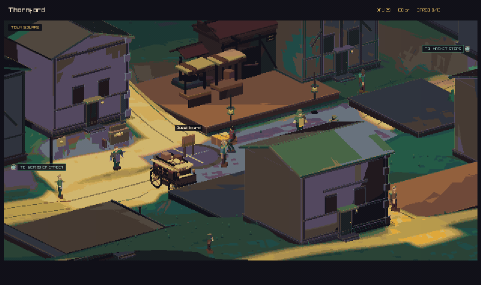

# Crownless Carriage

**Crownless Carriage** is a causal political action-RPG about running an
independent carriage line between kingdoms threatened by war, monsters, and
persistent dungeons.

Your power comes from deciding what moves. Passengers, food, iron, tools, weapons, sealed
messages, and contraband compete for limited space. A journey consumes time,
changes who gets help, and can become a fight, a bargain, or an expedition.
The result is written back into the same world that created the problem.

The game begins at character scale. Settlements, people, markets, and roads are
the main interface. Travel starts with the carriage following a track. The
camera stays low enough to show only what the crew could see from the coach,
including every road at the junction ahead. Maps are hand-drawn, tradeable
objects kept in the carriage, not a travel screen.

This project is in pre-production. The repository contains a living design
manual and a playable architecture proof written in C17.



_Captured from the current `play` build. The reel follows one complete promise:
accepting the job, loading cargo, choosing roads, crossing three settlements,
breaking a bandit cordon, making the delivery, and defending the destination._

[Download the higher-quality MP4 reel](assets/previews/crownless_gameplay_demo_reel_v07.mp4).

## Visual direction

Crownless Carriage is not built around a conventional isometric grid. The
current client is a fully 3D, street-scale adventure stage viewed through
authored three-quarter shots.

- Every town has exactly three visible camera scenes: Arrival, Town Heart, and
  Landmark. Hidden navigation districts do not invent extra camera cuts.
- Arrival begins in perspective behind the moving carriage, then pans up and
  out until the road and town threshold become one readable composition.
- Town Heart and Landmark are stable King's Quest-style orthographic stages
  with their own focus, foreground, quiet area, depth bands, and light profile.
- Camera angles are deliberately uneven. They show useful facades and avoid
  the perfect 45-degree look of a classic isometric map.
- The world renders at 457 by 285 art pixels and is enlarged with nearest-
  neighbour sampling. The HUD is drawn afterward at full display resolution.
- Painted lighting, fog, depth treatment, and procedural geometry are mapped
  into one final 37-color world palette.
- Characters use grounded dark-fantasy action-figure proportions: strong
  silhouettes, broad garment shapes, restrained colors, and readable gear.
- Roofs and upper walls cut away when they hide the hero. Collision and the
  lower building shell remain in place.

The scene mixes generated terrain and buildings with glTF characters, props,
and state layers. Visual replacements never change the collision footprint or
the simulation beneath it.

## What is playable now

The architecture proof connects these parts in one running build:

- Six authored 96 by 72 metre town plans: dispersed farm crofts, dense mining
  terraces, a radial crossroads market, a bridge garrison, tall capital wards,
  and a sparse lantern-lit expedition town
- Eighteen authored town compositions—three per location—with a moving
  carriage reveal, a social heart, and a purpose-built landmark stage
- Settlement profiles that own each town's building footprints and heights,
  civic hall, compound or keep, stable terrain seed, district names, material
  palette, plaza mark, physical landmarks, and secondary roads, with matched
  terrain, collision, navigation, camera picking, and rendering
- Continuous click-to-move navigation across real terrain and solid geometry,
  with no tile or screen-space movement grid
- One physical humanoid body for walking, vaulting, climbing, down-climbing,
  jumping, swimming, falling, ragdolls, and staged recovery
- OSR contact-based combat for the player, guards, scouts, and named outlaw
  companies, including reaction, telegraphed risk, guard, posture, morale,
  recoil, withdrawal, knockback, and defeat
- A market interior whose stock and prices come from the regional simulation
- Local situation boards with named sponsors, affected people, deadlines,
  rewards, accepted promises, and reputation consequences
- Carriage-stage junction scenes that show every physical branch at the current
  crossroads, plus a three-slot case of tradeable traveller's notes
- Separate mine, goblin-cave, and dragon-cave maps reached by short carriage
  roads, with the carriage parked as the return point
- A twelve-chart collectible map set with distinct physical artwork, a
  three-slot carriage case, and a persistent storage archive in Gloamgate
- Real-time carriage journeys, a dedicated road scene, and a route crisis that
  can be resolved through combat, coin, demanded cargo, or withdrawal
- Two persistent named carriage horses whose food, health, and fatigue affect
  travel, plus cattle herds that consume fodder, support farms, reproduce,
  face famine slaughter, and can be taken by dragons
- Stable breeding with pregnancy, named foals, inherited working traits,
  boarding care, training, lineage, and two-horse carriage team selection
- Immediate local aftermath and delayed consequences after a journey
- A deterministic regional simulation of settlements, kingdoms, factions,
  production, trade, shipments, hunger, security, bandits, monsters, and
  dungeons
- Three material kingdom identities—Road and Granary, Iron and Wall, and
  Capital and Deep—with live pressure derived from their holdings, roads,
  supplies, debts, factions, dungeons, and dragon exposure
- Multi-decade climate eras, bounded populations, abandoned towns, and
  resource-backed recolonization make long histories contract and recover
- Kingdoms can default on monastery debt, lose public services during long
  crises, and cede settlements when a peace courier ends a losing war
- Fields, farms, mountain deposits, mines, smith recipes, tool wear, rare Gold
  and Gems, bounded and perishable food stores, supplied warfare, and unique
  one-slot crafted treasures
- Restricted roads that still carry low-volume trade and travel while moving
  real tolls, border sanctions, or night-road bribes into kingdom treasuries
- An Iron Ledger of copied monastery accounts: kingdoms borrow deposited coin
  for famine grain and productive Tools, record debt, and make real repayments
- A goblin society with covenant, cohesion, a named representative, visible
  musters, trade, warnings, and interceptions; its lair economy raids for food
  or equipment, carries loot home, then carries portable offerings to a persistent dragon
  hoard, defends it with real members and Weapons, and raids again to replace
  losses; inequality or debt
  can drive the Ash-Poor to steal, while war can finance a Crown Levy, followed
  by omens, repayment, and bounded retaliation
- A persistent Crown Cycle: dragons age through whelp, wanderer, Crowned,
  Deep Wyrm, Uncrowned, and Afterdragon states; physical hoards stabilize
  memory, hunger takes livestock instead of burning towns, goblins tend rare
  broods with real Food, while a successor requires a visible surviving egg or
  a public, twenty-year goblin dragon-seed project
- A playable dragon cave in the graphical client, with live Crown Cycle state,
  hoard theft and exact restitution, visible broods and Afterdragon remains,
  and a chance to intercept physical tribute before the dragon owns it
- Kings who send physical declarations, peace offers, dragon alliances, and
  muster orders through a delayed and fallible courier network. The carriage
  can carry a sealed dispatch. Allied hosts consume real Food, Tools, and
  Weapons; surviving armies learn from failed campaigns, while victory slays
  the dragon and returns its actual hoard to the realms
- Hunger and exhausted credit that create night roads and recruit bandits,
  while unfed camps shrink and cannot raid empty towns
- An append-only SQLite action journal with checkpoints, replay, and exact
  state hashing

This is still a proof, not a finished campaign. It uses a small generated
region, one shared primary road spine with six distinct secondary-road and
landmark layouts, one reusable profile-specific civic interior, and a limited
set of journey and dungeon interventions. Content breadth, balance, carriage
progression, deeper interior grammars, stateful local casts, and playable
dungeon maps remain in production.

## Build and run

You need:

- CMake 3.24 or newer
- A C17 compiler
- Git
- SQLite 3 development headers
- The desktop and OpenGL development libraries required by raylib on Linux

CMake downloads the pinned raylib 6.0 source on the first configure.

Build the normal playtest version:

```sh
cmake --preset play
cmake --build --preset play
```

Run it on macOS:

```sh
open out/build/play/crownless_carriage.app
```

Run it on Linux:

```sh
./out/build/play/crownless_carriage
```

Run the presentation-free Empty Granary playtest:

```sh
./out/build/play/crownless_metagame_playtest
```

This text-first build uses the same simulation, commands, journeys, situations,
and SQLite save format as the 3D client. It exists so carriage choices and delayed
consequences can be tested while camera, movement, and art work continue. Type
`rumors` for local clues, `kingdoms` for the three realms, `treasures` for
unique cargo, `help` for commands, and `debrief` at the end of a session.

The headless build and tests run in CI on macOS and Linux. The full graphical
client is also built in macOS CI.

| Preset | Use |
| --- | --- |
| `play` | Normal play and visual review; optimized with debug symbols |
| `development` | Slow, assertion-heavy diagnostics |
| `release` | Optimized tests and repeatable performance checks |

## Controls

Inputs are contextual.

| Input | Action |
| --- | --- |
| Left click | Move to a visible surface, or select a named outlaw |
| `F` | Use a nearby door, notice board, carriage, or toll collector |
| `M` | Open or close the map case while beside the carriage |
| `Q` | Review situations; promises are made at the local notice board |
| `Tab` | Open the causal event ledger |
| `J` | Jump |
| `Space` | Make a manual basic strike |
| `X` | Enter or leave guard |
| `Backspace` | Withdraw from a road fight or return from a parley |
| `1` through `6` | Trade goods in markets; `1`, `2`, and `3` remain combat skills and encounter choices |
| `G` | Sound the village alarm and start a raid encounter |
| `E` | Start an expedition beside the dungeon entrance |
| `.` | Advance one day while parked |
| `K` | Advance one week while parked |
| `F5` or `Cmd/Ctrl+S` | Start or checkpoint the action journal |
| `F9` | Restore the checkpoint and replay later actions |
| `N` | Generate the crisis again with a new seed |
| `F3` | Toggle performance and character diagnostics |

In the market, use `1` through `6` to buy Food, Iron, Tools, Weapons, Raw Gold,
or Gems. Hold `Shift` with the same key to sell. Cargo slots hold eight Food,
four Iron, two Tools, two Weapons, one Gold strongbox, or one Gem case.

`Drive out` sends the carriage through the gate before any destination is
chosen. The team follows the track until a roadside branch actually comes into
view. Every route at that junction is visible in the world. Use the arrow keys
or `Face next branch` to turn the carriage toward one, then press `Enter` to
take it. Press `B` to buy local notes, `S` to sell carried notes, or `R` to
repair the selected branch. A chart can save time and warn of danger, but it is
never required to take a visible track.

Mine roads and cave roads lead to separate local maps. Their short carriage
rides use the same reins controls as regional travel. The camera pulls back
only to a carriage-passenger view and time moves faster; it never reveals the
whole world. Walk back to the parked carriage to return or open the physical
map case.

In the map case, use the arrow keys or click a sheet to select it. Press `B` to
buy a local chart, `S` to sell one, or `A` to store or retrieve it at the
Gloamgate archive. The team drives routine departure, road, and arrival
sections automatically. Use `W` to speed up, `S` to slow down, or `Space` to
pause. Press `Enter` to finish a safe trip or advance a dangerous trip to its
next real decision. Arrival follows the carriage into town while the camera
pulls out to reveal the threshold. Walking past the town edge is reserved for
the later procedural wilderness; for now, start every departure from the
carriage yard.

The current five-scene-per-town review sheet is
[here](docs/images/town-scene-sheet.png). Rows are Thornford, Gloamgate,
Alderwatch, Silverwick, Rosespire, and Hollowbarrow. The first three columns
are the wide Arrival, Town Heart, and Landmark pages; the last two are tighter
playable rooms built around local work, gates, and street life.

Normal play keeps one campaign window active at a time. Clean exits and manual
saves remember the hero's exact street or market position as well as the
durable strategic action journal.

During combat, `1` uses Crushing Blow, `2` uses Sunder, and `3` uses Catch
Breath. Catch Breath restores posture but never heals wounds. Click the ground
to disengage and return to direct movement. A road company can break and flee
before every opponent falls; the Crownless company can also withdraw.

## Code layout

| Path | Purpose |
| --- | --- |
| `src/sim/` | Deterministic strategic world and validated commands |
| `src/persistence/` | SQLite snapshots, action journal, replay, and hashing |
| `src/metagame/` | Presentation-free Empty Granary player loop |
| `src/locomotion/` | Renderer-free biomechanical and robotic movement systems |
| `src/client/` | raylib input, local world, cameras, art, UI, and projections |
| `tests/` | Simulation, persistence, terrain, movement, and rendering contracts |
| `tools/` | Headless runner, benchmarks, art checks, and Blender generators |
| `docs/` | Design, architecture, validation, and production contracts |

The strategic simulation does not depend on raylib or frame time. The client
reads simulation state, presents it locally, and submits validated commands
back to the simulation.

## Tests and tools

Run the play build's tests:

```sh
ctest --preset play
```

Run ten simulated years without graphics:

```sh
./out/build/play/crownless_sim_runner --seed 42 --years 10 --detail
```

Export yearly simulation-shape metrics across many seeds:

```sh
./out/build/play/crownless_sim_metrics --seeds 100 --years 10 \
  > out/simulation-shape.csv
```

Run optimized performance checks:

```sh
cmake --preset release
cmake --build --preset release
./out/build/release/crownless_benchmark
ctest --preset release
```

On macOS, capture directly from the executable inside the app bundle:

```sh
out/build/play/crownless_carriage.app/Contents/MacOS/crownless_carriage \
  --capture-golden /tmp/crownless-street.png
out/build/play/crownless_carriage.app/Contents/MacOS/crownless_carriage \
  --capture-town 0 thornford.png
out/build/play/crownless_carriage.app/Contents/MacOS/crownless_carriage \
  --capture-town 0 32 38 thornford-drovers-close.png
out/build/play/crownless_carriage.app/Contents/MacOS/crownless_carriage \
  --capture-town-arrival 0 0.35 thornford-arrival.png
out/build/play/crownless_carriage.app/Contents/MacOS/crownless_carriage \
  --capture-action-reel /tmp/crownless-action
```

Use `make art-check` from a desktop session to capture all ten exterior rooms,
the market, road, and parley scenes. It checks the palette, subject coverage,
contrast, edge density, scale, and frame-to-frame stability.

Asset-library work uses Blender and Python 3:

```sh
make blender-npc-assets-check
make blender-world-kit-check
```

## Design manual

The manual labels important statements as **Contract**, **Target**,
**Hypothesis**, or **Deferred**. Start with:

- [Manual contents](docs/README.md)
- [Creative constitution](docs/01-creative-constitution.md)
- [Carriage and travel](docs/04-carriage-and-travel.md)
- [Cities, characters, and situations](docs/06-cities-characters-situations.md)
- [Technical architecture](docs/07-technical-architecture.md)
- [Vertical slice](docs/08-vertical-slice.md)
- [Validation strategy](docs/09-validation.md)
- [Production roadmap](docs/10-roadmap.md)
- [Text-first metagame playtest](docs/11-metagame-playtest.md)
- [Runtime environment design](docs/production/runtime-environment-design.md)
- [Character readability](docs/production/character-readability.md)
- [World-kit construction language](docs/production/world-kit-action-figure-language.md)
- [Decision log](docs/decisions/README.md)

## North star

> Build a causal political RPG in which every important journey originates in
> the world simulation, becomes a character-scale adventure, and leaves visible
> immediate and delayed consequences.
