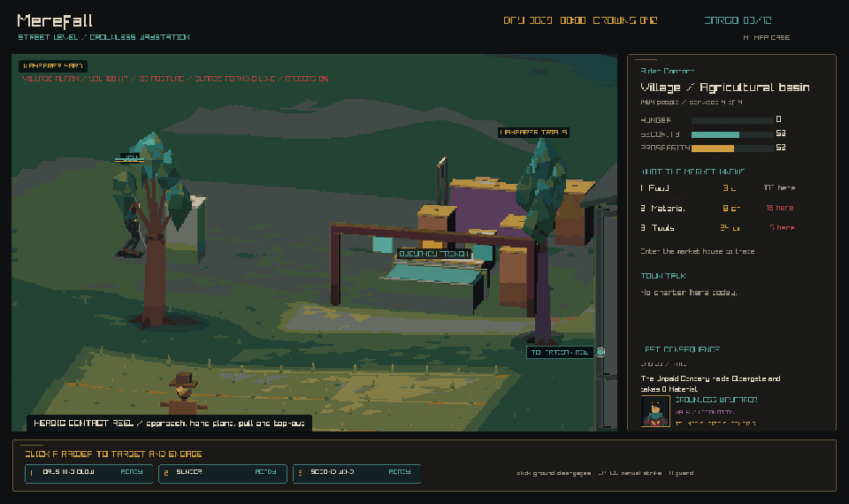

# Crownless Carriage

**Crownless Carriage** is a causal political action-RPG about running an
independent carriage line between kingdoms threatened by war, monsters, and
persistent dungeons.

Your power comes from deciding what moves. Passengers, food, tools, sealed
messages, and contraband compete for limited space. A journey consumes time,
changes who gets help, and can become a fight, a bargain, or an expedition.
The result is written back into the same world that created the problem.

The game begins at character scale. Settlements, people, markets, and roads are
the main interface. Route maps are physical sheets kept in the carriage, not an
all-knowing strategy screen.

This project is in pre-production. The repository contains a living design
manual and a playable architecture proof written in C17.



_Captured from the current `play` build. The reel shows live climbing,
jumping, swimming, combat, room transitions, and the fixed-pixel world pass._

## Visual direction

Crownless Carriage is not built around a conventional isometric grid. The
current client is a fully 3D, street-scale adventure stage viewed through
authored three-quarter orthographic shots.

- The exterior is split into ten named camera rooms. Each room has its own
  landmark, story axis, foreground, quiet area, depth bands, and light profile.
- Camera angles are deliberately uneven. They show useful facades and avoid
  the perfect 45-degree look of a classic isometric map.
- The world renders at 457 by 285 art pixels and is enlarged with nearest-
  neighbour sampling. The HUD is drawn afterward at full display resolution.
- Painted lighting, fog, depth treatment, and procedural geometry are mapped
  into one final 37-color world palette.
- Characters use grounded dark-fantasy action-figure proportions: strong
  silhouettes, broad garment shapes, restrained colors, and readable gear.
- Roofs and upper walls cut away when they hide the hero. Collision and the
  lower building shell remain in place.

The scene mixes generated terrain and buildings with glTF characters, props,
and state layers. Visual replacements never change the collision footprint or
the simulation beneath it.

## What is playable now

The architecture proof connects these parts in one running build:

- A seeded 96 by 72 metre waystation with farms, streets, market steps, a
  coach yard, a mine road, Crown Gate, and the Wayfarer Trials
- Continuous click-to-move navigation across real terrain and solid geometry,
  with no tile or screen-space movement grid
- One physical humanoid body for walking, vaulting, climbing, down-climbing,
  jumping, swimming, falling, ragdolls, and staged recovery
- Shared contact-based combat for the player, guards, scouts, and raiders,
  including guard, posture, skills, recoil, knockback, and defeat
- A market interior whose stock and prices come from the regional simulation
- Local situation boards with named sponsors, affected people, deadlines,
  rewards, accepted promises, and reputation consequences
- A three-slot carriage map case with route-specific, tradeable charts that
  record age, accuracy, legality, and old road conditions
- Real-time carriage journeys, a dedicated road scene, and a route crisis that
  can be resolved through combat or payment
- Immediate local aftermath and delayed consequences after a journey
- A deterministic regional simulation of settlements, kingdoms, factions,
  production, trade, shipments, hunger, security, bandits, monsters, and
  dungeons
- An append-only SQLite action journal with checkpoints, replay, and exact
  state hashing

This is still a proof, not a finished campaign. It uses a small generated
region, one main local settlement grammar, one detailed market interior, and a
limited set of journey and dungeon interventions. Content breadth, balance,
carriage progression, deeper interiors, and playable dungeon maps remain in
production.

## Build and run

You need:

- CMake 3.24 or newer
- A C17 compiler
- Git
- SQLite 3 development headers
- The desktop and OpenGL development libraries required by raylib on Linux

CMake downloads the pinned raylib 6.0 source on the first configure.

Build the normal playtest version:

```sh
cmake --preset play
cmake --build --preset play
```

Run it on macOS:

```sh
open out/build/play/crownless_carriage.app
```

Run it on Linux:

```sh
./out/build/play/crownless_carriage
```

The headless build and tests run in CI on macOS and Linux. The full graphical
client is also built in macOS CI.

| Preset | Use |
| --- | --- |
| `play` | Normal play and visual review; optimized with debug symbols |
| `development` | Slow, assertion-heavy diagnostics |
| `release` | Optimized tests and repeatable performance checks |

## Controls

Inputs are contextual.

| Input | Action |
| --- | --- |
| Left click | Move to a visible surface, or select a raider |
| `F` | Use a nearby door, notice board, carriage, or toll collector |
| `M` | Open or close the map case while beside the carriage |
| `Q` | Open the situation board |
| `Tab` | Open the causal event ledger |
| `J` | Jump |
| `Space` | Make a manual basic strike |
| `X` | Enter or leave guard |
| `1`, `2`, `3` | Use combat skills, trade goods, or choose an encounter response |
| `G` | Sound the village alarm and start a raid encounter |
| `E` | Start an expedition beside the dungeon entrance |
| `.` | Advance one day while parked |
| `K` | Advance one week while parked |
| `F5` or `Cmd/Ctrl+S` | Start or checkpoint the action journal |
| `F9` | Restore the checkpoint and replay later actions |
| `N` | Generate the crisis again with a new seed |
| `F3` | Toggle performance and character diagnostics |

In the market, use `1`, `2`, or `3` to buy food, materials, or tools. Hold
`Shift` with the same key to sell.

In the map case, use the arrow keys or click a sheet to select it. Press `B` to
buy a local chart, `S` to sell one, `Enter` to follow it from the correct
endpoint, or `R` to repair its contested route.

During combat, `1` uses Crushing Blow, `2` uses Sunder, and `3` uses Second
Wind. Click the ground to disengage and return to direct movement.

## Code layout

| Path | Purpose |
| --- | --- |
| `src/sim/` | Deterministic strategic world and validated commands |
| `src/persistence/` | SQLite snapshots, action journal, replay, and hashing |
| `src/locomotion/` | Renderer-free biomechanical and robotic movement systems |
| `src/client/` | raylib input, local world, cameras, art, UI, and projections |
| `tests/` | Simulation, persistence, terrain, movement, and rendering contracts |
| `tools/` | Headless runner, benchmarks, art checks, and Blender generators |
| `docs/` | Design, architecture, validation, and production contracts |

The strategic simulation does not depend on raylib or frame time. The client
reads simulation state, presents it locally, and submits validated commands
back to the simulation.

## Tests and tools

Run the play build's tests:

```sh
ctest --preset play
```

Run ten simulated years without graphics:

```sh
./out/build/play/crownless_sim_runner --seed 42 --years 10 --detail
```

Run optimized performance checks:

```sh
cmake --preset release
cmake --build --preset release
./out/build/release/crownless_benchmark
ctest --preset release
```

On macOS, capture directly from the executable inside the app bundle:

```sh
out/build/play/crownless_carriage.app/Contents/MacOS/crownless_carriage \
  --capture-golden /tmp/crownless-street.png
out/build/play/crownless_carriage.app/Contents/MacOS/crownless_carriage \
  --capture-action-reel /tmp/crownless-action
```

Use `make art-check` from a desktop session to capture all ten exterior rooms,
the market, road, and parley scenes. It checks the palette, subject coverage,
contrast, edge density, scale, and frame-to-frame stability.

Asset-library work uses Blender and Python 3:

```sh
make blender-npc-assets-check
make blender-world-kit-check
```

## Design manual

The manual labels important statements as **Contract**, **Target**,
**Hypothesis**, or **Deferred**. Start with:

- [Manual contents](docs/README.md)
- [Creative constitution](docs/01-creative-constitution.md)
- [Carriage and travel](docs/04-carriage-and-travel.md)
- [Cities, characters, and situations](docs/06-cities-characters-situations.md)
- [Technical architecture](docs/07-technical-architecture.md)
- [Vertical slice](docs/08-vertical-slice.md)
- [Validation strategy](docs/09-validation.md)
- [Production roadmap](docs/10-roadmap.md)
- [Runtime environment design](docs/production/runtime-environment-design.md)
- [Character readability](docs/production/character-readability.md)
- [World-kit construction language](docs/production/world-kit-action-figure-language.md)
- [Decision log](docs/decisions/README.md)

## North star

> Build a causal political RPG in which every important journey originates in
> the world simulation, becomes a character-scale adventure, and leaves visible
> immediate and delayed consequences.
