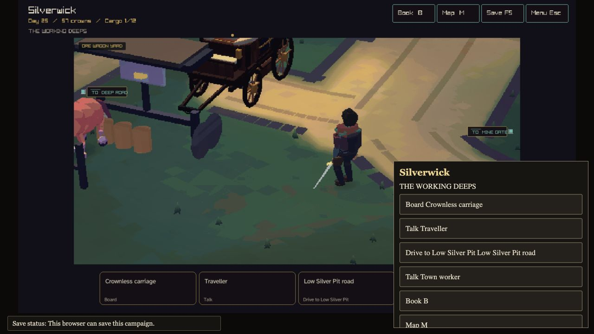
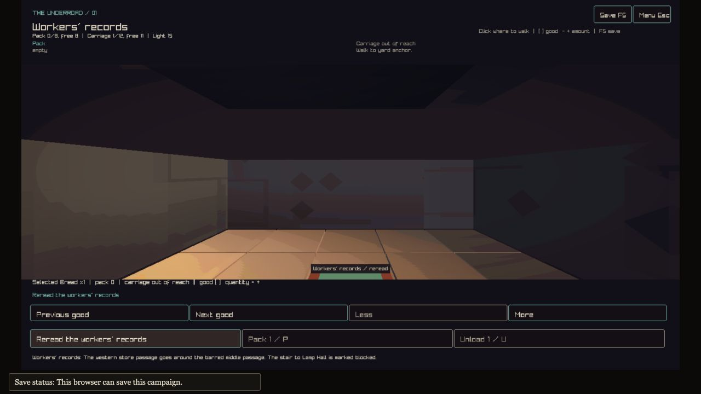

# Crownless Carriage

Crownless is a game about a travelling company in a changing world. Buy supplies
in town, drive your carriage along the road, and explore Low Silver Pit. Bring
gold back to sell, or return with news for the people who sent you.

[Play in your browser](https://crownless.ratimics.com).



*Gameplay capture from the recorded Silverwick trip, 19 September 2026.*

## Gameplay today

The playable town–road–mine trip gives you a small journey with lasting choices:

1. **Prepare in Silverwick.** Buy food and ask Jory Fen about Low Silver Pit.
2. **Take the road.** Travel toward Alderwatch, inspect your carriage, and take
   the mine turn-off. Pack supplies beside the carriage before walking inside.
3. **Explore the mine.** Entry costs one ration. Find the workers' records,
   trade two Bread for one Raw Gold, and use the Rope Store cache. Your pack
   holds eight goods, so supplies and treasure share the space.
4. **Bring something home.** Unload at the carriage, board, and return to town.
   Sell your gold to Oren or tell Jory what you found. Save and resume with your
   goods, position, and Company Book notes intact.



*Reading the workers' records during the same trip.*

The [recorded playthrough](docs/reviews/silverwick-first-haul-2026-09-19.md)
includes the road journey, food-for-gold bargain, cache recovery, return report,
sale, and save checks. The [mine guide](docs/design/silverwick-mine-slice.md)
explains the rooms, supplies, and choices in more detail.

## Play and controls

Choose Offline for a campaign saved in this browser, or Online for shared play.
Read the current action labels for the choices available at your location.

- Click the ground to walk. In town, select an object or its card to approach it.
- On the road, use the displayed travel, pace, stop, and boarding actions.
- Underground, click visible floor to walk. W/S move forward/back; A/D turn.
  E uses a nearby mine object. Looking and turning keep the campaign position.
- B opens the Company Book; M opens the map; F5 saves; Escape opens the menu.
- At the mine carriage, use the pack controls to prepare for entry.

The [mine guide](docs/design/silverwick-mine-slice.md) explains its saved state,
entry cost, and current controls. The pilot road supports carriage inspection,
reachable boarding, connected junction choices, and reversal from its saved
physical position.

## Roadmap

These concept images show the planned visual direction for Crownless. Click an
image to open it at full size.

<p>
  <a href="https://github.com/user-attachments/assets/43cec7bf-e28e-4915-bbe4-f6ab454aa301"></a>
  <a href="https://github.com/user-attachments/assets/0c762c6a-95a1-4fc6-82fb-b49dae396e2d"></a>
  <a href="https://github.com/user-attachments/assets/3163e010-3569-4927-ac42-7d291db24296"></a>
</p>

The goal is one continuous world across town, road, and dungeon:

| Place | Planned experience |
| --- | --- |
| Town | Meet people, prepare, trade, and return with news or goods in authored streets and interiors. |
| Road | Travel with the carriage, inspect its load and team, stop, and choose a way onward. |
| Dungeon | Explore, meet occupants, choose a load, and find the way back. |

Town, road, and mine already share lighting and model helpers. The next work
brings their targeting, approach, reach, and saved state under shared rules.
The [continuous-world plan](docs/design/outside-city-redesign.md) describes the
remaining work. [Issue #762](https://github.com/atimics/crownlesscarriage/issues/762)
tracks the checks for a complete trip.

## Build and check

Use CMake 3.24 or newer and a C toolchain. The native presets fetch raylib during
configuration and enable strict warnings.

```sh
cmake --preset play
cmake --build --preset play
ctest --preset play
```

The macOS executable is
`out/build/play/crownless_carriage.app/Contents/MacOS/crownless_carriage`.
Other native builds place `crownless_carriage` in `out/build/play`.
The `development` and `release` presets use the same build and test pattern.

For a browser build, activate Emscripten and run:

```sh
emcmake cmake --preset web
cmake --build --preset web
python3 -m http.server 8000 --bind 127.0.0.1 --directory out/build/web/site
```

Open `http://127.0.0.1:8000`. See the [web workflow](.github/workflows/web.yml)
for the browser regression suite and its Playwright setup. Native tests,
browser tests, rendered inspection, and a physical-phone walkthrough each
provide distinct evidence.

## Code map

- [Simulation](src/sim): campaign state, movement decisions, people, goods, and costs.
- [Persistence](src/persistence): saves, journal replay, and schema migration.
- [Local renderer](src/client/cc_local3d.c): shared lighting, models, and scene drawing.
- [Client](src/client/main.c): input, views, and the town/road/mine transitions.
- [World](src/world): route geometry and bounded world presentation.
- [Tests](tests): simulation, input, persistence, and browser checks.
