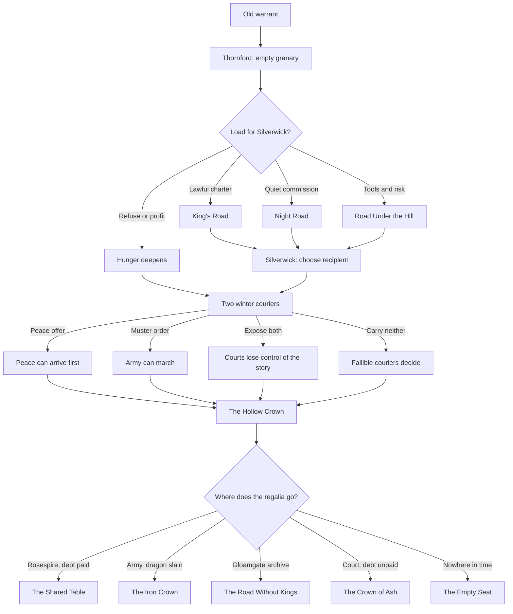

# A King's Quest Storyboard: The Road Without a Crown

## Purpose

This storyboard turns the existing Crownless systems into one clear adventure
with a beginning, middle, and end. It does not add a second story system. The
same food, roads, letters, named treasures, characters, dragon debt, and world
clock still decide what is true.

The target is one compact campaign told like a dark storybook. The first
release remains a two-to-four-hour Act I season; Acts II and III extend that
season only after the release loop works.

The presentation rules are:

- The player walks through fixed, hand-painted camera pages.
- Each page has one strong landmark, one human problem, and a few useful
  objects.
- Several puzzles can be solved by law, barter, stealth, courage, or sacrifice.
- Travel choices close other paths because time and carriage space are limited.
- Bad choices continue the story. They change the world instead of asking the
  player to reload.
- The ending is based on what the player moved, whom they trusted, and which
  debt they left behind.

The story uses three existing arcs in order: **The Empty Granary**, **The Winter
Courier**, and **The Hollow Crown**.

## The promise to the player

> Three kingdoms have crowns, but none has the old right to rule. Your carriage
> carries the last imperial charter they all still obey. Before winter, you will
> decide who eats, which royal message arrives, and where the lost crown rests.

The player is not the chosen king. The carriage is the rare power. It can cross
borders and carry one decisive load, but it cannot carry everything.

## Adventure grammar

### The storybook page

Every wide town scene works as one adventure-game page. The player enters at a
clear edge, sees the important problem before reading text, and can walk behind
foreground shapes to find one optional clue. A short page fade marks movement
between Arrival, Town Heart, and Landmark scenes.

Each page should contain:

1. One visible need.
2. One person who wants the player to act.
3. One person or object that questions the simple answer.
4. One exit that leads toward commitment.
5. At most one optional secret.

### The verbs

The graphical game can keep direct movement and contextual controls. The
interaction language should still feel like a classic adventure game:

- **Look** reveals sensory facts and one useful clue.
- **Talk** reveals a person's stake, offer, and fear.
- **Use** applies a carried object to the visible world.
- **Give** transfers a real object, cargo load, payment, or letter.
- **Take** moves a real object into limited carriage space.
- **Leave** is always allowed and always advances the story.

The narrator has a dry, warm voice. It may tease an unwise action, but it must
state the real danger before a permanent commitment.

### The puzzle rule

Every required puzzle has at least three solutions:

- a social solution using trust, law, or a promise;
- a material solution using cargo, coin, tools, or a map;
- a dangerous solution using stealth, the road, or combat.

No required solution depends on guessing a joke verb. Clues name the object,
person, or place involved. A failed attempt costs time, standing, supplies, or
carriage condition and then leaves another route open.

## The carried set

The small inventory is the heart of the adventure. Most objects already exist
in the simulation.

| Object | Where it begins | What it can solve | What carrying it costs |
| --- | --- | --- | --- |
| Imperial carriage charter | Carried by the company | A lawful border crossing or an audience with a court | The one accepted-charter slot |
| Eight Food | Thornford granary | Silverwick's immediate hunger | One cargo slot |
| Two Tools | Thornford or Gloamgate | The bridge winch, a mine brace, or carriage repair | One cargo slot |
| Traveller's note | Bought or traded in Gloamgate | One known road warning and a shorter journey | One of three map-case slots |
| Peace offer | A royal courier | Can end the war if it arrives first | The accepted-charter slot |
| Muster order | A second royal courier | Can raise an army against a rival or the dragon | The accepted-charter slot |
| Founding regalia | The dragon hoard | Can restore a crown, settle a debt, or prove that no crown is rightful | One cargo slot for each piece |
| The Third Bridle | Held by the outlaw captain | Can turn a river creature into a willing ferry | One cargo slot; it displaces Food, Tools, or regalia |

The Third Bridle is the only new fairy-tale curiosity in the season. It is an
optional post-release layer. If curiosities remain deferred, the outlaw
captain's traveller's note performs the same route-opening role without new
simulation state.

## Act I — The Empty Granary

The first act teaches that a puzzle solution is also a political choice.
Thornford has grain. Silverwick is hungry. Alderwatch has closed the bridge
between them.

### Board 1 — The old warrant

**Place:** A road outside Thornford, dawn.
**Image:** The carriage passes a broken imperial milestone. Three newer crown
marks have been cut over the same old road sign.
**Action:** The player can inspect the milestone or continue into town.
**Clue:** The charter seal matches the oldest mark, not any living kingdom.
**Turn:** Bells ring from Thornford, but no mill wheel turns.

### Board 2 — Bread without flour

**Place:** Thornford Arrival.
**Image:** Empty grain carts roll into town while full military wagons leave by
another gate.
**Human anchor:** Nell Varo splits a heel of bread with two children.
**Action:** Looking at the carts, speaking to Nell, or following the soldiers
all reveal the same short chain: Silverwick is hungry because the bridge is
closed and official grain is not moving.
**Optional clue:** One military sack bears a fresh Alderwatch inspection mark.

### Board 3 — The guarded abundance

**Place:** Thornford Town Heart.
**Image:** Grain stands behind a locked fence while the public market has bare
tables.
**Human anchors:** Mara Venn offers a lawful relief charter. Tomas Rill offers
more coin for a quiet delivery that avoids the bridge.
**Choice:** The player may accept one offer, refuse both, or load unpromised
food and act without a contract.
**Commitment:** Eight Food fills one cargo slot. Two Tools fill another. Taking
both leaves little room for guards, loot, or the optional bridle.

### Board 4 — The first fork

**Place:** Thornford carriage yard.
**Image:** Every local road is visible, but mist hides where each later road
goes. A board points toward Gloamgate.
**Action:** The player hitches the two named horses and leaves.
**Turn:** On reaching Gloamgate, three ways to Silverwick become available.

### Path A — The King's Road

#### Board 5A — The bridge that is not broken

**Place:** Alderwatch bridge checkpoint.
**Image:** The bridge is raised. Its winch works, but the soldiers have chained
it in place.
**Human anchor:** Ilyra Senn says the closure protects the realm. A tired
carter points out that military wagons still cross at night.
**Puzzle:** Open the bridge by one of these means:

- show the imperial charter and accept a full inspection;
- spend two Tools repairing the public winch, forcing the commander to state
  a new reason for the closure;
- carry the marked military sack or ledger evidence back to the checkpoint
  and expose the private traffic;
- pay the real border dues;
- break the cordon and accept damage, deaths, and lost standing.

**Immediate result:** Food reaches Silverwick's public market. Court legitimacy
rises. The night road and the monster problem remain.

### Path B — The Night Road

#### Board 5B — Supper at the outlaw fire

**Place:** The hidden road from Gloamgate.
**Image:** The carriage rolls into a camp built from toll gates and abandoned
farm doors. No one attacks. A pot sits over the fire.
**Human anchor:** The outlaw captain names a price based on the camp's actual
need.
**Puzzle:** Gain passage by one of these means:

- give coin or part of the Food;
- trade Tools or the Gloamgate route note;
- promise to carry the captain's account of the bridge closure;
- win the captain's Third Bridle by bargain, theft, or combat;
- withdraw and return to the lawful road.

**Immediate result:** Food reaches Silverwick quickly through the black market.
The hungry eat first, but outlaw influence and the night road grow stronger.

### Path C — The Road Under the Hill

#### Board 5C — The mine that breathes

**Place:** Silverwick's sealed lower workings.
**Image:** Cold air lifts flour dust from the floor. Small tools and food scraps
have been arranged around a flooded rail.
**Human anchor:** Jory Fen wants the tunnel cleared. A wounded scout says the
subterranean colony is defending its water, not hunting miners.
**Puzzle:** Open the last passage by one of these means:

- spend two Tools to brace the old freight way above the habitat;
- use the Third Bridle at the underground ford and gain a ferry;
- leave Food at the dry shaft and draw the colony away;
- fight the colony, lowering monster pressure now but harming the habitat;
- retreat before the clock advances too far.

**Immediate result:** Food reaches Silverwick through the mine. The guild,
outlaws, or creatures may control the new route depending on the method.

### Board 6 — Who receives the flour?

**Place:** Silverwick Town Heart.
**Image:** The same eight sacks stand between the guild store, the public ovens,
and a line of miners' families.
**Final act choice:** Deliver to the named charter holder, sell through the
black market, give directly to the families, or keep the cargo.
**Convergence:** Every route reaches this page, but the available recipients,
prices, and witnesses differ.
**Delayed echo:** Thirty days later, the player sees one changed route and hears
from Nell Varo or Jory Fen. The echo states both who was helped and what the
chosen path strengthened.

## Act II — The Winter Courier

The second act turns the inventory puzzle into a race. A peace offer and a
muster order are sent on the same morning. Only one sealed dispatch fits in the
accepted-charter slot.

### Board 7 — Two riders in the snow

**Place:** Gloamgate Arrival, early winter.
**Image:** Two exhausted couriers enter from opposite roads. One carries white
wax, the other red. Neither knows what the other bears.
**Human anchors:** Brin Alder asks the player to protect the peace offer. Cera
Mott says the muster is the only answer to raids and dragon omens.
**Choice:** Carry one letter, leave both to their fallible couriers, steal or
expose one, or refuse the race.

### Board 8 — The road remembers

The player's Act I path changes the middle of the race:

| Act I result | Winter advantage | Winter danger |
| --- | --- | --- |
| Bridge opened lawfully | Fast official crossing | The letter is inspected and its existence becomes public |
| Night road strengthened | A hidden shortcut | The outlaw captain may copy, sell, or suppress the message |
| Mine route opened | A route beneath the border | The colony, guild, or cave damage may close it again |
| Food withheld | More cargo space and coin | Hungry settlements stop the carriage or join the bandits |

This is the main branch payoff. The adventure reuses a place the player has
already changed instead of opening an unrelated quest area.

### Board 9 — The wrong throne room

**Place:** Rosespire Landmark.
**Image:** The player enters a formal court with one sealed letter. The empty
space behind the throne once held three pieces of founding regalia.
**Puzzle:** Decide what the court learns:

- deliver the peace offer intact;
- deliver the muster order intact;
- reveal that both messages existed;
- present a copied or damaged message and accept doubt;
- give no message and let the road decide.

**Turn:** The court's keeper explains that the missing regalia now sits in the
dragon hoard. The war, the famine, and the crown are one material problem:
failed rulers are preparing to rob the dragon to pay for their own crisis.

## Act III — The Hollow Crown

The last act is a classic three-treasure quest with no clean owner. The player
can carry all three pieces only by leaving behind food, tools, maps, or the
bridle. Taking the regalia also creates an exact debt to the dragon.

### Board 10 — The court beneath the cave

**Place:** The Cinder Tithe store caves.
**Image:** Goblins copy object names into a book whose script matches the
imperial charter. Nara Soot-Tongue stands beside three wrapped offerings.
**Human anchor:** Nara explains that the goblins remember who gave each object,
even when the human courts do not.
**Puzzle:** Reach the dragon by trade, accepted tribute escort, the smuggled
hoard chart, stealth, or violence. Feeding the lair can reduce its dependence
on the dragon. Killing its guards makes the cave easier and the region less
stable.

### Board 11 — The sleeping king

**Place:** Dragon cave.
**Image:** The dragon sleeps around a physical crown-shaped hoard. The three
regalia pieces are visible in separate parts of the pile.
**Puzzle:** The player can:

- take one piece and preserve room for restitution;
- take all three and accept a larger debt;
- replace value before leaving;
- mark the pieces on a chart and leave them where they are;
- wait for a royal levy or goblin tribute and intervene;
- wake the dragon and bargain from a position created by earlier acts.

There is no abstract "loot all" action. Each object is taken, carried, and
remembered.

### Board 12 — The last fork

**Place:** A three-way road below the cave.
**Image:** One road leads to Rosespire, one to the Gloamgate archive, and one
back toward the dragon. Ash begins to fall if any debt remains.
**Choice:** The destination gives the season its ending.

## Endings

There is no single golden ending. Each ending closes the three questions: who
ate, which message arrived, and where the crown rests.

### The Shared Table

Food reached the public ovens, peace arrived before the muster, and the player
returns or pays for every object taken from the hoard. The regalia goes back to
Rosespire under a public account. The crown survives, but now owes its peace to
commoners, goblins, and a carriage it cannot command.

### The Iron Crown

The lawful road won, the muster arrived, and the kingdoms killed the dragon.
The regalia returns with the armies. Roads are safe and checkpoints multiply.
The final picture shows full markets behind new gates.

### The Road Without Kings

The night road fed Silverwick, both royal messages were exposed, and the
regalia is deposited in the Gloamgate archive instead of returned to a court.
The crowns lose authority while towns and outlaw roads form a public carriage
league. It is freer, poorer, and fragile.

### The Crown of Ash

The player steals the regalia and leaves the debt unpaid. The nearest guilty
settlement burns after clear omens. The crown may be restored, but its people
can see who paid for it. The final page shows a bright crown in a roofless hall.

### The Empty Seat

The player withholds food, carries neither letter, or leaves the region until
the clocks fill. Famine and war decide the season without the carriage. The
company survives and keeps its charter, but every later road is poorer and
more dangerous. Refusal is an authored ending, not a game-over screen.

## Branch map

## Production order

This storyboard can be built without attempting the whole design manual at
once.

### Release pass

Use the systems that already work:

1. Boards 1–6 as the complete Empty Granary season.
2. Existing situation sponsors and affected characters as the speaking cast.
3. Existing cargo, traveller's notes, road contacts, route repair, dungeon
   intervention, delayed echo, and day-90 debrief.
4. Three route outcomes and the refusal outcome as the first ending set.

### Second pass

Add Boards 7–9 using the existing physical courier network. The main new work
is scene presentation and a debrief that compares the two messages.

### Third pass

Add Boards 10–12 using the existing goblin tribute, dragon cave, named
treasures, theft, restitution, omens, alliance, and dragon battle systems.

### Optional fable pass

Add the Third Bridle only after the release loop works. It must remain one
physical named object with one authored binding. The game stays complete
without it.

## Validation

The storyboard is ready for production when all of these are true:

- A new player can retell the three questions after the opening ten minutes.
- Every required puzzle has at least three readable solutions.
- Every route choice changes a later scene, not only a score.
- The player cannot see all content in one run.
- Refusal reaches a complete ending.
- Every ending can be derived from journaled actions and current state.
- Saving before a choice and replaying the same actions produces the same
  ending.
- The narrator never claims that an object moved, a person acted, or a place
  changed unless the simulation already committed it.
