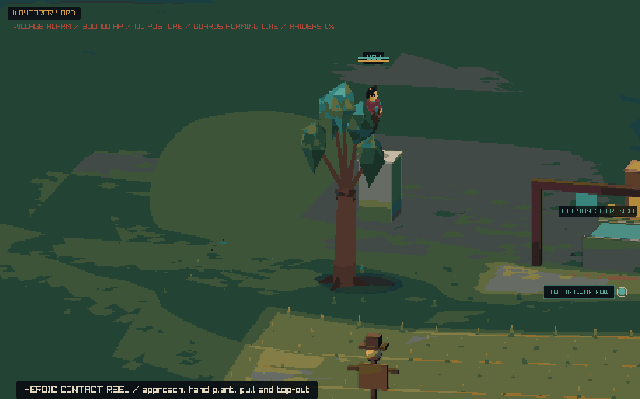
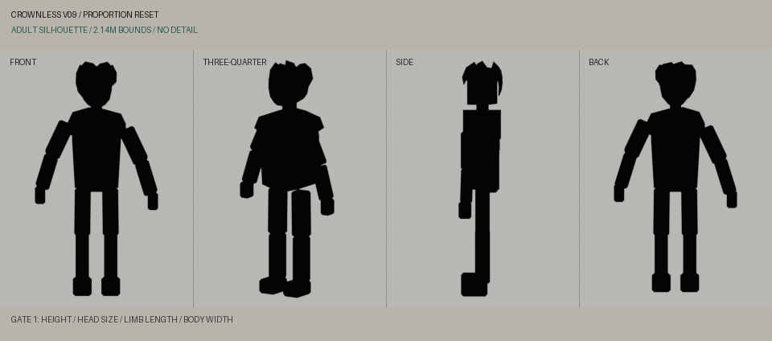
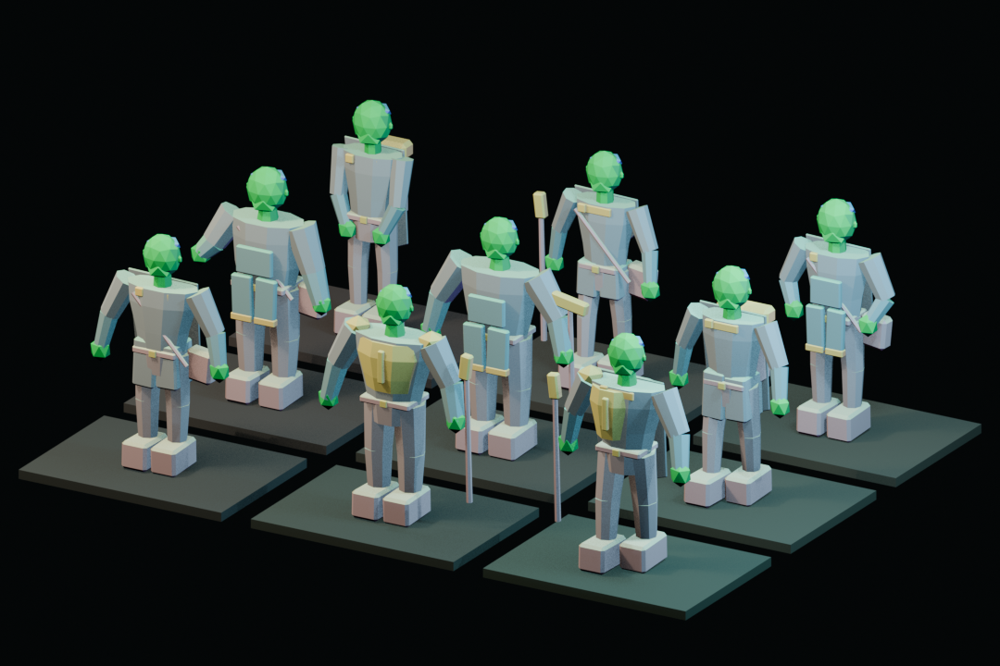
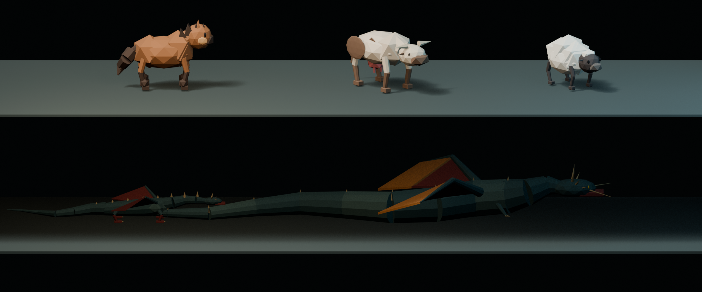
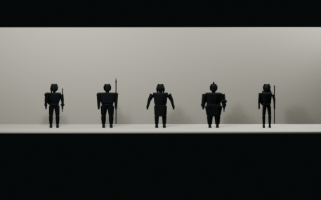
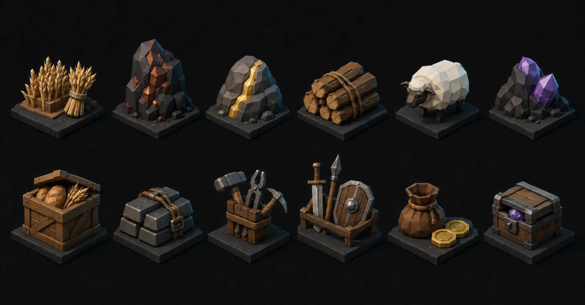
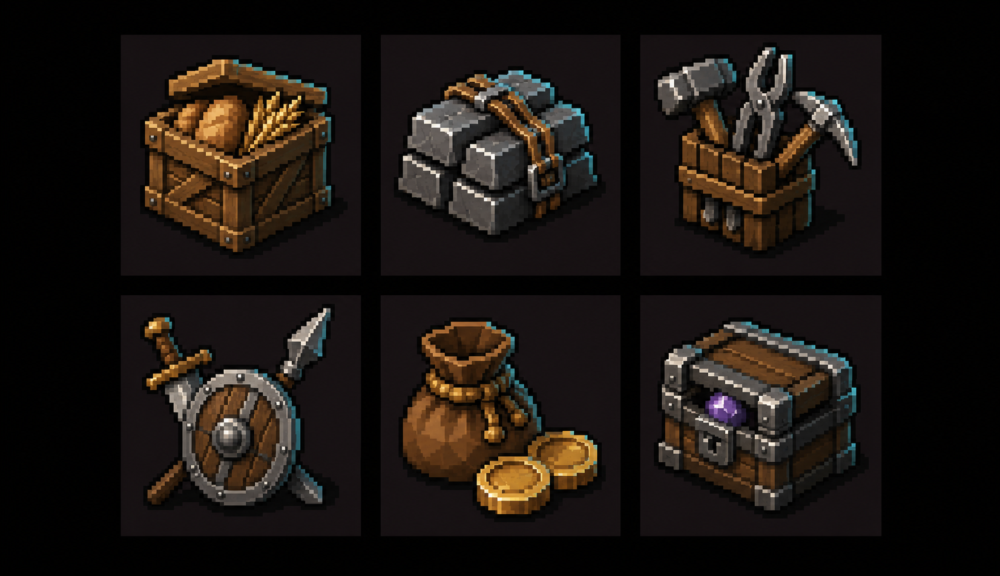

# Art gallery

This small gallery shows the current visual direction. Build scripts write
larger contact sheets, experiments, and reels to the ignored
`assets/previews` directory. Attach those generated files to the related pull
request or release when they help review an art change.

## Gameplay

## Hero silhouette

## Character families

## World kit

## Economic props

See [the economic visual language](production/economic-visual-language.md) for
the 3D, icon, palette, and world-state rules.
