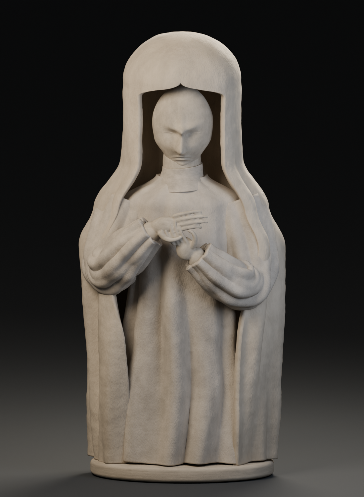

# Hooded stone figure

A quick Blender sculpture study from the supplied front-view photo. The figure has a bowed head, gathered hands, a deep hood, soft cloth folds, and a worn limestone surface. The back, full hem, and base are artistic extensions of the visible shape.

Open `docs/art/hooded-stone-statue/hooded_stone_statue.blend` in Blender 5. The `STATUE` collection has separate editable meshes for the hood, robe, face, sleeves, hands, and base. The `STUDIO` collection has the camera, lights, and floor. The stone materials use procedural mottling and grain.



Rebuild the model and render with:

```sh
blender --background --python tools/blender/build_hooded_statue.py -- --output /tmp/hooded-statue --samples 32
```

The output folder contains a compressed Blender file, a PNG preview, and an OBJ mesh with its MTL file. The OBJ contains the sculpture pieces. The Blender file includes the full studio and procedural materials.

Validation: the build and render completed in Blender 5.0.1. The saved file was reopened to check its mesh objects and camera. The repository art inventory check passed.
