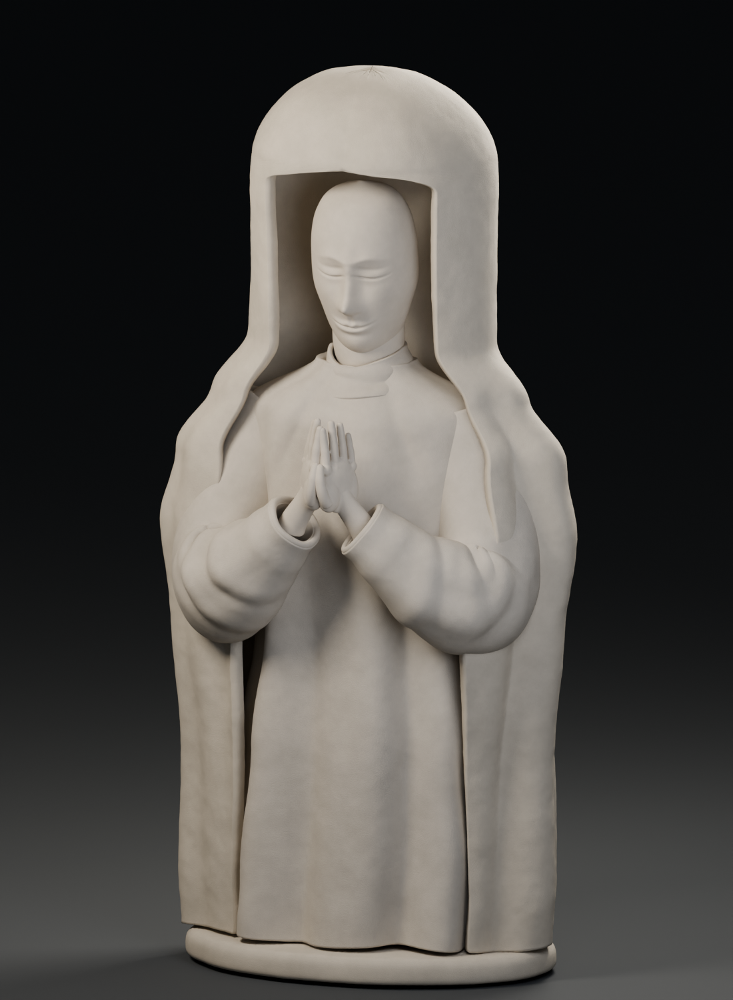
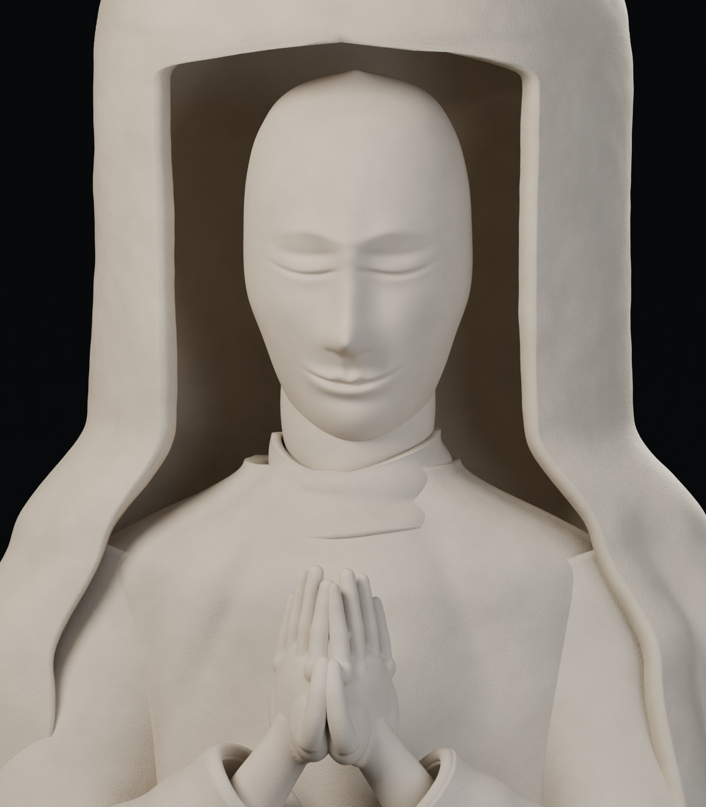
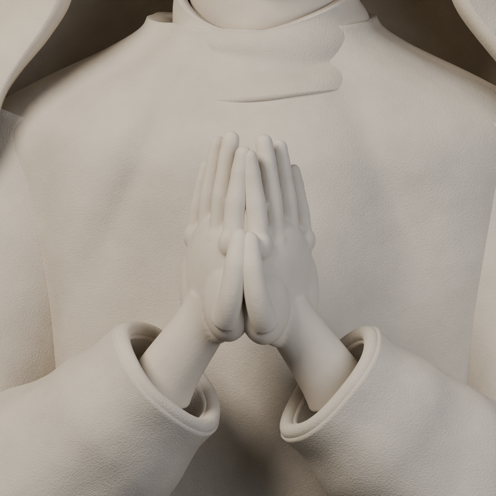

# Hooded stone figure

A Blender sculpture study from the supplied front-view photo. The figure has an adult face with closed eyes, soft cheekbones, a natural nose, and a slight smile. Full palms, curved fingers, and rounded thumbs meet in a gentle prayer pose. The hood, shoulder drape, gown, sleeves, collar, and cuffs have soft folds with varied weight. The stone has a fine grain and subtle wear.

The back, full hem, and base are artistic extensions of the visible shape. The prayer pose and calm expression follow the user's later request.

Open `docs/art/hooded-stone-statue/hooded_stone_statue.blend` in Blender 5. The `STATUE` collection has separate editable meshes for the hood, robe, face, sleeves, hands, cuffs, and base. The `STUDIO` collection has the camera, lights, and floor. The procedural stone materials have a shared grain scale and a smoother finish on the face and hands.








Rebuild the model and four views with:

```sh
blender --background --python tools/blender/build_hooded_statue.py -- --output /tmp/hooded-statue --samples 48
```

The builder uses three small modules for the face, hands, and cloth. The output folder contains a compressed Blender file, four PNG previews, and an OBJ mesh with its MTL file. The OBJ contains the sculpture pieces. The Blender file includes the full studio and procedural materials.

Validation: the build, four renders, and OBJ export completed in Blender 5.0.1. The saved file was reopened to check its camera, finite mesh coordinates, and closed face and hand surfaces. The front, side, back, face, and hands were checked in rendered views. The repository art inventory check and `git diff --check` passed.
