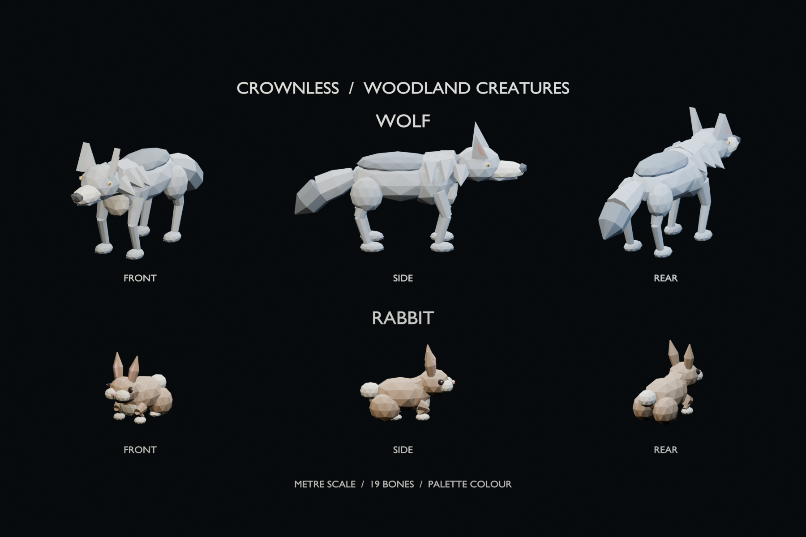
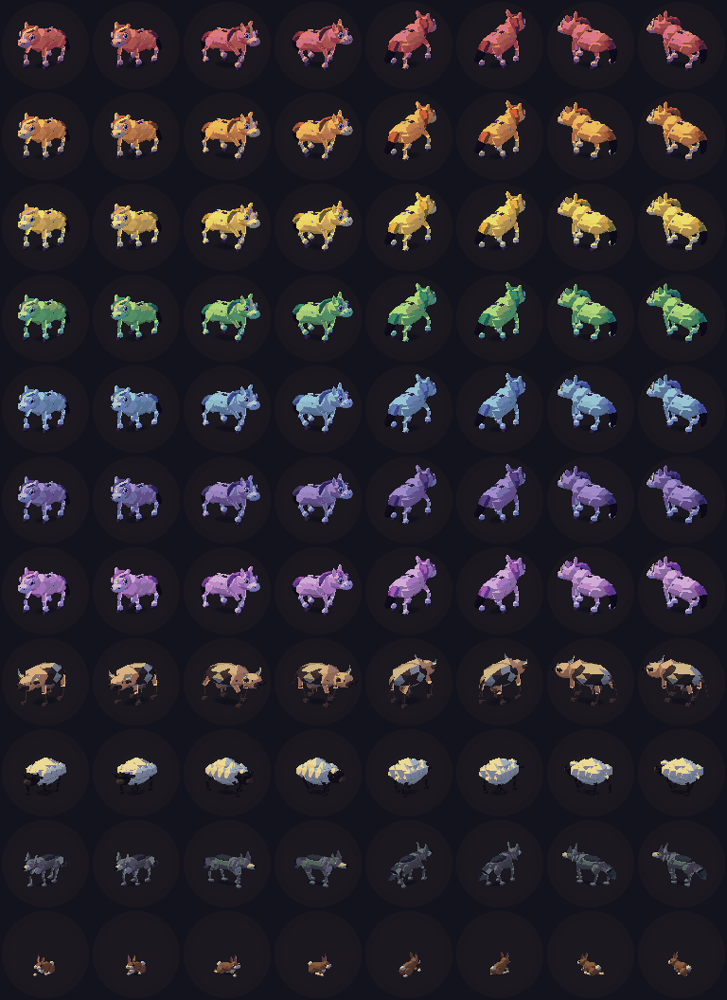

# Wolf and rabbit

Two woodland models for the Crownless creature library.



The wolf has a grey coat, cream muzzle and chest, amber eyes, pointed ears,
shoulder fur, clawed paws, and a dark brush tail. The rabbit has a brown coat,
cream cheeks and paws, pink inner ears, round hindquarters, and a cotton tail.
The sheet shows both at the same metre scale.

| Model | GLB | Triangles | Bones | Height |
| --- | --- | ---: | ---: | ---: |
| Wolf | `assets/exports/creatures/creature_wolf_v01.glb` | 1,864 | 19 | 1.43 m |
| Rabbit | `assets/exports/creatures/creature_rabbit_v01.glb` | 1,692 | 19 | 0.84 m |

Open `assets/blender/crownless_creature_library.blend` for the editable meshes
and armatures. Reveal the objects in `CREATURE_WOLF_IDLE` or
`CREATURE_RABBIT_IDLE` to edit the rigged model. Each export has one mesh,
one material, and the shared quadruped bone names. The vertex colours carry
palette, value, and fold data. The game supplies the coat colours and motion.

`CC_CREATURE_WOLF` and `CC_CREATURE_RABBIT` resolve through the creature catalog.
Each has its own quadruped body profile, palette, and contact shadow. The
browser startup asset list includes both GLBs. This PR supplies the models
and their renderer support. Wildlife placement is a later game feature.
The tracked art budget rises from 64 to 65 MiB for the two skins and the
larger Blender library. Tracked art uses 64.7 MiB with this addition.

Rebuild and inspect:

```sh
blender --background --python tools/blender/build_creature_library.py
blender --background --python tools/blender/render_wildlife_sheet.py
python3 tools/blender/validate_creature_library.py
cmake --preset play
cmake --build --preset play --target renderer_regression_tests quadruped_skin_tests creature_catalog_tests
ctest --test-dir out/build/play --output-on-failure -R 'blender_quadruped_skin_contract|generated_creature_catalog|renderer_skin_rotation'
out/build/play/renderer_regression_tests --animal-captures docs/art/wolf-rabbit/runtime
```

The animal capture checks the shipped GLBs through the game lighting and screen
pass. It checks four turns and two walking phases for every animal. The wolf
and rabbit are the last two rows.


