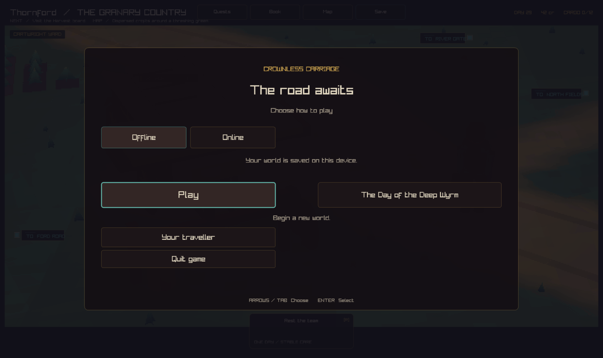
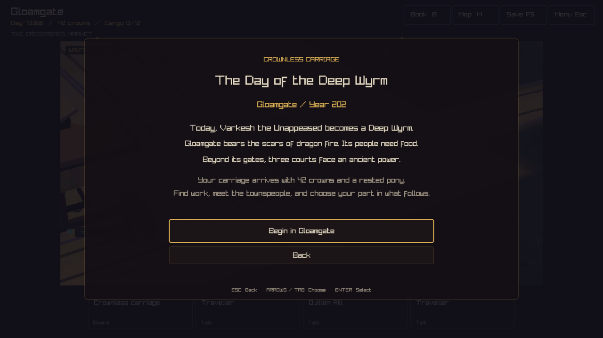
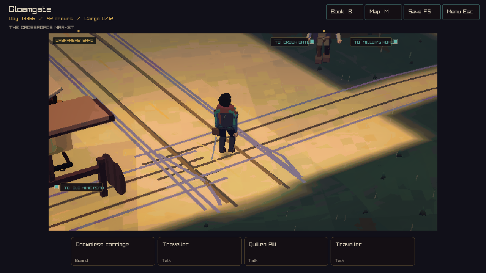

# The Day of the Deep Wyrm

Start a company in Gloamgate on the day Varkesh becomes a Deep Wyrm.
The town has 296 people, hunger at 23, and fire damage at 60. You arrive with
42 crowns, a carriage in good repair, a rested pony, and the **Prophecy of the Deep Wyrm**.
The gilt-bound book takes one cargo space. Open Company Book, then Prophecy
(or press 5 in the book), to read it. Press E or choose Deliver to Gloamgate
council to hand it over. The council keeps the book and the Journal records the
delivery. The promise appears alongside ordinary town work.

On a fresh offline title screen, choose **The Day of the Deep Wyrm**, then
**Begin in Gloamgate**. For a shared company, open **Create world** and choose
**Campaign: The Day of the Deep Wyrm**. The host supplies the usual world pass.
Invited players join that same company and history. Saved worlds use the usual
resume flow.

The opening images below record the original campaign before the prophecy item.

## Historical source

| Field | Recorded value |
| --- | --- |
| World seed | 2536334854 |
| Sweep ordinal | 310 |
| Opening day | 73366, Year 202 |
| Source simulation commit | d665eccedeb2f3795edd72dbe401ac2c5b471033 |
| Save schema / world generator | 75 / 25 |
| Historical state hash | 0x8c55991e74f0d280 |
| Asset SHA-256 | dd949453713d9fe80fefae3ab4496f8ab7626d697da4283652deb730aabf2e3f |

The source uses the archive supply dispatch rules in PR #592. This campaign
branch combines those rules with main at f0fa99e. The bundled SQLite snapshot
uses DELETE journal mode so it travels as one file. Its simulation hash matches
the original snapshot.

The loader checks the recorded seed, day, versions, and complete historical
state hash before it creates the company. It keeps the world clock, random
state, towns, characters, events, and dragon campaign. The new prophecy book
uses one new entity ID. The loader resets
the player inventory, carriage, horses, journey, mine progress, and route
knowledge for a fresh start in Gloamgate. The resulting company saves through
the regular campaign system.

## The starting book

> Three courts shall bind their banners. A champion shall leave Gloamgate.
> The Deep Wyrm shall fall by the narrowest measure.

The inscription asks the bearer to bring the warning to Gloamgate's council.
Roda Senn, the patron from the source history, is present in town at the opening.
The local handover is available on day one, while the town's empty fodder market
makes carriage departure depend on later supplies. A delivery transfers the
physical book to the town and records a world event. The player's normal
charter remains available for other work. The book's words stay in the Company
Book after delivery.

Fresh starts receive the book. Existing campaign saves retain their recorded
inventory. Solo and shared companies use the same delivery action and saved
ownership. Capture scene 23 opens the Prophecy page.

## A possible history

In the source replay, the world went on to produce these events:

| Day | Event |
| --- | --- |
| 73366 | Varkesh becomes the Deep Wyrm. |
| 73388 | Roda Senn funds a dragon host led by Quill Bridgeward. |
| 73397, 73428, 73458 | Three alliances form. |
| 73472 | The expedition leaves Gloamgate. |
| 73477 | Quill kills Varkesh, with strength 172 against 171. |
| 73482 | The survivors return with 3,185 crowns. |

These later events describe the source replay. Player actions and the running
world decide the campaign's future. Existing town work, trade, people, and
travel provide the company's first choices.

## Checks

- The campaign test checks the historical snapshot, fresh company, and world
  state preservation. It checks save/reload and 120 days of matching replay.
- The native frontend test covers opening, Back, starting, existing-world
  protection, saving, resuming, and the shared campaign selector.
- Shared host tests cover creation, invitations, repeat requests, restart,
  deletion, and recovery after a failed opening.
- Native and web asset preparation produce the recorded asset SHA-256.
- The screenshots above are native game captures at the opening.

For a headless build, run `ctest -R deep_wyrm_starting_campaign`.
For a native build, run `crownless_carriage --test-frontend`.
Capture scenes 21 and 22 show the introduction and the town respectively.

## Prophecy delivery validation

All 117 headless checks pass. The native Release build and interface regression
pass, including opening the Prophecy page, handing over the book, and resuming
the saved result. All 44 shared host checks pass, including a second player's
view of the delivery, repeated requests, and server restart. Static analysis
passes with the repository's one reviewed baseline item.

A further 120-day replay after immediate delivery kept the source sequence:
Roda funds the host on day 73388, Quill leaves Gloamgate on day 73472, the
wyrm's named trophy appears on day 73477, and the host returns 3185 crowns to
three allied realms on day 73482. The company took no further actions during
that replay.

The desktop window server was unavailable for the new Prophecy-page capture.
The earlier campaign images above remain labeled as the original opening.
