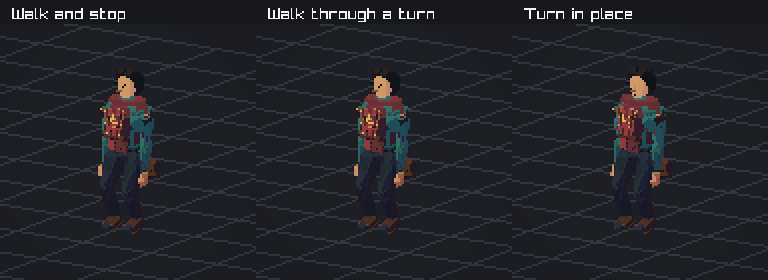

# Character steps and turns

Each boot keeps its heading while it supports the character. During a step, it
turns toward the new facing direction along the shortest angle. A standing turn
uses small steps and settles into the existing idle pose.

The foot follows an eased curve through lift and landing. At 0.70 m/s on flat
ground, a test sampled at 120 Hz measures a maximum landing speed of 0.0052 m/s,
compared with 1.0346 m/s for the previous controller. Both have about 12 cm of
mid-step clearance. These figures describe the test fixture.

The upper body keeps the game's eight-pose walk rhythm. Body lean is captured
with each pose. Feet blend from their walking pose into the climb preparation.



This eight-second review uses fixed simulation ticks, the game's pose blending,
and its character models. Each scene finishes at rest. Generate 120 frames at
15 frames per second with:

```sh
cmake --preset play
cmake --build --preset play --target run_humanoid_animation_captures
```

Frames are saved in `out/build/play/humanoid-animation`. Linux client CI runs
the same capture and publishes the `humanoid-animation` artifact.

The motion tests cover planted headings, left and right turns, the angle wrap,
standing half-turns, settling, step clearance, and takeoff and landing speed.
The local movement suite checks climbing, foot contacts, and held upper-body
poses in the character's facing frame.
