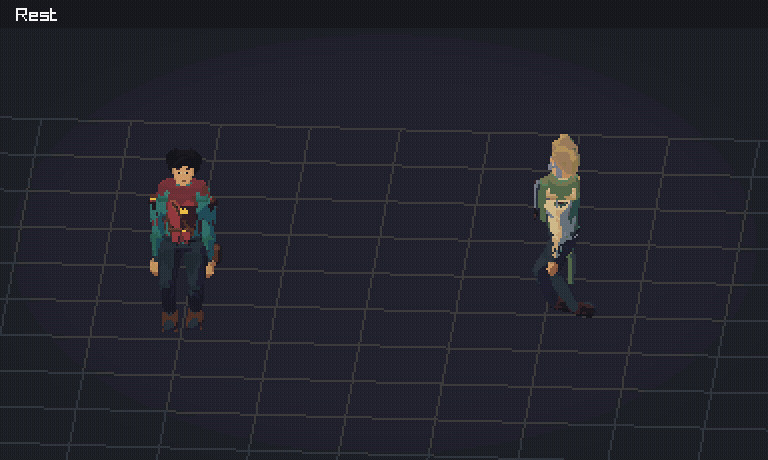

# Character steps and turns

Each boot keeps its heading while it supports the character. During a step, it
turns toward the new facing direction along the shortest angle. A standing turn
uses small steps and settles into the existing idle pose.

The foot follows an eased curve through lift and landing. At 0.70 m/s on flat
ground, a test sampled at 120 Hz measures a maximum landing speed of 0.0052 m/s,
compared with 1.0346 m/s for the previous controller. Both have about 12 cm of
mid-step clearance. These figures describe the test fixture.

The upper body follows continuous physical poses during travel. The head looks
toward the destination, followed by a smaller chest turn. Near a navigation
corner, attention blends toward the next path leg. Near the destination, a
small backward lean prepares the stop. Damped springs retain their current
speed when targets change, then settle as the character rests.

Pose history advances on each fixed simulation step. Rendering blends the
previous and current poses. A regression test compares matched poses at 30,
60, and 120 presentation samples per second, plus uneven sampling. It covers
a turn, a walk, and a stop, and requires exact matches.

Arm swings grow with walking speed. Forearm bend follows the shoulder with a
small delay. In the flat-ground test, the shoulder's swing spans 0.622 radians
at 0.35 m/s and 1.181 radians at 1.30 m/s. Both arm bones keep their lengths.

Resting characters breathe on a 3.6-second cycle. Their appearance seed sets
the cycle offset. The chest moves through 3.2 cm vertically, and the arms and
head follow it. The pelvis and feet keep their physical positions. Breathing
fades as walking speed rises and respects the reduced-motion setting. It uses
the interpolated simulation clock. The 120 Hz test measures a largest chest
step of 0.267 mm.

[View the earlier arm-swing and breathing upgrade](character-animation-comparison.gif).


This eight-second review uses fixed simulation ticks, the game's pose blending,
and its character models. Each scene finishes at rest. Generate 120 frames at
15 frames per second with:

```sh
cmake --preset play
cmake --build --preset play --target run_humanoid_animation_captures
```

Frames are saved in `out/build/play/humanoid-animation`. The full Linux client release job runs the same capture and publishes the
`humanoid-animation` artifact.

The motion tests cover planted headings, left and right turns, the angle wrap,
standing half-turns, settling, step clearance, and takeoff and landing speed.
The local movement suite checks climbing, foot contacts, and continuous upper-body
motion in the character's facing frame. Renderer tests also cover breathing,
repeated rendering, reduced motion, guard poses, and the walk-to-idle threshold.

## Attention and greeting

`CcLocalAgentAttend` accepts a point at eye height and a duration. A greeting
adds a small head lift, a nod, and a settle. Talking to a person uses this call.
Attention, chest turn, lean, and nod advance once per fixed tick. Rendering
blends their snapshots. The reduced-motion setting uses the resting head pose.
Combat, climbing, swimming, and falling use their physical action poses.

Gaze and nods are local presentation. The shared body pose keeps its existing
79-float layout. Head skin frames receive separate yaw and pitch values.

The renderer test checks matching body and head poses at 30, 60, 120, and
uneven display rates. It also checks the head leading the chest, a bounded
arrival lean, the greeting settling, foot contact, arm and head bone lengths,
reduced motion, and guard behavior. In the greeting fixture, the nod peaks at
0.205 radians and the largest fixed-tick gaze change is 0.166 radians.

## Performance review



[Watch the matched before and after scene](character-performance-comparison.mp4).
The earlier version appears above the new version. Both use the same route,
fixed updates, character models, camera, and twenty-second schedule.

```sh
cmake --build --preset play --target run_humanoid_performance_captures
```

This writes 300 frames at 15 frames per second to
`out/build/play/humanoid-animation/performance`. The full Linux client release
job includes them in the character animation artifact.
