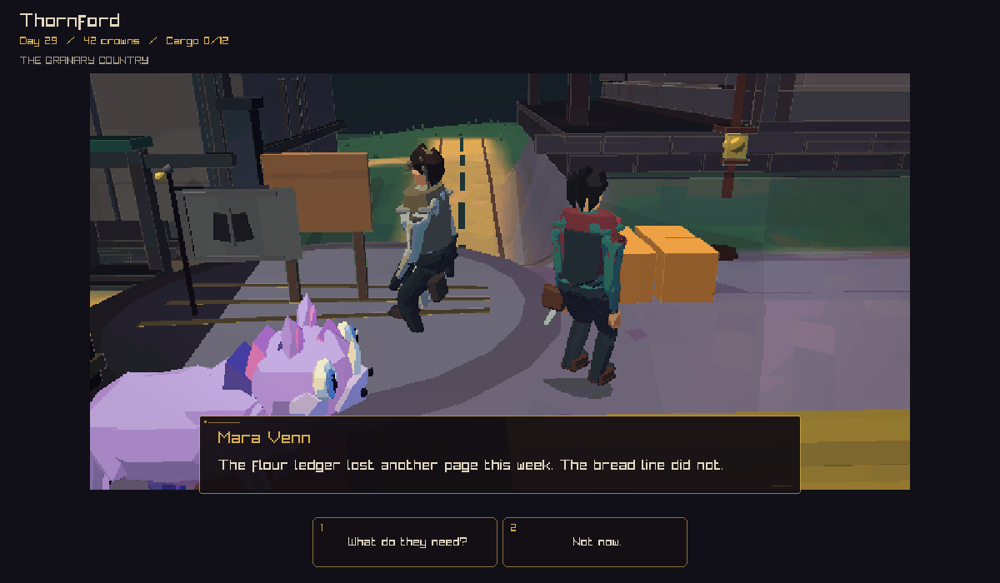
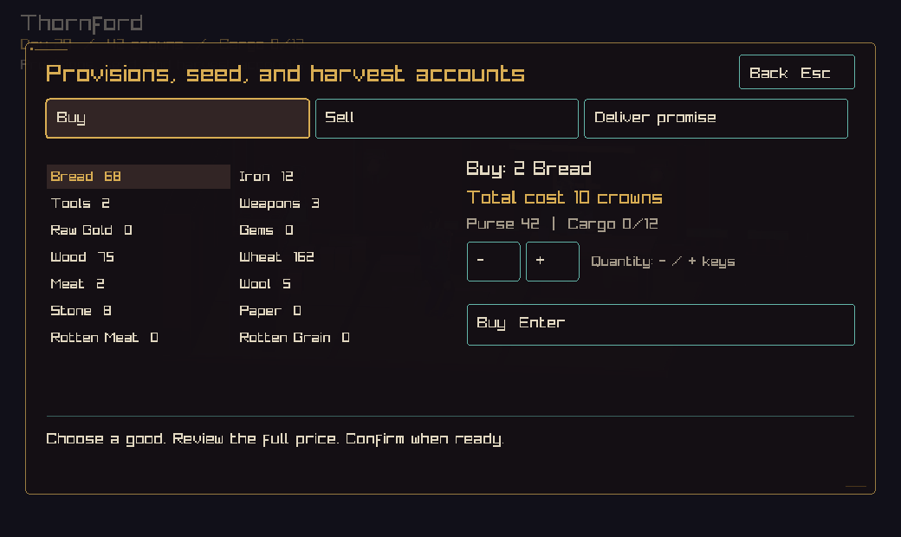
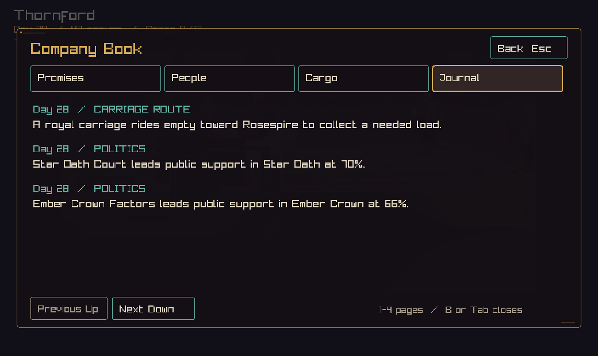

# Interaction and game interface

This PR builds the town interaction flow from [the design](interaction-ux-redesign.md). Clicking a person, service entrance, board, or carriage selects that object. The hero walks into range and performs its action. A new click changes the destination. Escape cancels the approach.

## Playing

| Control | Action |
| --- | --- |
| Click a person, door, board, or carriage | Walk over and act |
| Click clear ground or use movement keys | Walk |
| E / Shift+E | Select the next / previous visible target |
| F | Use the selected action |
| B or Tab | Open or close the Company Book |
| Q | Read local promises |
| M | Open the map case near the carriage |
| Escape | Cancel an approach, close a page, or open the menu |
| F5 | Save |
| F4 / F6 | Change motion / sound |
| T / H in the menu | Change text size / target hints |

Conversation replies use the numbered buttons. Trade has separate Buy, Sell, and Deliver tabs. Choose a good, set its quantity, and check the full price before confirming with Enter. The arrow keys choose goods; minus and plus change quantity. Hold Shift to change ten units at a time. The Deliver tab uses the full remaining promise load. A receipt shows the actual purse change.

The Company Book has Promises, People, Cargo, and Journal pages. It returns to the conversation, trade screen, or menu it came from. The combined title menu offers save, motion, text size, target hints, sound, return to title, and world controls. Solo play pauses while the menu is open. Shared play shows that the host keeps company time.

## How actions work

The planner uses place, object kind, and object ID to keep the selected target stable. Screen bounds come from the camera that drew the scene. Picking checks depth and building cover. Pointer input and F share the same availability check. A distant town alarm permits conversation when the hero is clear of combat.

A pending action follows the target until the hero arrives, the player cancels, or the target becomes unavailable. The walking route stays active when it passes a room exit. Object approaches use a gentler slope limit to allow for foot placement around turns. A blocked route produces a visible message.

Trade checks stock, purse, cargo space, the keeper's coins, and delivery proof. Confirmation compares the current quote with the one shown on screen. A completed trade holds its receipt until the player changes the selection or quantity. Commands still pass through the journal or the shared host. The existing journal and quest outcome records preserve completed actions.

## Review captures

These images show the interaction panels before the latest graphics and title-menu merge. They use a fixed native game fixture. Trade and book use 1040 × 620 with the largest text setting. Conversation uses 1200 × 700. The CI artifact `interaction-screen-review` captures the final combined build, including the menu.

## Checks

The native play build passes 72 tests. The new input check exercises both pointer and F conversation, a distant alarm, the full walk from the carriage yard into a shop, trade, exit, pause, book return, and journal reload. A separate route check reaches the service door and keeper in each of the six town types.

Trade checks cover purse, stock, cargo space, market funds, a changed quote, full delivery quantity, journey proof, reward, and repeated confirmation. Planner tests cover identity, moving targets, overlap, availability, cancellation, and a blocked route. Preferences tests cover saved settings and older preference files.

Run the native checks with `cmake --build --preset play -j 4` and `ctest --preset play --output-on-failure`. The focused checks match `adventure_`, `interaction_planner`, and `daily_play_policy`.

For a separate play session, pass `--campaign /path/to/review.ccsave`. Native review captures use `--capture-ux MODE image.png WIDTH TEXT_SIZE`. Use a relative output filename in the desired output folder. Modes are 0 town, 1 interior, 2 conversation, 3 trade, 4 journal, 5 menu, and 6 local promises. Supported widths are 1040, 1200, and 1600; text size 2 selects the largest setting.

## Follow-up work

The broader design remains tracked in #216. Further work covers private building interiors, more named conversations, road and site presentation, key remapping, caption options, and full browser and shared-session playtests. New receipt text stays in the current trade screen; lasting history uses the existing journal and quest outcome records. Shared trade uses the existing host command protocol. Host-side binding of price quotes remains a separate improvement.
