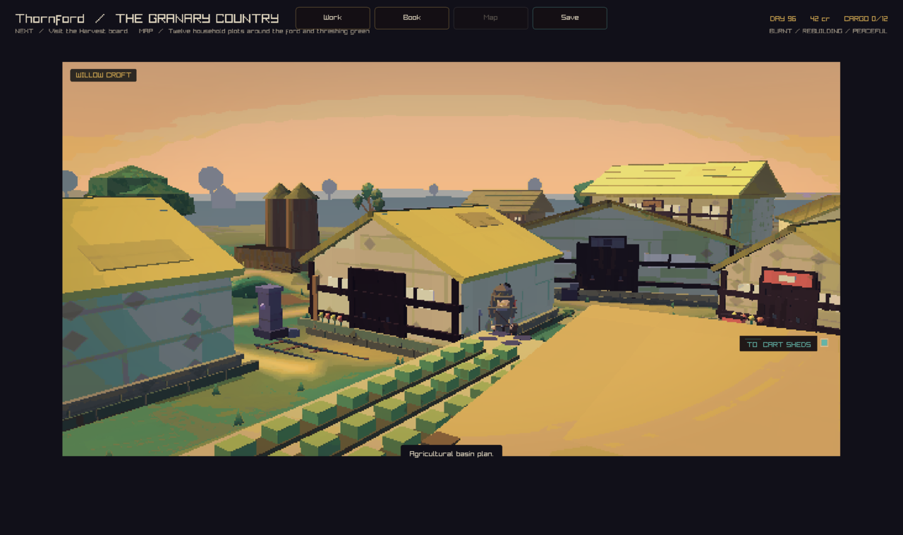
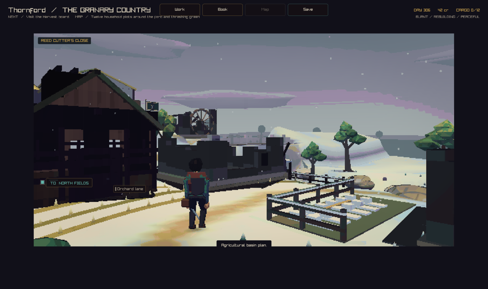
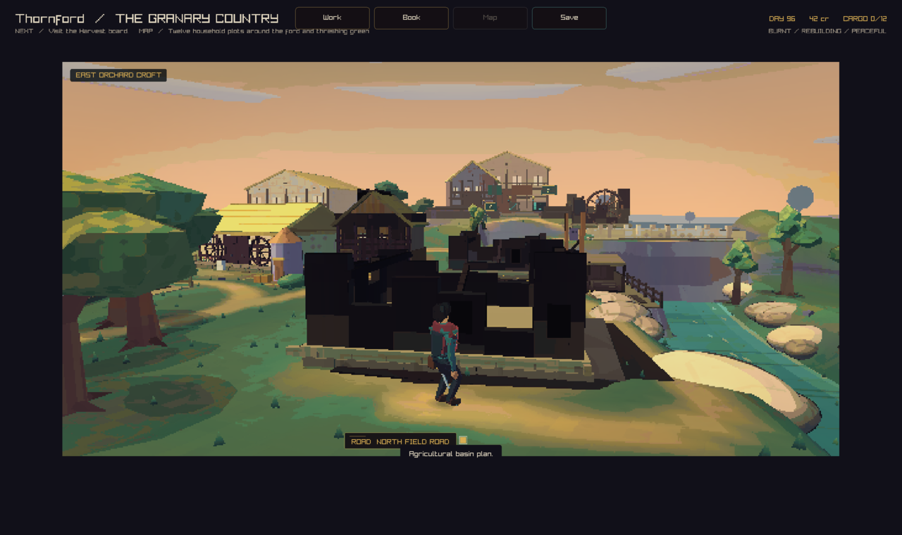

# Living village plots

Each settlement has a saved blueprint. Its buildings, doors, yards and walking
lanes form a hand-made set piece inside the generated landscape. Each house has
its own saved condition. The street view and the wider world read the same house.

## First village pass

Thornford has twelve fixed plots around the ford and threshing green. Willow
croft, the reed cutter's cottage and east orchard croft join the existing nine
buildings. Each plot has an authored household yard. Kitchen gardens, working
yards, sheds and fences give the streets a clear purpose. Two garden lanes join
the road network. Shared obstacle descriptions keep fences and sheds in step
with walking and collision. Three added street views show the new croft lanes.

The other five towns use their existing authored buildings with the same saved
house conditions. Each town keeps its blueprint when its economic role changes.

| Blueprint | Saved building plots |
| --- | ---: |
| Thornford | 12 |
| Silverwick | 11 |
| Gloamgate | 10 |
| Alderwatch | 9 |
| Rosespire | 12 |
| Hollowbarrow | 9 |

## House conditions

Conditions combine. A burned house can gather snow. A worn house can have a fresh
roof patch. Repairs can leave scaffolding beside a partly burned wall.

| State | Visible result | Source |
| --- | --- | --- |
| New or recently repaired | Pale timber, fresh plaster and roof patches | Build date and repair date |
| Worn | Damp wall bases, faded materials, roof patches and braces | Saved upkeep and roof health |
| Burned | Charred walls, scorched ground and an open shell at heavy damage | Saved fire damage for that plot |
| Under repair | Side scaffolding and work timber | Recorded repair progress |
| Snowy | Roof cover, snow in open ruins, garden and fence cover | Campaign day, roof pitch, exposure and warmth |
| Wet | Darker walls and roofs | Rain and recent thaw |

New worlds start with a fixed mix of ages and upkeep, with seeded details for each
plot. These values survive a save and reload. Fires and funded repairs change
house state during play. Fire damage starts by the approach road and then reaches
nearby houses. Repairs follow the existing town repair step that spends supplies.

Weather follows the 364-day calendar. Snow builds through winter and melts in
spring. A short history of daily weather keeps snow on the ground between storms.
The light setting leaves the day's weather intact. Winter precipitation uses
snowflakes in exterior views.

## Save and layout contract

Save schema 126 adds a blueprint record and building records for each settlement.
A plot ID links a house to its condition, yard and fire position. These IDs stay
fixed when a profile array changes order. New layout versions should retain old
plot IDs and supply an explicit save upgrade.

Older saves receive the matching blueprint. The upgrade preserves the old visible
burn order and burn amount on the original houses. Thornford's three added plots
start intact. Saved records include build and repair dates, upkeep, roof health,
fire damage, repair progress and a style seed. They also take part in the world
hash. Invalid, duplicate or missing records produce a load error.

The generated world places the whole set piece with one position and turn. House
state and solid yard props work in both views. The existing street scene supplies
Thornford's detailed river and bridge. Wider-world river and bridge stitching is
a later landscape step.

## Review and checks

The native review modes stage a mixed neighbourhood through the normal renderer.
They set the campaign day and house records for a clear visual comparison.
The combined native build passed all 259 checks. The final orchard camera
adjustment also passed the full renderer checks across two seeds.







These images are staged native captures. Willow and the orchard use day 96;
the snowy reed cutter's close uses day 306.

```sh
cmake -S . -B build-villages -DCMAKE_BUILD_TYPE=Release -DCC_WARNINGS_AS_ERRORS=ON -DCC_BUILD_GRAPHICS_PROBES=ON
cmake --build build-villages --parallel 8
ctest --test-dir build-villages --output-on-failure -R 'building|distinct_local_places|town_shop_walks|local_collision_space|seeded_hilly_terrain|finite_world_streaming|living_world_feedback|town_evolution|sqlite_round_trip|persistence_field_contract|the_return_digest'
```

The new checks cover per-house save and load, legacy fire appearance, connected
fire, funded repair, stable plot identity, season changes, and the match between
visible house centres and simulated fire positions. Existing route checks walk
to town services across six towns and two seeds.

Example review captures, with the native executable named `game`:

```sh
game --capture-town-state 0 25 52 thornford-crofts.png village
game --capture-town-state 0 70 54 thornford-winter.png winter
game --capture-town-state 0 77 67 east-orchard-repairs.png village
game --capture-town-state 1 44 29 gloamgate-wet.png wet
```

On macOS the executable is
`build-villages/crownless_carriage.app/Contents/MacOS/crownless_carriage`.
