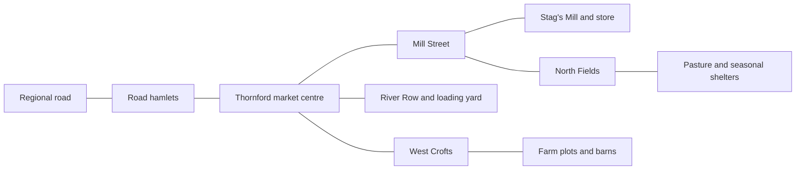

# A living world at human scale

Design review, 24 September 2026. Status: proposed direction and staged plan.

The code audit used `0f196d031dc65d5a8beca2938e43ec62e07c4392`, schema 113,
generator 25. The [evidence report](../reviews/living-world-2026-09-24/README.md)
contains source locations, measured counts, reproduction steps, and limits.

## The decision

Crownless should be an adventure about a travelling company in a living regional
economy. Every resident should be a person. Every person should have a home or a
known shelter situation. Every workplace should occupy a place and employ people.
Every delivery should carry goods between real stores.

Treat a settlement as a **town and its surrounding districts**. Keep the current
authored scenes as the memorable centres of those settlements. Roads can lead to
housing streets, farm hamlets, mills, mines, and camps. The census should cover
that whole area. The place sign and town book should make the boundary clear.

Keep the current population totals as the first layout targets. Decide whether
they fit after allocating homes, food supply, work, and travel. Existing counts
become claims that the world plan must support. Future population should follow
occupied homes, births, deaths, and moves.

The sample world contains 12,323 reported residents and 97 named character
records. Thornford reports 1,463 people and has eight main building records in
its current profile. Compound structures add visual detail. Their capacities
still need an address and occupancy model. This is the central design gap.

## What 1:1 means

These rules define the proposed product promise:

| Subject | Rule | What the player can verify |
|---|---|---|
| People | One living resident equals one saved person ID | Find the person at home, at work, visiting, or travelling |
| Homes | Each person has household membership and an address, or an explicit temporary shelter state | Visit the entrance and see who lives there |
| Buildings | One placed building has a stable footprint, floors, entrances, and room capacities | The same building has the same size through every view |
| Distance | One world unit is one metre; roads store measured lengths | A route, its signs, its travel time, and wheel motion agree |
| Time | One world clock orders movement, work, meals, travel, and history | A delivery arrives before its goods are used |
| Goods | One quantity and package definition follows goods through every holder | The load leaves one store, rides on a carrier, and reaches another |
| Money | Every payment has a payer, a recipient, and a reason | Follow a purchase, wage, toll, or grant through the ledger |
| Summaries | Town and kingdom values come from the people and places underneath | Open a total to see its districts, stores, and residents |

Art can keep Crownless's stylised proportions. Camera distance and simpler distant
models can keep the scene readable. Saved dimensions and occupancy remain stable.
People indoors are present in rooms. Their street appearance follows their actual
activity. A small room view can reveal them when the player enters.

## Lessons from other games

The source descriptions below are research findings. The Crownless choices are
proposals drawn from that research. Older design talks describe their own version
of each game.

| Reference | Useful finding | Crownless choice |
|---|---|---|
| MUDs | Bartle describes worlds built from meaningful linked places. A fixed visual scale adds distance and travel obligations. [Making Places, pp. 5–8](https://mud.co.uk/richard/makplac.pdf) | Use a graph of named places with real paths and distances. Each place offers clear people, services, and actions. |
| Evennia | Persistent object attributes can hold references to other saved objects. [Attributes](https://www.evennia.com/docs/latest/Components/Attributes.html) | Make person, home, store, and workplace references durable. |
| Dwarf Fortress | Its developer recorded population duplication between levels of world detail, then worked on population accounting. Locations later connected rooms and supplies with workers and visitors. [2013 log, 15 December](https://www.bay12games.com/dwarves/dev_2013.html), [2015 log, 1 December](https://www.bay12games.com/dwarves/dev_2015.html) | Share one census across local and distant simulation. Use institutions such as inns and archives to connect people, supplies, and stories. |
| The Sims 3 and 4 | The Sims 3 talk uses hierarchical choices and story progression across a larger world. Sims 4 Neighborhood Stories gives households careers, moves, and family changes. [GDC talk](https://media.gdcvault.com/gdc10/slides/Evans_Richard_ModelingIndividualPersonalitiesInTheSims3.pdf), [Neighborhood Stories](https://www.ea.com/games/the-sims/the-sims-4/news/neighborhood-stories-system) | Give residents simple daily plans. Record meaningful household events. Spend richer behaviour detail on people the company knows. |
| Foundation | Housing has explicit resident capacity, density, quality, and a distance limit for nearby work. [Housing](https://wiki.polymorph.games/foundation/House) | Match occupants to real dwelling capacity. Place housing around reachable work and services. |
| Farthest Frontier | Remote shelters support distant work. Its town information exposes time spent working, travelling, and seeking resources. [Buildings](https://www.farthestfrontier.com/guide/gameplay/buildings/), [Town information](https://www.farthestfrontier.com/guide/information/town-center/) | Let camps and hamlets support remote work. Explain a delay through a worker's actual time and route. |
| Cities: Skylines II | Citizens have homes, jobs, life stages, and activities. Routes consider time and other costs. [Citizen life paths](https://www.paradoxinteractive.com/games/cities-skylines-ii/features/citizen-simulation-lifepath), [Traffic](https://www.paradoxinteractive.com/games/cities-skylines-ii/features/traffic-ai) | Give each person a resolvable destination and a journey. Show home, work, and current activity in one small view. |
| Civilization VII | The original economy design delegates much of a supporting town's activity and gives it a clear focus. [Economics lead's design diary](https://www.ezgamedesign.com/dev-blogs/managing-your-empire) | Use district roles and local councils for routine decisions. Let the player influence priorities through relationships and contracts. |
| Workers & Resources | Production connects resources, workers, transport, and construction. [Official features](https://www.sovietrepublic.net/) | Make the complete supply path visible. Local managers arrange ordinary staffing and hauling. |
| Anno 117 | Needs can be met through alternative goods within categories. [Needs design](https://www.anno-union.com/devblog-fulfil-needs-your-way/) | Start with food, rest, and shelter. Allow food choices through shared nutrition units. |
| Patrician IV | Its manual ties regional production and trade to local demand and business growth. [Official manual, pp. 14 and 46](https://download.kalypsomedia.com/manuals/p4_manual-en.pdf) | Give the travelling company useful trade routes and clear local shortages. |
| Transport Fever 2 | Residents have homes and destinations. Its statistics distinguish production, shipment, and delivery. Its calendar has a separate speed model. [Simulation](https://wiki.transportfever2.com/doku.php?id=gamemanual:simulationoverview), [Statistics](https://wiki.transportfever2.com/doku.php?id=gamemanual:statisticsdatalayers) | Follow people and cargo. Display work completed, goods dispatched, and goods received separately. Declare Crownless's time model explicitly. |

The combination is a place graph from MUDs, lasting people and history from world
simulations, useful streets from city builders, readable trade from economic
games, and delegated regional decisions from 4X games.

Complexity needs a purpose. Foundation's 2023 roadmap reduced planned life and
maintenance systems to fit its management scope. Crownless should use that lesson
to stage new household detail around visible player choices.
[Foundation roadmap](https://www.polymorph.games/foundation/news/2023/02/24/our-roadmap-update-is-now-available/)

## Where Thornford's 1,463 people could live

This is a capacity sketch for the measured seed. District names beyond the
current centre and mill are working names. Four residents per dwelling is a
planning assumption. It makes the space requirement clear; household sizes can
vary within the final plan.

| Place | Residents | Dwellings | Main activity |
|---|---:|---:|---|
| Market centre | 64 | 16 | Trade, bakery, inn, granary, civic services; homes over shops and around yards |
| Mill Street | 240 | 60 | Mill work, workshops, gardens, paired cottages |
| River Row | 240 | 60 | Hauling, storage, services, housing courts |
| West Crofts | 440 | 110 | Farmsteads and small hamlets among fields |
| North Fields | 392 | 98 | Farms, herds, seasonal work |
| Road hamlets | 87 | 24 | Road crews, inns, carriers, outlying homes |
| **Total** | **1,463** | **368** | **1,472 sleeping places at the assumed capacity; nine spare places** |

This plan needs hundreds of dwelling units across the settlement's land. Several
units can share a building. Farms also need fields, grazing land, stores, access,
and workers. Final footprints and food yields must earn the capacity shown here.
The current centre's rooms need a floor plan before allocating its sixteen homes.
Spare beds within an occupied family home remain distinct from a vacant dwelling
or a room offered for lodging. Track all three. Ordinary moves reserve a suitable
home. Births and displacement can create recorded crowding or temporary shelter.

The diagram shows proposed connections. Geometry will set their lengths. Start
layout trials with homes within a short walk of routine work and rural groups
spread along paths. Remote sites need accommodation or a workable commute.
Existing road spurs are useful starting points.

The town book should say, for example, **Thornford: 1,463 residents across six
districts**. A district sign should show that district's name. Its details can
separate residents, people currently present, visitors, occupied homes, and free
places. A person away on a job still belongs to their home census.

Use the same method for the other five settlements. Silverwick can distribute
people among mine rows and pit camps. Alderwatch can include barracks and nearby
farms. Rosespire can support denser courts and several homes within one building.
Settlement character should emerge from its layout, work, and institutions.

## A small set of connected records

| Record | Authoritative state |
|---|---|
| Person | Lifetime ID, age, household, home, current room or journey, work assignment, needs, personal ties |
| Household | Members, dwelling agreement, shared pantry, purse, shopping plan |
| Building and dwelling | Place, footprint, floors, entrances, rooms, sleeping capacity, condition, ownership |
| District | Named boundary, connected places, plots, public services, local authority |
| Workplace | Building or land, owner, job slots, shifts, stores, recipes, equipment |
| Journey | Traveller or carrier, endpoints, path, travelled distance, start time, planned arrival, interruptions |
| Store and goods lot | Place, owner, quantity, package, condition, capacity, reservations |
| Event | Time, actors, affected records, cause, outcome |

Current lifetime IDs, appearance seeds, introductions, gossip sources, archives,
production receipts, custody transfers, and carrier reservations are foundations
for this model. Give existing characters addresses first. Preserve those people
as members of the existing census when filling the remaining resident records.

Use a compact record for each resident. Add rich memories and local animation
state as separate detail. The measured `CcCharacter` is 952 bytes on the review
machine: 12,323 full records alone would take about 11.2 MiB before related arrays.
The greater risk is work that scans people, relationships, routes, and gossip
together. Index records by place and next scheduled event.

A resident's current location must be exactly one room, outdoor place, or journey.
A journey has a route and progress even while its district is unloaded. The same
ID drives the conversation target, scene actor, People book, and event history.
Temporary shelter also resolves to a camp, building, outdoor place, or journey.
A displaced person retains one recorded home district until an explicit move
changes that membership.

## A day that explains itself

Begin with food, rest, shelter, and an assigned daily task. Give people a few
preferences that influence work choices, social visits, and travel. Reuse existing
disposition, stress, courage, and relationships where their effects are visible.

A baker leaves her recorded home and follows the lane to Stag's Mill. Her shift provides
available work time. Wheat, tools, oven capacity, and store room limit output.
A carrier brings wheat from Nine Furrows. Bread enters the mill bakery's store.
Households buy it or receive an agreed allocation. Eating reduces their pantry
and satisfies the members who ate. At the end of her shift, the baker visits a
friend or returns home.

The current site recipes already give Nine Furrows wheat output and Stag's Mill
wheat-to-bread work. This is the first chain to make visible end to end.

Households handle routine shopping together. Institutions handle shared meals and
beds for inns, barracks, and work camps. Reserve those places during booking.
The player can follow one trip or inspect a simple daily summary.

Births create new dependent people. Deaths close a life and open any resulting
vacancies. Moves transfer actual household members. Offices and jobs choose
successors from eligible people. Keep ancestry and history references across
these changes. Seasonal labour can have a permanent home and a temporary bed.

## Food, work, trade, and construction

Keep the existing fourteen goods during the first migration. Begin with the
existing **wheat → bread → household** chain and the tools it needs. Paper,
archives, mining, weapons, herds, and treasure can then use the same rules.

Define a base quantity for each good. A ration is a declared amount of game
nutrition. A sack or crate contains a stated number of base units. Each package
has mass and volume. All stores and vehicles use those same values. Vehicle size,
available load space, and carrying strength explain different capacities.

The current food scale requires a full balance pass. At one ration per resident
per day, Thornford would need 10,241 rations per week. The current civilian budget
is five. That roughly 2,048-fold difference shows why food production, fields, reserves,
prices, animal feed, starting stores, and carriage loads must change together.
The final model can assign different needs by age and activity using the same
nutrition units.

Workplaces get real stores. Settlement totals sum those stores and clearly label
goods in transit. Recipes require worker time, inputs, tools, suitable equipment,
and space. Farm production also uses worked land and season. Job assignment
includes the travel time needed to reach the shift. A worker has one time budget
across all commitments.

Keep the existing production plan and result records. Replace synthetic work
budgets with time supplied by workers. The archive's named staffing checks offer
a useful first pattern. Keep real freight dispatch, payment, route reservations,
and partial unloading. Extend these to local carriers and district stores.

Use existing money transfers as the base for household and workplace accounts.
A wage moves money from an employer to a household or person. A meal purchase
moves it to the seller. Taxes, rent, relief, and tolls have named accounts. Price
signals come from available supply, reserved demand, delivery time, and recent
sales. Limit price changes so a small event remains understandable.

Delivery changes stock and supply coverage. Eating changes hunger. The player
gets immediate feedback from a visible unloading, payment, and completed order.
When supply reaches people, queues shorten and work resumes through those events.

Growth uses the same rules: local demand leads to a proposed plot; a builder
books materials and workers; delivery and work complete the building; inspection
opens its rooms; households move into available homes. A council can arrange
ordinary growth. The company can fund a project, supply it, or negotiate access.

## Space and time

Use measured path distance for people, wagons, wheels, signs, and arrival times.
Use camera motion for transitions between street, district, and region views.
Buildings and carriage bodies keep their dimensions. Local entrances, spurs,
regional roads, and mine passages belong to one connected place graph.

The current regional routes are roughly 120–343 world units long but take two
to four game days. A metre-based region needs a new layout. As an initial balance
trial, a laden wagon moving about 1.1 metres per game second for six hours travels
about 24 kilometres per day. A two-day road would then cover about 48 kilometres
plus stops. These are prototype settings, not measured history. Author the real
route and stops first; calculate its travel time from them.

Stream the wider countryside in cells. Keep landmarks, fields, junctions, and
houses at stable coordinates. The player can walk the whole path or request
faster passage through quiet sections. Show the current place and next meaningful
stop while time advances.

Use one authoritative world clock. Start local play trials at one game second per
real second. Offer whole-world time steps for travel, rest, and waiting, with
trial multipliers of 60, 600, and 1,800. Stop at a blocked route, danger, arrival,
appointment, or another decision that needs the player. Time acceleration advances
every affected process through the same ordered events.

Walking takes time from distance and speed. Searching, mining, surveying, and
crafting take their own declared work time. Tune those durations together with
travel and production. The current activity-specific clock rates require a
versioned change.

For the first shared-world prototype, choose coordinated sessions. The server
owns the clock. Before a large time advance, each active company selects a
destination or timed activity, such as work, rest, or waiting. Once everyone is
ready, advance to the earliest decision. Bookings retain their place in the
shared schedule. Solo play can pause and advance the same schedule directly.

Test this choice before building the regional layout. One company should explore
locally while another prepares a two-day trip. They should then complete useful
activities through a shared advance. Target one to three real minutes for the
trip once the companies are ready. The test must also establish an acceptable
wait for agreement. At the proposed normal clock rate, a two-day journey takes
two real days while another company keeps the world at normal speed. This is a
material product constraint. The trial should settle session rules and route
scale before the wider world adopts them.

## How the player understands the world

Keep the street view calm. People, piles, doors, carts, smoke, and notices should
explain the most useful facts. Show a small contextual card after selection.

| Visible change | What selection reveals | Useful action |
|---|---|---|
| Stag's Mill bakery waiting; empty grain bins | Wheat is due from Nine Furrows; its cart is delayed at a broken crossing | Visit the crossing, carry a load, or accept a repair contract |
| Workers walk toward the mill | Names, homes, shifts, and current destination | Follow, talk, or open the workplace |
| New roofs rise beside a lane | Builder, funds, materials delivered, completion step | Supply timber or fund a dwelling |
| Homes have spare beds | Occupancy and terms | Rent a room, offer shelter, or arrange a move |
| Cart unloads into the granary | Goods, owner, origin, buyer, delivery receipt | Trade or take the next haul |
| Mine camp stays quiet | Shift delayed by tools, staff, access, or demand | Bring the needed tool or speak with the foreman |

A selected person needs a name, current purpose, home, and work, followed by Talk
or Follow. A selected workplace needs its current task, staff, supplies, and the
main reason for delay. District views can show homes, jobs, food coverage, and
routes. The regional map can show specialities, trade, authority, and danger.
Each summary opens the places that explain it.

Use measured game state for direct observations. Reports from other places retain
their source and age. A rumour can describe a suspected shortage; a visited store
can show its current stock. This preserves Crownless's gossip and archive play.

The company acts through travel, buying, selling, hauling, property, contracts,
aid, relationships, and political influence. Local households, employers, and
councils carry out routine plans. Each added system should create a visible
consequence and a useful company decision.

## Simulation detail and performance

| Distance from play | Work performed | State retained |
|---|---|---|
| Nearby | Local movement, avoidance, interaction, animation, room activity | Full identity, route, reservations, needs, work, and goods |
| Elsewhere in a loaded district | Scheduled departures, lane travel, arrivals, shifts, transactions | The same records and commitments |
| Distant districts | Ordered events for travel, work, meals, deliveries, and household changes | The same records and commitments |

Visibility chooses drawing detail and local movement detail. It also determines
which records are loaded into fast lookup structures. Economic and life outcomes
come from shared rules. A distant work shift must require the same staff, inputs,
time, and capacity as a watched shift. Saved events use stable ordering and
seeded choices so replay remains deterministic.

Lane capacity, queues, blocked entrances, and consequential travel delays belong
to those shared rules. Nearby animation follows their decisions. A player who
blocks a lane creates a saved movement event. Compare watched and distant runs
with the same command and event log, including a crowded crossing.

Profile 12,323 residents first, then a stress case of 25,000. Measure memory,
save size, load time, a busy district, one day, one year, and shared-world catch-up.
Keep detailed history for known people and important events; keep compact life
records and references for the full census. Set performance budgets from the
current browser and native measurements before choosing detail caps.

## Delivery plan and proof

Each row is a focused PR group with a playable or auditable result. The pilot
starts with a small occupied street, then reaches all 1,463 Thornford residents.
Use a separate pilot world during these steps. Reserve its housing, work, and
food-producing land before filling the census. Activate the new census, life
events, needs, goods conversion, opening stores, worker time, and freight rules
together. Earlier PRs can add records, migration checks, and review views. Existing
worlds keep their versioned rules until the complete conversion is ready.

| Order | Work | Required proof |
|---|---|---|
| 0 | Prototype local time and coordinated travel with two companies | Both companies complete useful sessions; trip and agreement times meet the play-test target before route geography is committed |
| 1 | Define space, time, food, cargo, and census units; fix route distance consumers and camera scaling | The same journey and body dimensions agree across views; saved in-flight journeys retain continuity |
| 2 | Add placed districts, buildings, dwellings, and workplaces around the current Thornford centre | Every entrance has a route; every capacity fits a floor plan; map and street view identify the same places |
| 3 | Add the compact census and households; assign existing people first | 1,463 unique resident IDs reconcile to households and addresses; visits preserve identity and count |
| 4 | Add shared time scheduling and the first home–work–food day | Following a person agrees with their saved plan; watched and distant days produce matching outcomes |
| 5 | Connect labour, food quantities, local stores, money, and district freight | A delayed wheat load causes a visible bakery delay; delivery and eating explain recovery; accounts reconcile |
| 6 | Add moves, births, deaths, vacancies, construction, and succession | Each census change names the people involved; new occupancy follows completed housing |
| 7 | Extend the place graph and census across the region; integrate mines, armies, and special systems | All six settlement totals reconcile; carriers and crews have identities; regional scale and performance meet measured budgets |

Migration should preserve existing person IDs, relationships, introductions,
treasures, owners, contracts, and event references. Allocate aggregate stores and
market funds to explicit holders with a saved conversion record. Food unit changes
need declared conversion rules and before/after totals in the new units. Apply
those rules to travelling cargo, reserved ingredients, paid orders, contract
quantities, and prices as well as stores. Record any added opening supply for new
districts separately from unit conversion. Current town and traveller quantities
need an explicit reconciliation because they share goods IDs across different
scales. Active journeys retain their path version until a safe transition. Earlier save versions
continue through their documented compatibility paths.

The audit found that the global goods total currently needs coverage for road-site
stock. Complete that accounting coverage before using it as a migration gate.
Test births independently from deaths as the lifecycle changes. Mutate every new
saved field and check direct load and hash coverage.

The first full demonstration should take the player from a known resident's home
to Stag's Mill bakery, through a delayed wheat delivery from Nine Furrows, and
back to the household's evening meal. Show the same saved people and load at each step. Repeat
with the district out of view, then reload during the journey. Matching identities,
quantities, times, and visible consequences establish the foundation for the wider
living world.
