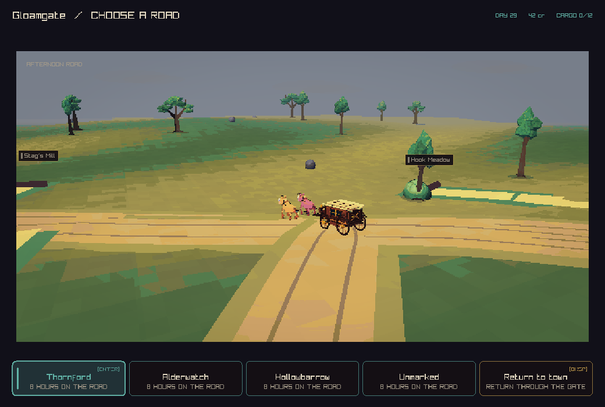

# Travel flow review

The company should leave town freely, follow a road, choose reachable branches, and face a toll when it reaches the booth. The destination is a travel goal. The carriage's current position determines the choices available now.

This review follows the Gloamgate multiplayer playtest. The player reported feeling stuck, found the text hard to understand, and asked for group agreement before the coach leaves. Source baseline: `c8d0dc02947360febecf0c503b99e0a49dac6a23`. The live report comes from the supplied screenshot; the source and local reproductions below use that revision.

## Why leaving cost crowns

`CcSimTravelPreview` combined the route's travel days, a surcharge for smuggler roads, and `TradeRouteToll`. The toll helper adds charges for a closed road, a smuggler road, or a war border. `ApplyTravel` required the whole sum before departure. It paid the origin market and the destination kingdom immediately.

This was a charge for a whole journey. A player with four crowns could select a nine-crown route and appear stuck. `BuildContextActions` offered every road as enabled. The command rejected the fare, but the feedback renderer required the town view while the player remained in the road view.

## Findings and changes

| Finding | Evidence and effect | Result in this PR |
| --- | --- | --- |
| Departure collected the fare and route toll together. | A baseline probe with zero crowns returned `The company cannot provision that journey.` | Schema 41 starts journeys for zero crowns. Every route passes the zero-purse test in both directions. Existing encounter payments remain choices at the encounter. |
| Road errors were hidden by the current view. | `ApplyTravel` returns the reason to `HandleInput`, while the toast required `VIEW_LOCAL`. | The road view keeps its feedback visible. Route buttons show travel hours; the return action uses plain wording. |
| Resolving an encounter could fail the shared host's validation. | `CreateJourneyTraffic` created an active shipment without a royal carriage. The test reported `Active shipment carriage link is invalid.` The host applies a command to a copy and rejects invalid results. | The shipment uses an idle carriage at its origin. When that carriage is away, normal dispatch handles later trade. Tests cover both cases and gold conservation. |
| The shared clock could pass a roadside choice. | At a prepared stop, progress changed from 160 to 191 during 60 runtime ticks. The local client checked the stop before each tick; the shared host advanced a batch. | The shared bridge checks each tick and holds at the same stop. A two-client save transfer preserves the stop. A pass command resumes travel. |
| An engine upgrade could leave the shared JSON view on the old rules. | The C save loader upgrades a campaign while the host previously retained its cached view. | Host startup refreshes each saved campaign and its view in one transaction when they differ. Revisions advance, while member sequences, receipts, and pause state stay intact. This addresses #303. |

The save version separates the new economic rule from historical command replay. An existing paid journey keeps its recorded charge and position. New departures use zero. A journal written by the baseline schema-40 executable replayed through the schema-41 build with the same purse, destination, and paid amount.

## Road structure still needs work

The visible fork uses the routes that leave the current settlement. `HandleInput` turns its selected branch into a complete destination journey. The saved journey holds one route, origin, destination, and elapsed progress. This supports travel along a corridor; it needs saved junction choices to support the requested branch-by-branch travel.

Roadside locations have route positions, but their current stop actions are camp and continue. Toll ownership and cost are currently route calculations. Existing armed encounters provide a place to pay, fight, or withdraw; a general toll-booth rule needs a saved booth, crossing state, and an explicit barrier at its location. Removing the departure tax is the first change, and the new booth model remains work in [#315](https://github.com/atimics/crownlesscarriage/issues/315).

Departure also consumes the whole trip's fodder, checks horse readiness and pregnancy, may wait until morning, and applies cargo spoilage before movement. Those rules remain in this PR. They need a visible preparation and time flow so a short trip toward a branch has clear consequences. Reaching a junction, a booth, or a site should expose the relevant choice there.

Multiplayer currently accepts a valid travel command from any member. Other clients follow the resulting shared journey when they poll. Add a host-owned departure proposal with a named destination, eligible crew, and visible responses. Start once the agreement rule is met, charge any later encounter payment once, and move every participating avatar with the carriage. Reconnecting players should return to the same journey or arrival point. [#316](https://github.com/atimics/crownlesscarriage/issues/316) tracks this work.

## Next travel delivery

1. Save road segments, reachable junctions, direction, and carriage progress in the simulation. Use these same locations for rendering and input.
2. Add booth approach, payment, passage, retreat, and branch choices. Bind each result to that booth and journey so reconnects and retries preserve one result.
3. Add group departure approval and show its state to every player, including players reading a book or using a town service.
4. Rework preparation, rest, supply use, and spoilage around visible time and travel decisions.
5. Play one complete route together: town, branch, booth, side stop, return, and arrival. Cover an empty purse, a refused toll, a lost connection, and save/reload at each decision.

## Checks

- All 73 native tests passed after the C and UI changes.
- All 28 shared-host tests passed after the startup refresh change, including idle, paused, and travelling cached views.
- A real schema-40 host database reopened under schema 41 with its fare changed from 2 to 0, its revision advanced, and its purse preserved.
- A schema-40 pending travel journal replayed under schema 41 with its original paid amount and destination.
- The updated road screen was captured at 1040 × 700. Larger text and complete travel guidance remain part of #293 and #315.

