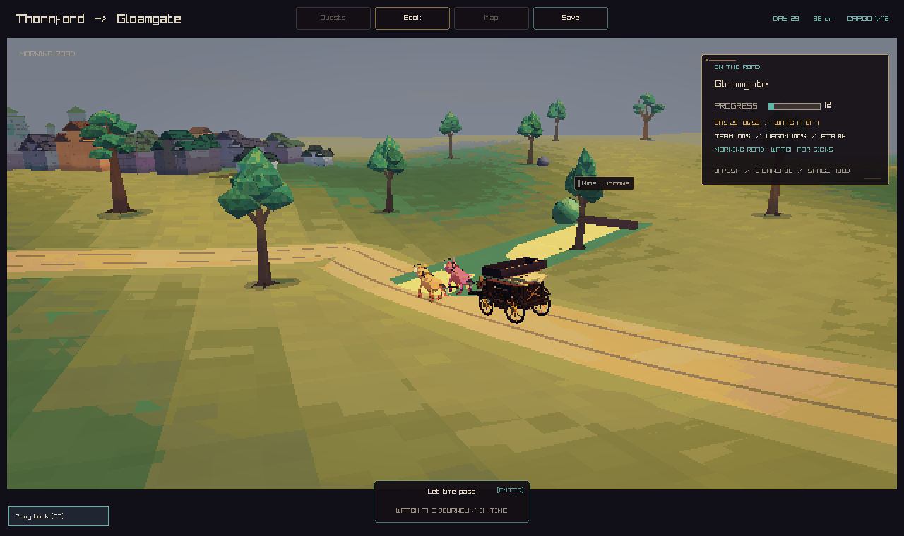
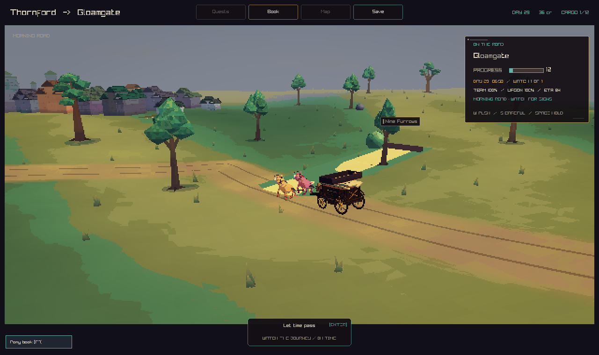

# Travel graphics

The travel hills now share colour and slope values at each terrain vertex.
Grass clumps add detail beside the road. Road shoulders blend into the meadow,
and small changes in width give the edges a worn shape.

The terrain cache holds up to 1,600 grass clumps. Each clump has three blades
and uses the same draw call as the ground. World coordinates set each clump's
position, so it stays in place when the cache moves. Roots sit on the rendered
ground triangles. Roads and settlements keep their clear ground.

The travel shader uses broad colour variation. Fine marks fade as they become
smaller than a pixel.

Both captures use `--capture-storybook 0.12 0` at 1280 by 760 pixels.
The before image comes from main at `c8d0dc0`.

Before:

After:

Checks: the strict play build, all 72 tests, the GLSL compiler, and
`run_roadbook_qa` with its close, wide, arrival, departure, and speed checks.
