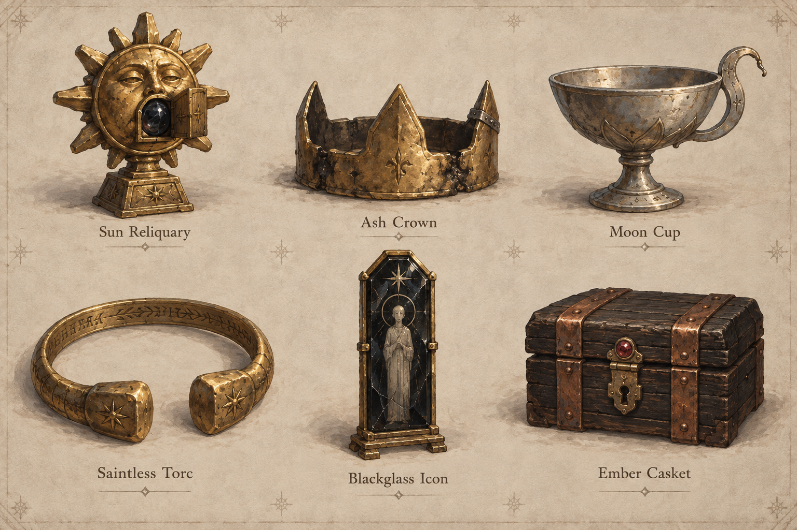

# Treasure and loot

Design proposal · 7 September 2026.

Backlog groomed and concept art added on 8 September 2026. Start with
[#408](https://github.com/atimics/crownlesscarriage/issues/408) for the delivery
order and [the art and backlog guide](treasure-art/README.md) for the six
treasure designs, dependencies and acceptance owners.

## The experience

Treasure gives the company a reason to take another road. A cup can buy food,
lead to its former keeper, or draw the dragon's attention. Its shape makes it
memorable. Its history gives the player a choice.

Loot answers an immediate need: bread for the journey, tools for a repair, or
goods for the next market. Both compete for room in the carriage.

Open the [interactive design sketch](treasure-and-loot.html). Choose objects,
pack the carriage, and inspect the six treasure forms. All prices, stories,
and cargo totals in the sketch are sample data. The rules below are proposed
work unless listed under the current foundation.

## Current foundation

Source reviewed: main at `5cb651dc6c3657b82d5eefedca5a4fbf79064439`.

| Existing rule | Source |
| --- | --- |
| A named treasure has an ID, maker settlement, holder, location, material contents, craft work, value, and creation day. Each carried treasure uses one cargo slot. | `CcTreasure` in [cc_sim.h](../../src/sim/cc_sim.h); `ApplyBuyTreasure` in [cc_sim.c](../../src/sim/cc_sim.c). |
| Workshops make six named forms. Value is gold × 40 + gems × 70 + craft work × 10. | `CompleteTreasure` in [cc_sim.c](../../src/sim/cc_sim.c). |
| Treasure sells for three quarters of its appraisal, rounded down, with a minimum of one crown. The market pays from its own purse. | `ApplySellTreasure` in [cc_sim.c](../../src/sim/cc_sim.c). |
| Road combat rolls two dice. Rolls of 4 or more can recover supplies; a roll of 12 can add a trophy worth 2–12 crowns if space and a treasure record are available. | `RollEncounterLoot` in [cc_sim.c](../../src/sim/cc_sim.c). |
| Searching a dungeon room takes goods up to available cargo space and marks the room searched. | `ApplySearchDungeon` in [cc_sim.c](../../src/sim/cc_sim.c). |
| Named treasures can change hands through trade, goblin activity, and dragon theft or return. | Treasure command handlers in [cc_sim.c](../../src/sim/cc_sim.c). |

Two details need care during implementation. Trophy creation currently writes
one gold and one gem into a low-value trophy, while
[loot_tests.c](../../tests/loot_tests.c) expects zero of each. Give simple
trophies their actual materials. Also, the dungeon search flag currently
prevents a second search even when goods remain. Split discovery from
collection so the player can make room and collect the remainder.

## What the player finds

| Kind | Examples | Main choice | Cargo rule |
| --- | --- | --- | --- |
| Road supplies | Bread, meat, tools, wood | Carry for use or sell at a market | Keep existing goods units and capacity rules. |
| Trade goods | Wool, iron, raw gold, gems, paper | Compare local demand with journey cost | Keep existing goods units and capacity rules. |
| Keepsakes | Outlaw clasp, carved gaming piece, dented cup | Sell or follow an owner mark | One named object uses one slot. |
| Crafted treasure | The six forms below | Trade, keep, or return | One named object uses one slot. |
| Written treasure | Existing chronicles, registers, and codices | Read, carry, preserve, or return | Keep existing archive rules. |
| Crowns | An existing purse or hoard | Take or leave a stated amount | Transfer between crown balances. |

Use plain source labels: **Recovered cargo**, **Owner's mark**, **Workshop
piece**, and **From the dragon's hoard**. Reveal each label through an observed
event, visible mark, or named witness. A report can say “Mara says this belongs
to Thornford.” Confirmed ownership can say “Thornford's mark.”

Give an object a short name, one physical detail, and one useful lead. Example:
“Moon Cup of Thornford. A crescent handle, bent at the tip. The ford keeper's
mark sits beneath the foot.” Knowledge stays with its source in the book.

## Six treasure forms

These forms already exist in workshop production. The visual designs and story
uses below extend them. Stories attach to actual makers, places, and events.

| Form | Shape and materials | Close detail | Proposed story use |
| --- | --- | --- | --- |
| Sun Reliquary | A round gold face, short rays, and a heavy square foot | A small shutter covers a dark central gem | A community asks for the return of a ceremonial object. |
| Ash Crown | A low, uneven crown with three broad points | Soot remains in the seams; one point has a visible repair | A claimant asks to borrow it for a ceremony. Witnesses decide what that means. |
| Moon Cup | A shallow silver-colored bowl with one crescent handle | A maker's stamp beneath the foot | A host recognizes the cup and names its former keeper. |
| Saintless Torc | An open neck ring with two large blunt ends | Worn engraving along the inside edge | A family recognizes an old gift and offers a return agreement. |
| Blackglass Icon | A tall dark tablet in a narrow brass frame | A pale inlaid figure catches side light | Two people offer different accounts of the figure. A surviving record supplies another lead. |
| Ember Casket | A squat wooden box with copper straps | A small red stone sits above the latch | Its contents are defined when the object enters the world. An inspection can reveal a letter or keepsake. |

The first art pass uses warm metal, dark wood, cloudy glass, and worn cloth.
Large silhouettes carry identity at game scale. Material color describes the
object; text explains value and ownership. Reserve a soft glint for the focused
object. A cloth bundle, split crate, and small strongbox show different loot
sources in the scene.

Each form needs a world prop, a cargo portrait, and a focused state. Review all
six together at the normal game camera and at a 48-pixel portrait size. Use the
game's existing mesh and material workflow. The sketch supplies flat shape
studies; final materials and models belong in the asset pass.

## The finding and carrying loop

1. **Notice a source.** A broken crate, opened camp chest, or marked bundle
   belongs to the place and event that produced it.
2. **Inspect.** Approach and open a compact contents sheet. Show item name,
   amount, cargo space, known origin, and any known consequence.
3. **Choose.** Select items and goods quantities. Show cargo after collection.
   Offer “Pack selected” and “Leave here.”
4. **Transfer.** Recheck reach, custody, quantities, and space. Apply one
   transfer and keep the sheet open with the remaining contents.
5. **Remember.** Record what moved and where it came from. A named item gains
   a book entry. A supply transfer gains a short receipt.
6. **Decide later.** At a reachable buyer or claimant, offer the applicable
   sale or return agreement with its exact terms.

Inspection and selection hold this sheet's local encounter state steady.
Opening it follows the game's ordinary reading rules. Packing spends the
existing collection action cost once. Reopening known contents is inspection;
the simulation charges time only for the committed collection action.

At full capacity, keep item details readable. Say “Make room for 1 slot.” Let
the player clear the selection, inspect cargo, and come back. Selection is a
preview; the transfer command owns the actual change. A failed recheck keeps
the current contents visible and explains the needed action.

For the first slice, road loot remains available during the current stop.
“Leave here” states that departure leaves those contents behind. Dungeon loot
stays in its room until a later recorded transfer, destruction, or world event.
A future persistent road cache needs its own location and lifetime rules.

## Value, ownership, and consequences

Keep workshop appraisal and the existing three-quarter market offer for the
first slice. A piece made with one gold, one gem, and three weeks of work is
worth 140 crowns; a funded market offers 105. Present “Appraised at 140” and
“This market offers 105” as separate facts. A distant market's live purse and
offer are checked on arrival.

Simple keepsakes begin in the existing 2–12 crown trophy range. They get a
recognizable form and an event-linked name. Materials reflect their contents.
The prototype's brass clasp is worth 8 crowns; a funded market offers 6.

Returns use a concrete agreement. A claimant may offer crowns from their own
funds, goods from their stock, or a recorded favor with a stated use. For the
first story, use an explicit crown payment from the settlement market. Transfer
the object and payment together, then close that agreement. A later owner can
create a fresh agreement through a new world event.

Track current custody separately from the person or institution claiming an
object. The player's display uses learned claims. The simulation keeps stable
IDs for the holder, claim source, and relevant event.

Dragon theft uses the existing hoard response. Before taking a marked object,
show the known consequence and a distinct “Take from the hoard” action. Returning
it calls the existing return rules. Local relationship effects come from
witnesses and later reports, following the existing gossip design.

Raw gold, gems, goods, and crowns keep their separate accounts. A found purse
comes from a recorded holder. A casket's contents count as held inside that
casket until they transfer out. Selling a closed casket transfers those contents
with it. Opening it reveals and transfers the same contents.

## Where rewards come from

| Source | First-slice rule | Later story opportunity |
| --- | --- | --- |
| Road encounter | Preserve the current supply roll; offer eligible recovery as a choice. | A recovered shipment carries its actual origin. |
| Rare road trophy | Preserve the roll of 12 and the 2–12 crown appraisal. Pick a form once. | An owner mark leads to a person or settlement. |
| Dungeon room | Read goods from the room's remaining stock. | Place a named treasure with a recorded origin. |
| Workshop | Use current material input and craft work. | A commission requests a specific form. |
| Goblin cache | Recover the goods and objects held there. | Recognizable stolen goods connect raids to their victims. |
| Dragon hoard | Move an existing hoard object. | A valuable recovery creates a costly journey home. |
| Agreed reward | Transfer the payer's promised funds or stock on completion. | A choice between a funded payment and a specific favor. |

Create the available reward once when its source event resolves. Save its
identity and remaining quantities. Reopening the sheet and loading a save show
the same items. Resolve “Pack selected” from stable IDs in one command. In
shared play, the first successful command changes the source; other players
receive the updated contents.

Keep the current reward frequency for the first playtest. Record goods offered,
goods taken, space left, crown gains, returns, and named pieces left behind.
Tune the supply amounts after comparing them with food use, repair costs, and
ordinary trading over equal journey lengths. A successful session gives players
a clear carrying decision and at least one remembered object.

## First playable story

An opened roadside strongbox holds two bread units and an outlaw clasp. The
carriage has two free slots. The player can take both bread units or one bread
unit and the clasp. The clasp has a mark that a Thornford witness recognizes.
At Thornford, the player can sell it for 6 crowns or accept an 8-crown return
agreement from the funded market. The return adds a specific journal event.

The story fixture supplies the clasp and witness deliberately. Ordinary road
encounters keep the existing roll. Playtest this fixture with full cargo, one
free slot, two free slots, and enough space for all three objects.

The sketch uses this fixture, three selection rows, and a sample capacity
of eight. Each bread row represents one goods unit. It demonstrates inspection,
space checks, collection, remaining loot, departure, and cargo receipts. The
six-form gallery explores shape and story direction. Market and return actions
belong to the next playable part of the story.

## Delivery plan and checks

1. **Contents and collection.** Add a saved loot offer with source ID, creation
   event, remaining goods, and treasure IDs. Separate offer creation from
   transfer. Route road recovery and dungeon collection through the same
   capacity check. Preserve encounter outcome and supply accounting.
2. **World and cargo art.** Build the six props and three source containers.
   Review portraits, camera-scale shapes, focus cues, and light and dark scenes.
3. **Contents sheet.** Connect approach, inspection, quantity choice, packing,
   and receipts to simulation commands. Keep mouse, touch, and keyboard paths
   equivalent. Show capacity and actual market offers in readable text.
4. **One return story.** Add the clasp's visible mark, named witness, funded
   agreement, ownership transfer, and journal entry.
5. **Wider stories.** Add claims, casket contents, commissions, and other
   treasure stories after the first journey is tested.

Implementation entry points: `CcTreasure` and new offer state in
[cc_sim.h](../../src/sim/cc_sim.h); loot, search, trade, and dragon commands in
[cc_sim.c](../../src/sim/cc_sim.c); state validation, hashing, and save handling;
[main.c](../../src/client/main.c) and the existing local-world interaction path.

Behavior checks should cover exact goods and crown transfers, partial pickup,
full cargo, double input, two players choosing the same item, save/load with
remaining loot, and a full treasure table. An award that needs a treasure record
waits for available space before consuming its source. Persist IDs through
trade, theft, and return. Test the funded return once, then retry the same
command and confirm the completed agreement stays settled. Verify appraisal,
market payment, materials, and archive behavior through the existing simulation
tests. Review the sheet at narrow widths and with keyboard focus and text zoom.

The design is ready for implementation when the first story, custody rules,
capacity examples, and visual forms agree. Gameplay tuning follows observed
journeys with the playable version.
