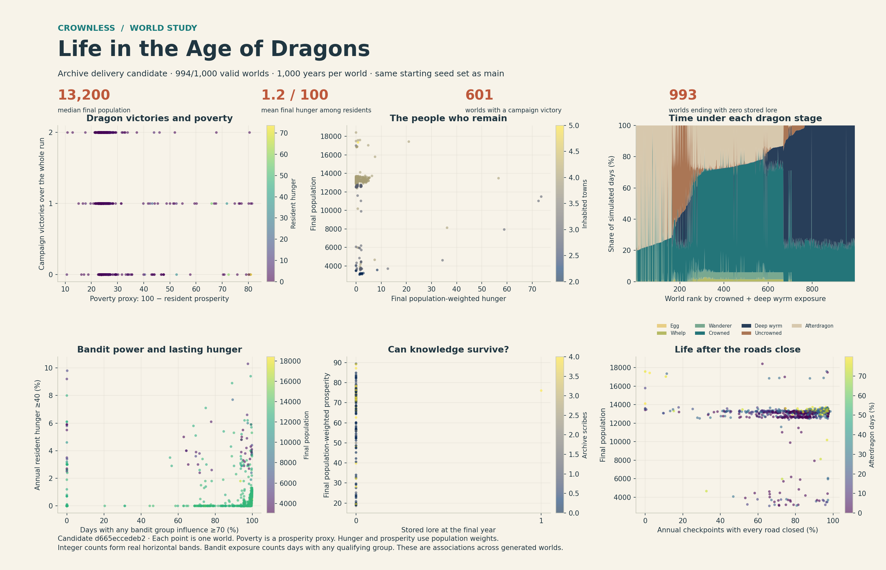
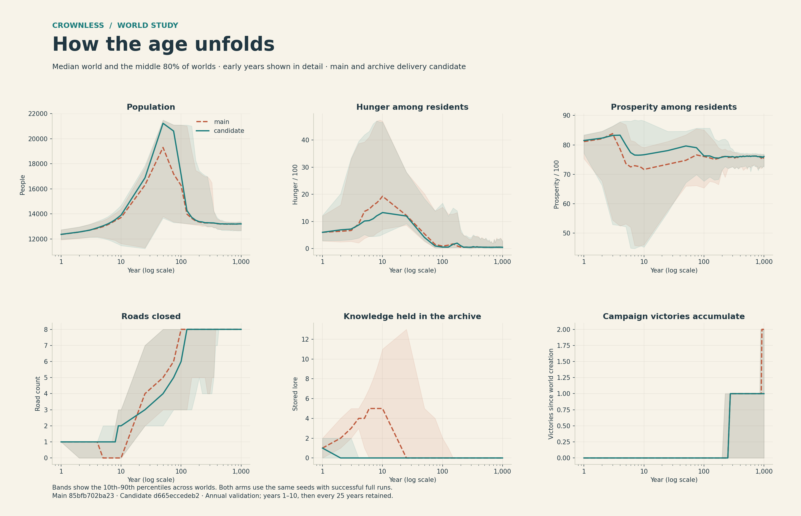
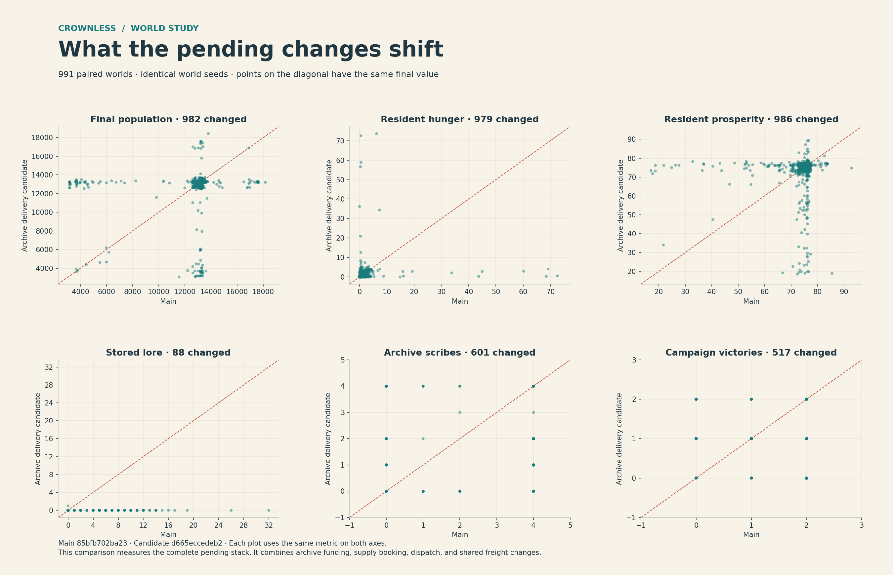
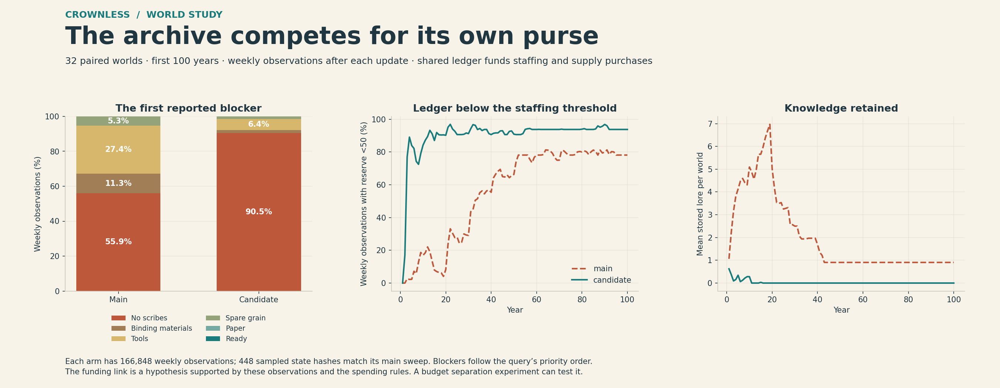

# Life in the Age of Dragons

The pending archive supply stack changes dragon history and knowledge survival much more than the typical final population. It also exposes rare settlement and courier lifetime failures. The main sweep completes 997 worlds; the candidate completes 994. The paired charts use the 991 seeds that complete in both versions.



## Results at year 1,000

| Measure | Main | Archive delivery candidate |
| --- | ---: | ---: |
| Completed worlds / requested | 997 / 1,000 | 994 / 1,000 |
| Validation failures | 3 | 6 |
| Median final population | 13,200 | 13,200 |
| Mean resident hunger per world | 1.335 / 100 | 1.248 / 100 |
| Mean resident prosperity per world | 74.072 / 100 | 73.555 / 100 |
| Worlds with a campaign victory | 787 / 997 | 601 / 994 |
| Mean cumulative campaign victories | 1.410 | 0.963 |
| Final dragon slain flag | 614 / 997 | 404 / 994 |
| Final deep wyrm stage | 186 / 997 | 398 / 994 |
| Worlds with surviving lore | 90 / 997 | 1 / 994 |
| Worlds with zero scribes | 196 / 997 | 526 / 994 |
| Median years with every route closed | 900 | 876 |

These endpoint summaries use each arm's successful worlds. All completed worlds retain residents. Candidate seed 908 retains one unit of lore; the other 993 completed candidate worlds end at zero.

On the 991 successful pairs, mean population changes by −8.08, mean resident hunger by −0.087, and mean resident prosperity by −0.515. Campaign victories fall in 403 worlds and rise in 114. Archive scribes fall in 523 and rise in 78. The population summary therefore conceals substantial differences in institutions and dragon history. These are observations from this seed set.

## How the age unfolds



The median population rises in the early decades, then converges near 13,200. Median resident hunger falls toward zero while the median closed-route count reaches eight. This makes the late-world population cluster easy to reproduce. The rules behind these patterns deserve targeted experiments, described below.

## Which paired worlds change



Every successful pair differs in at least one endpoint metric after excluding schema version and state hash. Population changes in 982 pairs, even though its overall median stays the same. The dense integer grids in the lower panels come from repeated whole-number outcomes.

## Archive funding pressure



The separate 32-world, first-century probe finds zero scribes at 90.48% of candidate weekly observations, versus 55.90% on main. The shared ledger lies below the first staffing threshold at 90.30% and 55.82%, respectively. The supply purchases and staffing rules share this reserve. Protecting a staffing budget is a useful next controlled experiment.

## Failed worlds

The study attempts 2,000 world runs and passes 1,994,749 annual validation checks. It records nine failed annual checks separately. Failed runs contribute their last valid sampled history to `partial-history.csv.gz`; completed-world charts use the successful full runs. All nine failures recur at the same seed and year in the diagnostic builds.

| Arm | Seed ordinal | First failed annual check | Diagnostic finding |
| --- | ---: | ---: | --- |
| Main | 353 | 81 | Abandoned town has population 0 and prosperity 1; the ruin contract requires prosperity 0. |
| Main | 426 | 209 | Active courier has no matching situation. |
| Main | 828 | 73 | Abandoned town has population 0 and prosperity 1; the ruin contract requires prosperity 0. |
| Candidate | 148 | 845 | Failed courier quest retains a target ID whose courier record is gone. |
| Candidate | 189 | 191 | Abandoned town has population 0 and prosperity 1; the ruin contract requires prosperity 0. |
| Candidate | 197 | 69 | Abandoned town has population 0 and prosperity 1; the ruin contract requires prosperity 0. |
| Candidate | 372 | 884 | Failed courier quest retains a target ID whose courier record is gone. |
| Candidate | 392 | 761 | Failed courier quest retains a target ID whose courier record is gone. |
| Candidate | 726 | 645 | Failed courier quest retains a target ID whose courier record is gone. |

Both versions encounter the abandoned-town state failure. The candidate also reaches four missing-target failures in retained failed courier quests. This study records the failures as simulation work to address. The report and chart tools preserve them for review.

## Versions and scope

| Arm | Simulation source | Rules | Included work |
| --- | --- | --- | --- |
| Main | `85bfb702ba233585d4e3359273f048de1cae7b2f` | Schema 74, generator 25 | Road meeting, quest cast continuity, archive work queries, and earlier simulation changes merged through #585 |
| Candidate | `d665eccedeb2f3795edd72dbe401ac2c5b471033` | Schema 75, generator 25 | Main plus archive funding, shared freight paths, freight context, supply booking, and supply dispatch through #592 |

The candidate contains #586, #587, #588, #590, #591, and #592 as one archive and freight stack. #589 is a separate acceptance report. The separate funded road repair regression experiment (#529) and unfinished dynamic scriptorium work (#453) remain outside this comparison. Each snapshot stays fixed throughout the study.

The analysis PR is based on `codex/archive-supply-dispatch`. The simulation changes belong to their existing PRs; this PR contains the study tools and evidence.

## Reading the charts

- Each scatter point represents one completed world. Counts overlap at the same coordinates.
- Poverty is `100 - weighted_prosperity`, a proxy for living standards. Hunger and prosperity weight towns by their living population. Each world receives equal weight in the summary. Empty worlds are counted separately.
- `dragon_campaign_victories` counts successful campaigns over the run. `dragon_slain` records the final dragon's slain flag. Daily stage totals describe exposure to each phase of the dragon cycle.
- Horizontal victory bands follow integer campaign counts. A zero-lore vertical line means every plotted world has the same measured lore value.
- High hunger means a population-weighted hunger score of at least 40 at an annual checkpoint. Road isolation means every route is closed at an annual checkpoint. These rates use all 1,000 years as their denominator.
- Bandit exposure counts days when any bandit group has influence of at least 70.
- Timeline bands show the 10th–90th percentiles across worlds. Both timeline arms and endpoint pairs use only seeds that completed successfully in both versions. The candidate overview uses all successful candidate worlds.
- These are automatic world simulations. Player support, travel, quest choices, and sustained company policies require their own intervention studies.

## Reproduce the sweep

Create two clean worktrees at the commits above. Build each simulation:

```sh
cmake -S SOURCE -B BUILD -DCC_BUILD_CLIENT=OFF \
  -DCC_WARNINGS_AS_ERRORS=ON -DCMAKE_BUILD_TYPE=Release
cmake --build BUILD --target crownless_sim_metrics -j 4
```

From the study checkout, run the same command for each arm with its source commit, build path, and output folder:

```sh
python3 tools/age_of_dragons_sweep.py \
  --binary BUILD/crownless_sim_metrics --source FULL_COMMIT \
  --output docs/experiments/age-of-dragons-2026-09-08/ARM \
  --seeds 1000 --years 1000 --jobs 4
```

Seeds are ordinals 1–1,000. The raw world seed is `(ordinal * 0x9E3779B9) & 0xFFFFFFFF`. Each world advances one day at a time for 365,000 days. Day 1 is the starting day; year 1,000 ends on day 365,001. Validation runs at every annual checkpoint. The study retains years 1–10, every 25th year, and the endpoint. A failed run returns a failing status and retains its error and sampled partial history. Each arm's manifest records the exact command, simulation commit, executable hash, artifact hashes, and each run's outcome.

The ignored `.checkpoint` folder supports interrupted runs. Keep it to resume the same experiment. The published CSV and manifest files support independent chart generation:

```sh
MPLCONFIGDIR=/tmp/crownless-chart-cache python3 tools/plot_age_of_dragons.py \
  docs/experiments/age-of-dragons-2026-09-08
```

The chart tool requires NumPy and Matplotlib. The sweep tool uses the Python standard library.

## Archive probe

Compile the same observer against each arm's headers and simulation library:

```sh
cc -O3 -std=c17 -Wall -Wextra -Werror -ISOURCE/src \
  tools/age_archive_probe.c BUILD/libcrownless_sim.a -lm -o PROBE
PROBE > docs/experiments/age-of-dragons-2026-09-08/ARM/archive-probe.csv
```

The probe follows seeds 1–32 for 100 years. It records the material-chain query after each daily update whose current day is divisible by seven. Blockers follow the query's order: scribes, binding materials, tools, spare grain, paper, ready. A reported blocker can coexist with later blockers. These are weekly observations after the update; recording readiness is evaluated during archive work too.

Each arm contains 166,848 weekly observations. Its 448 retained annual state hashes match the matching sweep snapshots. `archive-probe-manifest.json` records source, observer and binary hashes, CSV hashes, and aggregate observations.

## Failure diagnosis

The diagnostic tool builds a temporary copy of the simulation with extra messages inside the settlement-service and situation validation failures. It reports the true validation clauses and keeps simulation updates intact. It checks the source file against the sweep commit before building. The recorded failure must recur at the same year with the same message.

```sh
python3 tools/diagnose_age_of_dragons.py \
  --source-root SOURCE --build BUILD \
  --manifest docs/experiments/age-of-dragons-2026-09-08/ARM/manifest.json \
  --output docs/experiments/age-of-dragons-2026-09-08/ARM/diagnosis.json
```

## My take on the patterns

The simulation has connected systems: the pending stack changes money, staffing, knowledge, travel, and later world outcomes. Its long-run diversity is still constrained by a few strong rules.

1. **Dragon victory bands are expected.** Campaign victories are integer events. Daily stage exposure adds the history that the final slain flag cannot express on its own.
2. **Population clusters deserve an experiment.** `SettlementPopulationCapacity` uses five fixed capacity tiers, plus farming and market bonuses. Growth is checked every 28 days against hunger, prosperity, and capacity. `CcEconomyCivilianFoodUse` returns fixed authored consumption once population reaches 600. These rules are plausible contributors to the tight bands and low hunger among survivors. A controlled demand-and-capacity comparison would establish their effect.
3. **Road isolation needs stronger consequences or recovery.** The charts show worlds that sustain residents through long stretches with every route closed. Local production can support this outcome. The next study should measure which settlements can feed themselves and which goods or roles actually require travel.
4. **Archive supplies and staffing compete for the shared ledger.** The weekly staffing thresholds are 50, 150, and 300 crowns. Archive supply dispatch spends from the same reserve. The 32-world probe finds zero scribes at 90.48% of candidate observations and 55.90% on main; reserve below 50 occurs at 90.30% and 55.82%, respectively. This supports a funding-competition hypothesis. A protected staffing reserve, compared with the same dispatch policy, is a concrete next experiment. The blocker query has an order, so fewer tool-blocked observations can result from an earlier staffing blocker.
5. **Quest and settlement lifetimes still need repair.** Failed seeds expose references to missing quest targets and town state that violates the abandoned-town contract. These are structural failures. Their reproductions are separate evidence from the distribution charts.

The paired changes measure the whole pending stack. Source changes can alter later random choices, so a different outcome in one seed can reflect both the new rule and a changed sequence of later events. Component experiments and repeated seed sets can strengthen causal claims.

## Validation

The strict Release build passed. All 117 local headless checks passed, with the speech server test rerun using local socket access. The sweep tool's seven integrity tests cover annual order, seed and day identity, truncated output, retained failures, separate partial history, checkpoint reuse, and rejection of a changed binary. Both archive observers passed annual validation and matched 448 retained state hashes per arm. Chart generation checks input hashes. Each final chart was visually inspected.

The long sweep's failures remain part of the result even though the focused test suite passes. The exact failed seeds, years, messages, and diagnostic reproductions appear in each arm's manifest and diagnosis file.
