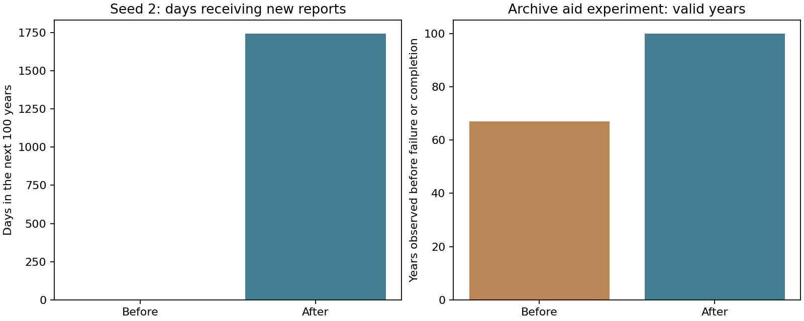

# News and archive recovery — 8 September 2026

The scriptorium can now receive an oral report while its paid archive is closed. The report must reach the town through the existing gossip network. Writing it into a book still uses staff and materials. This gives the campaign a real arrival event even when the archive fund is empty.

A solvent host crown can restore an empty archive fund to 50 crowns after five years of silence. Two connected donor crowns remain another route. The contribution transfers existing coins. The host still needs at least 800 crowns. Scribes now count bread and meat toward the civilian food reserve before taking spare wheat for their work.

A kingdom that loses its final holding can have vacant ruler and patron offices. The allegiance checks still apply to kingdoms with land, and a foreign office holder still fails validation.

## Results

- All 71 local checks passed. Added cases cover an oral dragon report reaching an unfunded scriptorium, a remote report awaiting delivery, recovery from zero funds, coin conservation, bread protecting scribe grain, landless offices and restored territory.
- The exact seed-2 failure is now a saved regression fixture. On day 5,864,250, resettlement transfers its last holding away from the Ashen Throne. Its vacant offices now pass validation. The fixture also exercises save migration before that day.
- Starting from the old seed-2 world at year 16,000, the next century contains **1,745 days with newly heard reports**, compared with zero in the earlier audit. Its archive remains unfunded. Oral reports and lasting books have separate measures.
- All three century-long observation arms now pass. The earlier aid arm stopped after 24,455 days with the ruler error; the repaired arm completes all 36,500 days.
- Eight fresh seeds each passed 16,000 years: **128,000 annual validations**. All eight end with four funded scribes and zero stored lore. Material supply and physical book survival remain constraints on lasting written history. This result supports receiving campaign news and recovering staff; it also shows why lore count alone is a poor measure of whether a report arrived.

The existing 24 treasure slots remain in place. War and trade recovery remain wider balance concerns. In the mature seed-2 control, war persists throughout the next century.

## Reproduction and provenance

Production source: `b764e4e`, based on `289d55e`. The older baseline is `d478d2e`; the intervening main change adds character names. The fresh sweep is a stability check, rather than a matched balance comparison against the earlier 32-world sweep.

`seed-2-year-16000.ccsave` was generated by the original audit source at `d478d2e`, using seed number 2 multiplied by `0x9e3779b9`, for 16,000 ordinary 365-day years. Every year passed validation. `tests/fixtures/shipped/seed-2-before-land-loss.ccsave` comes from its maintained road-and-archive aid arm, just before the failing day. These are SQLite saves with journal mode DELETE, so they travel as single files. The manifest and provenance file preserve run commands, endpoints and hashes.

Compile `probe.c` against the current persistence and simulation libraries, plus SQLite and the math library. Pass the mature `.ccsave` path as its only argument. It reads and upgrades the saved world, then observes three 100-year arms. The road arm maintains route condition and security. The aid arm also transfers treasury money and replenishes archive wheat, paper and tools daily. Those replenishments are diagnostic interventions.

The new report counter counts only stories whose heard day equals the current day. The earlier audit counter counted days holding any report heard since the window began. Both methods give zero for its unfunded control; the older aided-report totals should be read with that distinction.

`smoke.py` runs the eight fresh worlds. `plot.py` renders the chart from the saved probe output and the earlier audit's failure duration.
