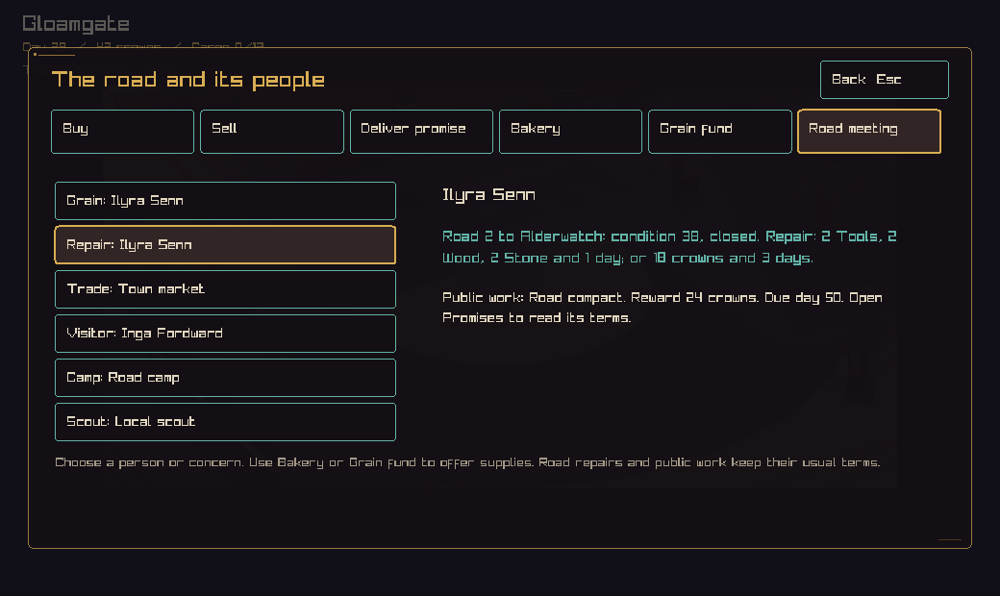
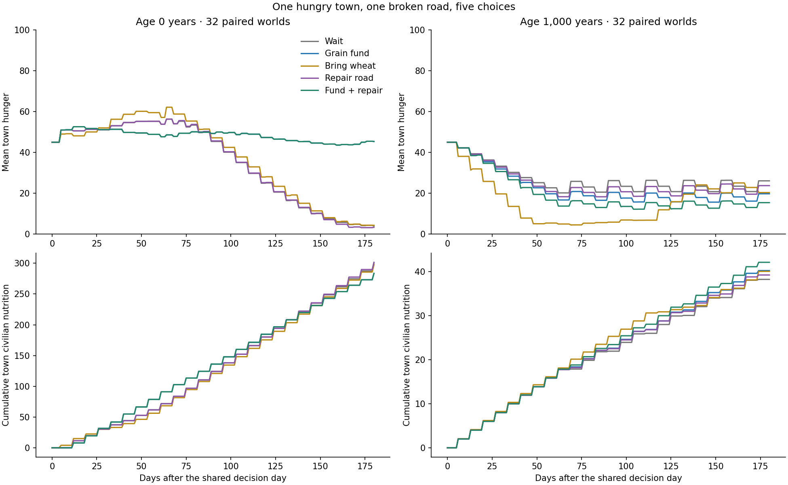
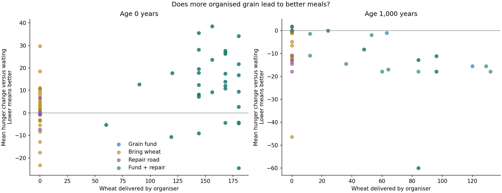
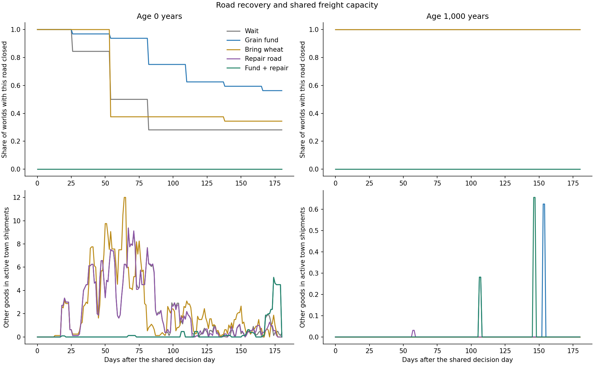
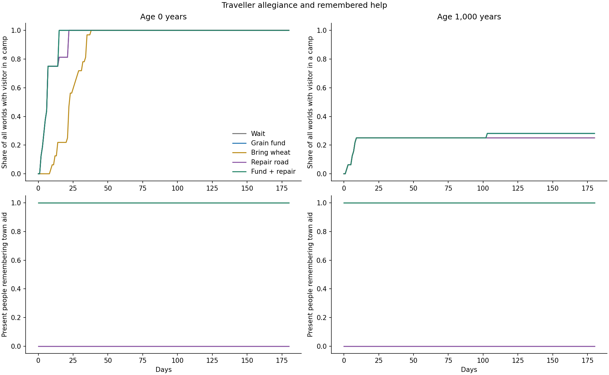
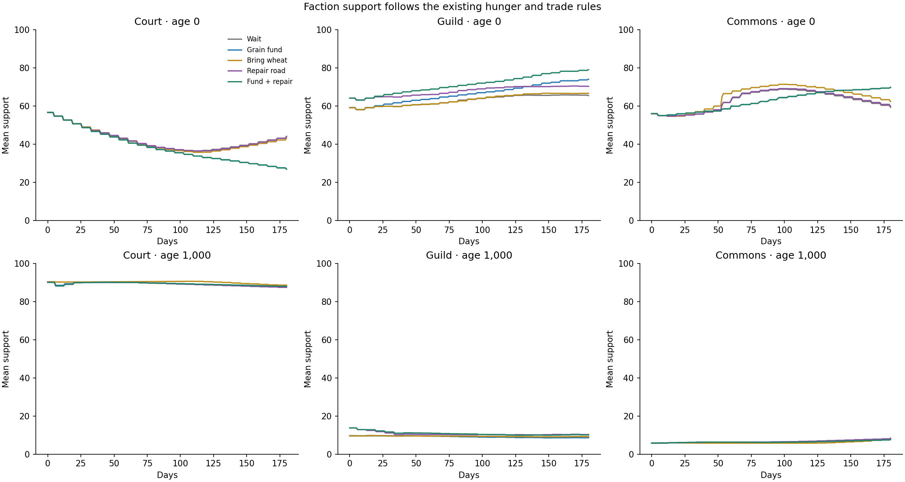

# A hungry town and a contested road

The road meeting brings grain, road work, trade, travellers, a nearby camp,
and a scout's public accounts into one view. It uses existing people and
commissions. The experiment then asks which existing actions change the town.

Across 64 worlds and five choices, the clearest result is that delivered grain,
an open road, a completed quest, and a person's recovery are separate outcomes.
The game should show each of them.

## Play the slice

Open the town trade panel and choose **Road meeting**, or type `council` in the
text game. Select a concern to read its current state and related public work.
Bakery and Grain fund retain their existing actions. Road repair and public
commissions retain their existing terms.



The same person can appear under grain and repair because they hold both
responsibilities. Reading the meeting preserves their occupation, allegiance,
location, money, memories, and the random state. The market row describes town
trade; the current model assigns that trade to a town account. Traveller rows
follow a present, living person with the greatest recorded hardship. Scouts'
links use shared accounts about posted or accepted work. Private commissions
stay behind their existing discovery rules.

The capture shows seed 42 in the native app. It demonstrates the meeting layout;
the experiment below uses a separate controlled arrival.

## Method

We ran ordinals 1 through 32, with world seeds `ordinal * 2654435761` modulo
2^32, at ages 0 and 1,000 years. All 64 worlds and all 320 branches validated.
The saved data contains 57,920 daily observations.

Each world receives the same controlled setup before branching:

- The company arrives at settlement slot 1 with 400 crowns, 12 Wheat, 2 Tools,
  2 Wood, and 2 Stone. Test cargo capacity is 18; normal capacity is 12.
- The town has an existing bakery. Civilian food stocks are removed and hunger
  is set to 45. Existing incoming shipments, production, services, and politics
  remain part of the starting world.
- The meeting selects an adjacent road, preferring a closed road and then poor
  condition. Its condition becomes zero and it closes. Ordinary simulation
  rules can repair it later. Alternative roads remain available.
- One existing adult traveller from another town arrives with six crowns,
  where such a person is available. Their role, allegiance, home, and memories
  are retained. There are 32 such visitors in young worlds and 13 in old worlds.

This setup injects company resources and changes the visitor's purse before
branching. It represents a controlled stress test, rather than a natural sample
of journeys. The food shock is deliberately severe.

| Choice | Existing command and cost |
| --- | --- |
| Wait | Keep the initial money and cargo. |
| Grain fund | Pay 200 crowns: 8 to the organiser and 192 to the freight fund. |
| Bring wheat | Give the bakery 12 Wheat and 8 crowns. |
| Repair road | Spend 2 Tools, 2 Wood, 2 Stone, and one day. |
| Fund + repair | Make both the grain and material repair commitments. |

All branches advance to the same date, one day after the decision. We then
measure 180 days, including the initial and final snapshots. The intervention
day's food consumption is outside the accounting window. The choices spend
different amounts, so this comparison measures outcomes rather than return per
crown. The company remains in town during follow-up.

## Food and freight

Hunger changes are paired against waiting in the same world. Lower is better.
Nutrition is the cumulative town civilian accounting total during follow-up;
individual traveller purchases are outside that counter.

| Choice | Young: mean hunger change | Old: mean hunger change | Young: organiser wheat delivered | Old: organiser wheat delivered |
| --- | ---: | ---: | ---: | ---: |
| Grain fund | +12.38 | -3.95 | 154.28 | 19.22 |
| Bring wheat | +1.83 | -10.79 | 0 | 0 |
| Repair road | -0.06 | -1.72 | 0 | 0 |
| Fund + repair | +12.38 | -6.96 | 154.28 | 31.69 |



Wheat aid improves mean hunger in 31 of 32 old worlds and 11 of 32 young worlds.
Grain funding improves it in 7 worlds of each age. The combined choice improves
14 old worlds. World conditions matter, even with the same imposed shock.



In young worlds, funding delivers grain while mean town hunger grows relative
to waiting. Grain gets first use of ordinary royal freight after site work.
The fund, other purchases, visitor meals, and later quests can all change the
world's path. These runs establish the combined effect of the intervention;
isolating freight priority itself requires a further paired change to that rule.

Repair keeps the selected road open throughout follow-up. In old worlds the
combined choice delivers more organiser wheat than funding alone. Its mean
hunger interaction is -1.29 points beyond adding the separate fund and repair
effects. In young worlds the corresponding interaction is +0.06 points. Repair
there changes access and quest state while the mean funded food result stays
the same to the shown precision.



The other-cargo chart measures goods present in active town shipments each day.
Longer time in transit also raises that number. It should be read as cargo
occupancy, rather than delivered throughput or proof of displaced sales.

## People and quests



All 32 original young-world visitors join a camp at some point in every arm.
The severe starting food shock and the weekly hardship recruitment rule make
this a strong attractor. The graph uses the original traveller's identity
where that record still exists. Old-world curves use all 32 worlds as their
denominator, including the 19 worlds with no eligible visitor.

The [seed 2 visitor trace](visitor-trace.csv) follows Jory Fen. With waiting,
he joins on observation day 2 with 18 crowns after three hungry days. With
wheat aid, he joins on day 23. Cash alone cannot buy a meal from empty stocks.
Aid changes his path and timing, while the eventual allegiance is the same.

At observation day 75 his recorded location changes back to his home in the
wait, fund, and wheat arms. His camp allegiance remains. In the repair arms he
stays in the arrival town. This is why local bandit counts and recruitment
counts must be kept separate. Quest casting is a relevant code weakness:
`AssignSituationCast` directly assigns sponsor and participant locations and
roles. The trace records the location change; a separate intervention on
casting would isolate its contribution.

Every funded or wheat-aid branch ends with one present person remembering town
aid. Repair resolves a local road quest in all 32 young worlds and 11 old
worlds. The repair arms hold zero town-aid memories in this measure. Repairs
were performed without accepting a charter, and the helper counter queries
town-keyed memories; quest-keyed memories have a separate scope. These numbers
measure current records, rather than every lifetime memory or retired quest.

## Factions and design gaps



The Court, Factors, and Commons have distinct quest roles, but much of their
support still follows kingdom hunger and active shipment thresholds. The
smooth slopes and boundary plateaus in these charts follow those update rules.
They describe the current model; they provide limited evidence of negotiation
between people.

The next connected work should address these specific gaps:

1. Preserve people's work, allegiance, and travel when selecting quest actors.
   Prefer a present person with a relevant responsibility and an actual account.
2. Give each new local crisis its own lifetime. The current primary-crisis
   completion gate suppresses later relief, repair, and black-market generation
   while a resolved primary record remains.
3. Separate meeting a need, earning payment, and receiving personal credit.
   An organiser's arrival, direct aid, and a charter delivery can all contribute
   to recovery through different paths.
4. Give freight choices named owners and explicit terms. The current grain
   organiser can choose a supplier; merchant bargaining and passenger booking
   need further work to become competing personal requests.
5. Give a recruited traveller a continuing life in the camp. The current needs
   loop stops meal and shelter updates after recruitment. Later hunger counters
   then preserve their last values. Our unaffiliated hardship counts exclude
   camp members for that reason.

This slice makes the existing choices and their outcomes inspectable. The
broader bargaining, passenger, scout investigation, and recurring-crisis rules
remain concrete follow-up work.

## Reproduce and verify

Build `crownless_contested_road_experiment`, then run:

```sh
MPLCONFIGDIR=/tmp/crownless-chart-cache python3 tools/plot_contested_road.py \
  --binary /path/to/crownless_contested_road_experiment \
  --output docs/experiments/contested-road-2026-09-08 --seeds 32 --workers 6
```

`--reuse-data` redraws saved observations after checking the simulation source
hashes in [results.json](results.json). [daily.csv.gz](daily.csv.gz) contains all
five arms. `CC_CONTESTED_TRACE=1` adds a visitor trace on stderr. Trace columns
are arm, observation day, name, role, home ID, current town ID, purse, hungry
days, unsheltered nights, and bandit group ID.

Validation: strict headless and native builds; 102 headless checks, with the
local HTTP test rerun successfully with socket access; four focused native
checks; static analysis with one reviewed baseline item. Council tests cover
unchanged state, resident availability, public quest visibility, and closure
after material repair. Native tests cover tab entry and repeated Enter while
reading. The native capture was visually inspected at 1040 pixels wide.
