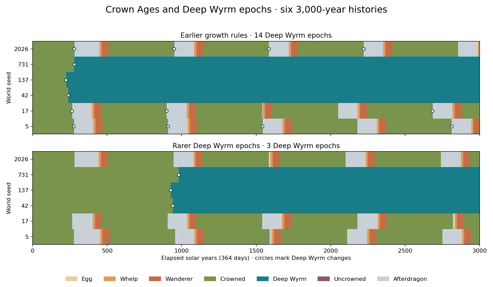

# First sightings and rare epochs

Crown Ages now start on the first dated sighting of a Crowned Dragon. Scribes compare the actual tomes at Scrivendays and agree later. A Deep Wyrm change marks a separate epoch, with its own investigation and estimated date.

Six worlds ran for 3,000 solar years each. Deep Wyrm epochs fell from **14 to 3** compared with the preceding recovery rules. Dragon successors stayed at **15**. Two worlds adopted Crown Age dates; a third kept a lone sighting. The rare epochs and the ordinary calendar can now tell different parts of the same history.



The bands show annual dragon stages. Circles mark each recorded Deep Wyrm change, including changes followed quickly by a dragon's death.

| World | Crowned sighting | First agreement | Deep Wyrm epochs | Dragon successors | People at year 3,000 |
| --- | --- | --- | ---: | ---: | ---: |
| 5 | Day 149 | Day 202, three schools | 0 | 5 | 13,102 |
| 17 | Awaiting a field account | Awaiting a hearing | 0 | 5 | 13,245 |
| 42 | Awaiting a field account | Awaiting a hearing | 1 | 0 | 13,159 |
| 137 | Day 143 | Awaiting a hearing | 1 | 0 | 13,370 |
| 731 | Awaiting a field account | Awaiting a hearing | 1 | 0 | 3,635 |
| 2026 | Day 143 | Day 202, two schools | 0 | 5 | 13,181 |

**World 5: a calendar older than its agreement.** A scribe sees Varkesh the Unappeased at the lair on day 149. Three schools sign the date on day 202. Their almanac starts the Crown Age 53 days before the meeting. Tallen Longreckon kills Varkesh in solar year 276. The Remembered Scale hatches in year 453. Later successors include Cinder-Child and Ember Beneath Stone. Five successors appear over the full history, and each lives within the ordinary dragon stages. This world finishes under a Crowned Dragon.

**World 2026: a second school tradition.** Its earliest account is dated day 143. Two schools agree 59 days later. A later comparison preserves a second edition with different cited tomes and the same start date. Earlier copies keep their original citations. This world also produces five successors and ends under a Crowned Dragon.

**World 137: evidence waiting for agreement.** A scribe records a Crowned Dragon sighting on day 143. The world records zero completed Scrivendays meetings. Its founding dragon becomes a Deep Wyrm in solar year 926. The true change and the unfinished human calendar remain separate records. Town supplies and safe travel still decide whether scribes can gather.

**Worlds 42 and 731: the long reigns.** Their founding dragons become Deep Wyrms in solar years 940 and 980. These dragons were already centuries old when the simulation began. Each survives to the end. World 731 also keeps its long war: 1,082,147 days at war, with 3,635 people left across three inhabited towns. A rare epoch can therefore sit above a very long period of political decline.

The broader recovery results hold. Human cults finish with 60 members in every world. Goblin populations finish between 12 and 39, with cohesion at 100. Only seven goblin raids return empty across the six histories. Every bandit group finishes with four members in a hideout. Royal transport records zero empty shipment arrivals. These are still old worlds with weak roads and scarce town tools: all eight road flags are closed at the end, and town tool stocks reach zero. Later scribe expeditions remain scarce. The five successors in each repeating dynasty supply future fieldwork for the calendar; their first sightings still need an actual observer with a tome.

New dragons reach the Deep Wyrm threshold at 1,200 years of age and 800 years of crown continuity, alongside the existing strength, stability, and heart requirements. Earlier thresholds were 500 and 200 years. Dragon growth retains the existing 365-day timers. Solar years retain 364 days, with thirteen signs of 28 days. Scrivendays remain Quill 1–7.

The company learns dates by making observations, reading received tomes, and carrying editions from hearings. A copied account keeps its original witness identity. A hearing needs independent witnesses and scribes from two schools. An older recovered account can revise the start date. Each town adopts an edition when it receives the book. The Company Book shows separate Crown Age and Deep Wyrm Epoch pages.

Schema 115 saves the sighting register, cited editions, carried copies, town calendars, and company knowledge. Legacy schema 114 behavior matches a captured complete-world hash. Validation also covers a destroyed tome whose object slot later becomes another treasure. The full local suite covered 165 checks. A long succession check exposed that slot case; its rerun passed after the fix. A macOS configuration check passed alone after exceeding its time limit during concurrent simulations. Calendar, dragon growth, and save checks passed on the final code.

The final six runs each validate state weekly and save, reload, and compare the complete world hash at year 3,000. All six pass. The comparison uses the same raw seeds and zero player commands, for 36,000 simulated years across the two versions. Event-buffer saturation stays at zero. Story dates use the recorded solar calendar; endpoint columns count elapsed solar years. Earlier trial outputs remain separate.

[Summary table](summary.csv), [full records](summary.json), and [build records](provenance.json) retain the measurements and source commits. To repeat the run, build a chosen checkout with the `play` preset and `CC_BUILD_CLIENT=OFF`, then run:

```sh
python3 docs/experiments/crowned-calendar-2026-09-24/run.py \
  --source /path/to/checkout --build /path/to/checkout/out/build/play \
  --output /tmp/crown-history
python3 docs/experiments/crowned-calendar-2026-09-24/analyze.py \
  --before /tmp/recovery-history --after /tmp/crown-history \
  --output /tmp/crown-report
```

The probe retains annual ecosystem measures and each Crown Age agreement. Plotting uses Matplotlib. The sample describes these six histories; a wider seed set can measure how often each story occurs.
