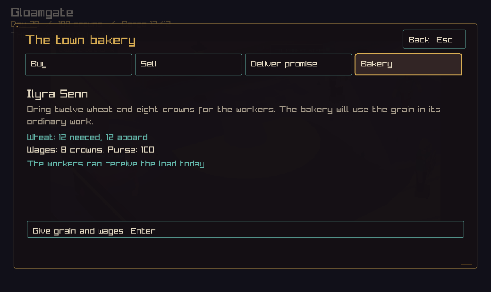
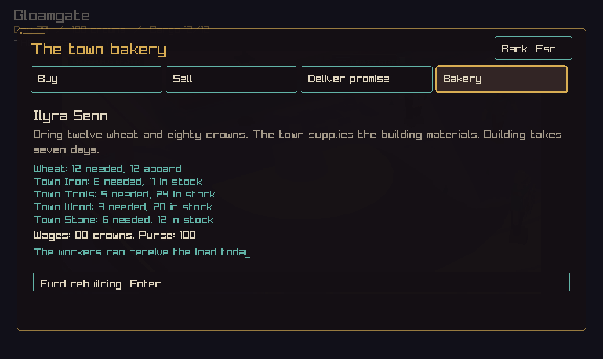
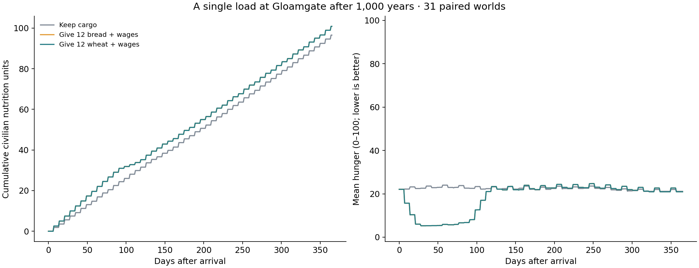
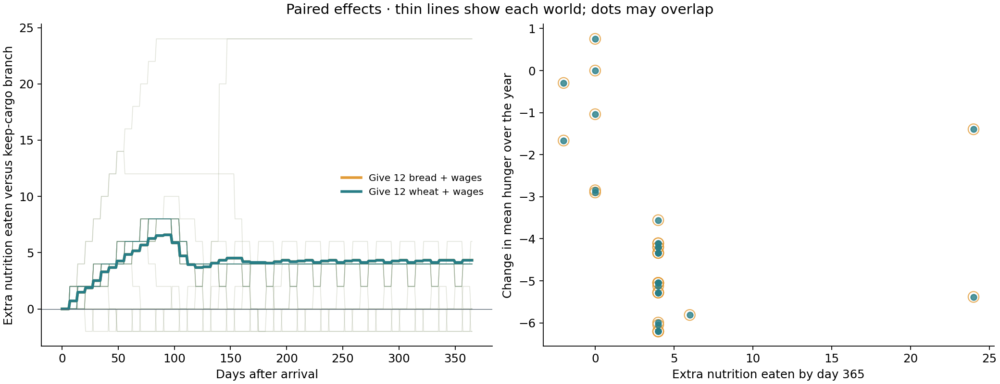
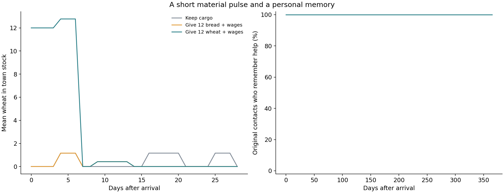

# A load for Gloamgate's bakery

This slice connects a player delivery to ordinary food production and a named
person's memory. The experiment finds a useful, temporary benefit. It also shows
how much work remains between relief and lasting town recovery.

## Play the slice

Open a town's trade panel and select **Bakery**. The offer names a resident worker
or official. Bring twelve wheat and eight crowns to supply an open bakery.
Twelve wheat fills the ordinary carriage's twelve cargo slots.

If the bakery has been lost, bring twelve wheat and eighty crowns. The town must
hold eight wood, six stone, six iron, and five tools, plus a free service slot.
The materials are consumed and the existing seven-day building project starts.
Players can supply town stocks through ordinary sales over earlier trips.

The receiving person remembers the company. The first remembered gift adds eight
points to their disposition. Further gifts renew the memory while keeping that
bonus steady. A later visit shows the memory and the current offer. An active
bakery project shows its remaining days. The console offers the same action
through `bakery` and `bakery support`.

Wheat moves from the carriage to town stock. Crowns move to the town market.
Production and meals then follow the normal simulation. Rebuilding uses the
existing completion rule, including its two-point prosperity gain on opening.





## Experiment

We grew 32 worlds for 365,000 days each, then followed Gloamgate for another 365
days in three paired branches. The seed is the ordinal multiplied by 2654435761,
wrapped to 32 bits. The starting code comes from main at
`0ce44461cff0ad7cadfbba5294dd9807f9d4c817`. The final run includes main through
`4ac989a` and this PR's intervention. `results.json` stores source-file hashes.

Each branch uses the same grown world. A controlled arrival places the company
and its parked carriage at Gloamgate with 100 crowns and one full cargo load.
The setup supplies those resources externally. Procurement, road travel, cargo
risk, and earning the purse are separate questions for a later experiment.

| Branch | Load at arrival | Action |
| --- | --- | --- |
| Keep cargo | 12 wheat | Keep the load and purse. |
| Bread gift | 12 bread | Transfer bread to town stock and pay the same wages as bakery support. |
| Bakery support | 12 wheat | Apply the new player command. |

The bread gift is a diagnostic treatment in the experiment runner. It transfers
food directly into ordinary stock. It deliberately avoids the immediate hunger
change in the existing food-sale command. Bread and wheat have different market
prices; this comparison holds cargo space and cash support equal. The comparison
with keep-cargo measures the combined gift of goods and money.

Thirty-one worlds completed all three branches and every daily validation.
Seed 29 had no eligible resident worker or official at arrival. Its rejection is
preserved in `failed-029.txt`. All eligible towns already had a bakery, so the
seven-day rebuilding path has a focused saved-game test rather than evidence
from this natural sample. The raw file contains 34,038 daily rows.

## Results



The two gift curves overlap exactly for daily hunger, prosperity, population,
and civilian nutrition eaten in all 31 completed worlds. The normal bakery
recipe converts wheat to bread one-for-one. Every town's wheat gift had left
stock by day seven. This result fits quick processing in these working bakeries.

| Measure across the 31 worlds | Keep cargo | Either gift |
| --- | ---: | ---: |
| Mean hunger on arrival | 22.06 | 22.06 |
| Mean hunger after 28 days | 22.58 | 5.26 |
| Mean hunger after 365 days | 21.13 | 20.94 |
| Mean civilian nutrition eaten during the year | 96.52 | 100.84 |
| Mean prosperity after 365 days | 6.81 | 8.94 |
| Mean population after 365 days | 437 | 437 |

The gift reduces average hunger over the entire year by 4.05 points. Twenty-nine
worlds have lower average hunger; 24 have more nutrition eaten by day 365. The
mean gain is 4.32 nutrition units, with individual differences from -2 to +24.
A negative difference is a change in later consumption between branches; the
ledger itself counts actual meals monotonically. The gift initially contains
24 potential nutrition units once baked.

The control stays near 22 hunger. The early relief largely fades by about day
130, and the year-end hunger gap is 0.19 points. Equal final population across
branches makes lasting population recovery an open question.



Each thin line is one world's difference from its own control. Bread uses hollow
orange points and wheat uses smaller teal points, so their overlap is visible.
The spread matters: the mean conceals worlds with little lasting food gain.



All 31 original receiving contacts still remember the help at day 365. This
measures stored personal memory. The playable panel reads that memory on return.
A full walk-away-and-return journey remains outside the arrival experiment.

## Clusters, straight lines, and the design

The material response gives this slice a small piece of the living world promised
in [People, carriages, and gossip](../../npc-society.md): a load changes shared
stocks, regular work uses it, and a particular person remembers the company.

Several chart shapes have clear causes:

- **Matching bread and wheat curves:** consistent with existing bakeries having
  enough capacity for this small load. Try larger deliveries, damaged workshops,
  and different arrival dates before treating this as a general rule.
- **Stair steps and repeated columns:** weekly meals, whole goods units, and
  integer hunger changes create these shapes. Their timing is expected. The
  large early hunger change alongside a small food gain deserves closer study:
  the hunger rule also responds to stock coverage and threshold bonuses.
- **A flat memory line at 100%:** this is a retained yes/no fact. A person's later
  choices would provide stronger evidence of a living relationship.
- **A return toward the control:** a single delivery runs out. Sustained recovery
  needs a continuing source of grain and a working delivery route.

The next gaps are concrete. A worker or official currently receives the event,
while the market holds the crowns. Personal pay, workshop ownership, and the
worker's changing purpose would connect this to the
[physical custody design](../../design/power-memory-and-crowns.md). The contact
rule should also cope with towns whose available residents have other roles.

A useful next experiment would compare recurring player deliveries with restored
freight access, across several arrival weeks. It should count delivered inputs,
recipe output, meals, storage loss, and transport cost separately. Then a return
visit could show who secured the next load, what they did with the wages, and how
their relationship changed.

## Reproduce and verify

From the repository root:

```sh
cmake -S . -B out/build/bakery -DCC_BUILD_CLIENT=OFF -DCC_BUILD_BENCHMARKS=ON -DBUILD_TESTING=ON
cmake --build out/build/bakery --target crownless_bakery_experiment bakery_support_tests
MPLCONFIGDIR=/tmp/crownless-chart-cache python3 tools/plot_bakery_experiment.py --binary out/build/bakery/crownless_bakery_experiment --output docs/experiments/gloamgate-bakery-2026-09-08 --seeds 32 --workers 6
ctest --test-dir out/build/bakery -R bakery_support_and_memory --output-on-failure
```

Charts need Python, Matplotlib, and NumPy. `daily.csv.gz` contains the observations;
`results.json` records coverage and paired effects. The simulation is validated
before arrival, after the fixture, and on each follow-up day. Every gift checks
crown conservation. The focused tests cover cargo conservation, town materials,
promised wheat, stale offers, repeat gifts, rebuilding, saved memory, journal
replay, and schema-71 migration.

Local validation: all 100 headless tests passed. The four relevant native tests
passed, including confirmation through the Bakery tab. Static analysis passed.
Both offers were captured at 1040 by 620 and visually checked.
