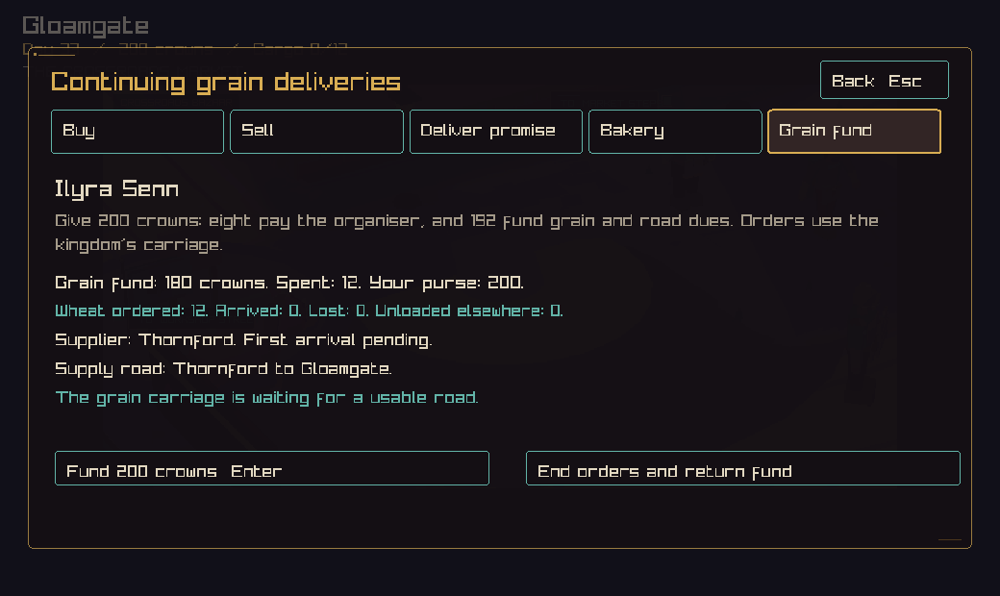
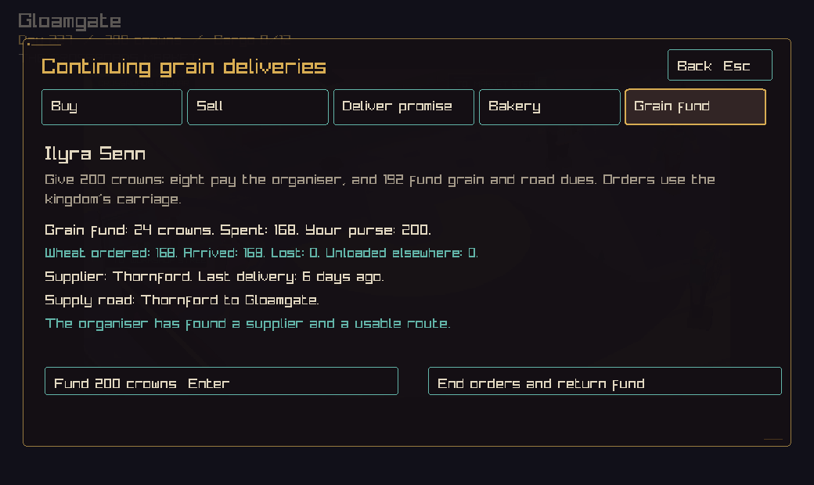
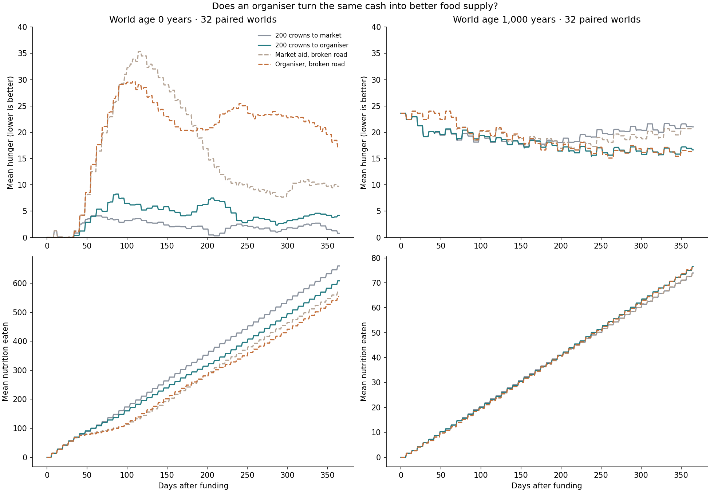
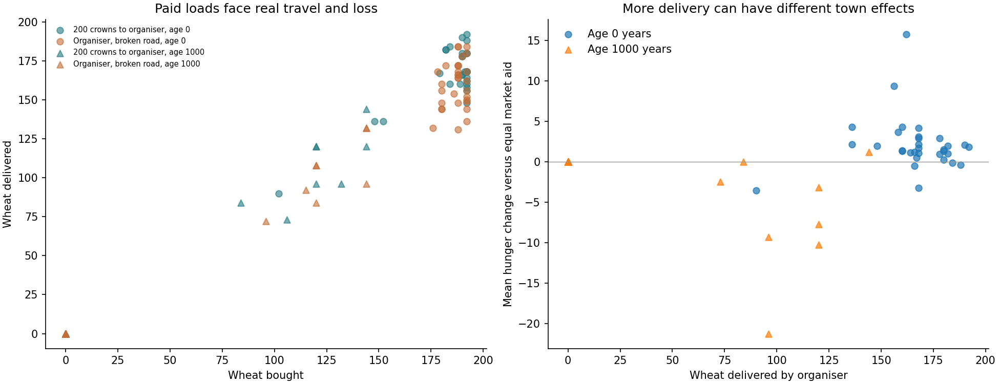
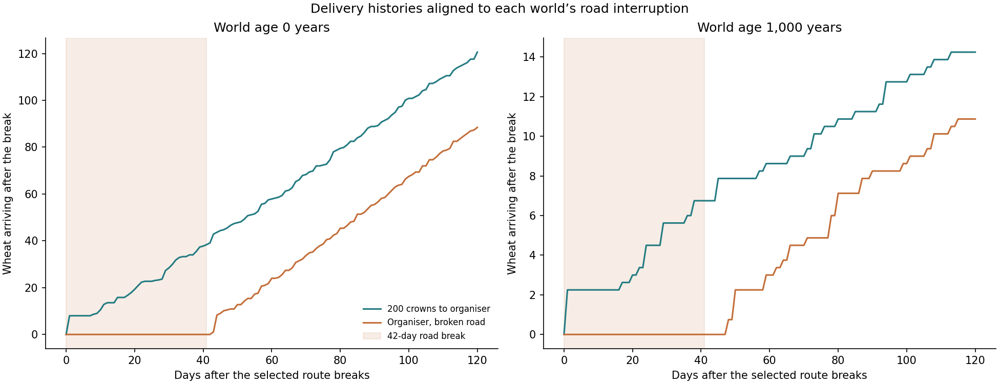

# A person who arranges the next grain load

A local organiser can now receive pay, manage a separate grain fund, choose a
supplier, and book repeated deliveries. A broken road interrupts those plans.
A return visit shows what happened to the money and grain.

The experiment gives a mixed result. Organisers deliver reliably in new worlds,
but equal cash aid produces more meals there. In thousand-year-old worlds,
organisers bring a small food benefit and often wait on a missing supply path.
This is a useful step toward people with lasting purposes and real constraints.

## Play the slice

Open the town's trade panel and select **Grain fund**. Funding costs 200 crowns.
Eight go into the named organiser's personal purse. The other 192 enter a saved
fund for grain purchases and road dues. Each further contribution uses the same
split. **End orders and return fund** gives the unspent balance back to the
company. Already-paid loads continue their journey and retain their receipts.

The organiser seeks spare wheat when the town has less than twelve wheat in stock
and incoming loads combined. They compare suppliers by price, road cost, and the
carriage's journey to collect the load. Existing rules protect suppliers' own
reserves. Orders use the kingdom's existing carriage and compete with its other
work. The organiser checks again when the carriage becomes available.

If a supplier runs out, the organiser can choose another. If the person leaves
or dies, further buying waits for a local organiser. A funded bakery can retain
its money while waiting for grain, transport, or an open workshop. The panel
shows the current reason and names the supply road.

The console exposes the same actions as `grain`, `grain fund`, and `grain end`.
The same commands work through the saved action journal and shared company play.





These native captures use a controlled visit at Gloamgate. The later view follows
14 days of disruption and 180 more days after repair. The screenshot fixture
advances time at the town; it does not measure a player's round-trip journey.
The separate saved-game test also checks actual waiting, delivery after repair,
and retained receipts.

## The road rule found by the test

The existing freight rules allowed some traffic even at zero road condition.
Schema 73 treats zero condition as impassable for freight. A damaged road with
positive condition still uses the existing capacity and toll rules. Existing
freight can wait, reroute, or unload elsewhere after a long delay. Repairs make
the route usable again. Earlier save versions retain their original replay rules.

This affects ordinary freight as well as organised grain. The experiments grow
all worlds under the new rule and compare cloned branches within each world.
Their aged endpoints therefore differ from the earlier bakery experiment.

## Paired experiment

We tested the same 32 seed ordinals at world ages zero and 1,000 years. Each of
those 64 worlds then has four branches and a 365-day follow-up: 256 branch-years
and 93,696 daily observations. Every branch passed daily simulation validation.
All 64 starting worlds accepted the funding action.

| Branch | Use of the same 200-crown gift | Road treatment |
| --- | --- | --- |
| Market aid | Transfer all 200 to the town market. | Ordinary world changes. |
| Organiser | Pay the person eight and place 192 in the grain fund. | Ordinary world changes. |
| Market aid with interruption | Same market transfer. | Break one route for 42 days, then restore its prior state. |
| Organiser with interruption | Same organiser payment and fund. | Apply the identical route treatment. |

Each branch starts from the same saved world state. A controlled arrival places
the company and its carriage at Gloamgate with 400 crowns. That setup supplies
the purse externally. Earning it and travelling there remain outside this test.
The cash comparison is a diagnostic market transfer, not a new player command.

A funded pilot chooses the first dispatched load's route within 90 days. The
interruption begins the next day. All 32 new worlds and eight old worlds had a
pilot dispatch. For the other 24 old worlds, the test uses a town approach road
on day 28. Those cases describe already-stalled supply. The raw records identify
them with `pilot_dispatched=0`.

During interruption, the chosen road is held at zero condition. At the end, its
condition and closed flag return to their pre-break values. This avoids giving
the disrupted branch a stronger road than it had before. All other world events
continue normally. The seed is the ordinal times 2654435761, wrapped to 32 bits.

## Deliveries resume, but the food benefit depends on the world



| Mean result after one year | New world, organiser | Old world, organiser |
| --- | ---: | ---: |
| Worlds with a grain delivery | 32 of 32 | 8 of 32 |
| Wheat bought | 184.53 | 30.31 |
| Wheat delivered | 166.22 | 26.66 |
| Wheat lost on the road | 18.31 | 3.66 |
| Crowns spent from the 192-crown fund | 191.47 | 45.84 |
| Change in mean hunger versus market aid | +2.17 points | -1.65 points |
| Change in nutrition eaten versus market aid | -51.31 units | +2.63 units |

The new-world organiser delivers grain while its town eats less than the equal
cash branch. The code gives organised grain priority over ordinary town trade
when the carriage is free. Competing cargo, different buying choices, and the
salary split are possible causes of the difference. A further experiment should
separate their contributions before changing the priority rule.

Old worlds retain an average 146.16 crowns in the fund after a year. Much of the
money is waiting on another input to the plan. A purse alone gives limited help
when the supplier, carriage, or road is unavailable.



The dots preserve each world's result. Whole loads create repeated values. The
gap between bought and delivered goods includes road losses, loads still moving,
and loads unloaded elsewhere. The saved record keeps those outcomes distinct.



Organised arrivals stop during the chosen road break in this sample. They resume
after restoration in all 32 new worlds and the eight old worlds that receive
loads. By day 365, disrupted new worlds average 160.25 delivered wheat and 8.88
wheat unloaded elsewhere. Disrupted old worlds average 25.75 delivered and three
unloaded elsewhere. The mean curves include the stalled old worlds.

The focused supplier test also removes the chosen source's wheat and checks that
the next plan selects another stocked town. That proves the choice can change;
the road chart itself mainly shows waiting and resumed delivery.

## What happens between wheat and meals

The daily records include exact bakery inputs and outputs, civilian nutrition
consumed, food lost to ageing, and food lost to storage overflow. Delivery records
separately count bought, received, lost, and redirected wheat.

New-world organisers produce an average 234.12 bread during the year, compared
with 225.25 under market aid, while total nutrition eaten is 608.09 versus 659.41.
More bread production therefore does not imply more meals overall.

Old-world organisers produce 74.34 bread versus 77.31 under market aid. Their
nutrition eaten is 76.56 versus 73.94, and food overflow is 49.50 versus 68.19
nutrition units. Timing and other food sources matter alongside baking output.

These are whole-town totals. A particular donated grain unit loses its identity
once it joins ordinary stock. The records show where goods enter and leave each
process; they do not assign every later meal to a particular gift.

## Design take

This closes a real gap from [the bakery slice](../gloamgate-bakery-2026-09-08/README.md):
the person now has pay, an ongoing purpose, a limited fund, supplier choices, and
visible outcomes. It follows the physical purses and current purposes described
in [People, carriages, and gossip](../../npc-society.md).

The strongest remaining gap is deciding which work should use the carriage next.
An organiser's narrow success can coexist with worse food outcomes for the town.
A useful next slice would compare the grain order with other urgent cargo and
show the person explaining that choice. Workshop ownership and broader personal
plans remain open parts of the design.

## Reproduce and verify

```sh
cmake -S . -B out/build/grain -DCC_BUILD_CLIENT=OFF -DCC_BUILD_BENCHMARKS=ON -DBUILD_TESTING=ON -DCMAKE_BUILD_TYPE=Release
cmake --build out/build/grain --target crownless_grain_experiment grain_supply_tests
MPLCONFIGDIR=/tmp/crownless-chart-cache python3 tools/plot_grain_experiment.py --binary out/build/grain/crownless_grain_experiment --output docs/experiments/grain-organiser-2026-09-08 --seeds 32 --workers 6
ctest --test-dir out/build/grain -R grain_supply_and_disruption --output-on-failure
```

Python, Matplotlib, and NumPy draw the charts. `daily.csv.gz` contains the raw
records; `results.json` contains coverage, results, and simulation source hashes.
`--reuse-data` redraws saved records. Source changes require a fresh run.

Validation includes all 101 headless tests, four relevant native tests, and static
analysis. Focused tests cover crown custody, repeated dispatch, road interruption,
resumption, supplier replacement, lack of funds, refunds, save/load, journal
replay, schema-72 migration, and the player-facing funding action. Both native
screens were captured at 1040 by 620 and visually checked.
