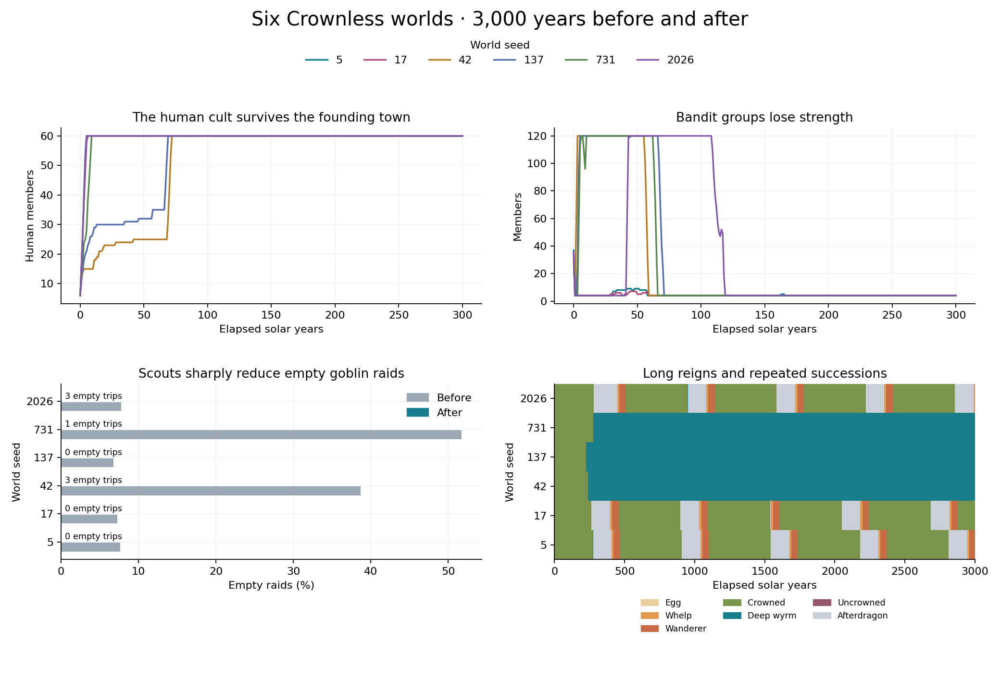

# Cults, raids, and long histories

Six worlds now produce three repeating dragon dynasties and three long Deep Wyrm reigns. The human cult survives the loss of Silverwick in every world. Empty goblin raids fall from 33,427 to 7. Small bandit groups finish as hideouts with two services. These results come from 3,000 solar years per world, compared with the same six seeds on unchanged main: 36,000 simulated years in the final comparison.



| World seed | Dragon successors, before → after | People at year 3,000, before → after | Empty goblin raids, before → after | Final dragon |
| --- | ---: | ---: | ---: | --- |
| 5 | 0 → 5 | 13,210 → 13,175 | 1,846 → 0 | Wanderer |
| 17 | 0 → 5 | 13,205 → 13,151 | 1,762 → 0 | Crowned |
| 42 | 0 → 0 | 13,200 → 13,159 | 11,033 → 3 | Deep Wyrm |
| 137 | 0 → 0 | 13,279 → 13,370 | 1,642 → 0 | Deep Wyrm |
| 731 | 0 → 0 | 13,337 → 3,635 | 15,253 → 1 | Deep Wyrm |
| 2026 | 0 → 5 | 13,195 → 13,253 | 1,891 → 3 | Whelp |

**World 5: the long return.** Hollowbarrow falls in calendar year 57. Silverwick follows in year 244. Tallen Longreckon kills Varkesh in year 276. A century later, Red and Purple porters leave their clan lairs with grave gifts. The Red porter reaches the ash-vault on day 136,973; the Purple porter follows the next day. Each delivers one relic. The cult opens the vault in year 396 and reveals two eggs. Ember Beneath Stone hatches in year 406. Four more successors follow over the remaining centuries. The final dragon is still a young wanderer. This is the delayed cycle the calendar needs: a fall, a long period of remembrance, real gifts, and a later return.

**World 17: inheritance can be quick.** Most successors follow long periods after a dragon's death. One existing clutch gives this world a shorter interval: a dragon dies in year 1,540, and its successor hatches in year 1,544. There are five successors but four revival rituals. Eggs already laid by a living dragon account for that difference. The records retain each event separately.

**Worlds 42 and 137: the old wyrm endures.** Their founding dragons remain Deep Wyrms at year 3,000. Goblin raids keep bringing useful supplies, and cohesion reaches 100. These worlds show a long reign alongside the repeating dynasties elsewhere. World 42 has a small goblin population of 11 at the final observation; the human cult still has 60 members. Cult membership and the whole goblin population remain separate counts.

**World 731: an age of war.** Ember Crown declares war on Star Oath on day 11,210, in calendar year 30. That war remains active at the end. Alderwatch and Hollowbarrow empty in year 62, followed by Silverwick in year 169. The surviving population concentrates in Thornford: 2,801 people there, 296 in Gloamgate, and 538 in Rosespire. The Deep Wyrm survives throughout. The world spends 1,082,147 days at war, about 2,973 solar years. This is a useful balance warning: old wars can outlast the towns and courts that began them.

The bandit stories also change. The Broken Pennants reach 120 members, then dwindle after their last successful raid in year 59. The Unpaid Company in world 2026 raids until year 119. In worlds 5 and 17, the bands decline within the opening year. All six end with four members and a hideout; their past raids remain in their records. Successful bandit raids across the six worlds fall from 116,134 to 3,479. Their final stores still reach 100 through the existing night-road supply rule, so camp wealth and camp population can take different paths. Bandit recovery and the founding of new bands deserve a separate balance pass.

Other life continues. Five worlds retain four inhabited towns and roughly 13,000 people. Their final population-weighted hunger stays below 2 on the 0–100 scale. The six worlds finish with 61–63 cows, 139–165 sheep, and 35–36 common ponies. Monster pressure reaches 100 in every world. These measures show that recovery still varies between systems.

The calendar has more real history to record: true age records rise from six to fourteen. Scribes hold four meetings, compared with seven before, and produce zero agreed almanacs in both versions. Every world ends with all eight road flags closed and zero tools in town stores. Scribe travel and meeting supplies remain the limiting steps. The closed flag has different meanings for different forms of travel; royal transport and raids can still occur under existing route rules. Shared route rules, town tool renewal, and late scribe expeditions are the next calendar work.

Royal records are clearer. The unchanged runs report 161,300 zero-load shipment arrivals. The changed runs report zero. Loaded arrivals total 13,360, compared with 11,858 before. Empty blocked carriages now record parking. This makes the cargo counts useful for later studies.

The implementation changes five connected rules:

- Human cult members draw from living towns. After the founding town falls, surviving towns take turns hosting recruitment. Each human initiation consumes one ration. Goblin recruitment follows the living goblin population.
- Clan porters carry coins and relics along the existing Underroad passages. Gifts move from clan storage into carried loads, then into the ash-vault. Blocked passages hold the load in transit.
- Town gifts keep a working purse of 100 crowns and stop at the revival target of 120. Coins carried back to a living dragon also reduce its automatic missing-coin claim. An earlier trial exposed repeated fires after returned coins had already reached the hoard; this credit closes that loop through actual transfers.
- Scouts check useful stock before choosing targets. Goblins change their raid purpose when the preferred supplies run out, and wait 28 days when their scouts find no useful target. Lair smiths consume recovered iron or wood to make needed tools and weapons.
- Bandit camp size, services, and control of ruins follow current membership. Recruitment pressure comes from inhabited towns. Empty royal carriages produce a parking event.

All new rules use schema 114. Old journal turns retain their original rules before the save upgrade. A regression test matches the complete schema-113 world hash for raw seed 42 after 364 days against the unchanged build.

The final comparison uses raw seeds 5, 17, 42, 137, 731, and 2026. Each world starts at day 1 and advances 1,092,000 days with zero player commands. A solar year is 364 days; older dragon timers still use their existing 365-day periods. Endpoint tables use elapsed years. Story dates above use the calendar recorded in events. Each run validates state weekly, saves the final world, reloads it, and checks the full world hash. All twelve runs passed. Each event is counted by its numeric kind; narrative samples retain the first two examples per kind per century and every dragon succession and diplomatic change. Event-buffer saturation was zero in every run.

[Summary data](summary.csv), [full summaries](summary.json), and [build and run records](provenance.json) contain the numbers behind this review. The control commit is `615031d9d3b85015f0e2d990e91f3b3df21f2f2e`; the changed simulation commit is `b3045541a4c8ee34fa637fee9213c81132481e95`. All 165 local checks passed, including the permission-enabled local speech server check. The browser persistence test setup now provides the random-value API used for campaign identities.

To repeat the study, build each chosen checkout with the `play` preset and `CC_BUILD_CLIENT=OFF`. Run this folder's `run.py` once for each build, then pass the two output directories to `analyze.py`:

```sh
python3 docs/experiments/long-history-recovery-2026-09-24/run.py \
  --source /path/to/checkout --build /path/to/checkout/out/build/play \
  --output /tmp/new-history-output
python3 docs/experiments/long-history-recovery-2026-09-24/analyze.py \
  --before /tmp/control-history-output --after /tmp/new-history-output \
  --output /tmp/history-review
```

The measurement probe and its CSV headers are frozen for this comparison. Use the recorded source commits to repeat it. Plotting requires Matplotlib. Six seeds reveal useful stories and failure patterns; a larger seed set can measure how often they occur.
