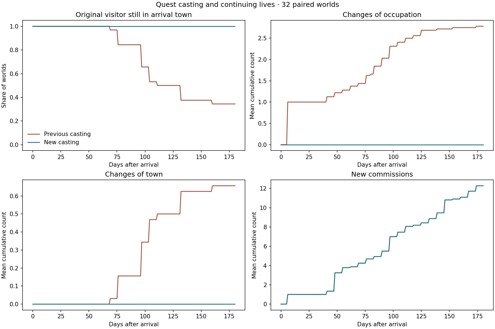

# Quest casting and continuing lives

Recurring quests now choose available adults already at the relevant place.
The person keeps their occupation, personal goal, allegiance, and location.
Their responsibility lives on the quest record.

The change also preserves surviving cast members after another member dies.
A suitable local replacement can take that responsibility. If the place has
no suitable replacement, the commission closes with a recorded reason and an
archived outcome. The player receives no blame for that closure.

## The rules

- New candidates are living adults present at the required town. Camp members
  and people currently travelling remain in their existing lives.
- A sponsor shares the issuing faction or has no recorded faction. The choice
  prefers the relevant occupation, then faction membership, then age. Stable
  identity breaks ties.
- The sponsor, affected person, and mine witness are separate people. New mine
  commissions require all three roles to be filled.
- Surviving members keep their established responsibility when a colleague
  dies, including when they have since travelled elsewhere.
- Quest activity updates preserve travelling and camp activity. Existing
  memories, knowledge, and relationships remain part of the social system.
- A new commission waits until a complete cast is available. A commission
  already issued can close after a death, with its original names and IDs
  retained in history.

The opening day's named cast keeps the existing setup. Schema 74 applies the
new rules after that opening. Earlier schemas retain their casting rules for
save and journal replay. Loading then advances the save to schema 74, with its
existing people and past events intact.

## Paired experiment

We followed 32 young worlds for 180 days under schema 73 and schema 74. The
world seeds are ordinal times 2654435761, modulo 2^32. In each world, an existing
adult traveller arrives at settlement slot 1 with six crowns. Their home and
other identity fields remain intact. The town receives the same severe food
shock used in the earlier exploration: edible civilian stocks become zero and
hunger becomes 45. Existing production, quests, and routes continue.

This experiment isolates the casting rule through its schema gate. There is
one waiting branch per rule set. It is a controlled arrival, rather than a
natural sample of traveller decisions. All 64 runs validate each day.



| Outcome after 180 days | Previous rules | New rules |
| --- | ---: | ---: |
| Original visitors still in the arrival town | 11 of 32 | 32 of 32 |
| Mean changes of occupation across existing people | 2.78 | 0 |
| Mean changes of faction allegiance across existing people | 8.22 | 0 |
| Mean changes of town across existing people | 0.66 | 0 |
| Mean new commissions | 12.28 | 12.28 |
| Original visitors in a bandit group | 32 of 32 | 32 of 32 |
| Mean town hunger | 4.41 | 4.41 |

The change preserves people's continuing lives while maintaining the measured
flow of commissions. It also separates two earlier findings: quest casting
caused location and identity changes in this fixture, while recruitment still
follows the existing hardship rules.

The movement, occupation, and allegiance counters compare the same person
across consecutive days. Newborn replacements are excluded. They count all
such changes, including any ordinary world changes. The result is specific to
this fixture; legitimate migration and political changes remain possible in
other worlds. The focused tests separately exercise casting and replacement.

## Compatibility and checks

Every schema 73 daily record, including its full simulation hash, matched the
previous build from the road meeting slice: 5,792 verified legacy states.
Its simulation sources are recorded in PR #575 at `e1bc31a`. The
same harness links against the previous simulation library for that check.
Binary and simulation source hashes are in [results.json](results.json).

The committed schema 73 journal fixture was written with the previous
persistence and simulation libraries. It contains one action-journal row for
100 days and an initial epoch. Its final legacy hash is
`17607823286729841219`. The new reader replays that journal, verifies the old
state, and upgrades it. The fixture uses DELETE storage mode so its action
journal travels in one file. [Its writer](write_legacy_fixture.c) records this
procedure.

Focused tests cover retained identity, a local replacement who keeps their
occupation, travelling and camp candidates, children, closure after a death,
saved outcomes, snapshot migration, a current journal, and the actual previous
version's journal.

Strict headless and native builds pass. All 107 headless checks pass, including
the local HTTP test run with socket access. Five focused native checks pass.
Static analysis passes with one reviewed baseline item. The separate
[1,000-year runs](long-run.json) record eight ordinary worlds and their final
validation results.

## Run it again

Build `crownless_quest_cast_experiment`. Compile the same source against the
previous schema 73 simulation library to obtain the legacy comparison binary.
Then run:

```sh
MPLCONFIGDIR=/tmp/crownless-chart-cache python3 tools/plot_quest_cast.py \
  --binary /path/to/crownless_quest_cast_experiment \
  --legacy-binary /path/to/quest-cast-old \
  --output docs/experiments/quest-cast-2026-09-08 --seeds 32
```

The script verifies the old daily states before publishing the comparison.
[daily.csv.gz](daily.csv.gz) contains all 11,584 observations.

## Next connection

People now keep their lives when a quest needs participants. Their next useful
step is to choose among competing responsibilities and explain that choice.
Camp food and work, passenger passage, and local crisis renewal can build on
these preserved identities. The current primary-crisis completion gate remains
a separate rule for a later slice.
