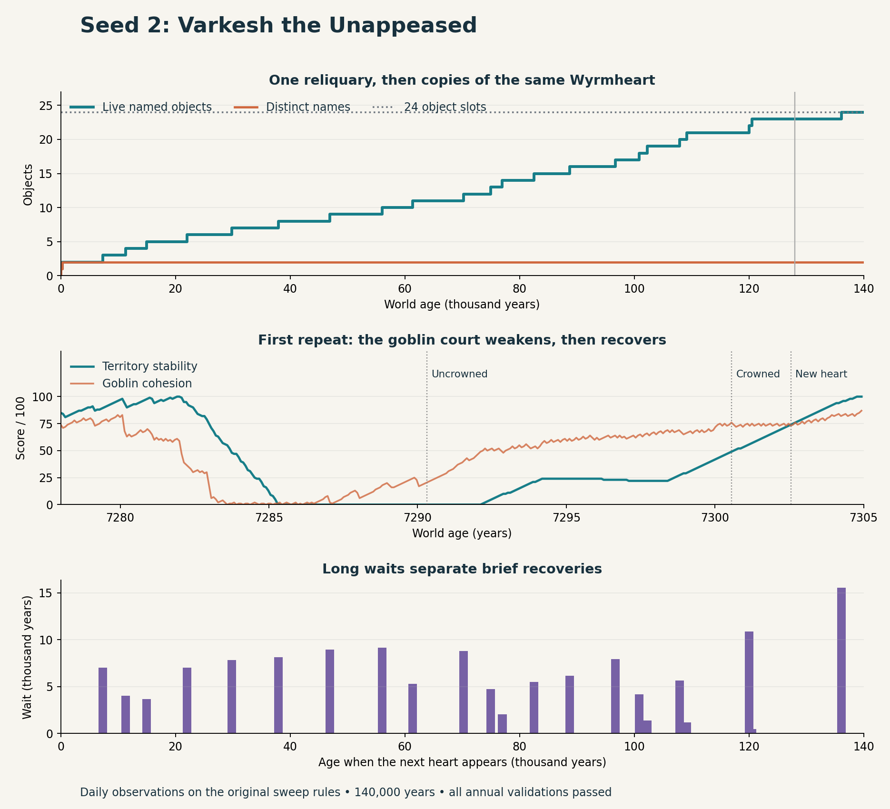

# Seed 2: the repeated Wyrmheart

Seed 2's late treasure growth comes from one dragon repeatedly regaining its crown. Each return to the deep-wyrm stage creates another Wyrmheart with the same name, materials, and value. This explains the slow rise that moved the earlier sweep's average.



## What happened

Varkesh the Unappeased lives at Hollowbarrow. Rosespire makes a Sun Reliquary on day 21, worth 140 crowns. The goblin tribute system brings it to Varkesh by day 108. The dragon makes its first Wyrmheart on day 92,711, about year 254. Each heart is worth 1,420 crowns: two gold, twelve gems, and fifty units of craft work.

The same dragon later loses its territory, becomes uncrowned, rebuilds its hold, and becomes a deep wyrm again. The trace records the new object on the same day as that last stage change.

At year 128,000, the world has **one reliquary and 22 Wyrmhearts**, worth **31,380 crowns** in total. All 23 objects belong to Varkesh and sit at Hollowbarrow. They have separate IDs and creation dates, but only two distinct names. Every treasure created in this history survives to that checkpoint.

The extension reaches the 24-object limit at **year 136,100.63** and stays there through year 140,000. The final inventory is one reliquary and 23 Wyrmhearts. The run records **22 uncrownings**, each followed by recovery and another heart. The median wait between hearts is **5,929 years**; the median uncrowned-to-deep-wyrm recovery is just **11.85 years**. All 140,000 annual validations pass.

## Why another heart appears

The relevant rules are in [`AdvanceDragonEcology`](../../../src/sim/cc_sim.c):

1. Five 364-day years at zero territory turn a crowned dragon or deep wyrm into an uncrowned dragon.
2. A recovering dragon can regain its crown with territory at least 50, memory at least 60, crown strength at least 25, and goblin devotion at least 50.
3. A crowned dragon becomes a deep wyrm with territory at least 75, crown strength at least 60, age at least 500 years, and crown continuity at least 200 years.
4. Entering that stage calls `AllocateTreasure` and creates a Wyrmheart whenever a slot is available.

`ChangeDragonStage` preserves the dragon's accumulated crown continuity. Varkesh already has thousands of years on that clock during its later recoveries. The age gates remain satisfied. The heart award therefore repeats when territory recovers.

The first repeat is clear:

| Event | World age |
|---|---:|
| Becomes uncrowned | 7,290.32 years |
| Regains crown | 7,300.56 years |
| Becomes deep wyrm; creates second heart | 7,302.55 years |

The focused observations show food shortages and low goblin cohesion around the collapse. Between years 7,280 and 7,286, 20 of 78 sampled days have empty bread, wheat, and meat stores. Cohesion reaches zero. Territory drops from 100 to zero. The lair kingdom is at peace at all 78 samples. Supply and cohesion recover later; a brief war overlaps that recovery.

These ecology samples are taken the day before each 28-day update. They describe the conditions around the first collapse. The daily stage trace provides the direct evidence for the repeated award. All observed uncrownings have zero territory while memory and crown strength remain above their separate failure thresholds.

## Campaign opinion

**Treat seed 2 as a repeated reward loop when choosing the warm-up age.** The extra objects increase hoard value, while their names, material mix, and location stay the same. This reduces the case for waiting another hundred thousand years just to obtain a richer range of loot.

I would give each dragon one Wyrmheart. If repeated formation is part of the setting, each later heart should carry a distinct name, effect, or recorded event. The territory-loss cycle itself offers useful history: a hungry goblin court, a fallen crown, and a restored ancient power.

For an in-medias-res opening, use a concrete recent event as the start signal after the world has enough useful objects and places. Track distinct relics, owners, locations, and fresh reports alongside total value. The earlier 16,000-year suggestion remains a useful candidate for testing across seeds; seed 2 gives a reason to judge variety as well as count.

## Evidence and reproduction

The simulation rules are frozen at `06e5701c6d6c09bc25430685a9fd917b81a42972`, the source used for the earlier sweep. This report concerns that version. The observer reads state once per day and validates the world once per year.

The full trace was built from observer commit `64b8277`. The final observer adds a duration argument and the focused ecology output. Its 8,000-year run matches the full trace at every thousand-year checkpoint. The full trace matches all 128 earlier thousand-year checkpoints on treasure count and next entity serial. At year 128,000, treasure ID hash and total value also match the earlier sweep. These comparisons cover the listed fields.

The extended horizon, object creation ages, interval statistics, and file hashes are in [`summary.json`](summary.json). The exact observations are in [`trace.jsonl`](trace.jsonl) and [`first-cycle.jsonl`](first-cycle.jsonl). Event excerpts capture up to twelve recent events on a stage or creation day. Object and stage observations supply the main evidence.

From this checkout, build the frozen simulation in a separate worktree:

```sh
git worktree add --detach /tmp/crownless-seed2-rules 06e5701c6d6c09bc25430685a9fd917b81a42972
cmake -S /tmp/crownless-seed2-rules -B /tmp/crownless-seed2-build -DCC_BUILD_CLIENT=OFF -DCMAKE_BUILD_TYPE=Release
cmake --build /tmp/crownless-seed2-build --target crownless_sim
cc -O3 -DNDEBUG -std=c17 -Wall -Wextra -Werror -I /tmp/crownless-seed2-rules/src docs/experiments/seed2-2026-09-08/trace.c /tmp/crownless-seed2-build/libcrownless_sim.a -o /tmp/crownless-seed2-trace
/tmp/crownless-seed2-trace > docs/experiments/seed2-2026-09-08/trace.jsonl 2> docs/experiments/seed2-2026-09-08/trace.log
/tmp/crownless-seed2-trace 8000 > docs/experiments/seed2-2026-09-08/first-cycle.jsonl 2> docs/experiments/seed2-2026-09-08/first-cycle.log
python3 docs/experiments/seed2-2026-09-08/analyze.py
```

The chart script requires Matplotlib and NumPy. The C observer builds with warnings treated as errors. Local evidence consists of the annual world validation and the comparisons above. PR checks are a separate result.
