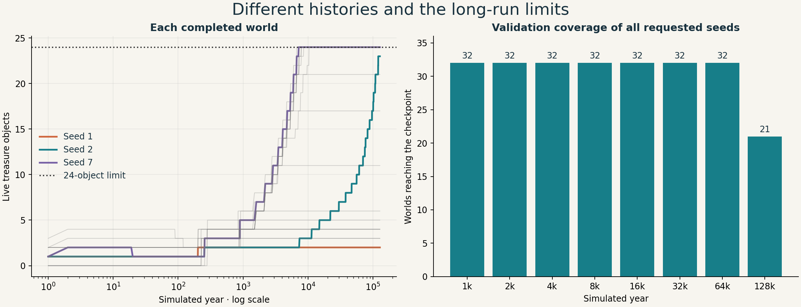
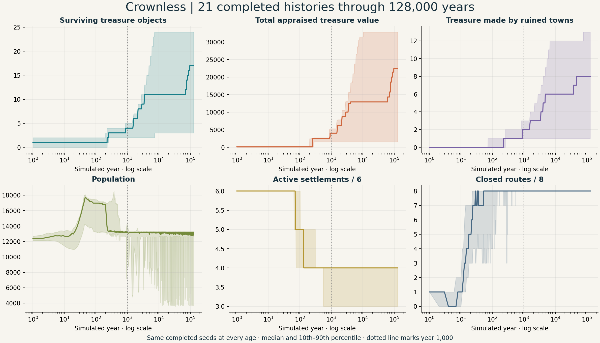
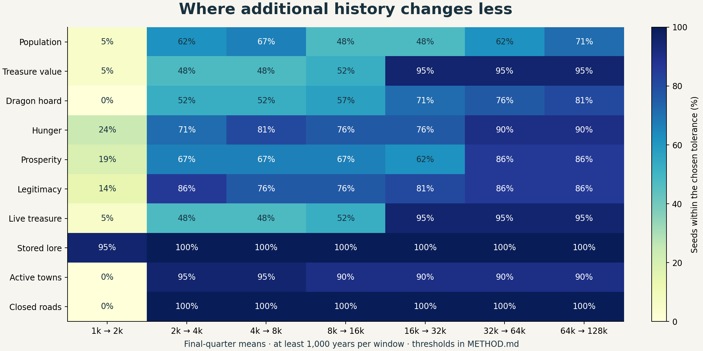
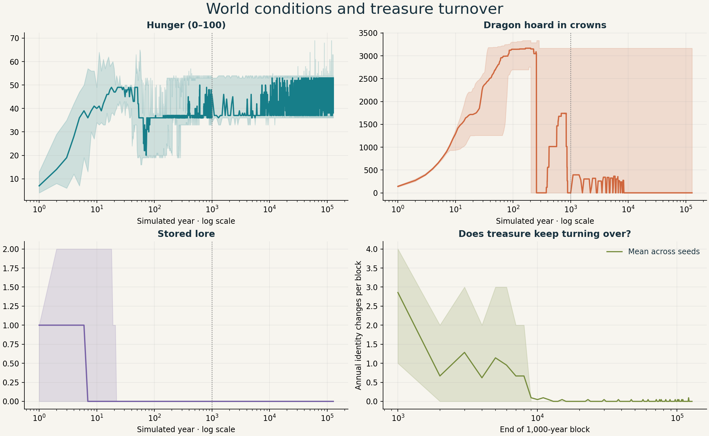

# Campaign histories through 128,000 years

**Most treasure stocks settle by about 16,000 years. One world keeps adding treasure past 120,000 years.** The world also shows long plateaus in roads and lore, while population and wealth continue to vary.

My view: 16,000 years is a useful candidate for a default campaign warm-up. A later start can suit a slow-growing world. The start should also check for an interesting report, surviving treasure and an expedition target. Long-run counter limits need attention before offering the full 128,000-year range.

## Scope and reliability

This extends the earlier sweep using the same simulation source, `06e5701c6d6c09bc25430685a9fd917b81a42972`. The measurement build adds read-only treasure columns. The run used metrics seeds 1–32, with a target of 128,000 years per seed.

- All 32 worlds reached 64,000 years.
- 21 worlds reached 128,000 years.
- 11 worlds failed validation between years 76,718 and 113,628.
- The run processed 3,608,199 valid annual observations, spanning 1,316,992,635 simulated days. Saved data includes sampled rows, complete-block statistics and the last valid endpoint of each run.
- Tracked crowns stayed constant across annual observations in every seed's valid history.
- The first 1,000 years match the earlier sweep exactly for all 32 seeds.
- Seed 1's 128,000-year endpoint matches both the original binary and a build with undefined-behavior checks, across every comparable column.
- The full sweep took 2,516.5 seconds, about 42 minutes, with eight workers on the local Mac. Other diagnostic runs shared the machine.

The main charts and tables follow the **same 21 completed worlds at every age**. The coverage chart includes all 32 requested worlds. Selection into the completed group limits the conclusions, so the report also checks treasure stability across the common 64,000-year span of all 32 seeds.

## The treasure plateau



The highlighted worlds show three useful cases:

- **Seed 1:** two surviving treasures from year 1,000 through year 128,000.
- **Seed 7:** five treasures at year 1,000; 24 by year 16,000. Its youngest surviving item was created around year 7,140.
- **Seed 2:** five treasures at year 16,000; 11 at year 64,000; 23 at year 128,000. Its youngest surviving item was created around year 120,521.

Across the full 32-world sample, **31 worlds preserve the same treasure identities at annual observations from year 16,000 to year 64,000**. Among the 21 completed histories, **20 preserve them through year 128,000**. Seed 2 accounts for all 18 additional objects between years 16,000 and 128,000 in that completed group.

| Age | Mean surviving treasures | Mean appraised value | Worlds at the 24-object limit |
| --- | ---: | ---: | ---: |
| 1,000 | 4.05 | 3,715 | 0 / 21 |
| 8,000 | 12.90 | 15,555 | 6 / 21 |
| 16,000 | 13.29 | 16,117 | 8 / 21 |
| 32,000 | 13.38 | 16,252 | 8 / 21 |
| 64,000 | 13.57 | 16,523 | 8 / 21 |
| 128,000 | 14.14 | 17,334 | 8 / 21 |

For all 32 worlds over their common span, mean treasure count rises from 4.38 at year 1,000 to 14.25 at year 8,000, 15.22 at year 16,000 and 15.41 at year 64,000. That supports the same pattern: a large early gain followed by a small tail.

**My opinion:** use about 16,000 years as a candidate warm-up age, then evaluate the actual starting material. The additional 112,000 years give one of these completed worlds 18 more objects. An adaptive generator could reserve that time for worlds with continuing treasure production or a desired late event.

Treasure here means entries in the simulation's treasure array, including books and ruined volumes. Ordinary weapons, tools and other goods have their own stocks. Appraised value is the simulation's item value. Expedition quality also depends on access, clues, location and ownership.

The source sets `CC_MAX_TREASURES` to 24. The allocator can reuse destroyed slots; the smithy also checks the retained slot count before completing an item. Eight completed worlds reach the live-object limit. Others settle well below it. Those smaller stocks make supply and production rules useful subjects for the next experiment.

## What else levels off?



Lines show medians and shading shows the 10th–90th percentile across the 21 completed histories. The log time axis keeps the opening centuries visible. The dotted line marks the earlier 1,000-year horizon.

I used a practical plateau rule: compare the final quarter of each history at successive doublings, with a minimum 1,000-year window. Both the cohort mean and at least 80% of its seeds must remain within tolerance at every later tested doubling. The full rule is in [METHOD.md](METHOD.md).

| Measure | First sustained plateau under that rule | Tolerance |
| --- | ---: | --- |
| Stored lore | 1,000 years | 0.1 unit |
| Active settlement count | 2,000 years | 0.1 settlement |
| Closed route count | 2,000 years | 0.1 route |
| Legitimacy | 16,000 years | 1 point |
| Hunger | 32,000 years | 1 point |
| Prosperity | 32,000 years | 1 point |
| Treasure count | Continued cohort growth through the final comparison | 0.1 object |
| Treasure value | Continued cohort growth through the final comparison | 1% |
| Population | Variation remains above the chosen limit in several seeds | 1% |
| Dragon hoard | Cohort variation remains above the chosen limit | 1% |

These are descriptive thresholds within the tested ages. A plateau means small changes under this rule; later events can still change a world.



The heatmap shows the share of seeds within tolerance. The table also applies the cohort-mean check. Treasure illustrates the distinction: 20 of 21 seeds are stable in the late comparisons, while seed 2 keeps the group mean rising. Between the final windows at 64,000 and 128,000 years, mean treasure count increases by 0.51 and mean value increases by 4.39%.

Population looks fairly steady in the median chart. Yet only 15 of 21 worlds keep their late-window mean change within 1%, so it falls short of the chosen plateau rule. A quiet-looking median can hide meaningful changes in individual histories.

## Stable stocks, continuing activity



The final 32,000 years contain seven annual treasure-identity changes across the 21 completed worlds, all in seed 2. Over the same period, population changes at 304,071 annual observations and hunger changes at 491,697. Closed routes remain at eight throughout those annual observations. Stored lore also stays fixed: 20 worlds hold zero and one holds one unit.

Existing objects can gain a ruined origin as their maker's town falls. That can add campaign context while the object identities remain stable. The long histories also retain active dragon and faction processes; for example, seed 2's dragon brood counter rises from 262 at year 64,000 to 527 at year 128,000.

**My opinion:** choose a campaign start by the material it offers. A world can be ready once it has an old treasure, a traceable place, a useful report and an active local problem. Further simulated age can deepen selected histories. Preserving their useful records deserves equal attention: the event buffer holds 256 entries, and the treasure array holds 24 slots.

## The failures expose lifetime counter limits

Nine worlds fail the bandit-expedition check; two fail the royal-carriage check.

| Check | Seeds and failing year |
| --- | --- |
| Bandit expedition | 3: 84,569; 5: 76,871; 15: 76,724; 17: 76,718; 18: 81,306; 19: 77,205; 23: 77,972; 24: 79,451; 27: 81,597 |
| Royal carriage | 4: 94,169; 11: 113,628 |

The original measurement binary reproduces seed 4's failure at the exact same year. Two focused probes show the specific fields:

- Seed 4: **1,000,001 completed carriage trips**, against a limit of 1,000,000.
- Seed 5: **1,000,008 completed bandit raids**, against the same limit.

The validator uses `CC_SIM_MAX_UNITS` for these lifetime totals. The other bandit failures also have raid totals just below that ceiling at their last valid annual observation. The two probes give direct state evidence for the representative failures; every seed's original error is retained in [logs](logs).

The 128,000-year target uses 46,720,001 as its ending day, within the declared day limit of 2,147,000,000. The representative failures arise from lifetime activity totals exceeding their validation bounds.

**My opinion:** give lifetime activity totals a range suited to long histories before exposing the full age range in campaign generation. Keep stock limits and historical totals as separate concepts. Repeat the failed seeds after that change.

## Reproduce and review

The recorded sweep used measurement revision `b7c01ac` on top of the earlier report. Later changes add analysis, probes and a failure exit code to the driver. The manifest records per-seed return codes and valid row counts from the original run.

```sh
cmake -S . -B /tmp/crownless-long-build -DCC_BUILD_CLIENT=OFF -DCC_BUILD_BENCHMARKS=ON -DCMAKE_BUILD_TYPE=Release -DCC_WARNINGS_AS_ERRORS=ON
cmake --build /tmp/crownless-long-build --target crownless_sim_metrics -j 8
python3 docs/experiments/simulation-128000-years-2026-09-08/run.py /tmp/crownless-long-build/crownless_sim_metrics
python3 docs/experiments/simulation-128000-years-2026-09-08/check_results.py
python3 docs/experiments/simulation-128000-years-2026-09-08/analyze.py
```

The current driver exits with failure when any seed fails and retains the data. Analysis needs NumPy and Matplotlib. Raw samples keep every year through 1,000 and every hundredth year afterward. Each complete 1,000-year block uses all annual observations. Failed final partial blocks retain sampled rows and the last valid endpoint in the manifest.

The optional `--campaign-metrics` columns measure live treasure count, value, creation dates, ruined origins and locations, an identity hash, and the next entity serial. Default output matches the earlier binary byte for byte in the three instrumentation checks. The identity hash tracks the sequence of live IDs at annual observations; ownership changes and items that appear and disappear between observations have separate measurement needs.

Local checks verified the build, data hashes, the 32 baseline histories, the extended-column bounds, the repeated endpoints and expected failures. The PR's checked baseline also has the previously observed save-version test failure at `tests/persistence_tests.c:2735`.

Files: [manifest](manifest.json), [summary](summary.json), [annual samples](annual), [block statistics](blocks), [data checks](data-checks.json), [independent checks](independent-checks.json), [carriage probe](failure-probe-4.log), [bandit probe](failure-probe-5.log), and [comparison method](METHOD.md).
