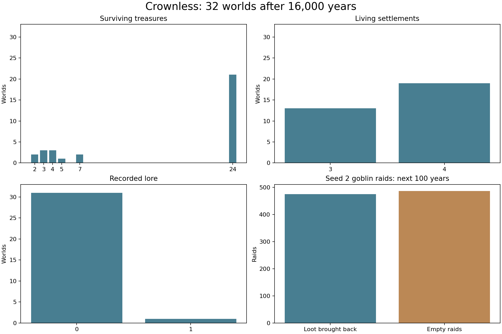

# Simulation audit — 8 September 2026

Source: `d478d2e`. Seeds 1–32 each ran 16,000 years. All 512,000 annual validations passed. The manifest records commands, binary hash, timing and endpoints. Compressed files retain annual rows through year 1,000 and every hundredth year thereafter.

## Findings and judgement

1. **Campaign news needs attention first.** At year 16,000, 31 of 32 worlds held zero lore, while 29 had four scribes. Staffing alone is therefore a weak readiness measure. Every world had eight closed routes. A campaign opening should require a usable scriptorium and an actual delivered dragon report. The existing gossip tests prove delivery in prepared conditions; the long sweep tests the world that naturally develops.
2. **Recovery can stall.** Seed 2 had zero archive funds, scribes and materials. Its current funding recovery requires a narrow reserve range of 40–49; zero falls outside that window. In the next 100 years, the control and the arm with roads maintained both had zero days with new heard gossip. Road repairs alone left other barriers in place.
3. **Peace needs a closer pass.** Seed 2 remained at war for all 36,500 days of the control and road-maintenance arms. Its war began near year 481. The dragon-crisis branch takes priority over ordinary peace logic; courier paths also depend on usable settlements. These are concrete recovery barriers, though this experiment does not isolate their individual shares.
4. **A recovery experiment exposed a ruler bug.** Maintaining roads and supplying the archive restored activity: 5,352 days holding a report heard since the observation window began, alongside staffed work. That arm failed validation after 24,455 days with “Kingdom Ashen Throne has an invalid ruler home allegiance.” This is a reproducible failure in an artificial aid scenario. The cause still needs isolation. The ordinary 32-world sweep passed.
5. **Goblins keep doing useful work.** Seed 2 completed 962 raids in its next century: 475 brought resources back and 487 were empty. Food and equipment raids supply the lair; the tribute counter tracks offerings to the dragon. A flat tribute total can hide active food gathering. Empty raids deserve a targeting review.
6. **Lifetime counters have a real ceiling.** Setting carriage trips, bandit raids, hoard raids or goblin tributes to 1,000,001 independently fails validation. These use the same ceiling as bounded stock. Long history needs a separate counter policy. These boundary fixtures establish the limit; they do not establish the year each normal world would hit it.
7. **Keep the 24 treasure slots.** Twenty-one worlds reached 24 surviving treasures; the others held 2–7. Seed 2 retained three. For the campaign, focus on treasure locations, stories and access. A larger slot count would not resolve the news and recovery findings.

## Method and limits

`probe.c` grows seed 2 for 16,000 years, then copies it into three daily observation arms. The control changes nothing. The second repairs all roads each day. The third also transfers treasury coins to support the archive and replenishes its wheat, paper and tools. This is an intervention, not a proposed balance rule. It stops at the recorded validation failure. `probe.jsonl` holds snapshots, event counts, examples and the exact failure. Its `days_with_new_heard_gossip` field counts days holding any report heard since the window began. A retained report can count on several days. The control and road-maintenance arms each recorded zero by this measure.

Five existing tests passed: living world feedback, goblin causal cycle, physical materials, material chains and traveller gossip. This audit adds evidence and a diagnostic probe. The traveller poverty rule is in a separate change and has its own eight-world comparison.

My priority order is campaign news and archive recovery, the ruler failure, peace recovery, then empty raid targeting and lifetime counter limits. The world supports long runs, but a campaign start needs a readiness check beyond elapsed years.
