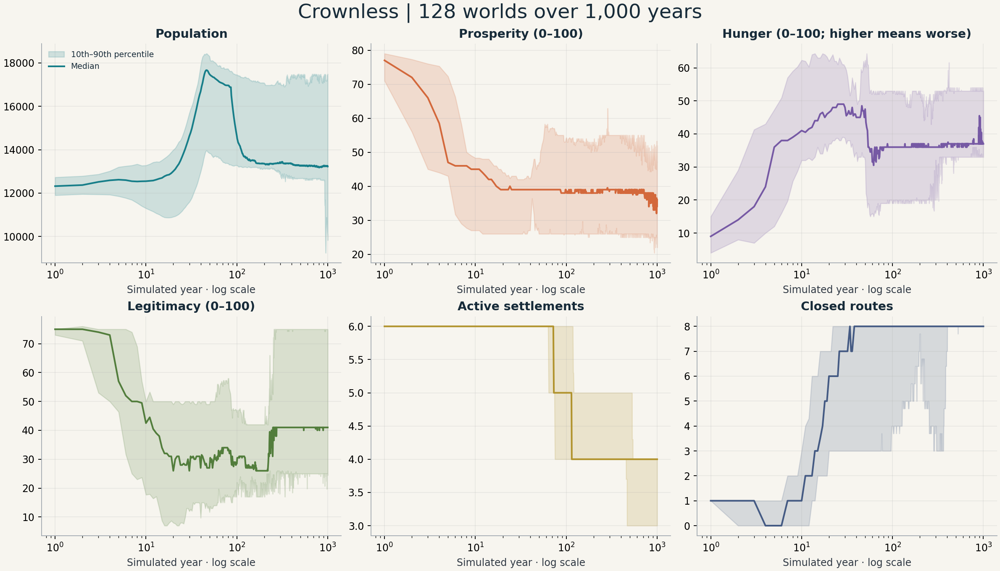
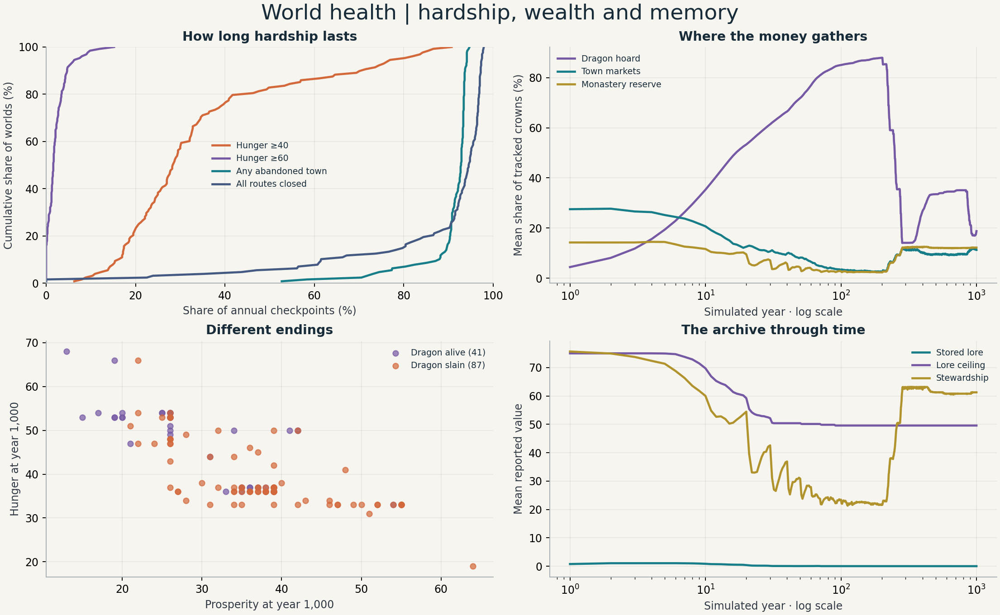
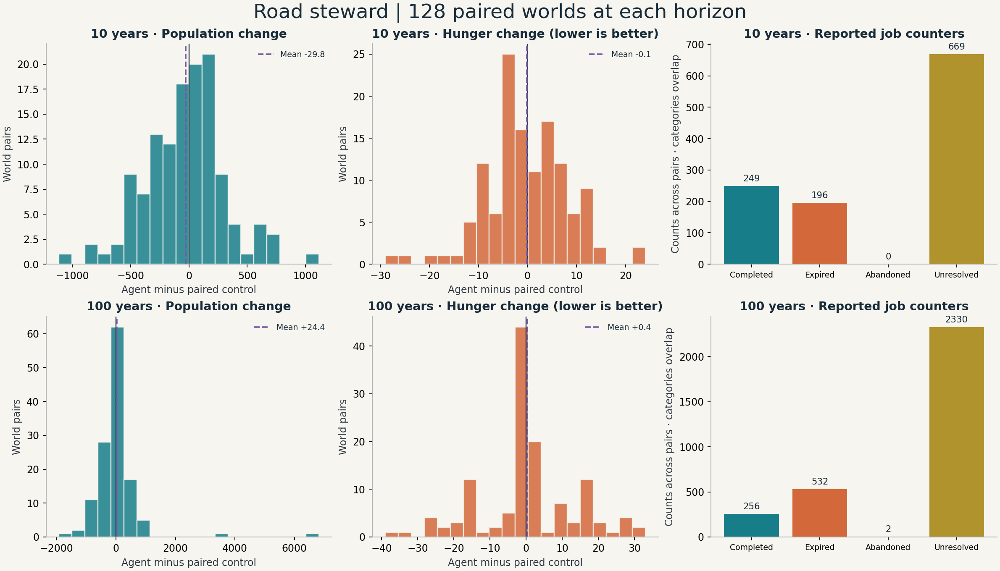

# Crownless simulation sweep — 8 September 2026 UTC

My view: Crownless has a solid base for long simulations and a strong early decline story. Its long-run world needs stronger recovery, and its road-steward test needs a repair-policy fix before it can support balance decisions about player influence.

This report measures source `06e5701c6d6c09bc25430685a9fd917b81a42972`. The run took place on 7 September in Vancouver, 8 September UTC. All figures below come from this source and the saved data in this folder.

## What ran

- 128 deterministic worlds, metrics seeds 1–128, for 1,000 years each: 46,720,000 simulated days and 128,000 annual observations.
- The same 128 seeds with the road steward and a passive control at 10 years and 100 years: 256 paired trials. The default work limit was one job.
- The full 65-test build with the graphics client switched off.
- Five repeats each of the standard performance and robotics benchmarks.
- Fresh repeats of seeds 1, 47 and 128 for each experiment: nine exact endpoint comparisons.

All 384 sweep runs passed. World validation ran after every year. The paired runner validated both worlds at the end. All nine repeated outputs matched exactly. Tracked crowns stayed constant across the 1,000 annual samples in each of the 128 passive worlds.

The sweep used a Release build in a separate worktree. The run manifest saves each command, exit code, elapsed time, source revision, data hashes and binary hashes. These are local results on one Mac. The sweep completed in 88.7 seconds with eight workers.

## The world loses its roads



Lines show the median world; shaded areas show the 10th–90th percentile across seeds. The time axis uses a log scale to keep the opening decades visible. These bands describe variation among worlds.

The table uses means, so its values can differ from the median lines.

| Measure | Year 1 | Year 10 | Year 100 | Year 1,000 |
| --- | ---: | ---: | ---: | ---: |
| Population | 12,308 | 12,435 | 15,203 | 13,059 |
| Prosperity, 0–100 | 76.1 | 41.6 | 38.9 | 34.6 |
| Hunger, 0–100 | 9.0 | 43.1 | 34.7 | 41.8 |
| Security, 0–100 | 65.8 | 46.5 | 52.2 | 47.3 |
| Legitimacy, 0–100 | 74.6 | 38.0 | 32.5 | 43.2 |
| Active settlements, out of 6 | 6.0 | 6.0 | 4.8 | 3.8 |
| Closed routes, out of 8 | 1.0 | 1.5 | 7.2 | 7.9 |

Every world had an abandoned settlement at an annual checkpoint. The first such checkpoint occurred at median year 73, with a range of 54–474. All 128 worlds still had an abandoned settlement at year 1,000. At that endpoint, 125 worlds had all eight routes closed.

The median world had every route closed at 94.55% of annual checkpoints and at least one abandoned town at 92.8%. Average hunger reached 40 or more at a median 28.4% of checkpoints. The corresponding share for hunger 60 or more was 1.6%.

**My opinion:** road recovery is the highest balance priority. Town populations can persist while the travel network spends centuries closed. That pattern suggests a long campaign could lose places to visit and useful trade choices. A play session should test how these closed routes affect actual travel and quests.

The source gives a concrete place to investigate: `AdvanceRoadsideRecovery` in `src/sim/cc_sim.c` checks recovery every 112 days. It requires living settlements at both ends, enough people, food, wood, stone and tools. It also checks border war status. Repairs consume supplies and people. These requirements may make recovery hardest when the road network most needs it. That is a source-based hypothesis; a treatment sweep should measure each requirement's effect.

## Wealth and memory



The dragon's mean share of tracked crowns rises from 4.4% at year one to 35.3% at year ten and 85.0% at year 100. At year 200 it reaches 87.9%. By year 1,000 it falls to 18.8%, while road closures remain common. The wealth chart shows selected holders; the remaining tracked crowns belong to other holders.

At year 1,000, the dragon is alive in 41 worlds and slain in 87. The living-dragon group has mean prosperity 29.7 and hunger 47.3. The slain-dragon group has prosperity 36.9 and hunger 39.2. These are associations among end states. Shared history, war, resources and other seed differences can affect both dragon survival and human welfare.

**My opinion:** wealth concentration is worth a controlled experiment. The later release of hoarded crowns accompanies persistent road damage, so I would test crown circulation alongside road supplies and repair access.

Stored lore averages 0.87 at year ten and 0.03 at year 1,000. At both years 100 and 1,000, 125 of 128 worlds report zero stored lore. The mean lore ceiling falls from 75 to 49.6. Scribes still average 3.3 per world at the endpoint.

The archive chart mixes three clearly named measures: stored lore counts, the lore ceiling, and stewardship scores. The source requires heard gossip, paper, tools and a successful tome binding to record lore. The sweep measures the passive world; active research and delivery policies merit their own trials.

**My opinion:** the archive is the second world-system priority. A history-driven game benefits from a visible supply of surviving records. I would measure gossip arrivals, paper shortages, binding failures, records written and records lost each year, then test a supply-and-delivery policy.

Faction exposure adds variety: the median world spends 15.1% of simulated days with at least one war, versus a mean of 23.0%. Alliance exposure has a median of 0.32% and a mean of 11.1%, which shows a long upper tail. Bandit influence ends between 72 and 100 in every world. These patterns support closer study of the few worlds that sustain alliances and roads.

## The road steward needs a policy repair



The plots compare each agent world with its control from the same seed. Below are mean agent-minus-control changes, followed by 95% bootstrap intervals over seed pairs. The bootstrap uses 10,000 resamples and a fixed analysis seed.

| Measure | 10 years | 100 years |
| --- | ---: | ---: |
| Population | −29.8 [−88.6, +30.0] | +24.4 [−101.1, +177.4] |
| Prosperity | −0.40 [−1.23, +0.43] | +0.05 [−1.76, +1.88] |
| Hunger | −0.11 [−1.60, +1.34] | +0.40 [−1.87, +2.68] |
| Closed routes | +0.20 [−0.16, +0.57] | +0.02 [−0.45, +0.47] |

Every listed interval includes zero. The road steward's objective score fails in all 256 trials. It performs 249 repairs across the ten-year cohort and 256 across the hundred-year cohort: roughly two per world at either horizon. It accepts 866 and 2,864 route jobs, respectively, and reports zero resolved job lifecycles in both cohorts. Relief-job acceptances are zero in both cohorts. The combat sample totals three fights across the hundred-year cohort, which gives only narrow combat coverage.

A source review explains a likely policy fault. `AcceptRouteJobAtLocation` sets `tracked_job_id`; `RepairAtLocation` returns immediately while that ID is set. The lifecycle observer keeps the ID while the player holds the job. Together, these rules block the repair action during an accepted route job. The agent can repair again after the tracked job clears.

The chart shows **raw counters with overlapping meanings**. `jobs_completed` increments after some successful repairs even when the player has no accepted job. `jobs_unresolved` also includes a missing retained lifecycle record. Completion counts therefore need reconciliation with the lifecycle counters before reporting a job success rate.

**My opinion:** fix the accepted-job repair path and reconcile these counters first. Then repeat the same seeds. The present trials mainly measure this specific agent policy. Their mean effects and intervals give a baseline for that repair.

The agent can finish a journey after the target day, and its commands can change the random sequence. The paired runner omits actual endpoint days from its output. These details limit a precise causal reading of the small endpoint differences. Add endpoint-day reporting for the next trial.

## Physics, speed and test health

All ten benchmark runs passed and each benchmark kept the same checksum across its five repeats.

| Work | Median CPU cost | Range across five runs |
| --- | ---: | ---: |
| World simulation | 22.36 μs/day | 22.20–22.41 μs |
| Locomotion | 0.677 μs/step | 0.673–0.690 μs |
| Terrain sampling | 0.279 μs/point | 0.276–0.285 μs |
| Pair avoidance | 3.5 ns/pair | 3.4–3.6 ns |
| Climb planning | 269.9 μs/request | 266.0–275.2 μs |

Simulation uses about 45% of its configured 50 μs/day budget; locomotion uses about 8.5% of its 8 μs/step budget. The robotics workload covers two million actor pairs and 128 climb requests per repeat. It produces the expected 96 reachable climb routes. These workloads give CPU evidence for the tested cases; rendered frame time needs a client measurement.

The 65-test suite initially passed 63 tests. The speech test passed on a repeat with local server access. The save-file test failed again at `tests/persistence_tests.c:2735`: its expected legacy range ends at schema 49, while the production table accepts schema 50. The current schema is 51. This is a concrete mismatch to repair before claiming a fully passing suite.

**My opinion:** spend the next effort on agent correctness, road recovery and archive flow. The measured CPU costs leave useful room for experiments. The world already runs long enough to expose its balance patterns.

## Scope and reproduction

This is one rule set over seeds 1–128. Seed sweeps measure world variation; parameter treatments are a separate step. A thousand years is a stress horizon. The year-one and year-ten results are more relevant to shorter campaigns.

Town averages use integer division over all six settlements, including abandoned towns. Year one is the first observation. Annual snapshots can miss short closures or recoveries between observations. Route-closure and abandonment transition counters also use annual sampling. Daily faction exposure counters use daily observations. Money conservation here compares annual samples. Full economic flows, short events, human play and active archive missions need separate measurements.

Run from the repository root at the source revision, with these report scripts available:

```sh
cmake -S . -B /tmp/crownless-sweep-build -DCC_BUILD_CLIENT=OFF -DCC_BUILD_BENCHMARKS=ON -DCMAKE_BUILD_TYPE=Release
cmake --build /tmp/crownless-sweep-build -j 8
python3 docs/experiments/simulation-sweep-2026-09-08/run.py /tmp/crownless-sweep-build
python3 docs/experiments/simulation-sweep-2026-09-08/analyze.py
ctest --test-dir /tmp/crownless-sweep-build --output-on-failure -j 8
```

The analysis script needs NumPy and Matplotlib. Metrics seeds map to raw world seeds with `(seed_number * 0x9E3779B9) & 0xFFFFFFFF`.

Files: [annual observations](annual.csv.gz), [endpoints](endpoints.csv), [10-year pairs](agent-10.csv), [100-year pairs](agent-100.csv), [summary statistics](summary.json), [run manifest](manifest.json), [repeat checks](repeatability.json), [benchmarks](benchmarks.json), [test log](tests.log), and [test repeat log](tests-recheck.log).
