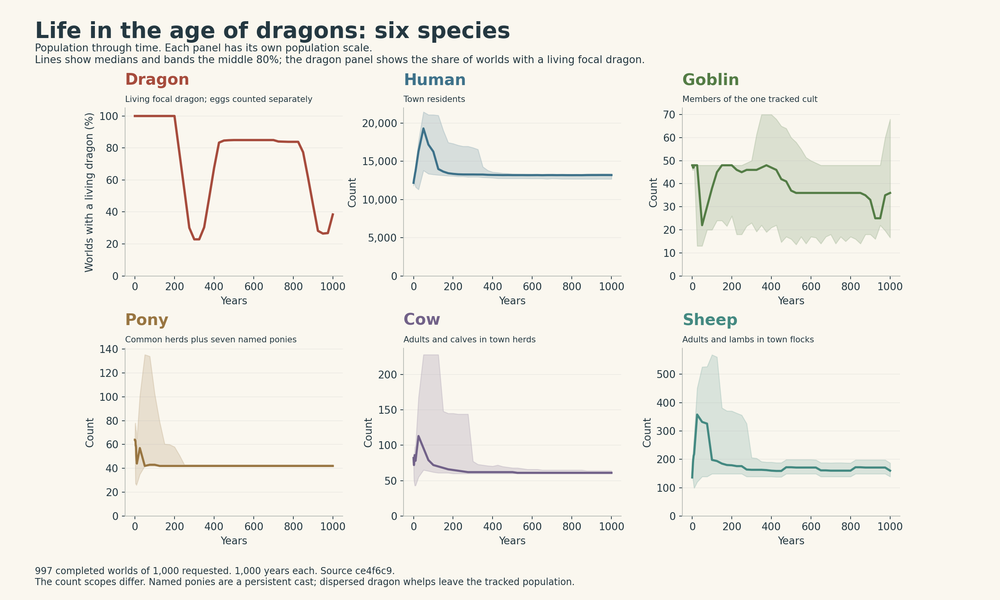
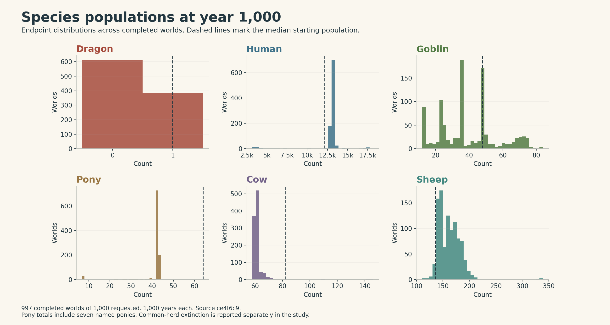
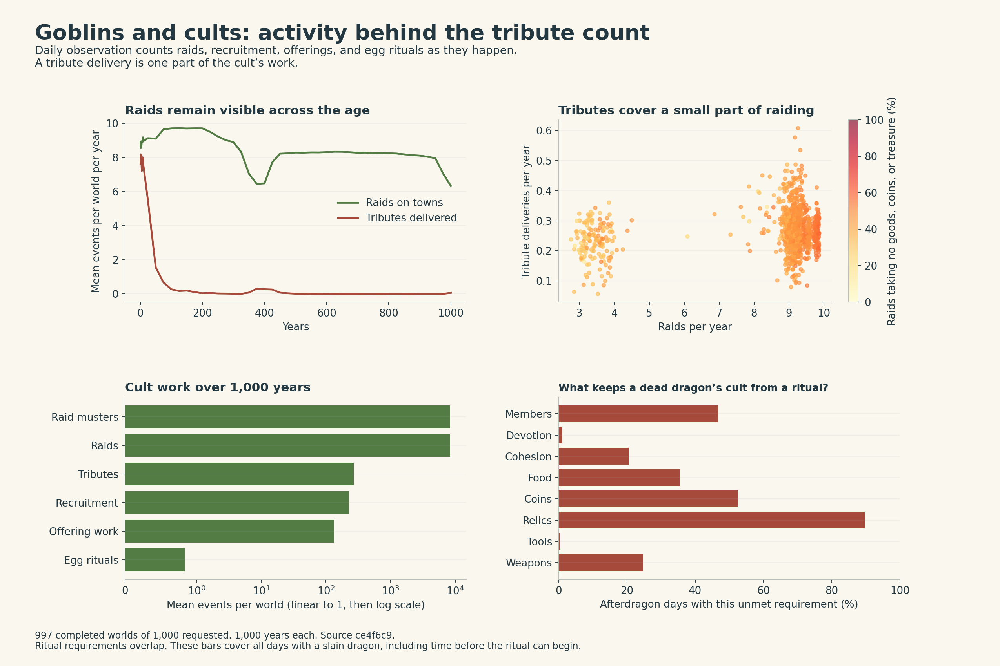

# Six species in the age of dragons

Goblins are busy. The existing tribute chart shows a narrow part of their work.
This fresh sweep observes **8,356,654 raids**, **227,815 recruitment
events**, and **829 dragon-egg rituals** across 997 completed worlds.
The same worlds produce 267,425 tribute deliveries: about
31.2 raids for every delivery.

The most striking weakness is the result of those raids. **46.5%
take no goods, coins, or named treasure.** The raid rules still reduce the town's
prosperity and security. This makes a large share of goblin activity repetitive
pressure on the town, even when the raid brings nothing home.

## Six species



| Species | Median at start | Median at year 1,000 | Endpoint range | What is counted |
| --- | ---: | ---: | --- | --- |
| Dragon | 1 | 0 | 0–1 | One focal dragon, excluding eggs |
| Human | 12,184 | 13,200 | 3,175–18,160 | Town residents |
| Goblin | 48 | 36 | 12–84 | Members of the single tracked cult |
| Pony | 64 | 42 | 7–44 | Common town herds plus seven named ponies |
| Cow | 82 | 61 | 58–146 | Town adults and calves |
| Sheep | 136 | 160 | 111–339 | Town adults and lambs |

At the endpoint, **383 of 997 worlds (38.4%) have a living focal dragon**.
Eggs and cumulative dispersed whelps have their own columns. Dispersed whelps
leave the tracked population, so the dragon curve describes the focal lineage.

**30 worlds lose every common pony.** Their total
still shows seven because the named pony cast persists. The human count uses town
residents; named people and other human groups have separate representations.
Adding all of those records together would need a clear rule for overlap.



## Goblins and cults



Across completed worlds, goblins spend **15.1% of days**
preparing or travelling on raids. Of these active days:

- 52.8% involve food raids.
- 25.4% involve equipment raids.
- 21.8% involve dragon tribute raids.

The observer also records 409,839 recruits across 227,815 rallies,
132,966 offering-work events, and 829 completed egg
rituals. **626 of 997 worlds (62.8%)
complete at least one egg ritual.** Offering-work events include both gathering
supplies and announcing public preparation; they count pieces of work.

On days when the dragon is slain, the ritual requirements most often unmet are
relics (89.6%), coins
(52.5%), and enough members
(46.7%). These conditions
can overlap. This denominator includes the waiting period before a ritual can
begin. It measures material readiness across the aftermath; a controlled
intervention would establish which resource changes the eventual outcome.

## What the rules explain

1. **The old display undercounts the range of goblin activity.** The faction chart
   in [plot_archetypes.py](../../../tools/plot_archetypes.py) uses tribute delivery
   and endpoint cohesion. Daily food raids, equipment raids, rallies, offering
   work, and egg rituals now have explicit columns and charts.
2. **The world tracks one goblin cult.** `CcSim` owns one `CcGoblinCult`.
   Ashkeepers are part of that dragon-cult system. The Crown, Guild, and Commons
   are the separate political faction kinds. Several independent cults, rival
   doctrines, and settlements would require a wider model.
3. **Goblin survival has a rule-imposed floor.** Hunger and combat losses usually
   stop at 12 members. Recruitment under a living dragon is checked every two
   years, requires supplies and cohesion, and adds one member. Afterdragon
   recruitment follows a separate annual rule. The cult spends
   6.5% of observed days at 12 members.
4. **Empty raids still damage towns.** `AdvanceGoblinTribute` removes two points
   of prosperity and security after calculating the haul. It also adds at least
   one hunger point when the chosen good is food, including a zero haul. The
   target score can still choose an empty town. This is a strong candidate for
   an experiment that links damage to actual violence or stolen supplies.
5. **Animal plateaus follow feeding and capacity rules.** Cattle use a capacity
   of `max(6, population / 50)`, common ponies `max(6, population / 80)`, and sheep
   `max(12, population / 20)`. Health, hunger, maturation, and slaughter rules add
   further limits. Those population-linked limits help explain the flat late
   curves. Seven named ponies remain separate from the common herds.
6. **Ritual time is deliberately long.** The aftermath must last at least 100
   years before a rumor can begin. Preparation adds a 20-year countdown, followed
   by the resource requirements and another 10–15 years for the brood. Cult work
   therefore spans generations even when the current chart has few tributes.

The source for these mechanisms is [cc_sim.c](../../../src/sim/cc_sim.c), especially
`PlanGoblinTribute`, `AdvanceGoblinTribute`, `AdvanceLivingDragonCult`,
`AdvanceAfterdragonCult`, and the herd update functions. These are code findings.
The percentages above are observations from the completed sweep.

My next slice would make a named raid or ash-vault project visible through a
warning, a destination, the supplies sought, and a player choice. I would also
compare current empty-raid damage with damage tied to the encounter's outcome.
This gives goblins a clearer place in play and tests the largest repeated effect
found here. The measurements establish a baseline for that comparison.

## Worlds to inspect

| Sweep ordinal | Raw world seed | Why it is useful |
| --- | --- | --- |
| 1 | 2654435769 | Two completed dragon-egg rituals. |
| 555 | 38069267 | 9,866 raids over 1,000 years. |
| 975 | 2504562583 | 5,590 raids bring back no goods, coins, or treasure. |

## Reproduction and evidence

The study runs main at `ce4f6c9`, schema 74, generator 25. The full source revision,
compiler, observer revision, and build settings are in [environment.json](environment.json).
The world receives no player actions. Observation leaves its state unchanged;
the test compares state hashes with the existing metrics runner.

```sh
cmake -S . -B out/species -DCC_BUILD_CLIENT=OFF -DCC_WARNINGS_AS_ERRORS=ON -DCMAKE_BUILD_TYPE=Release
cmake --build out/species --target crownless_species_metrics crownless_sim_metrics
python3 tools/species_sweep.py --binary out/species/crownless_species_metrics --source ce4f6c9 --output out/species-study --seeds 1000 --years 1000 --jobs 6
python3 tools/plot_species.py out/species-study
ctest --test-dir out/species -R species_sweep_integrity --output-on-failure
```

Population snapshots include year 0, years 1–10, every 25 years, and year 1,000.
Activity counters observe every day. Validation runs at startup and every year.
New events are collected after each daily step. The full-window saturation
counter is zero in all completed runs. Raid emptiness checks both event haul
and carried treasure. The published CSVs retain the underlying counts.

- [Endpoint data](endpoints.csv.gz)
- [Sampled history](history.csv.gz)
- [Partial history from failed worlds](partial-history.csv.gz)
- [Run manifest and data hashes](manifest.json)
- [Calculated summary](summary.json)

**997 of 1,000 worlds complete.** The charts use those completed worlds throughout,
including their starting populations. Three worlds fail annual validation:

| Ordinal | Failed year | Reported error |
| --- | ---: | --- |
| 353 | 81 | Settlement service state is invalid. |
| 426 | 209 | Active courier has no matching situation. |
| 828 | 73 | Settlement service state is invalid. |

Their valid earlier samples and exact errors remain in the artifacts. These
failures also appeared in the earlier Age of Dragons main study. The completed
worlds are a selected subset, which matters when reading the aggregate curves.

The strict Release build and four observer/integrity tests pass. Tests cover
state-hash parity, population scope, daily counter bounds, the sampling schedule,
input limits, and partial failure retention. All three final charts were visually reviewed. Static analysis passes with
one reviewed repository baseline item.
