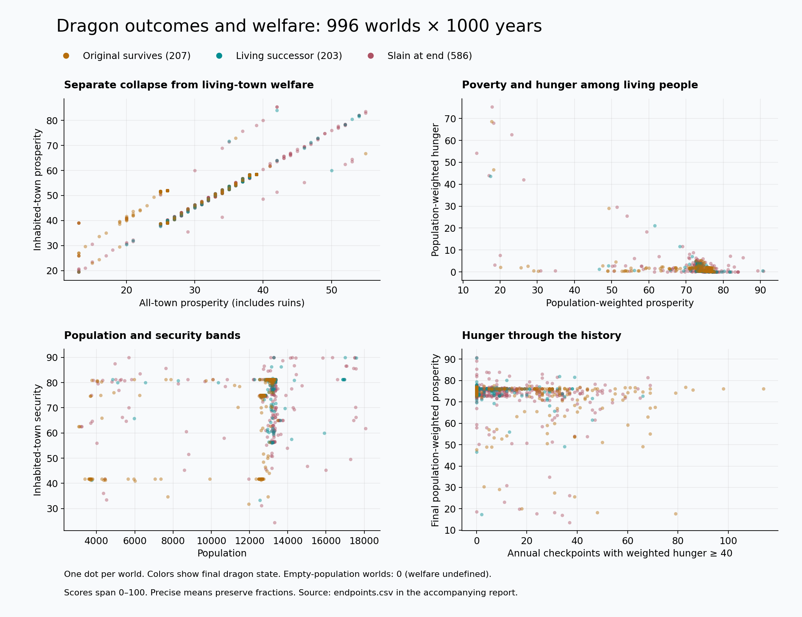
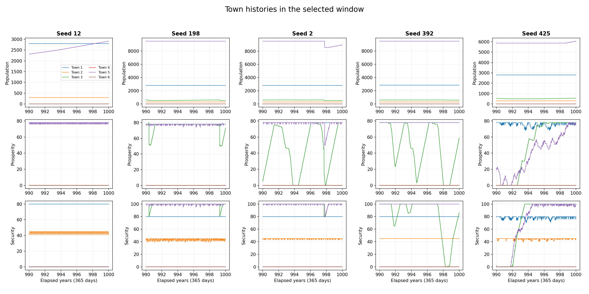

# Welfare clusters and town histories

The fresh sweep confirms both fixed bands and active recovery cycles. Splitting
ruins from living-town welfare changes the meaning of the poverty chart. Daily
histories then show which towns stay fixed and which move between the bands.

## Coverage

We requested metrics seeds 1–1,000 for 1,000 years each, using 365 days per year.
996 worlds completed. Four stopped at validation errors. The charts and group
tables describe the 996 completed worlds. Their 996,000 annual checkpoints
passed validation. The failures are retained in [sweep.log](sweep.log).

All four errors reproduce in the original main build at the same seed and year:

| Seed | Year | Validation error |
| --- | ---: | --- |
| 357 | 280 | Royal carriage state |
| 423 | 70 | Settlement service state |
| 806 | 125 | Settlement service state |
| 996 | 94 | Settlement service state |

[Baseline failures](baseline-failures.json) preserve the exact messages. The
main source used for this comparison is `1dda2ad`. The September 6 charts came
from an earlier simulation version, so differences between the two sweeps also
include intervening game changes.

## Welfare results



| Final dragon outcome | Worlds | Mean ruined towns | Inhabited prosperity | Population-weighted prosperity | Population-weighted hunger |
| --- | ---: | ---: | ---: | ---: | ---: |
| Original survives | 207 | 2.49 | 50.20 | 71.19 | 1.82 |
| Living successor | 203 | 2.06 | 53.28 | 74.70 | 1.27 |
| Slain at end | 586 | 2.07 | 51.86 | 73.72 | 1.82 |

Original-dragon worlds lose more towns. Surviving populations have low mean
hunger in all three groups. Their mean annual checkpoints with weighted hunger
at least 40 are 22.23, 6.09, and 9.35 respectively. Those are counts of annual
observations, with the full history in the denominator. They describe different
past exposure even when final hunger is similar.

Town-weighted and population-weighted prosperity answer different questions.
A small poor town counts equally with a large capital in the first measure.
The second describes the distribution of people. Both belong beside the ruin
count. These are associations across worlds grouped by their final dragon state.

The diagonal lines in the upper-left chart are expected arithmetic: all-town
prosperity and inhabited prosperity share a numerator when ruins have zero
prosperity. Their ratio depends on the number of living towns. This panel makes
that reporting effect visible.

## What produces the remaining bands?



The five selected worlds have full annual records through year 1,000 and daily
town records for years 990–1,000. All five final rows match the corresponding
sweep endpoints, including their full state hashes. Selection uses group
medians and modal values, with the rule implemented in
[plot_welfare.py](../../../tools/plot_welfare.py). See
[selected-seeds.json](selected-seeds.json) for the chosen cases.

The lines show both stable towns and short or multi-year cycles:

- In seed 2, Thornford remains at prosperity 78 and security 80 throughout the
  recorded decade. Alderwatch moves between prosperity 0 and 78, and Rosespire
  falls from its usual high prosperity before recovering.
- In seed 392, Alderwatch moves through prosperity 0–78 and security 0–100.
  A final-year dot captures one phase of that history.
- Gloamgate has exactly 296 people and prosperity 0 throughout the decade in
  all five selected worlds. Its hunger stays between 18 and 25 across those
  records. This is a strong example of a poor town persisting in the population
  rule's broad stable range.
- Security 81.25 occurs in 491 of 996 endpoints. Seed 2 shows its exact town
  composition: `(80 + 45 + 100 + 100) / 4`. Its all-town average truncates to 54.
- Inhabited prosperity 58.5 occurs in 206 endpoints. Seed 2 again shows the
  composition: `(78 + 0 + 78 + 78) / 4`. Its all-town average is 39.

The trace tables retain each town's range and final value in
[trace-summary.md](trace-summary.md). Town order in the chart is Thornford,
Gloamgate, Alderwatch, Silverwick, Rosespire, and Hollowbarrow.

## Rule review and next balance experiments

The present rules in [cc_sim.c](../../../src/sim/cc_sim.c) explain these patterns:

| Rule | Evidence and decision |
| --- | --- |
| Prosperity recovery targets 45 and 78 | The traces show both long residence at 78 and recovery toward it. Test a target based on food cover and working services in a paired treatment. Measure recovery time and time at the target. |
| Security recovery targets 45 and 80, plus barracks increments | The 81.25 band is a repeated town composition. Test local threat and service capacity as drivers of recovery, and measure time spent at 45, 80, and 100. |
| Population grows above 70 prosperity with hunger below 15; it shrinks above 65 hunger | Gloamgate stays poor at 296 people despite moderate hunger. This is the first suggested dynamics experiment: gradual growth or decline based on food and services across the middle range. Compare small-town survival, migration if introduced, and kingdom population. |
| Population capacity comes from town size and function | Thornford repeatedly stays near 2,800 and Rosespire near 9,500. Keep a capacity constraint, then test how housing and supplies could change it over time. |
| Legitimacy recovery stops at 75; faction pressure acts around 20 | These are shared rule thresholds. A later treatment can tie recovery to local services and needs. The current daily trace includes kingdom legitimacy for that review. |
| Gold moves among holders | Retain the accounting. Measure the dragon's share of tracked crowns when comparing worlds. |
| Inequality includes prosperity and hunger in its formula | Treat it as a derived score when plotting those same inputs. Use direct holdings and needs for a separate inequality study. |

This PR supplies the corrected measurement baseline and the tools for those
paired experiments. The daily histories support targeted changes: stable poor
towns, fixed recovery targets, and effective capacity. They also show active
cycles that should remain visible during balance work. A paired experiment
should use identical seeds and record both benefits and costs before selecting
new recovery constants.

## Reproduce and verify

The measurement code was built at `6c8a144`; the bounded trace and plotting tools
were built at `3cfac4e`. [manifest.json](manifest.json) records source and binary
hashes. The added snapshot is read-only. The final 1,000-year row of seed 1
matches all 121 existing fields from the original main binary. Tests reconcile
precise means with raw towns and check trace-on/trace-off state hashes, empty
populations, large population sums, and sample boundaries.

```sh
cmake -S . -B out/build/welfare -DCMAKE_BUILD_TYPE=Release \
  -DCC_BUILD_CLIENT=OFF -DCC_BUILD_BENCHMARKS=ON -DBUILD_TESTING=ON \
  -DCC_ENABLE_STRICT_WARNINGS=ON -DCC_WARNINGS_AS_ERRORS=ON
cmake --build out/build/welfare -j 6
python3 tools/sim_sweep.py --binary out/build/welfare/crownless_sim_metrics \
  --seeds 1000 --years 1000 --jobs 8 \
  --output docs/experiments/welfare-clusters-2026-09-08/endpoints.csv
python3 tools/plot_welfare.py docs/experiments/welfare-clusters-2026-09-08/endpoints.csv \
  --out docs/experiments/welfare-clusters-2026-09-08
```

The recorded sweep exits with status 1 for the four retained failures. Each
selected-world command is saved in [trace-runs.json](trace-runs.json). Annual
rows and daily traces are stored as compressed CSVs in [traces](traces).
The plotter reads both plain and compressed settlement traces:

```sh
python3 tools/plot_welfare.py docs/experiments/welfare-clusters-2026-09-08/endpoints.csv \
  --out docs/experiments/welfare-clusters-2026-09-08 \
  --traces docs/experiments/welfare-clusters-2026-09-08/traces
```

Local validation passed the complete 89-test suite, the new plot-input test,
the final focused report tests, undefined-behavior checks for welfare and trace
tests, and static analysis. The local HTTP test passed with loopback access.
