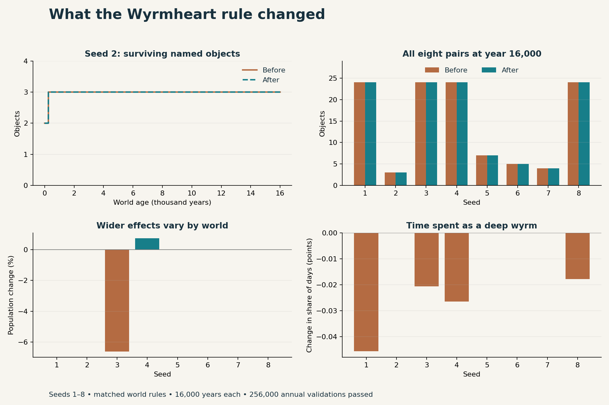
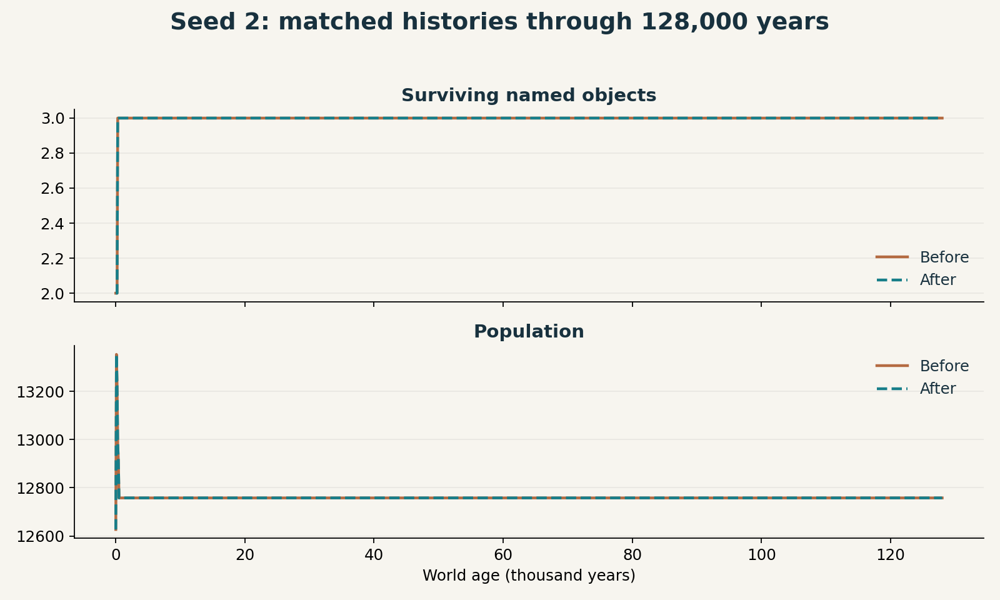

# Wyrmheart rule: matched simulation comparison

The eight matched 16,000-year histories retain the same treasure counts and values. Four worlds develop different dragon and faction histories. Population changes are small on average, while some activity counters move sharply.



## What changed at year 16,000

| Measure, mean across eight seeds | Before | After | Change |
|---|---:|---:|---:|
| Live named treasures | 14.375 | 14.375 | 0 |
| Appraised treasure value | 17,034.75 | 17,034.75 | 0 |
| Population | 12,722.625 | 12,672.5 | −0.39% |
| Average hunger score | 9.25 | 7.875 | −1.375 points |
| Average prosperity score | 28.5 | 28.125 | −0.375 points |
| Lifetime dragon hunts | 3,825.875 | 5,033.5 | +31.56% |
| Lifetime dragon broods | 31.625 | 29.875 | −5.53% |

All eight pairs also have the same final active-settlement count, closed-route count, and stored lore. Every annual output row matches in seeds 2, 5, 6, and 7 through year 16,000. The first different annual rows occur in seed 1 at year 7,915, seed 3 at year 9,422, seed 4 at year 7,890, and seed 8 at year 7,940.

The changed worlds all hold 24 live treasures at those first different checkpoints. The updated rule requires a slot for the first Wyrmheart as well as possession of the existing heart for recovery. The 24-slot cap can therefore delay a first deep-wyrm transformation. This is a direct consequence of requiring the heart to exist.

Seed 4 accounts for most of the increase in hunts: 6,456 becomes 15,412. Its dragon is alive at the final checkpoint with the fix, and slain at that checkpoint in the control. Its population changes from 12,600 to 12,692. Seed 3 accounts for the larger population change, from 7,444 to 6,951 (−6.62%). These are outcomes of individual histories; the direction of a group average is a limited guide to campaign quality.

## Seed 2 through 128,000 years

**Every exported annual field matches in all 128,000 rows.** Both runs end with three treasures worth 1,566 crowns, population 12,758, 9,645 dragon hunts, and 528 broods. The dragon spends zero days uncrowned in both runs. Its existing heart stays sufficient for its continuing deep-wyrm life, so the recovery rule has no measured effect in this history.



Both longer runs pass all annual validations. Their first 16,000 years also match their shorter runs byte for byte after decompression. Together with the eight matched pairs, this study contains 512,000 successful annual validations, including those repeated prefixes. The complete older 32-seed long sweep remains a separate study on its earlier rules.

## Why the earlier seed 2 numbers differ

The original 128,000-year investigation used simulation revision `06e5701`. The recovery fix was built on the later main revision `5f13096`, which includes other world-rule changes. At year 16,000, seed 2 has three treasures worth 1,566 crowns both before and after this fix. Every exported annual field agrees through that age.

The earlier five-to-three treasure difference belongs to the change in baseline rules. The matched comparison isolates the Wyrmheart fix. Other intervening changes already gave seed 2 a steadier history before this fix. Identifying which of those changes caused that shift would require a separate comparison.

## Campaign opinion

The rule gives the Wyrmheart a clear role as an object the dragon must possess. That makes stealing and recovering it meaningful. The focused regression tests establish that repeated recovery reuses the original object.

The comparison also makes the global treasure cap more important. I would address treasure capacity next, so space for a new dragon's first heart reflects the world design. For choosing a campaign start, distinct objects, useful locations, and fresh reports remain better guides than a growing total value alone.

## Method and checks

- Control: `5f13096`, built in Release mode with the original simulation tool.
- Treatment: `7bccd65`, the Wyrmheart fix with first formation kept in the original event and identity order.
- Seeds 1–8, each run for 16,000 years on both versions. Both sides start from a fresh world with the same seed.
- Every day advances normally. The simulation validates once per year. Every annual output row is retained in compressed form.
- All 16 runs finish successfully: 256,000 annual validations. The analysis checks lengths, exit results, empty error logs, and file hashes.
- Only the Wyrmheart rule, its saved identity, and the associated schema support differ between the compared game revisions.

The first-formation order was tightened during comparison preparation. The initial exploratory batch was interrupted. The results here come from the completed batch with the refinement on every treatment run.

`run.py` records commands, binary hashes, result hashes, elapsed times, and endpoints in `manifest.json`. `analyze.py` checks the runs, records per-seed differences in `summary.json`, and draws the chart. To rerun, build `crownless_sim_metrics` from the two revisions, update the two binary paths in `run.py`, then run:

```sh
python3 run.py
python3 analyze.py
python3 run.py --long-seed2
python3 analyze_long.py
```

Matplotlib and NumPy are required for the charts. The eight-seed results describe this sample and these horizons. `long-manifest.json` and `long-summary.json` record the 128,000-year pair; `analyze_long.py` checks every exported annual field and draws its chart.
