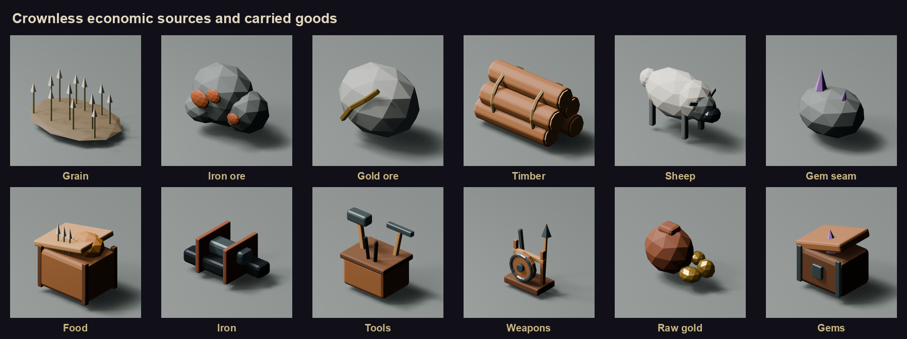

# Economic visual language

This design gives each economic value one clear shape across the world, cargo,
markets, and the fixed-pixel interface.

The production models use the same source and cargo order as the simulation.

The top row shows production sources. The bottom row shows goods that can be
carried and traded.

The icons use the same shapes as the 3D goods. This lets a player connect a
mine, a market stall, a carriage load, and a ledger entry at a glance.

## Current goods

`CcGood` has six goods. Each good gets one main cargo shape.

| Good | UI shape | 3D cargo prop | Main colors |
| --- | --- | --- | --- |
| Food | open crate, loaf, wheat | lidded provision crate | crop, parchment, wood |
| Iron | three strapped bars | iron ingot bundle | metal, leather |
| Tools | hammer, tongs, pick | tool basket or low tool crate | metal, wood |
| Weapons | shield, sword, spear | short weapon rack | metal, wood, danger accent |
| Raw Gold | pouch and rough nuggets | sealed raw-gold pouch | gold, leather |
| Gems | casket with one crystal | reinforced gem casket | violet, metal, wood |

Food uses the crate as its main shape. The loaf and wheat act as small detail.
Iron uses flat bars. Tools use several short handles. Weapons use one tall
spear and a round shield. Raw gold uses irregular nuggets. Gems use one sharp
violet crystal. These shapes stay distinct when color is reduced.

## Production sources

Wood, sheep, ore, and crops make the economy visible before goods reach a
market. They are place props and state dressing.

| Source | 3D form | Economic meaning |
| --- | --- | --- |
| Grain | short crop patch with a tied sheaf | food production |
| Iron ore | tall dark rock with broad rust-red faces | iron extraction |
| Gold ore | lower grey rock with one warm gold seam | gold extraction |
| Timber | five split logs tied with rope | building and tool supply |
| Sheep | compact pale body with a dark face and legs | food and wool supply |
| Gem seam | dark rock with two modest violet crystals | gem extraction |

This layer can grow later. A traded wood or wool good would add a saved
`CcGood` value, a cargo prop, and an icon as one schema change.

## 3D rules

- Use low-poly geometry with broad faceted planes.
- Use one metre as one world metre.
- Use three values for each material: shadow, base, and light.
- Keep each prop clear from the normal three-quarter camera.
- Give each source one tall or sharp feature that reads above grass and market
  clutter.
- Give each cargo good a stable container or binding. Quantity stays in the UI.
- Place one representative cargo prop on the carriage rack for each loaded
  good.
- Use the same prop in a market, on a carriage, and in an icon render.

Suggested footprints:

| Prop | Approximate size in metres |
| --- | --- |
| Grain patch | 2.2 x 1.6 x 1.1 |
| Iron or gold vein | 1.5 x 1.1 x 1.4 |
| Timber bundle | 1.6 x 1.0 x 0.8 |
| Sheep | 1.3 x 0.6 x 0.9 |
| Gem seam | 1.2 x 1.0 x 1.2 |
| Food crate | 0.85 x 0.65 x 0.65 |
| Ingot bundle | 0.75 x 0.55 x 0.42 |
| Tool basket | 0.65 x 0.55 x 0.75 |
| Weapon rack | 1.0 x 0.55 x 1.25 |
| Coin purse | 0.35 x 0.28 x 0.32 |
| Gem casket | 0.65 x 0.48 x 0.48 |

## Icon rules

- Build each master icon on a 32 by 32 pixel grid.
- Keep two clear pixels around the main shape.
- Use a dark outline and a small ground shadow.
- Use the same upper-left light direction for every icon.
- Use at most three values per material plus one teal edge light.
- Test each icon at 24 and 32 pixels.
- Let the existing UI panel supply the background and selection state.
- Use a number for quantity. Keep the resource picture unchanged.

The main palette comes from `src/client/cc_visual_style.h`:

| Use | Color |
| --- | --- |
| Background | `#111019` |
| Panel | `#1c1518` |
| Parchment | `#c9b684` |
| Wood | `#58352a` |
| Iron | `#68727d` |
| Gold | `#d8ad53` |
| Gems | `#a684ad` |
| Danger accent | `#8b373e` |

## World state

Markets and production sites show supply through three simple states.

| State | World treatment |
| --- | --- |
| Scarce | one open space, one empty container, one small remaining prop |
| Normal | one complete prop cluster |
| Surplus | one complete cluster plus a smaller second cluster |

The shape remains stable in every state. This keeps the economy readable while
the amount changes.

## Asset handoff

The production pass adds these props to the generated general asset library.
Each prop uses a stable `economy_source_*_v01` or `economy_cargo_*_v01` ID.
`assets/asset_manifest.json` maps each `CcGood` value to its cargo asset and
icon frame. The icon atlas comes from an orthographic render of the same cargo
models, followed by a fixed 32-pixel reduction.

The client draws one model for every good present on the carriage rack. The
cargo screen draws the matching atlas frame beside its quantity. Desktop and
web packages carry the six cargo models and the atlas.

The concept boards set shape, material, camera, and light direction. The
production board shows the generated Blender assets used by the game.
