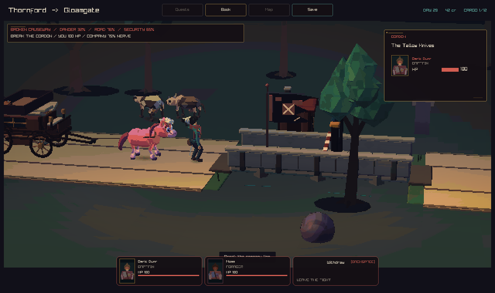
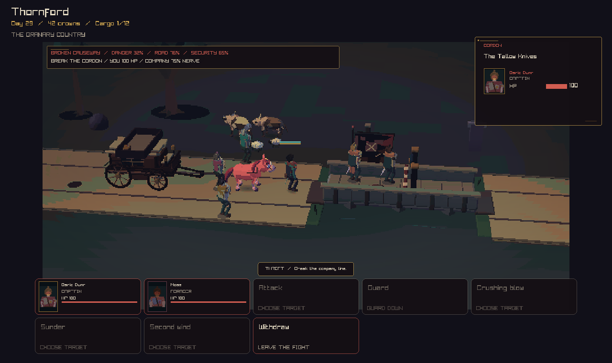
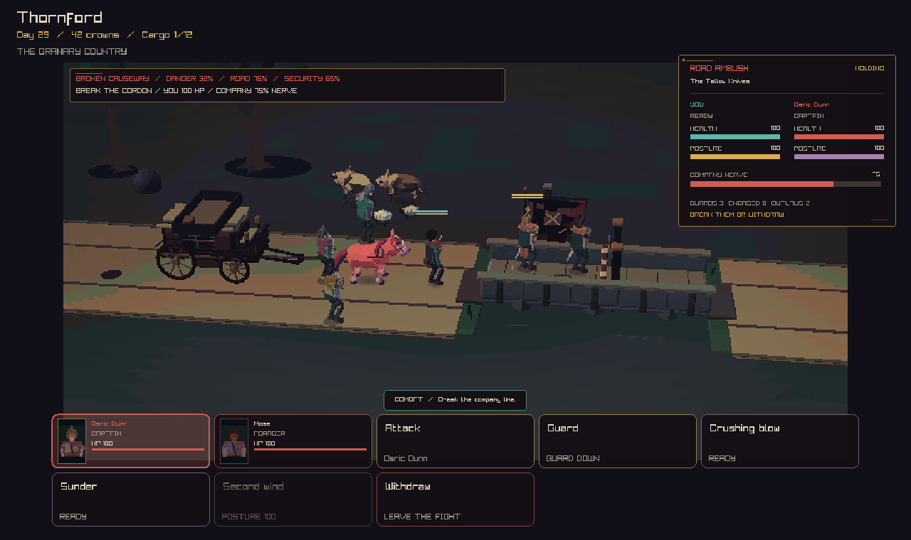
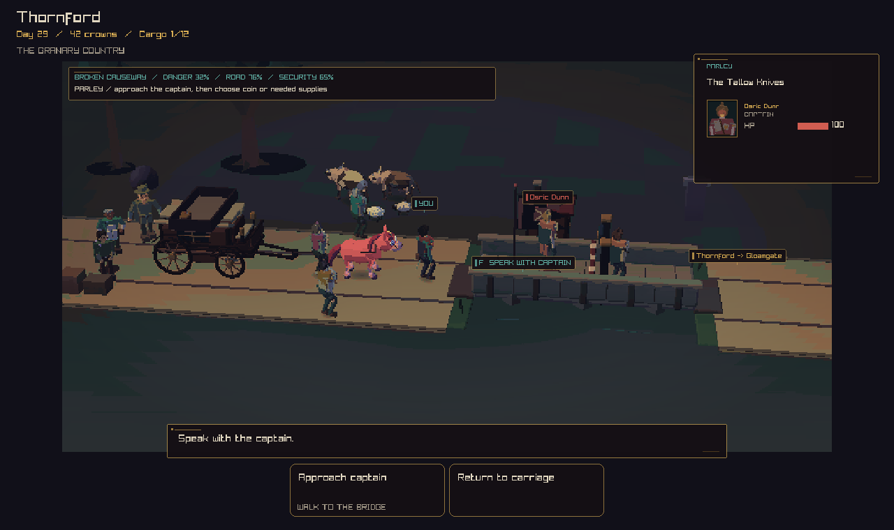

# Bridge encounter review

The carriage now parks at x=38.35, with its horse team behind the hero at the west approach. The two bandits start on the bridge deck within target range. Every guard and bandit stays visible. The camera keeps a steady view of the crossing during target selection.

Combat actions keep fixed slots when a target is selected or falls. Screens at least 900 pixels wide show all eight actions in two rows. Smaller screens use the existing card pages. Disabled targets show their state, skills show their queue or cooldown, and feedback sits above the controls. Parley offers an Approach captain button that walks to speaking distance.

## Images

The baseline used the old capture interface. The new captures use the normal play interface.

| Before | Ready to fight |
| --- | --- |
|  |  |

| Target selected | Parley |
| --- | --- |
|  |  |

## Checks

- Strict native build passed.
- All 97 local tests passed. The final parley change also passed the five affected input, movement, and session tests.
- The new `bridge_scene_input` test clicks the rendered card rectangles through the real input handler. It checks both targets, Attack, Guard, both attack skills, Second wind, cooldown, fixed card positions after defeat, Approach captain, Return to carriage, and Withdraw.
- Existing movement tests cover bridge support, collision, combat, retreat, and the parley route.

Capture commands, run from the source directory after a play build:

```sh
./out/build/play/crownless_carriage.app/Contents/MacOS/crownless_carriage --capture-road docs/review/bridge-scene/ready.png
./out/build/play/crownless_carriage.app/Contents/MacOS/crownless_carriage --capture-road docs/review/bridge-scene/target-selected.png focused
./out/build/play/crownless_carriage.app/Contents/MacOS/crownless_carriage --capture-parley docs/review/bridge-scene/parley.png
```
