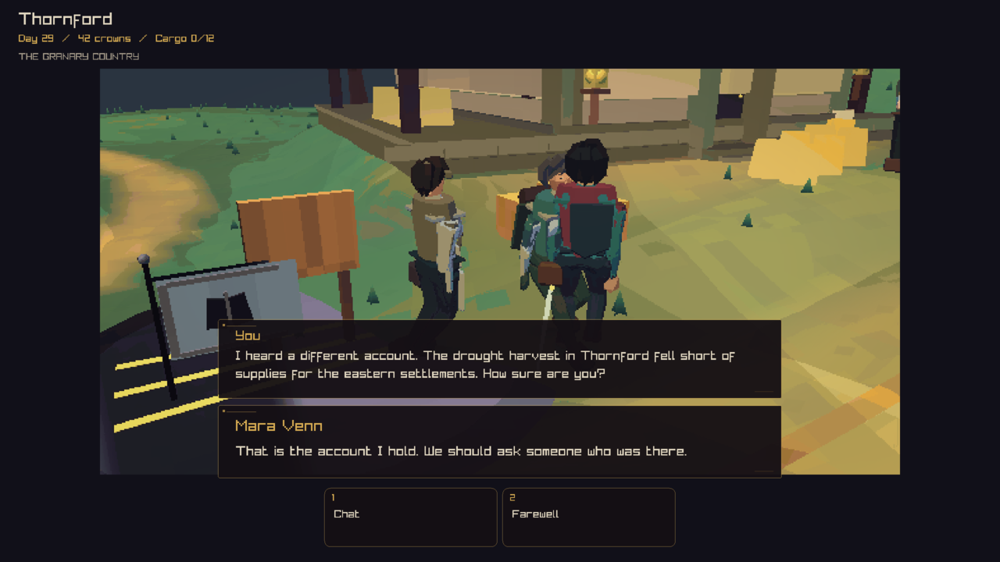

# Model chat in the game

Ordinary conversations offer Chat and Farewell. Chat exchanges held news through the existing simulation command. The 4,935,937-parameter core generates the player line from the player account, appends that exact sentence to spoken history, and generates the NPC reply from the NPC account. Both lines retain their speaker and source event identities.

The player line stays on screen for a reading interval while the NPC reply is prepared. The finished screen keeps the player line above the NPC reply. Repeated Chat input during a turn preserves the current round. Farewell clears local conversation history and unfinished generation.



Reproduce the screen from a native client build:

```sh
crownless_carriage --capture-ux 14 chat.png 1280 0
```

The fixture runs the real simulation, exchanges local news, and calls the same model service as the game. The real keyboard regression also drives Chat and Farewell through the campaign journal. Its output is:

> You: That's what I heard too. How sure are you?
>
> Mara Venn: That is the account I hold. We should ask someone who was there.

The model fixture checks 133 complete outputs and 302 tokenizer inputs against ZERO. The conversation test independently regenerates the NPC reply using the saved player sentence to verify the handoff. Tests also check redraw stability, repeated input, cancellation, bounded history, model integrity, and preservation of the simulation after the news exchange.

The strict full native suite passed all 183 tests. Static analysis passed with the existing reviewed baseline. The browser build packages the 5,044,766-byte model separately; its startup data pack is 5,872,138 bytes, within the existing 10 MiB limit. The browser fetches the model before play, then generates locally.
