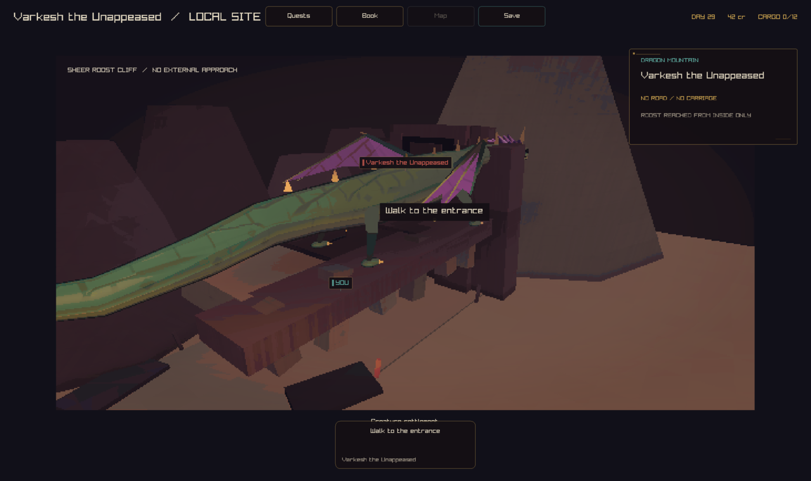
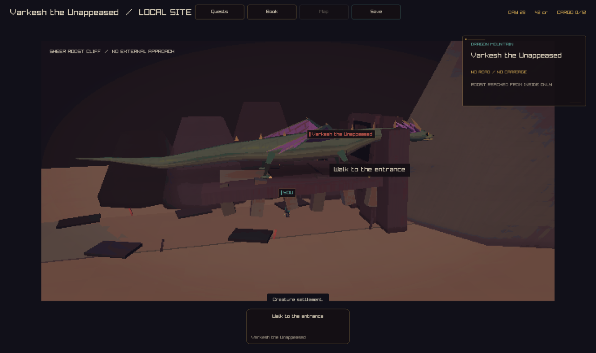
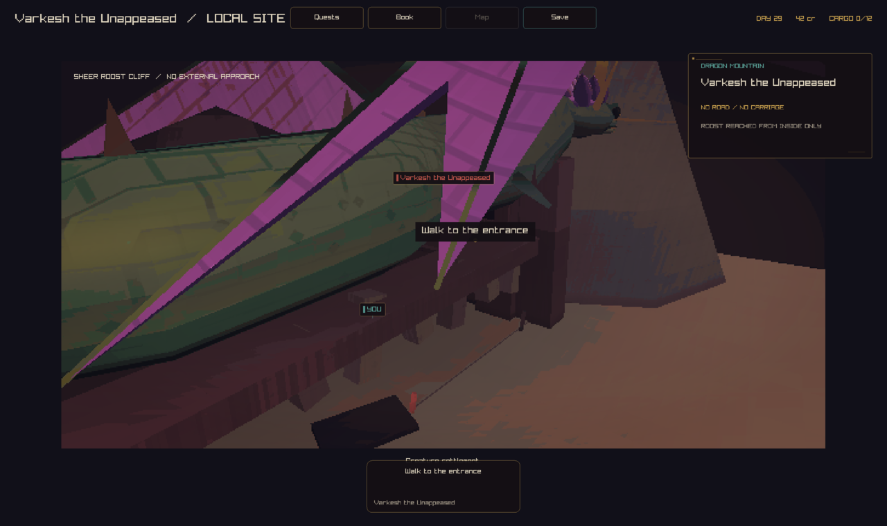
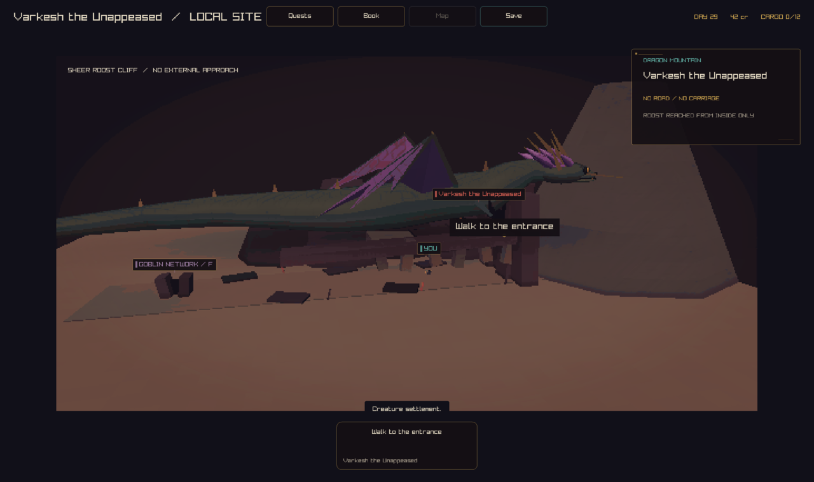
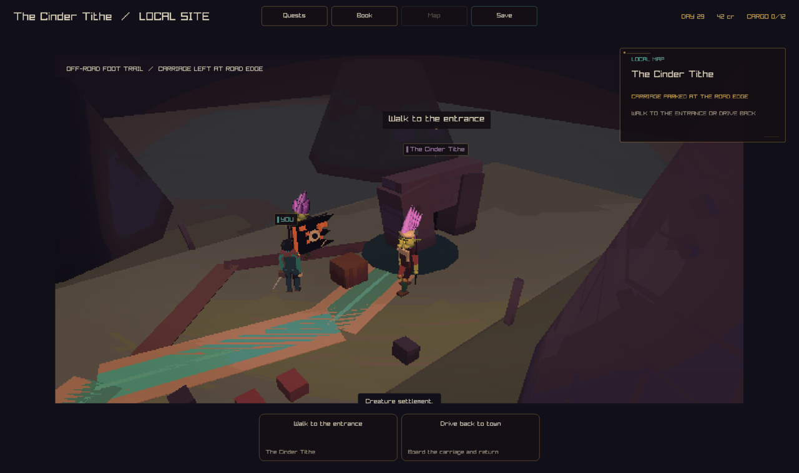

# Creature site framing

Captured with `--capture-creatures <family> <png>` on the play build.

## Crowned dragon (`dragon`)

Before, the body crossed the whole frame, the camera sat against the model,
and the "YOU" label pointed at nothing. After, the camera frames the point
between the hero and the dragon's perch, and pulls back for bigger stages.
It keeps the low eye line from `docs/design/ground-level-towns.md`, so it
retreats instead of craning down.

## Deep wyrm (`dragon-deep-wyrm`)

## Goblin site (`goblins`)

The site reused the roadside forest, which was built for the tall travel
camera. From the low site camera those trees became trunks against the lens.
The stationary site camera now skips the roadside forest.

## Also checked, not stored

`dragon-whelp`, `dragon-wanderer` and `animals` were captured and looked at.
They are left out to stay under the research-artifact budget. The hero is now
visible at every dragon stage. Follow-up: the whelp is still very small in the
frame (it was before as well), and it needs a tighter framing of its own.

## Checks

`TestDragonRoostCameraFraming` (tests/site_creature_camera_tests.inc) samples
every dragon stage along the hero's approach. It requires a perspective lens,
the hero and the dragon both beyond the near plane, and both projected inside
the art target.
