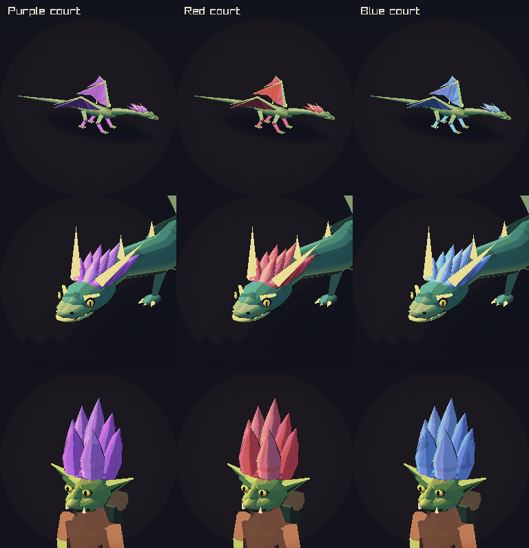
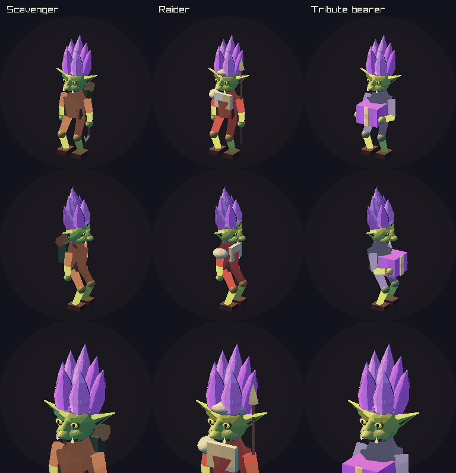
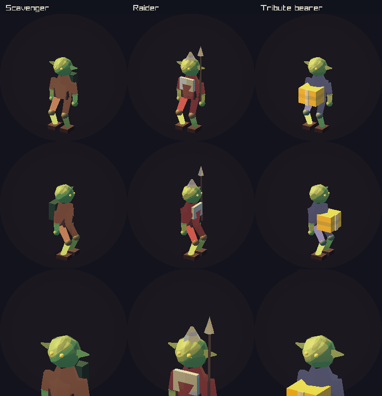
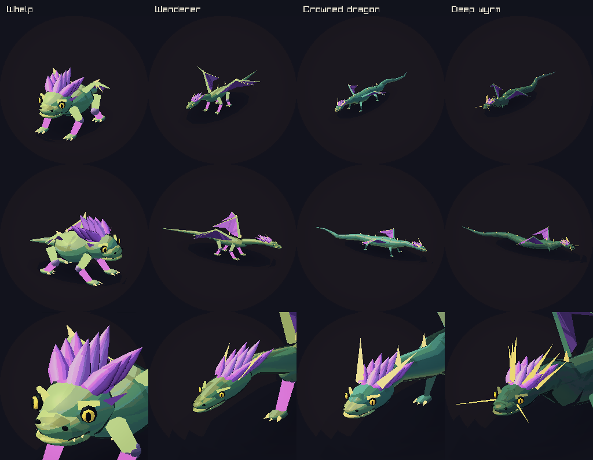
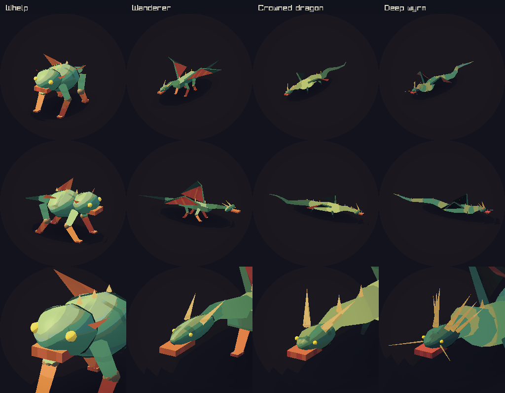

# Dragon courts and goblins

The dragon and its goblins share a court colour. It appears in the dragon's swept mane and wing membranes, and in goblin hair, scarves, spear pennants, and tribute boxes. The first court is purple. Red and blue are available for future courts.



The current world tracks one dragon and its goblin court. Live encounters read the colour from that dragon. The study above shows three colour options through the same game renderer. Each column shows a wanderer's wings, a crowned dragon's face, and a scavenger's face.

## Goblins

All three roles have tall, bright hair inspired by Trolls toys. Wider ears, brows, pupils, a hooked nose, and small tusks make their faces clearer. The scavenger has a pack and hooked tool. The raider has armour and a spear. The tribute bearer holds its box in both hands.





## Dragons

The whelp has a round face and a lower body. Older dragons have long jaws, slit pupils, and horns. Joined surfaces follow the neck and tail bends. The wings have ribs and scalloped edges. Paws and claws give the walking stages clearer feet.





Each sheet shows two full views and a face view. Each life stage is framed on its own so its details fit the card. The game's growth scales still set encounter size.

## Findings and fixes

| Finding | Change |
| --- | --- |
| Creature identity relied on clothing and broad body shape. | Shared court colours, goblin hair, and dragon manes add a clear family trait. |
| Eyes were small gold spheres and dragon jaws were boxes. | Shaped muzzles, jaws, brows, pupils, nostrils, mouths, and teeth give faces more expression. |
| Head and body ellipsoids kept their world orientation through turns. | The ellipsoids now rotate with the creature. A rendered silhouette test checks this. |
| Separate neck and tail cylinders produced abrupt joins and uneven light. | Shared rings form continuous surfaces with vertex normals. |
| Goblin tools and tribute boxes needed closer hand contact. | Tools follow the hand, and the bearer uses a carrying pose. |

Live goblins and dragons use procedural geometry in the C renderer. This pass updates that path. The exported creature library is also checked as part of asset validation.

## Saved court colour

The colour belongs to `CcDragon.hair_color`. Every live goblin draw uses its court dragon's colour. A successor keeps the court colour. Save schema 43 and SQLite format 27 store the trait. Older saves receive purple. Tests cover red and blue save round trips, the older table layout, colour bounds, state hashes, and succession.

## Validation

The client build, all 76 local tests, the native graphics checks, and both asset checks passed. Live captures cover the [goblin site](goblin-site.png) and [dragon roost](dragon-site.png).

The matched before images use the procedural renderer from `98728f6`. Both versions use the same cameras and clear market light. The after images use the new renderer and the merged pony improvements.

```sh
cmake --build --preset play
ctest --preset play --parallel 4
make art-assets-check blender-creature-assets-check
out/build/play/renderer_regression_tests --graphics out/creature-review/renderer.png
out/build/play/renderer_regression_tests --creature-captures out/creature-review/after
```

The native graphics checks cover all seven creatures through four moving turns, visible court hair at small sizes, three court colours across every role and life stage, and body rotation. The standard graphics check runs these checks in CI too.

Encounter camera framing remains tracked in [graphics issue #322](https://github.com/atimics/crownlesscarriage/issues/322).
