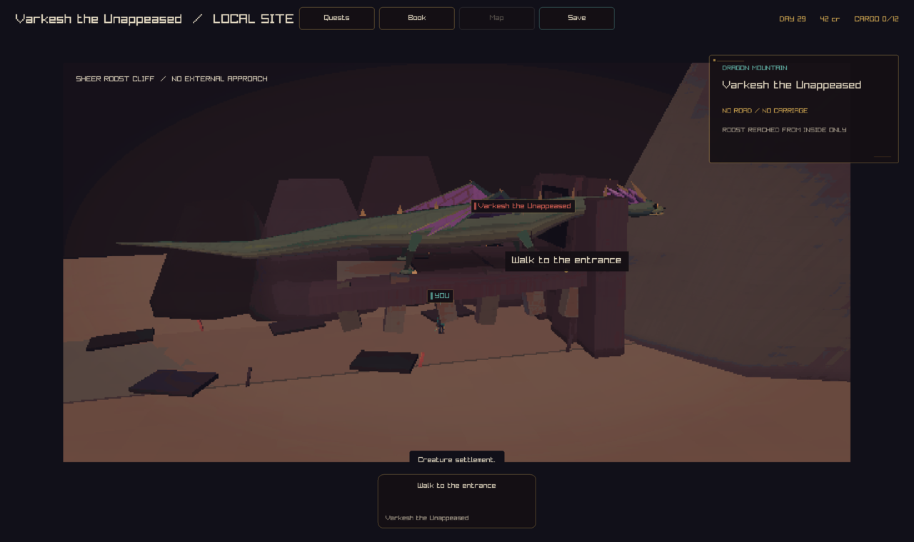
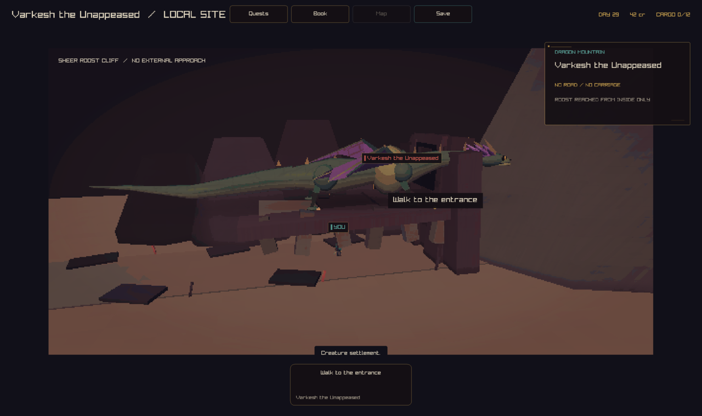
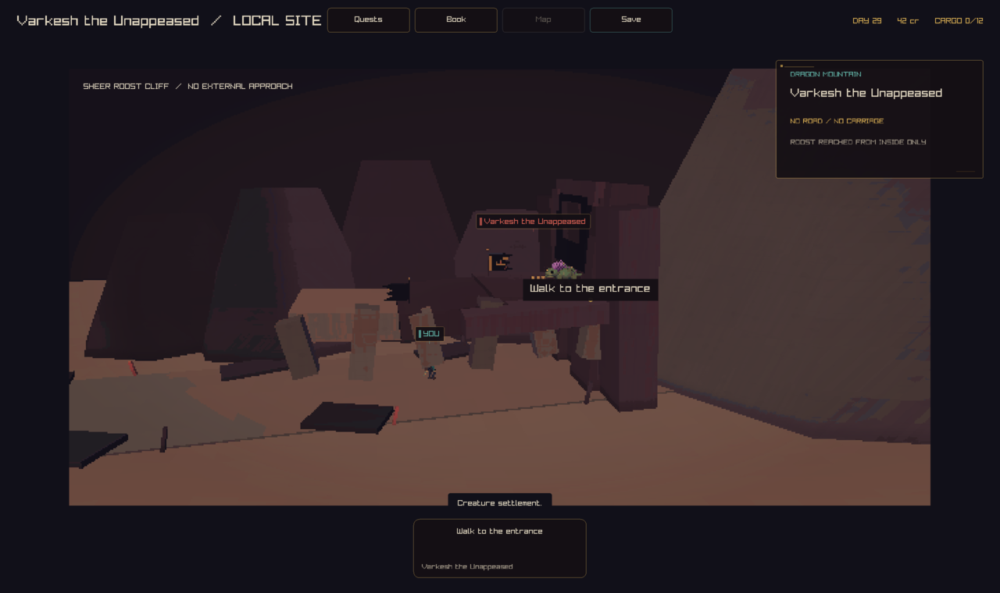
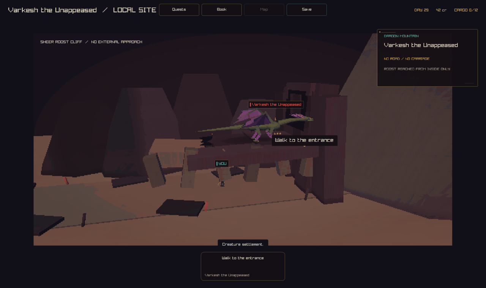
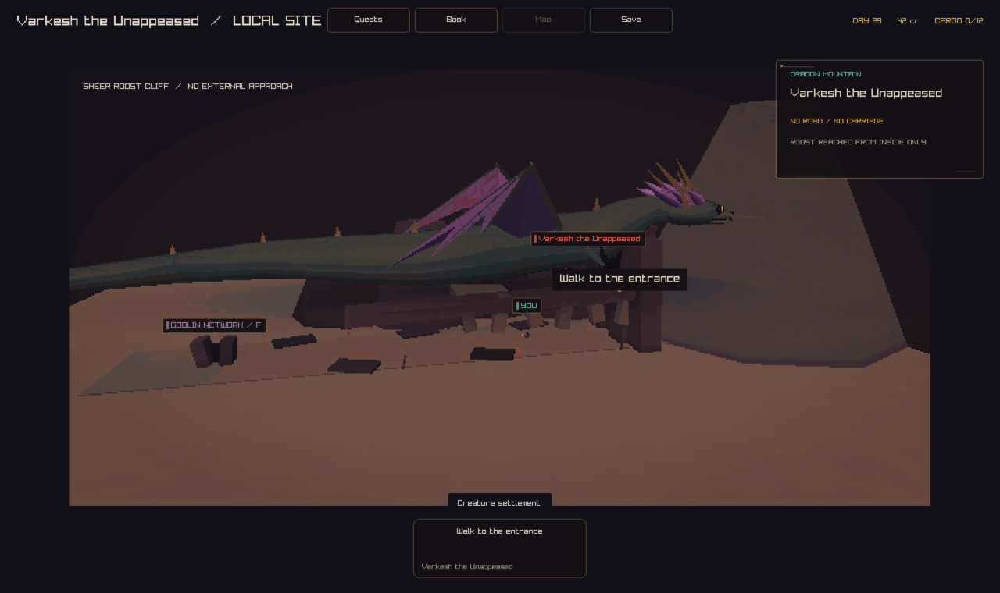

# Dragon mass and silhouette

Captured with `--capture-creatures <family> <png>` on the play build, from
the dragon-roost site scene (`DrawDragonCliffRoost`). "Before" is the
untouched `main` build; "after" is this branch.

## What changed

Dragons are held-pose GLBs authored by
`tools/blender/build_creature_library.py`, but the live game does not draw
that mesh: `DrawCreatureGait3D` only loads a GLB for the `skinned` gait
contract (horse, cow, sheep). Dragons use `gait_contract = "dragon_authored"`
with `skinned = false`, so they draw through a separate hand-written
procedural rig, `DrawDragonRig` (and its helpers `DrawDragonWing`,
`DrawDragonFace`, `DrawCreatureTube`, `DrawCreatureEllipsoid` in
`src/client/local3d/creature_detail.inc` /
`src/client/local3d/asset_loading.inc`). That is what
`--capture-creatures` actually renders, so this pass edits both:

- `tools/blender/build_creature_library.py`: the authored GLB pipeline
  (manifest, validator, catalog), for consistency and any future/offline
  use of the exported meshes.
- `src/client/local3d/creature_detail.inc` and
  `src/client/local3d/asset_loading.inc`: the live procedural rig that the
  captures below actually show.

Per stage:

- **Mass hierarchy.** Added explicit chest/shoulder and haunch masses
  (`DrawCreatureEllipsoid` bulges beyond the body tube) for every stage,
  and gave the crowned dragon's torso a real chest -> waist -> haunch
  radius profile (`0.76, 0.50, 0.68, 0.42`) instead of the old
  near-uniform `0.64, 0.68, 0.58, 0.46`. The wanderer's single 1.44-long
  body ellipsoid (the clearest "tube") is now three pieces: chest, a
  cinched waist, and a haunch. The deep wyrm gets an explicit chest bulge
  behind its neck so it still reads as having a chest despite being
  serpentine.
- **Head.** Deeper jaw ellipsoid, a browridge over each eye, and a bigger
  eye, shared by `DrawDragonFace` so every stage picks it up.
- **Wings.** `DrawDragonWing`'s membrane panels were flat double-sided
  triangles -- one plane, invisible edge-on. Panels now fold out of the
  wing's own plane (alternating sides, like a paper fan), and the finger
  struts got thicker. Same fix in the Blender pipeline's new
  `add_dragon_wing` helper (arm, forearm, a fan of finger struts, and
  folded membrane panels), used by all four `build_dragon_*` functions.
- **Whelp visibility.** The whelp drew at the same `dragon_scale` (0.90)
  and body height (`y = 7.58`) tuned for the adult stages on the roost
  ledge; at the whelp's own growth scale that put a genuinely tiny model
  in a dim, rock-occluded corner of the scene -- "a few dark pixels", and
  a known follow-up from `docs/reviews/creature-framing-2026-09-24`
  (camera fix, PR #920). Its own `dragon_scale` is now `2.20` so it
  actually reads at this camera distance. (A body-height tweak was also
  tried and reverted: it made the ledge-rock occlusion worse rather than
  better; scale alone was the right lever here.)

Left alone: shaders and the family colour palettes (`FAMILY_PALETTES`,
`CreaturePalette`) -- another agent owns those.

## Crowned dragon (`dragon`)

The clearest single diff: two round shoulder/chest masses now sit where the
body used to run as one thin tube, and the wing membrane shows real
panel/fold structure instead of one flat triangle.

## Whelp (`dragon-whelp`)

Before: indistinguishable from the cave rock at this camera distance.
After: a readable small green-and-purple silhouette.

## Wanderer (`dragon-wanderer`)

## Deep wyrm (`dragon-deep-wyrm`)

## Checks

- `make blender-creature-assets` then `python3
  tools/blender/validate_creature_library.py`: passes. Dragon triangle
  counts moved from 1000-1436 to 1408-1760 (budget is 7500 per pose), all
  four stages still distinct topology, and the length/height growth
  ratios the validator enforces across whelp -> wanderer -> crowned ->
  deep wyrm still hold.
- `cmake --build --preset play` then `ctest --preset play`
  (`ulimit -s 65520` first): 237/237 pass, including
  `TestDragonRoostCameraFraming` (in `renderer_skin_rotation`), unaffected
  because the mass/wing changes stayed within each stage's existing
  length envelope and `DragonRoostReachInternal` was not touched.
