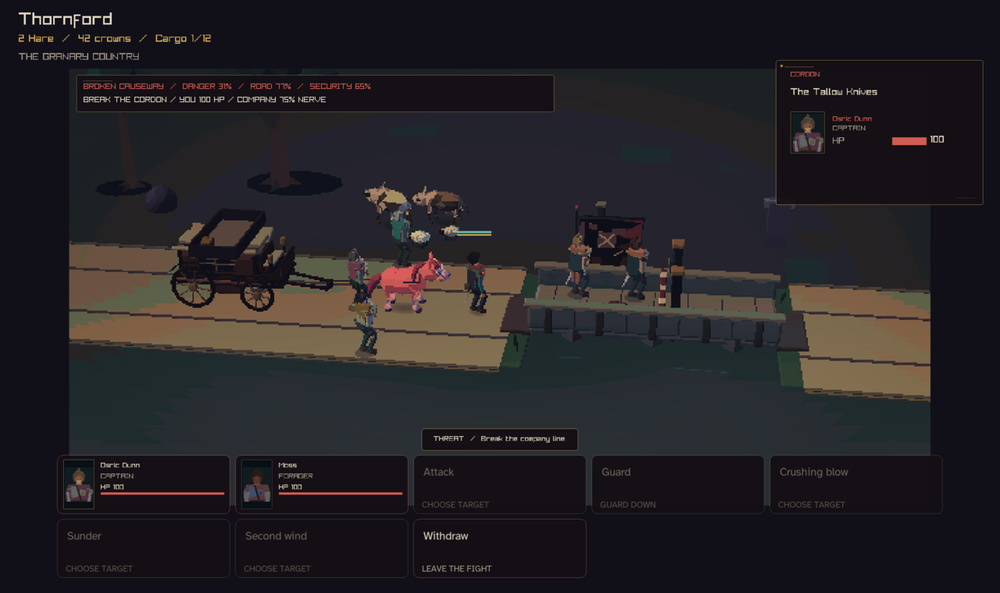
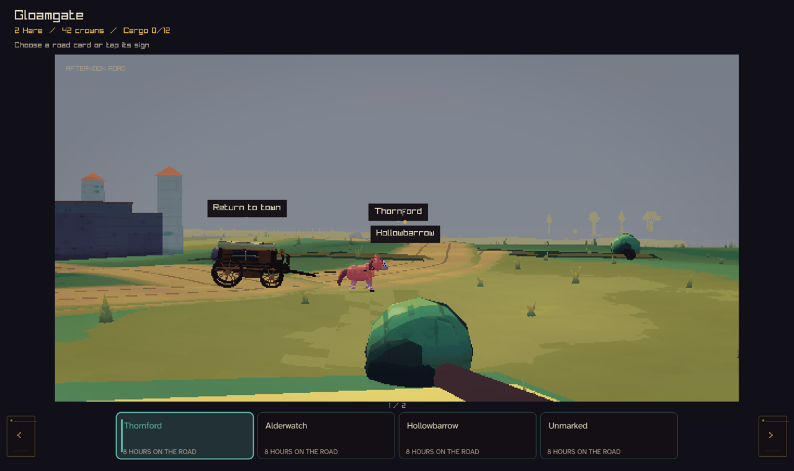
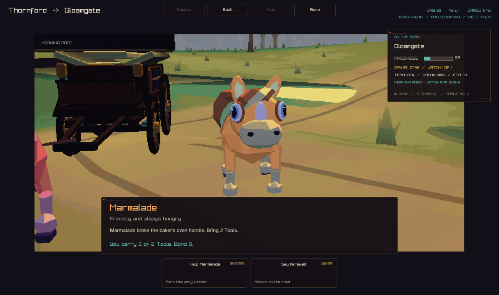
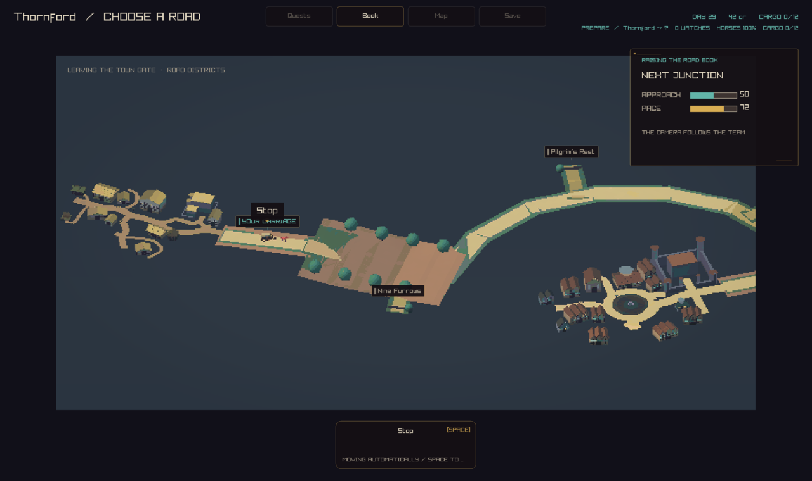

# GFX-03 remaining road scenes: update-path publish

Finishes the pony presentation split recorded in
`docs/design/pony-presentation-timeline.md`. The travel path already
published its hitched team's gait targets from the update path (PR #863,
#867). The fork, encounter/combat/parley, remote-site, and town-street
convoy (arrival/departure) scenes still published at draw time. They now do
not: `CcLocalRoadForkHorseTargetsInternal`,
`CcLocalRoadEncounterHorseTargetsInternal`,
`CcLocalRoadSiteHorseTargetsInternal`, and
`CcLocalRoadConvoyHorseTargetsInternal` (all in
`src/client/local3d/road_book.inc`) compute the same placement the draw site
uses and publish the team's (and any met pony's) gait targets once, from the
update path in `main.c`, before the draw dispatch for that frame.
`DrawRoadHorseTeam` and the pony-on-road block in `DrawRoadCarriage` now only
read the already-published pose (`CcLocalCreatureGaitPoseInternal`); they no
longer call `CcLocalCreatureGaitTargetInternal`.

The fork carriage's own turn/branch math moved into a shared
`ForkCarriagePose` helper (built on a new `ForkSelectedBranchEnd`), so the
draw site and the publisher cannot drift apart, the same way
`RoadTravelCarriageBase` already keeps the travelling draw and its publisher
in step.

## Frames

This change must not move anything on screen, so the frames below are the
evidence that it does not. Four scenes rendered byte-identical before and
after, so only the after frame is kept (SHA-256 prefixes, main `88f13d07`
compared with this branch):

| Scene | Flag | Before | After |
|---|---|---|---|
| Encounter/combat | `--capture-road` | `d1e1cdc466804605` | `d1e1cdc466804605` |
| Fork | `--capture-road-fork` | `316997ead9dc1aa3` | `316997ead9dc1aa3` |
| Pony encounter | `--capture-pony-encounter` | `ad9d5d9a342f769f` | `ad9d5d9a342f769f` |
| Departure | `--capture-road-departure 0.5` | `a6cc307f416f1602` | `a6cc307f416f1602` |
| Arrival | `--capture-road-arrival 0.5` | `d03f5c013a9af826` | `dc57fa8e4f94234c` |

`arrival` differs by 132 of 972800 pixels. Two runs of the *same* binary
after this change differ by the same amount, so this is jitter that was
already there, not a regression. The remote site (goblin cave) has no capture
that shows its parked carriage; `TestSiteDrawReadOnly` below covers it.







## Validation

- `cmake --build --preset play` succeeds with warnings-as-errors.
- `ulimit -s 65520 && ctest --preset play` -- 237/237 tests pass.
- `renderer_regression_tests --carriage-graphics <path>` now runs five
  draw-twice checks under a real graphics context: the existing world
  carriage, plus new `TestForkDrawReadOnly`, `TestEncounterDrawReadOnly`,
  `TestSiteDrawReadOnly`, and `TestConvoyDrawReadOnly`. Each publishes once,
  steps the gaits once, draws the scene twice, and asserts the hitched
  team's and any met pony's `CreatureGaitCache` entries are byte-identical
  before and after both draws.

## Capture recipe

Build with the `play` preset. Run from the worktree root:

```sh
out/build/play/crownless_carriage.app/Contents/MacOS/crownless_carriage --capture-road road.png
out/build/play/crownless_carriage.app/Contents/MacOS/crownless_carriage --capture-road-fork fork.png
out/build/play/crownless_carriage.app/Contents/MacOS/crownless_carriage --capture-pony-encounter pony-encounter.png
out/build/play/crownless_carriage.app/Contents/MacOS/crownless_carriage --capture-road-departure 0.5 departure.png
out/build/play/crownless_carriage.app/Contents/MacOS/crownless_carriage --capture-road-arrival 0.5 arrival.png
ulimit -s 65520
out/build/play/renderer_regression_tests --carriage-graphics unused.png
```
