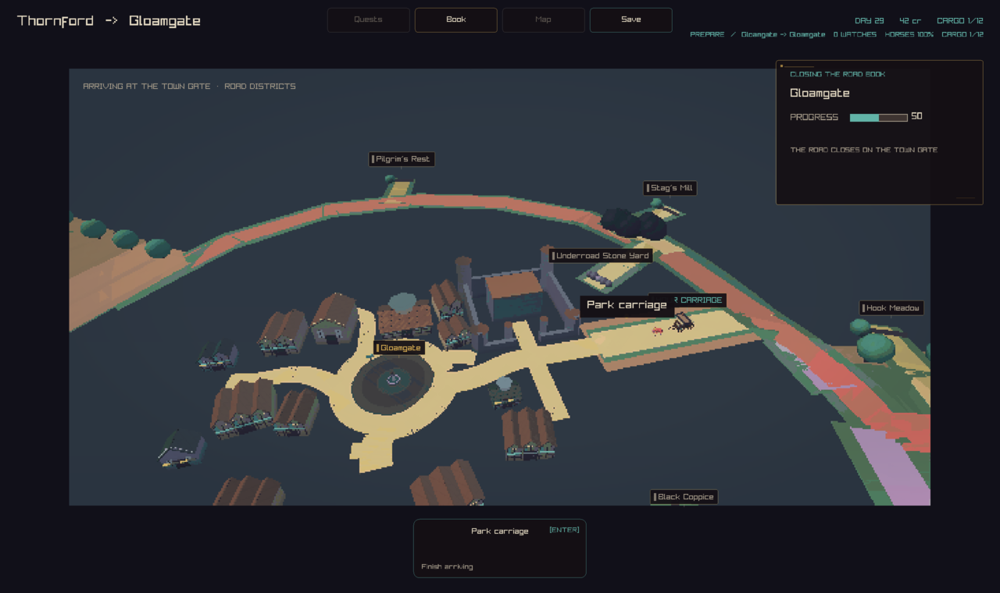
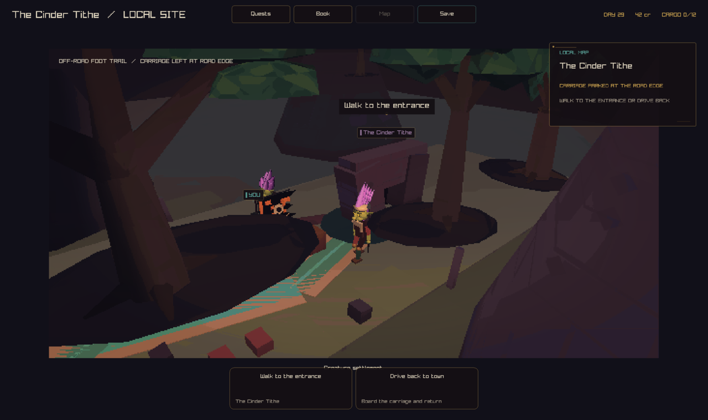

# GFX-03 remaining road scenes: update-path publish

Finishes the pony presentation split recorded in
`docs/design/pony-presentation-timeline.md`. The travel path already
published its hitched team's gait targets from the update path (PR #863,
#867). The fork, encounter/combat/parley, remote-site, and town-street
convoy (arrival/departure) scenes still published at draw time. They now do
not: `CcLocalRoadForkHorseTargetsInternal`,
`CcLocalRoadEncounterHorseTargetsInternal`,
`CcLocalRoadSiteHorseTargetsInternal`, and
`CcLocalRoadConvoyHorseTargetsInternal` (all in
`src/client/local3d/road_book.inc`) compute the same placement the draw site
uses and publish the team's (and any met pony's) gait targets once, from the
update path in `main.c`, before the draw dispatch for that frame.
`DrawRoadHorseTeam` and the pony-on-road block in `DrawRoadCarriage` now only
read the already-published pose (`CcLocalCreatureGaitPoseInternal`); they no
longer call `CcLocalCreatureGaitTargetInternal`.

The fork carriage's own turn/branch math moved into a shared
`ForkCarriagePose` helper (built on a new `ForkSelectedBranchEnd`), so the
draw site and the publisher cannot drift apart, the same way
`RoadTravelCarriageBase` already keeps the travelling draw and its publisher
in step.

## Before / after

All five scenes render pixel-identical before and after the change, except
`arrival`, which differs by 132 of 972800 pixels even between two runs of the
*same* (post-change) binary -- a pre-existing, unrelated jitter, not a
regression.

### Encounter/combat (`--capture-road`)

Before:


After:


### Fork (`--capture-road-fork`)

Before:


After:


### Pony encounter (`--capture-pony-encounter`)

Before:


After:


### Departure (`--capture-road-departure 0.5`)

Before:


After:


### Arrival (`--capture-road-arrival 0.5`)

Before:



After:


### Remote site (goblin cave, `--capture-creatures goblins`)

No capture flag shows the site's parked carriage directly (the camera frames
the entrance), so this is included for context rather than as a pixel
comparison; `TestSiteDrawReadOnly` below is the scene's real regression
coverage.



## Validation

- `cmake --build --preset play` succeeds with warnings-as-errors.
- `ulimit -s 65520 && ctest --preset play` -- 237/237 tests pass.
- `renderer_regression_tests --carriage-graphics <path>` now runs five
  draw-twice checks under a real graphics context: the existing world
  carriage, plus new `TestForkDrawReadOnly`, `TestEncounterDrawReadOnly`,
  `TestSiteDrawReadOnly`, and `TestConvoyDrawReadOnly`. Each publishes once,
  steps the gaits once, draws the scene twice, and asserts the hitched
  team's and any met pony's `CreatureGaitCache` entries are byte-identical
  before and after both draws.

## Capture recipe

Build with the `play` preset. Run from the worktree root:

```sh
out/build/play/crownless_carriage.app/Contents/MacOS/crownless_carriage --capture-road road.png
out/build/play/crownless_carriage.app/Contents/MacOS/crownless_carriage --capture-road-fork fork.png
out/build/play/crownless_carriage.app/Contents/MacOS/crownless_carriage --capture-pony-encounter pony-encounter.png
out/build/play/crownless_carriage.app/Contents/MacOS/crownless_carriage --capture-road-departure 0.5 departure.png
out/build/play/crownless_carriage.app/Contents/MacOS/crownless_carriage --capture-road-arrival 0.5 arrival.png
ulimit -s 65520
out/build/play/renderer_regression_tests --carriage-graphics unused.png
```
