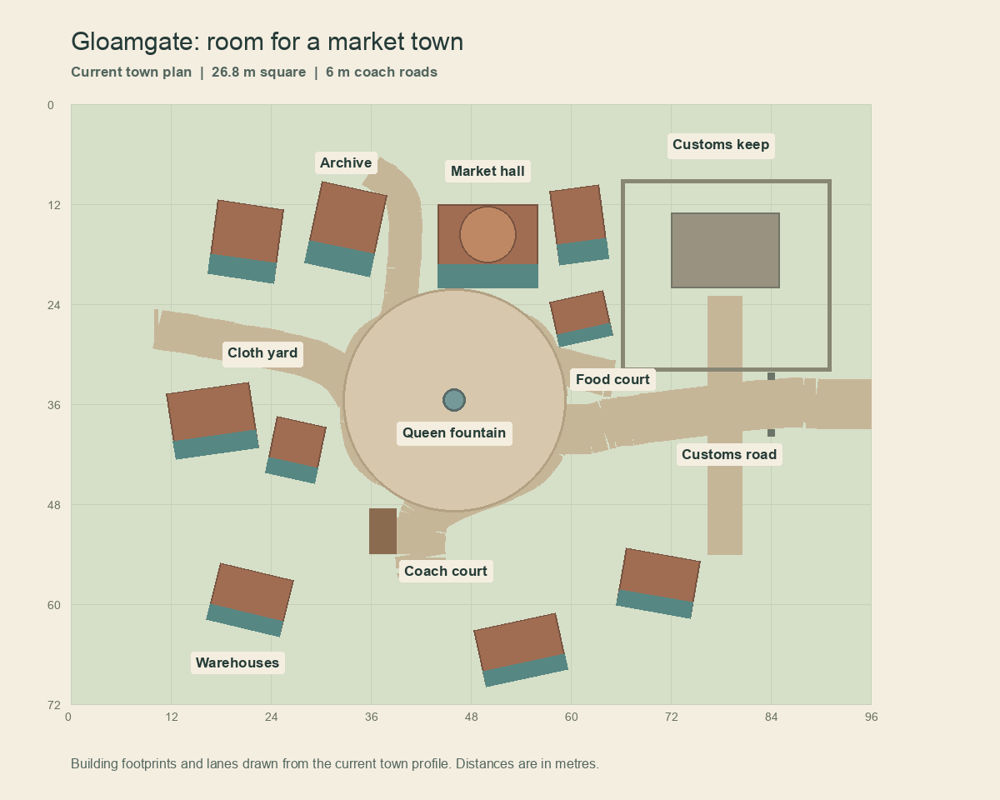
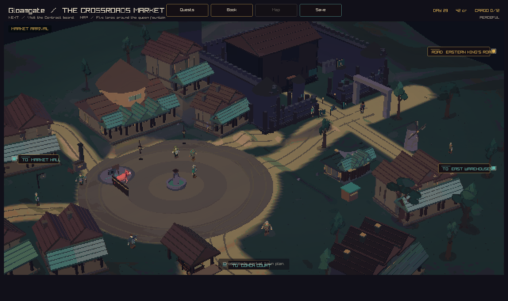
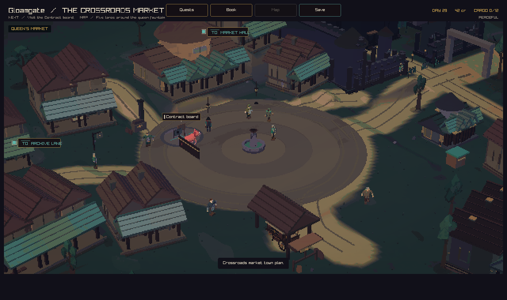
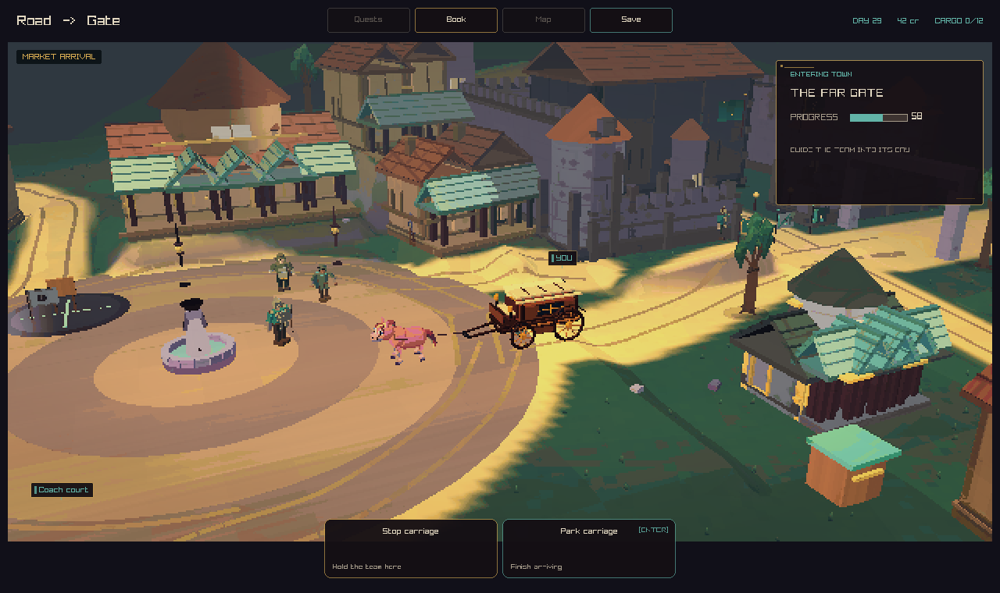
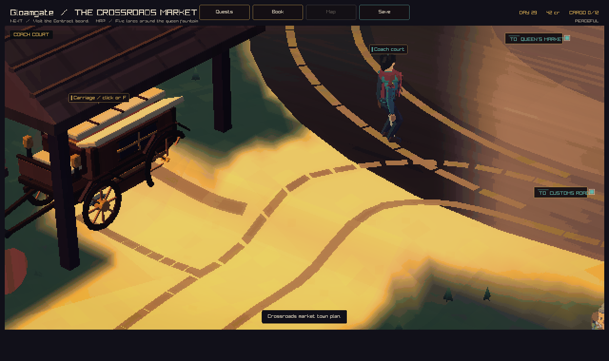
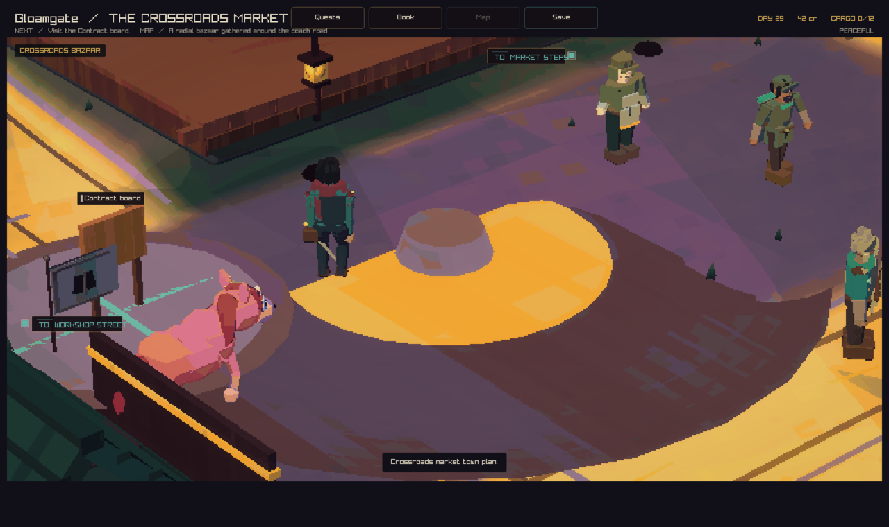

# Gloamgate: the queen's market

Gloamgate has a broad market square and five service lanes. The square is
26.8 metres across. Six-metre coach roads curve into the existing yard.
Shops and warehouses stand around separate trading courts, with lower
buildings toward the camera. Angled shops follow the lanes. A round guild
chamber rises above the market hall and its bowed canopy.



The plan uses the current building footprints and lane points in
`src/client/cc_local_place.c`. The square is centred at (46, 35.5).
The coach gate is at (96, 36), matching the road handoff. The archive,
cloth yard, food court, customs road, and coach court have distinct labels.

## Town life

The queen fountain has a wooden bowl on its broken shoulders. Teal covered
shop fronts face the lanes. A stone customs arch marks the coach road.
A timber shelter covers the parked carriage.

Food sacks and bread follow stored wheat and bread. Warehouse crates follow
stored wood and tools. The archive has paper charts, and the cloth shops
show wool stock. Each stock prop represents several units.

Low security adds shutters and bars. Saved fire damage darkens buildings and
awnings in a stable order. Rebuilding adds scaffolds. Fresh timber remains
after repairs. Prosperity adds trim to open shops.

The fountain uses the same location in street rendering, walking collision,
body collision, and the wider world view. The scene uses the town's existing
simulation state.

## In-game review

These Linux game captures come from commit `e47c405aa188a62d712d6dbd10f8fb3949edc93f`
in [CI run 34289081803](https://github.com/atimics/crownlesscarriage/actions/runs/34289081803).
The arrival view shows the round hall, angled shops, and open square together.
The moving carriage follows the wide curve around the fountain.









| Town condition | Capture |
| --- | --- |
| Fire damage | [Darkened shops](burnt.png) |
| Rebuilding | [Repair scaffolds](rebuilding.png) |
| Low security | [Shuttered fronts](lawless.png) |
| Prosperity | [Fresh trim](thriving.png) |
| Empty food stores | [Hungry town](hungry.png) |

All 152 local tests passed. The added walking check for angled walls also
passed. Static analysis passed. Route checks cover two terrain seeds, all
service lanes, the fountain, and carriage arrival and departure.

## Before

This native capture shows main at f0fa99e before the rebuild.



## Capture recipe

The Linux client job publishes `gloamgate-review` with the arrival, market,
coach court, moving carriage, fire damage, repairs, low security, prosperity, and empty food stores.

```sh
--capture-town-state 1 82 36 arrival.png peaceful
--capture-town-state 1 44.25 28.85 market.png peaceful
--capture-town-state 1 42 47 coach-court.png peaceful
--capture-town-arrival 1 0.58 carriage.png
--capture-town-state 1 44.25 28.85 burnt.png burnt
--capture-town-state 1 44.25 28.85 rebuilding.png rebuilding
--capture-town-state 1 44.25 28.85 lawless.png lawless
--capture-town-state 1 44.25 28.85 thriving.png thriving
--capture-town-state 1 44.25 28.85 hungry.png hungry
```
