# Crownless graphics deep dive

Source: graphics PR #312, commit `d0476b945b318b43cbdd4746b3095d073251d1f8`.

The atlas includes 570 views and studies: 87 game screenshots, 373 model studies,
96 small character captures, nine sheets and art images, and five videos.
Each screenshot is an original capture from the native game. Model studies use
neutral Blender light to show the shape. Runtime character paint appears in the
game screenshots and small character captures.

## World and scenes

The six town layouts have different purposes and shapes:

| Town | Purpose |
| --- | --- |
| Thornford | Farming |
| Gloamgate | Market |
| Alderwatch | Fortress |
| Silverwick | Mining |
| Rosespire | Capital |
| Hollowbarrow | Dungeon town |

The captures show every town centre and arrival, ten town districts, close and
wide travel, road choices, departure, arrival, the underroad, the dragon site,
the goblin site, an interior, and movement and combat scenes.

## People and creatures

The NPC library contains 99 files across nine roles and eleven poses. Another
34 files hold separate character modules. The hero folders contain two rigs and
20 component exports. The world kit includes 93 modules and 36 body skins.

The creature library has 50 files across ten variants: three goblins, horse,
cow, sheep, and four dragon stages. The animal sheet shows seven pony colours,
cow, and sheep through four viewing angles and two walking poses at each angle.

The 96 small character captures show the hero and guard at 35, 48, and 60 pixels
tall, in day and interior light, across eight walking turns. These use the
production modular character renderer.

## Paint and light

The main scene is drawn at 630 by 320 pixels. Surface shaders apply indexed
character paint, world light, foliage, fog, and weather. The final colour pass
blends the image toward the shared palette. Point scaling keeps pixel edges
clear as the scene is enlarged. The game draws menus and labels around that scene.

Five matched captures show clear day, rain, amber dusk, moonlit night, and a
dragon omen. The separate material captures show how character features read
under bright and warm interior light.

## Visual findings

1. **Town ground needs a clearer shape.** In the Rosespire capture, wide road
   surfaces cross the foreground at steep angles. Road height, ground contact,
   and the view of the player deserve the next pass.
2. **Creature scenes need more room.** The adult dragon fills the cliff scene.
   Foreground structures cover parts of the dragon and the player. A wider
   camera and a light edge around the head would help show the encounter.
3. **Small characters need broad features.** Hats, clothes, and body shapes
   carry identity. Faces and armour benefit from larger light and dark shapes
   at the smallest game sizes.
4. **Travel has a softer ground pattern.** The graphics PR shares ground colour
   and slope across tile edges, adds fixed grass clumps, and blends the road
   shoulders into the meadow. Matched before and after captures are included.

## Scope and evidence

The 373 model count covers every GLB file in `assets/exports` at this revision,
including pose variants, separate parts, assembled rigs, and development models.
Each model has a render and a source link in the atlas. Game captures show how
the runtime presents the art.

All 87 game captures, 373 model renders, and 96 character captures completed.
The clips include horse movement, goblin and dragon scenes, climbing, jumping,
swimming, combat, and the introduction film. Capture labels and messages remain
in the original game screenshots.

The full atlas and inventory were produced as local review outputs. The key
captures are kept here with the review. Each was captured from the revision above.

## First fix: street camera angle

The Rosespire capture exposed a camera height problem. Each street camera used
the height of the ground beneath the camera. Where that ground is lower than
the town square, the view points up through the raised road toward the player.

Street cameras now keep a downward angle of about 29 degrees or more. The
authored camera direction and view size still set the composition. A higher
foreground hill can lift the camera further. This gives a clear view of the
square and the player's ground contact.

The regression check projects the player's feet into the image, then checks
the viewing ray and its clearance above the ground. It covers all six town
squares with two world seeds. With the original renderer, it catches the low
viewing angle. The checks for camera transitions,
road clicks, and combat selection also cover the higher street view.

Validation: the full client build, all 72 CTest checks, and native renderer
checks pass. Matched captures cover all six town centres and arrivals, with a
travel capture to check the meadow graphics. The combat click fixture keeps
both actors on the level training yard, and the traversal check uses the same
body centre as the other camera checks.

The next passes in issue #322 cover town ground transitions, dragon and goblin
framing, and small character features.

### Six towns after the camera fix

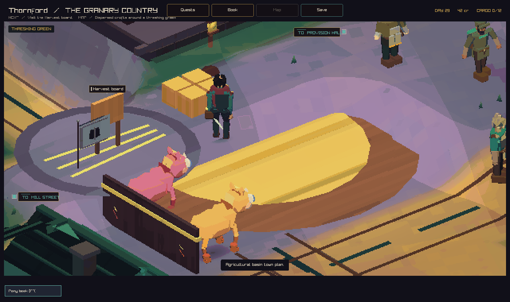

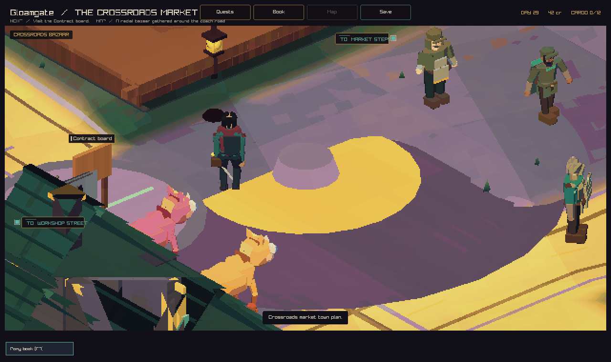

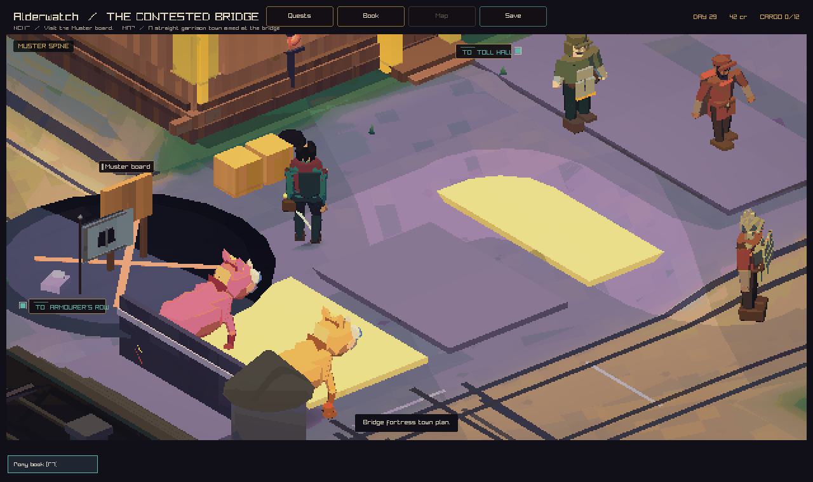

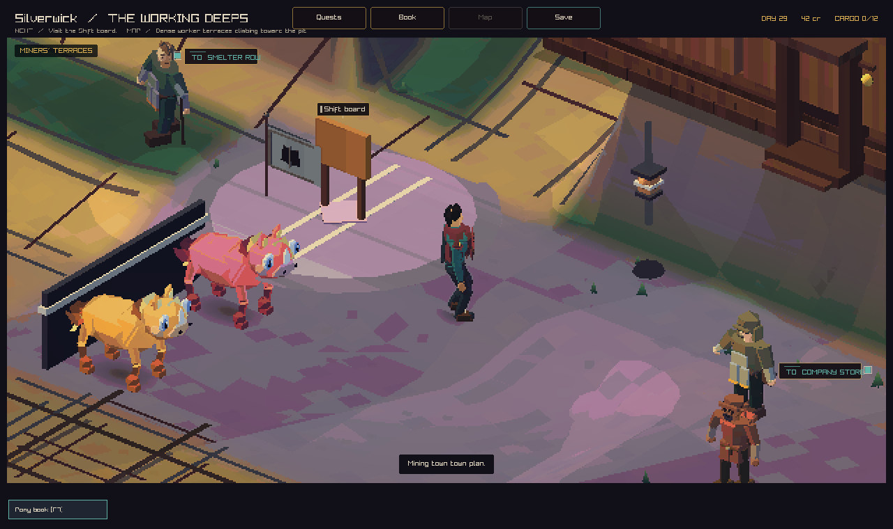

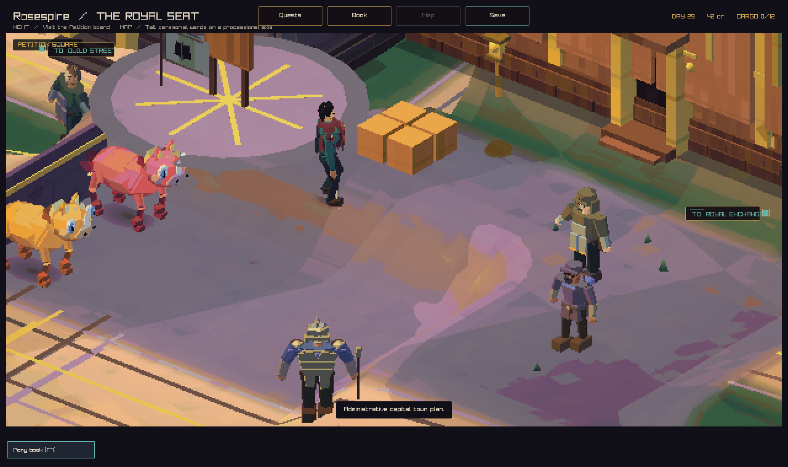

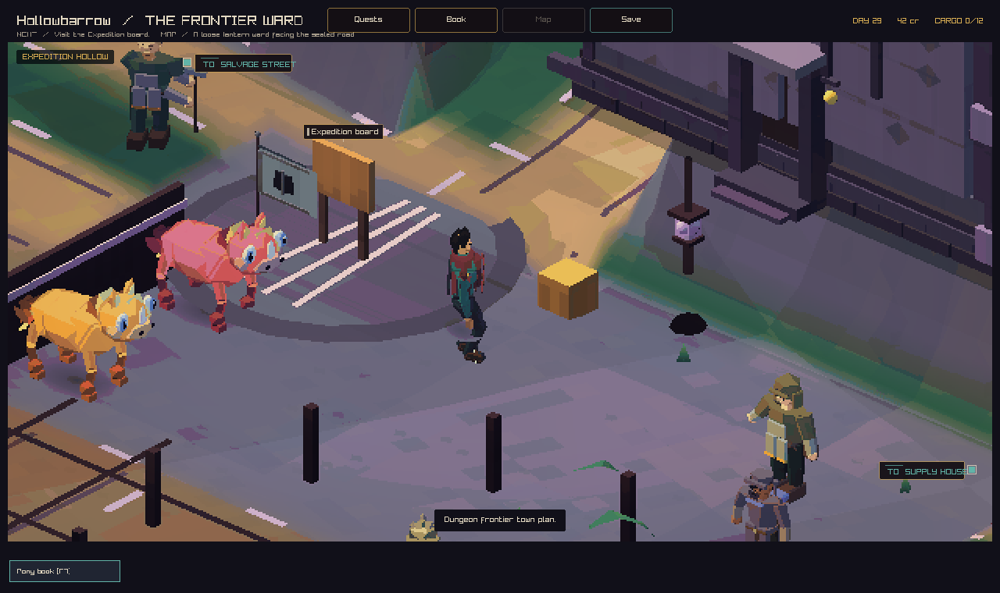

## Original captures

### Rosespire road and ground

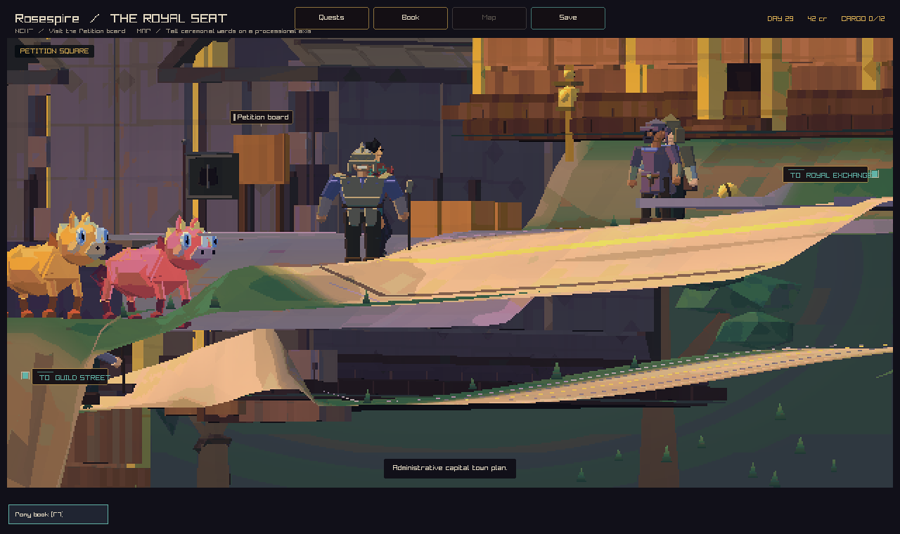

### Adult dragon at the cliff

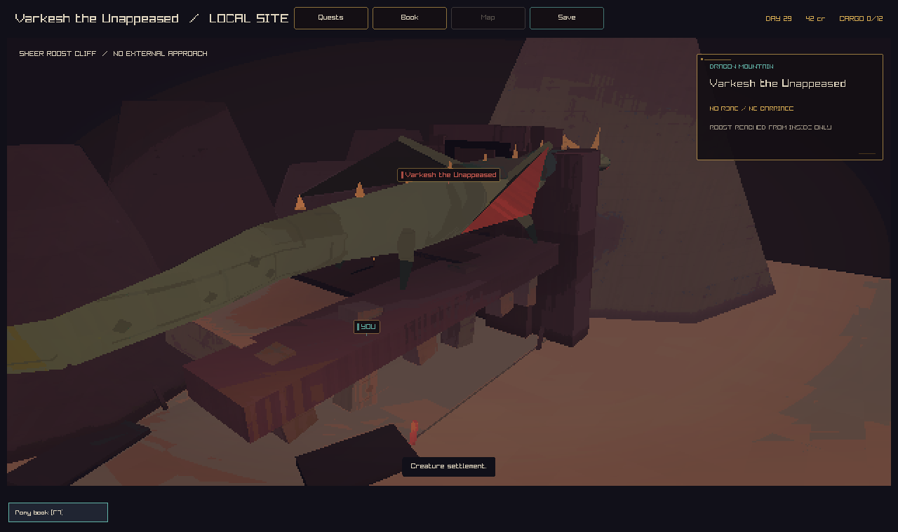

### Character shapes

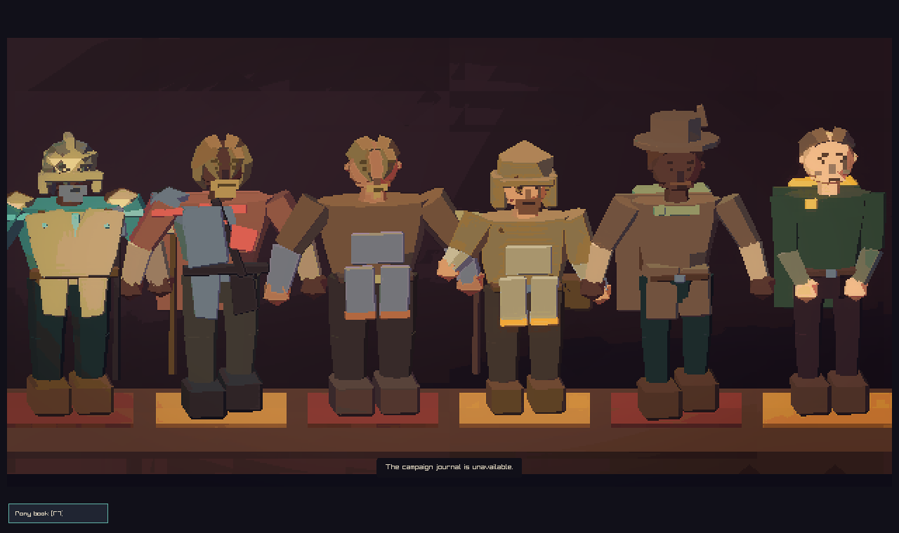

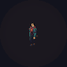

### Interior light

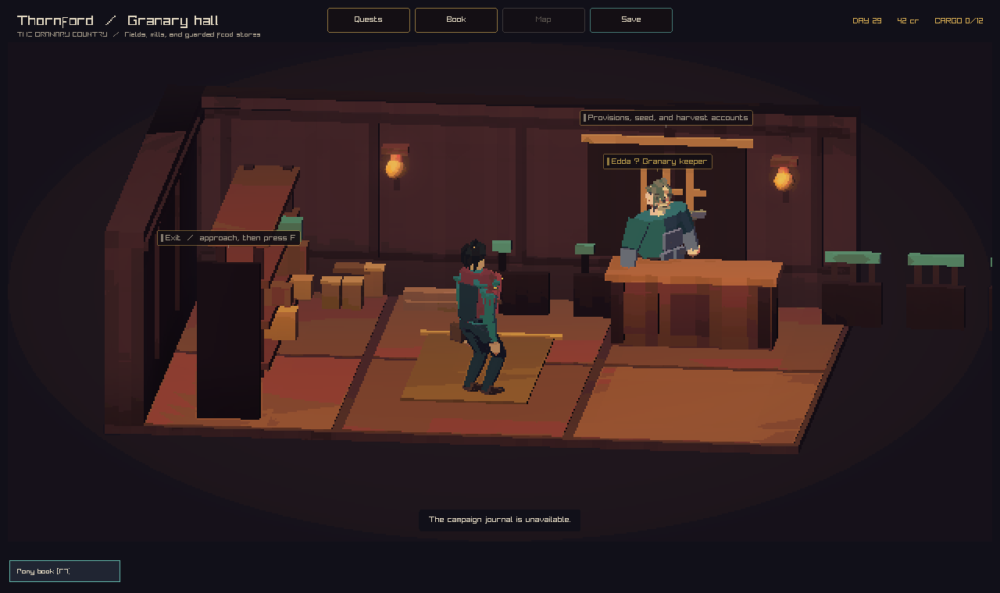
