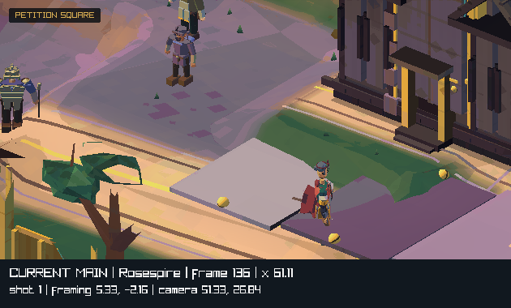
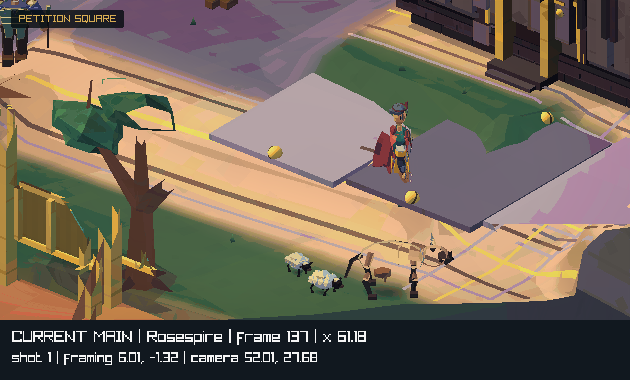
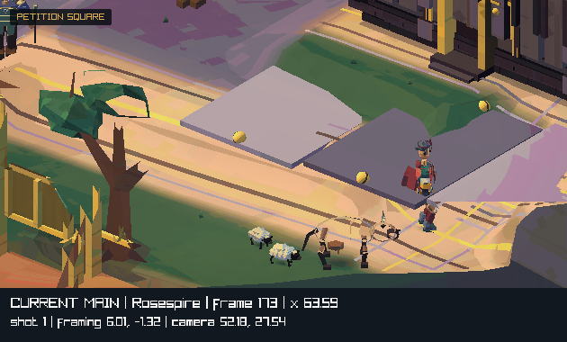
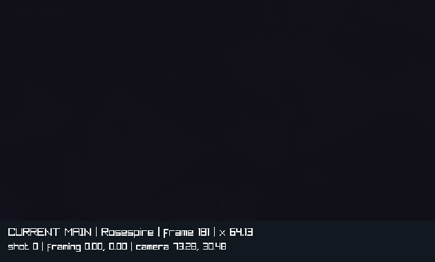
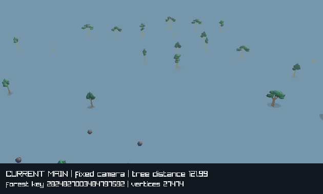
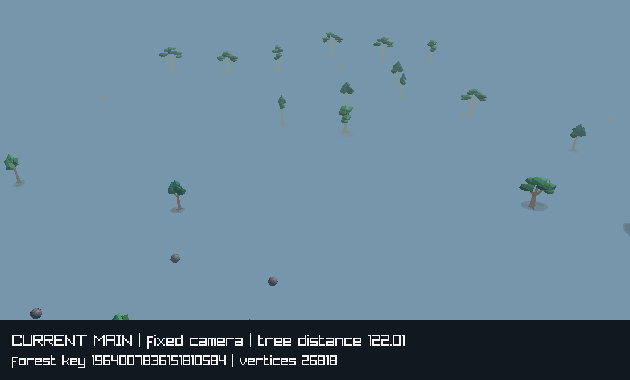

# Camera, visibility, and graphics review

5 September 2026. Reviewed engine: [`8b834995`](https://github.com/atimics/crownlesscarriage/commit/8b83499581273ee05a88d1f22bc82d34eba6df28). The user reports flicker during camera movement in browser and desktop builds. The requested direction is a modern King's Quest style.

**The strongest causes are abrupt camera and visibility changes.** The production camera helpers reproduce large street reframes, a dark shot transition, an immediate projection switch, and a platform height switch. Native captures also reproduce a tree disappearing at the scenery distance boundary. These are shared engine paths, which fits the report across builds. Browser and other desktop GPU confirmation remains part of the implementation validation.

The proposed direction is a composed storybook stage: stable buildings and trees, clear views of the actors, and smooth moves between carefully chosen camera positions. Keep the bold silhouettes, painted surfaces, warm light, and readable walking paths. Give each transition a clear spatial purpose.

**Evidence and scope**

This review covers the street, conversation, combat, arrival, and travel cameras; scenery selection and tree batching; building cutaways; shader clipping; depth setup; material thresholds; the 630 × 320 presentation path; and the relevant graphics and movement checks. It includes a strict native client build, production-helper probes, a four-second rendered town path, and a controlled forest boundary capture.

The review uses three evidence levels: **reproduced** means a production helper or native render showed the behavior; **source finding** means the behavior follows directly from the current code; **risk** means a controlled render comparison should establish its share of the reported flicker. The proposals below are design work for follow-up PRs.

| Priority | Finding | Evidence | Likely visible symptom |
|---|---|---|---|
| P1 | Street reframing jumps in one frame | Reproduced in all six towns, two seeds, and a native town capture | The whole scene jerks during walking |
| P1 | Town shot changes use a dark fade and a midpoint cut | Reproduced in helper trace and native capture | A brief dark flash while crossing town |
| P1 | Conversation and combat switch projection immediately | Conversation helper reproduced; combat has the same switch | Scenery changes size and position on entry or exit |
| P1 | Platform and gate visibility use hard switches | Platform threshold reproduced; gate rule confirmed in source | Parts of scenery collapse or return suddenly |
| P2 | Travel distance culling removes visible trees and rebuilds the forest | Reproduced in a controlled native forest capture | Distant objects pop; movement can also trigger buffer work |
| P2 | Camera placement and cutaways use separate rules | Source finding | A smooth move may cross a wall, roof, or canopy |
| P2 | Several camera helpers still assume 457 × 285 | Source finding | Framing and overlap decisions differ from the displayed view |
| P2 | Fine surface patterns and ink bands have sharp thresholds | Source finding; contribution to the report is a risk | Wall, roof, and ground detail shimmers during movement |
| P2 | Local scenes inherit a 0.05–4000 depth range | Source finding; actual depth conflict is a risk | Thin overlapping surfaces may flicker in perspective views |

**1. Street reframing jumps during ordinary walking**

[`FixedCameraRigFrameHero`](https://github.com/atimics/crownlesscarriage/blob/8b83499581273ee05a88d1f22bc82d34eba6df28/src/client/local3d/camera_composition.inc#L824) contains an interpolation path, but its trigger assigns the destination directly to `framing_offset`, sets `framing_duration` to zero, and moves both the camera and target immediately. It then holds that position for 0.65 seconds. The result is a series of jumps as the hero reaches the framing boundary.

The probe sampled each of the five authored carriage-road centre lines at 900 positions, at 60 Hz, in six towns and two seeds: 54,000 camera samples. It measured target movement while the shot remained the same and the authored shot transition was complete. The hero position was supplied directly from the road path; this is a camera test fixture.

| Town | Largest one-frame target move, seed `c0a71a9e` | Seed `12345678` |
|---|---:|---:|
| Thornford | 4.689 | 4.689 |
| Gloamgate | 4.667 | 4.667 |
| Alderwatch | 4.407 | 3.690 |
| Silverwick | 4.778 | 4.778 |
| Rosespire | 4.912 | 4.897 |
| Hollowbarrow | 4.689 | 4.689 |

Units are engine world units. In the native Rosespire capture, consecutive frames 136 and 137 show a large vertical reframe after the supplied hero position advances by 0.067 units. Both frames remain in shot 1. The scene is rendered at the shipped 630 × 320 size; the strip underneath records the fixture state.




**Proposal:** retain a quiet area where the hero can walk freely. Ease the camera toward a framing destination when the hero approaches its edge. Start with a 0.25–0.45 second response and tune it at normal walking speed. Preserve current position and velocity when the destination changes. Pass the final camera to picking, labels, lighting, and visibility.

**2. The remaining fade is deliberate engine behavior**

[`FixedCameraRigAim`](https://github.com/atimics/crownlesscarriage/blob/8b83499581273ee05a88d1f22bc82d34eba6df28/src/client/local3d/camera_composition.inc#L775) sets a 0.26-second transition. It holds the old target, offset, and field of view until the midpoint, then selects the new values. [`DrawFixedCameraFade`](https://github.com/atimics/crownlesscarriage/blob/8b83499581273ee05a88d1f22bc82d34eba6df28/src/client/local3d/camera_composition.inc#L813) covers the viewport with `WORLD_VOID`. The street and road presentations call this overlay.

At 60 Hz, the probe moves its supplied target by 10 units on frame 8, at 0.133 seconds. Fade opacity is 0.998 on that frame. The native town capture shows the same dark midpoint.




A related timing mismatch exists in [`CcLocalDrawStreet3D`](https://github.com/atimics/crownlesscarriage/blob/8b83499581273ee05a88d1f22bc82d34eba6df28/src/client/local3d/road_book.inc#L1743): the light profile and composition use the newly selected shot while the rig can still display the old camera. The mining landmark also has a shot-specific tree exclusion. These choices can change the scene before the camera reaches the new view.

**Proposal:** define connected camera positions for each town. Move along a clear path between them, starting around 0.45–0.8 seconds for adjacent views. Blend target, orientation, view scale, composition lighting, and visibility policy on one timeline. Tie a fade to an authored story or scene event. Ordinary travel within a town should carry a continuous view of the place. Validate the path's clearance before enabling a smooth move.

**3. Projection changes create an extra jump**

The [`combat`](https://github.com/atimics/crownlesscarriage/blob/8b83499581273ee05a88d1f22bc82d34eba6df28/src/client/local3d/camera_composition.inc#L1409) and [`conversation`](https://github.com/atimics/crownlesscarriage/blob/8b83499581273ee05a88d1f22bc82d34eba6df28/src/client/local3d/camera_composition.inc#L1509) cameras ease position, target, and field of view. Their projection enum changes as soon as the mode becomes active. Exit also switches projection and forces the displayed pose back to the base when the mode weight reaches zero.

The conversation probe holds the camera position and target fixed, then activates the mode. A static point near the subject moves by 4.698 art pixels solely because the projection changes. Other sampled depths move further. This isolates the lens change from the later camera motion. [`PerspectiveFovyForOrthographic`](https://github.com/atimics/crownlesscarriage/blob/8b83499581273ee05a88d1f22bc82d34eba6df28/src/client/local3d/camera_composition.inc#L20) also clamps the converted angle to 24–48 degrees, which can change the scale at the focus plane.

Arrival has a similar handoff risk: [`TownArrivalCamera`](https://github.com/atimics/crownlesscarriage/blob/8b83499581273ee05a88d1f22bc82d34eba6df28/src/client/local3d/camera_composition.inc#L1013) supplies a perspective view and clears the street rig's initialized state on each call. The following street view starts from a fresh orthographic pose.

**Proposal:** prototype one perspective lens family for town exploration, conversation, and combat. Use longer camera distances and narrower fields of view for the painted town compositions. Match the current subject size at each authored view. Keep the lens, position, and velocity continuous at mode and arrival boundaries. Review all six town compositions before adopting the lens change. Orthographic presentation remains useful for book and map views.

**4. Some occlusion rules still remove geometry instantly**

[`CameraStreetPlatformSubjectOverlap`](https://github.com/atimics/crownlesscarriage/blob/8b83499581273ee05a88d1f22bc82d34eba6df28/src/client/local3d/camera_composition.inc#L451) uses screen overlap to select a platform. The draw loop compares that score with 0.001 and selects either full height or 0.12 units. Screen overlap can also select scenery behind a subject.

The production helper probe crosses this threshold with a 0.0005-unit camera translation. The score changes from 0.0010323 to 0.0009760. The draw rule therefore switches a platform from 0.12 to 1.65 units tall in one frame. [`The gate rule`](https://github.com/atimics/crownlesscarriage/blob/8b83499581273ee05a88d1f22bc82d34eba6df28/src/client/local3d/road_book.inc#L1868) also selects a cut whenever close combat uses a perspective camera. [`DrawWayfarerGate`](https://github.com/atimics/crownlesscarriage/blob/8b83499581273ee05a88d1f22bc82d34eba6df28/src/client/local3d/authored_places.inc#L931) then substitutes short posts for the full gate.

Buildings already have a better timing model. [`UpdateBuildingReveal`](https://github.com/atimics/crownlesscarriage/blob/8b83499581273ee05a88d1f22bc82d34eba6df28/src/client/local3d/authored_places.inc#L3546) waits 0.06 seconds before opening and 0.14–0.16 seconds before closing, then eases the amount. Its tests pass at 30, 60, and 144 Hz. The building shader clips everything above a horizontal plane that moves down through an eight-unit span. The cap follows that plane. This is still a broad change to a building's silhouette, especially during close framing.

**Proposal:** share one occlusion policy across buildings, gates, platforms, canopies, and authored props. Use depth-aware tests against the player, conversation partner, and active subject. Keep each reveal state under a stable place/object ID. Apply the existing hold-and-ease behavior to every eligible object. Author roof and front-wall groups so a reveal preserves the building's overall identity. Give each group a cut range based on its bounds. Prioritize a clear camera position, then use a bounded cutaway for a remaining foreground blocker.

**5. Distance culling and forest batching remain visible during travel**

[`DrawStorybookScenery`](https://github.com/atimics/crownlesscarriage/blob/8b83499581273ee05a88d1f22bc82d34eba6df28/src/client/local3d/open_world.inc#L1292) tests tree origins against a 122-unit radius around the carriage. It hashes the selected tree list. A change in that list clears and rebuilds both forest meshes. Town trees similarly use a 42-unit selection mask as part of their batch key. [`WorldTreeVisibilityMask`](https://github.com/atimics/crownlesscarriage/blob/8b83499581273ee05a88d1f22bc82d34eba6df28/src/client/local3d/actor_rendering.inc#L3303) also excludes two tree indices in the mining landmark shot.

The controlled forest capture holds the camera fixed and moves the selection centre by 0.02 units, from tree distance 121.99 to 122.01. A visible tree disappears. The forest changes from 27,474 to 26,018 vertices. Exactly 135 RGB pixels change inside the scene area. This fixture isolates the production forest against a plain background; full travel footage should establish how often terrain or haze masks the effect.




The recent travel repair already keeps tree placement stable through a small camera turn. Its native test passes. The remaining boundary here is carriage movement and the selected tree list.

**Proposal:** build tree meshes by stable spatial cells. Keep a bounded set of nearby cells resident with separate load and release distances. Select draws using whole-object bounds and the actual camera volume. Retain cells covering the full transition path. Hide cell release beyond the visible region or after scenery has reached the intended haze. Measure upload count and bytes while walking and travelling; a tree crossing a draw boundary should leave neighbouring cell buffers intact.

**6. Camera clearance and screen geometry need one owner**

The street camera checks terrain height at its authored position. Combat scores candidate positions. Conversation scores a set of rotated sightlines. Their eased paths can pass through space between those candidates. This deserves a camera-volume clearance test throughout the move, including the near-plane corners, roofs, tall actors, and canopy bounds.

Several helpers in [`camera_composition.inc`](https://github.com/atimics/crownlesscarriage/blob/8b83499581273ee05a88d1f22bc82d34eba6df28/src/client/local3d/camera_composition.inc#L44) derive width from 457/285. The shipped target in [`cc_local_viewport.h`](https://github.com/atimics/crownlesscarriage/blob/8b83499581273ee05a88d1f22bc82d34eba6df28/src/client/cc_local_viewport.h#L8) is 630/320. At 320 pixels high, the old ratio implies about 513 pixels wide. That narrows the assumed horizontal frame by about 18.6 percent. It affects safe areas and screen-overlap scores. Ray projection followed by its matching inverse can cancel the aspect difference for the building ray test, so each helper should be checked on its own.

**Proposal:** pass one frame-view value containing camera, projection, viewport size, clip planes, and elapsed time through the render frame. Resolve camera placement once. Reuse the result for picking and occlusion. Validate a swept camera volume along each authored transition. Use a clear alternate path when the first path crosses scenery. Add debug views for camera bounds, object bounds, sightline samples, and the reason an object was hidden.

**7. Surface shimmer and depth precision need a second pass**

The renderer draws into a 630 × 320 target with point filtering. [`SnapCameraToArtPixels`](https://github.com/atimics/crownlesscarriage/blob/8b83499581273ee05a88d1f22bc82d34eba6df28/src/client/local3d/camera_composition.inc#L75) rounds orthographic movement to art pixels. Perspective views use continuous movement. The scene then receives sharpening, glow, colour grading, and a nearest-palette lookup before enlargement.

The current foliage shader reduces fine detail using pixel derivatives. Town roof stripes, stone joints, ground marks, the painted environment's flecks, and view-dependent ink bands still have sharp thresholds. A small view change can therefore alter a material's colour even when its geometry stays visible. Face detail also switches at projected heights of 4 and 12 pixels. These are plausible sources of residual shimmer after the large camera changes are fixed.

The pinned raylib source uses near/far defaults of 0.05 and 4000. The local renderer inherits them. Native depth storage lets the driver choose a format; the web path has its own format selection. Contact shadows and road marks sit close to other surfaces. The actual depth attachment and depth separation should be measured on each backend before assigning any observed patch to a depth conflict.

**Proposal:** first filter high-frequency paint marks according to their projected size. Give ink and highlight thresholds a narrow, controlled transition. Add stable entry/exit bands to face detail levels. Test a 2× scene render followed by one downsample before palette grading as a quality option; compare its cost and character readability. Keep pixel rounding as an explicit art choice. Set scene-specific clip ranges from measured camera and world bounds, with stable margins, and give thin surface layers an explicit depth policy.

Source references: [`world_lit.fs`](https://github.com/atimics/crownlesscarriage/blob/8b83499581273ee05a88d1f22bc82d34eba6df28/assets/shaders/world_lit.fs#L211), [`painted_environment.fs`](https://github.com/atimics/crownlesscarriage/blob/8b83499581273ee05a88d1f22bc82d34eba6df28/assets/shaders/painted_environment.fs#L107), [`style_grade.fs`](https://github.com/atimics/crownlesscarriage/blob/8b83499581273ee05a88d1f22bc82d34eba6df28/assets/shaders/style_grade.fs#L70), [pinned raylib clip defaults](https://github.com/raysan5/raylib/blob/dbc56a87da87d973a9c5baa4e7438a9d20121d28/src/rlgl.h#L234), [pinned depth allocation](https://github.com/raysan5/raylib/blob/dbc56a87da87d973a9c5baa4e7438a9d20121d28/src/rlgl.h#L3423).

**Implementation order and acceptance**

| Follow-up PR | Work | Acceptance |
|---|---|---|
| 1. Continuous camera motion | Shared view dimensions; eased reframing; clear paths between town views; shared lighting timeline; explicit transition type | Record the full path in all six towns at 30/60/144 Hz. Ordinary town moves keep fade opacity at zero. Camera speed and acceleration stay within the chosen bounds, including interrupted moves. |
| 2. Continuous lens and mode handoffs | Match exploration, conversation, combat, arrival, and return views; adopt a consistent lens family after visual review | Stationary landmarks keep continuous screen positions at entry and exit. Verify hero, partner, dragon head, and interaction point remain inside the intended frame throughout the move. |
| 3. Shared occlusion and clearance | Depth-aware blocker tests; stable reveal IDs; hold times; authored cutaway groups; swept camera clearance | A platform behind an actor keeps its full shape. Repeated small boundary crossings preserve the current reveal. Roof and wall groups change together. Every sampled transition keeps the camera volume clear. |
| 4. Stable scenery cells | Cell-based tree batches; conservative object bounds; residency margins; camera-path coverage | Repeat the 122-unit crossing and town tree boundary probes. Visible object IDs persist. Adjacent cell buffers retain their IDs. Report upload bytes and frame-time percentiles during traversal. |
| 5. Paint and depth stability | Filter small marks; smooth ink thresholds; face detail bands; measured clip ranges; optional supersampling trial | Capture slow pan, orbit, and zoom sequences with fixed lighting. Compare flat colour, normal, depth, ungraded colour, and final colour passes. Preserve the chosen painted appearance at normal play size. |

Each PR should include matched motion captures and the checks for its changed paths. Start with the current raylib renderer and the existing asset pipeline. The concrete problems found here are reachable within that engine. This review gives the general graphics issue [#322](https://github.com/atimics/crownlesscarriage/issues/322) a camera-and-visibility workstream. The separate backend proposal [#14](https://github.com/atimics/crownlesscarriage/issues/14) can use the resulting measurements when its scope is reviewed.

**Validation performed**

- Strict native client and renderer builds passed at the reviewed revision.
- `renderer_skin_rotation`, `physical_goods_displays`, and `local_collision_space` passed.
- The native `--graphics` checks passed. Raised cutaway parity: 5,709 visible pixels and zero changed pixels. Travel leaf motion: 0.000 mean channel change. Box parity: zero changed pixels in all ten views. Character, animal, primitive, material, and buffer-state checks passed.
- Production-helper probes covered 54,000 town camera samples, the shot timeline, the projection switch, the platform threshold, and the travel visibility boundary.
- Native renders captured a controlled four-second Rosespire path and a two-frame isolated forest comparison.

Existing checks cover settled camera framing, building reveal timing, primitive parity, and a small travel camera turn. Extend them with continuous motion, activation thresholds, and object visibility over time. Use the same deterministic paths on native OpenGL and browser WebGL2. Add real-device captures for supported desktop and mobile browsers. Keep CPU timing, GPU timing where available, buffer uploads, and visual stability as separate measurements.

The numbers above are local evidence from the reviewed source. Browser rendering, other desktop GPUs, full-suite CI, and proposed improvements have separate validation steps. Main advanced during the review; the checked graphics source remained unchanged through `d5c4a3b`.

**Review evidence**

- [Probe source](graphics-flicker-2026-09-05/camera_probe.c) calls the production private helpers through the same unity include used by the renderer regression checks. Its direct-position fixtures isolate camera and scenery decisions. `--walk <directory>` records the town path; `--road-cut <directory>` records the forest boundary.
- [Probe results](graphics-flicker-2026-09-05/camera-probe.csv) contain the full shot trace and town maxima. Rows use a leading probe name followed by that probe's fields.
- [Native graphics log](graphics-flicker-2026-09-05/graphics-native.log) records the renderer checks.

The native captures and checks used an Apple M4 Max with OpenGL 4.1. The capture comparison controls were checked at 360 and 736 pixels wide in light and dark themes.

To reproduce the probe on macOS, configure a client build and build `renderer_regression_tests`. Compile the review source against the same libraries. With a default build directory named `build`, the command is:

```sh
cc -O2 -std=c17 -mmacosx-version-min=14.0 \
  -Wall -Wextra -Wpedantic -Wshadow -Wconversion -Werror \
  -DPLATFORM_DESKTOP -DGRAPHICS_API_OPENGL_33 \
  -DCC_ASSET_SOURCE_ROOT=\"$(pwd)\" \
  -I src -I build/_deps/raylib-src/src \
  docs/reviews/graphics-flicker-2026-09-05/camera_probe.c \
  build/libcrownless_local_renderer.a build/libcrownless_locomotion.a \
  build/libcrownless_creature_catalog.a build/libcrownless_local_place.a \
  build/libcrownless_client_policy.a build/libcrownless_road_book.a \
  build/libcrownless_world.a build/libcrownless_sim.a \
  build/_deps/raylib-build/raylib/libraylib.a -lm \
  -framework OpenGL -framework Cocoa -framework IOKit -framework CoreFoundation \
  -o build/camera_probe
build/camera_probe
mkdir -p build/camera-walk build/forest-edge
build/camera_probe --walk build/camera-walk
build/camera_probe --road-cut build/forest-edge
```

Use the configured raylib source path if the build supplies `FETCHCONTENT_SOURCE_DIR_RAYLIB`. The recorded checks used that option with the exact pinned raylib revision. The probe passed the strict warning flags above and reproduced the saved measurements. Native capture commands need access to the macOS graphics service.
