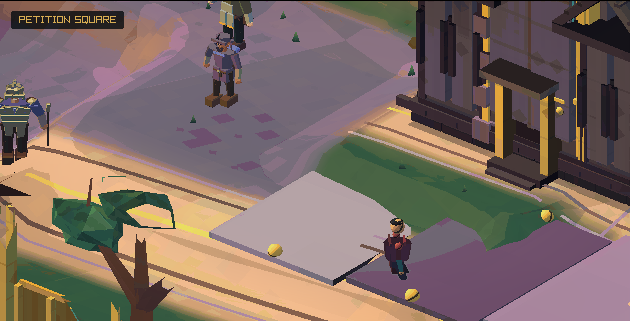
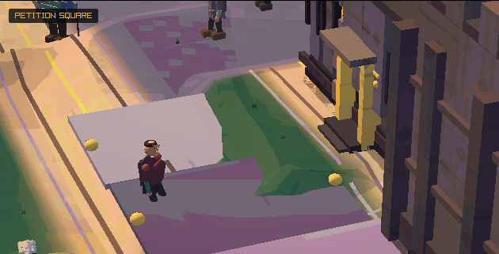
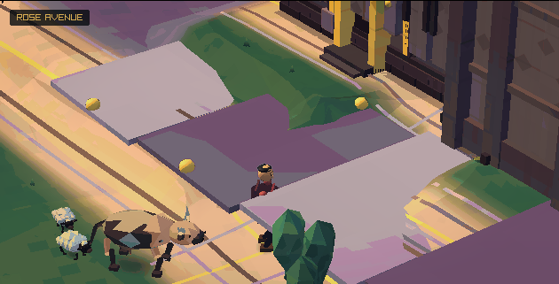
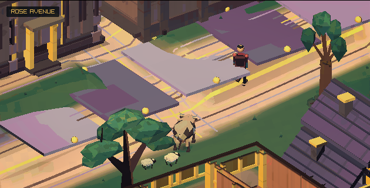
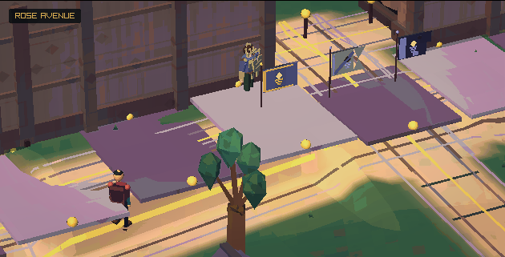

# Camera and visibility improvements

This implements the camera and scenery fixes from [review #359](https://github.com/atimics/crownlesscarriage/pull/359).
The towns keep their composed, painted views. Walking, conversations, and combat
now share a perspective camera family with a long lens for the wider town views.

## Changes

| Cause | New behaviour |
| --- | --- |
| Instant street reframing and a dark fade at the shot boundary | Camera position and aim ease between shots. An interrupted move carries its current velocity into the next move. |
| Projection changes at conversation entry and exit | Town, road, and close views keep the same lens family. Blending the visible span preserves character size. Pony conversations also preserve the incoming projection. |
| Old 457 by 285 camera calculations | Framing, visibility, and street portal selection use the actual 630 by 320 art viewport. |
| Camera movement through nearby ground and roofs | Camera clearance samples the ground around the eye and adds a gradual lift near building and compound roofs. |
| Whole objects leaving a small distance circle | Visibility uses the camera frustum and conservative object bounds. |
| Platforms and gates changing shape at a single overlap threshold | Cutaways use actor depth, separate entry and exit thresholds, a hold period, and gradual height changes. Gate checks follow its actual posts and banners. |
| Town trees disappearing between shots | Authored town trees stay in a stable mesh batch. The camera eases around obstructing canopies. |
| Travel turns rebuilding the whole forest | Trees and rocks stay in fixed 80-unit cells. A spare ring keeps recently visible cells ready for a reversed move. A held camera reuses its GPU buffers. |
| Fine paint and face details changing abruptly with scale | Paint edges use the pixel footprint. Face features grow and shrink gradually as their projected size changes. |
| Very wide depth range in close scenes | Town and road rendering use a 0.10–512 range. Storybook travel uses 0.10–240 with horizon haze. |

Town lighting stays consistent across a camera move. A lens adjustment preserves
the authored haze depth as the wider camera moves farther from the scene.
Arrival follows the carriage into its parking place, then passes its last
camera position to the street camera. A regression check covers this handoff
in every town with both world seeds.
Foreground roofs still lower when they cover an actor; that reveal now eases
over time.

## Evidence

The native build uses strict warnings. All 88 local CTest checks pass, including
the latest Thornford, character collision, and shared company checks. Camera
coverage includes 210,780 samples across six towns, two seeds, five routes,
and 30, 60, and 144 Hz. It checks the safe frame, finite lenses, bounded target
speed, and repeated queries within a frame. Separate checks cover interrupted
shots, conversation returns, pony views, gate openings, actor depth, and tree
residency.

The Chromium gameplay suite passes for desktop and mobile layout, touch,
menus, saves, shaders, fullscreen, and reloads. A WebGL capture fixture renders
every frame on the same four-second path through each town. It also verifies
that a slight camera turn preserves resident tree buffers. The distant leaf
test measures **0.000 mean channel change** during a subpixel camera move.
That number describes the isolated leaf test.

Local native graphics window creation currently fails on this host for both
the baseline and this branch. Browser captures provide the local rendered
evidence. The PR also runs the Linux renderer under a virtual display and
builds the macOS client.

### Matched Rosespire walk

Baseline: `440426c`, including the latest town and collision work. Both sides
use world seed `0xc0a71a9e`, a 630 by 320 view, and the shipped browser assets.
The path advances from `(52, 35.8)` along the x axis by 0.067 units per frame at
60 Hz. Every intervening frame is rendered. This isolates camera presentation
from movement input.

| Frame | Before | After |
| --- | --- | --- |
| 136, approaching the next shot |  |  |
| 181, during the transition |  |  |
| 240, continuing along the road |  |  |

### Reproduce

Build the browser game with the normal Emscripten CMake configuration. Then run:

```sh
python3 tools/build_camera_capture.py out/build/web
CC_PLAYWRIGHT_MODULE=/path/to/playwright node tests/camera_motion_capture.cjs out/build/web/camera-capture out/camera-motion
```

The fixture saves 36 screenshots and a diagnostics file. The baseline can be
captured with `--source /path/to/baseline --output /path/to/baseline-capture`.
Use matching simulation libraries and browser assets when comparing revisions.
The capture uses the browser's procedural hero. Existing asset warnings are
recorded in the diagnostics file.

## Further work

Camera clearance currently samples each displayed position. A full path sweep
and authored roof groups remain useful follow-ups for dense indoor spaces and
more detailed buildings. An optional higher internal resolution needs a
separate performance and art review. Physical mobile GPU captures would add
coverage beyond the current Chromium and desktop CI checks.
