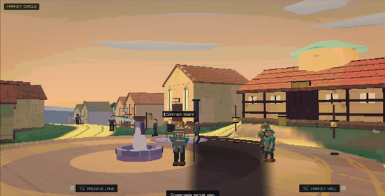
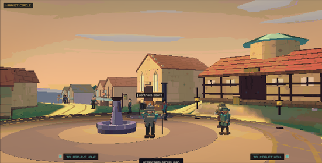
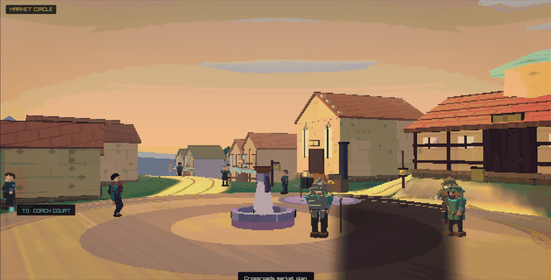
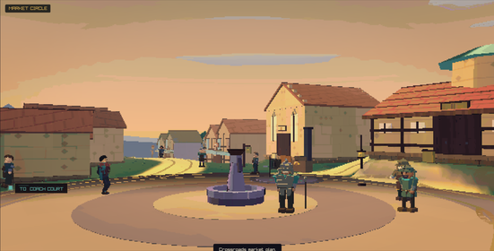
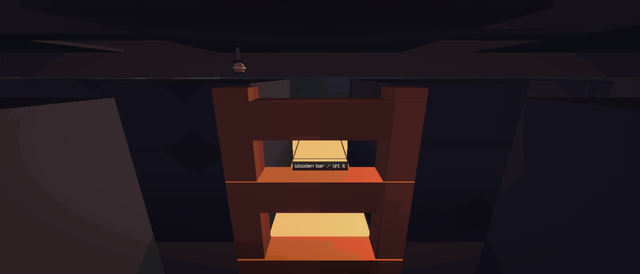
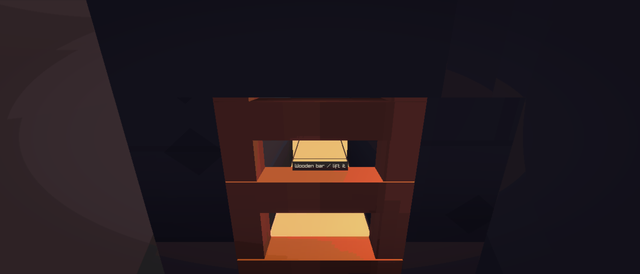
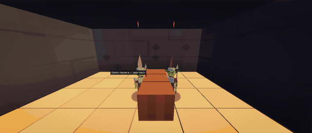
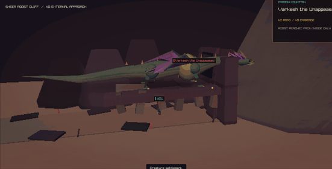
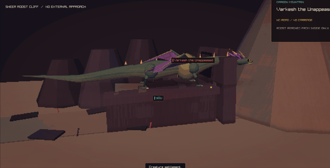

# Graphics repairs, 30 September 2026

Starting point: `4684ab95` on `main`. Every scene here was rendered with the
native play build's own capture flags, looked at, and then fixed at the cause.
Each fix has a check that fails on the old code.

## 1. Every cylinder in the renderer was lit with a stale normal

`world_lit.vs` shades from `vertexNormal`. raylib's `DrawCylinder` and
`DrawCylinderEx` emit no normals at all, so every one of the renderer's 178
cylinder draws took whatever normal the previous draw left in the batch. The
box helper ends on its `-x` face, so a cylinder drawn after a box was lit as a
wall facing away from the sun. The visible case was the Gloamgate market
court: its four stone rings around the queen's fountain rendered as a dark
oval that moved with the camera and did not belong to anything.

| Before | After |
| --- | --- |
|  |  |
|  |  |

`DrawLitCylinder` and `DrawLitCylinderEx` (`context_state.inc`) mirror
raylib's vertex order exactly and add a normal per face: caps along the axis,
sides radial and leaning with the taper. Every `DrawCylinder` and
`DrawCylinderEx` call in `src/client/local3d` now goes through them. Lantern
posts, tree trunks, pillars, wheel hubs, spears, and the movement reticle all
shade the same way whatever was drawn before them.

Check: `TestLitPrimitiveNormals` (`tests/lit_primitive_tests.inc`, in
`renderer_regression_tests --graphics`) draws a box off screen, then a flat
lit disc from above and a tall lit cylinder from the side, and requires the
cap to match a `DrawPlane` of the same colour and the side to match a box
face with the same normal. On this machine the readings match exactly:

```
Lit cap: plane 227,142,86  disc 227,142,86
Lit side 1: box 47,42,55  cylinder 47,42,55
Lit side 2: box 47,42,55  cylinder 47,42,55
```

## 2. The underground mine opened onto the void

`CcLocalDrawMine3D` drew walls 1.4 units tall on the rock tiles that touch a
corridor, and a ceiling slab 2.5 units up over walkable tiles only. From the
first-person eye at 1.42–1.55 the player looked over every wall into black,
and the ceiling hung as separate floating plates with nothing at their edges.
The wall pass also skipped the grid border, so a corridor beside the border
had no wall at all on that side.

| Before | After |
| --- | --- |
|  |  |

The tunnel is now a closed volume. Walls run from the floor past the ceiling
slab (`CcLocalMineWallHeightInternal`), the ceiling slabs are full width so
no grout gap shows the void, rock closes the arch above the closed bar, and
the wall pass covers the whole grid. Combat keeps the old low walls and no
ceiling, so the raised fight camera still sees into the chamber. The mine
view's click occluders use the same wall height, so a click on the upper
half of a wall no longer selects the floor behind it.



Check: `TestMineTunnelEnclosure` (same file, in the default
`renderer_regression_tests` run) requires the wall to reach past the ceiling
slab, rock above the bar, the combat height to stay at the bar height, and
the border to be rock.

## 3. The dragon roost floated

`DrawDragonCliffRoost` placed its three shelves and the perch 4–6 units up
with nothing under them, and its six "teeth" ended 2.5 units above the
ground. The roost read as a table on stubby legs with the hero standing
under it.

| Before | After |
| --- | --- |
|  |  |

Each shelf and the perch now stand on a rock foot that runs to the ground,
and the teeth are rooted at ground level, so the roost is one cliff outcrop
and the hero stands at its foot. The dragon's perch height, the camera
framing, and `TestDragonRoostCameraFraming` are unchanged.

## 4. Raw stone had no cargo model

`CC_GOOD_RAW_STONE` was added to the goods table without a cargo export, so
`TestPhysicalGoodsGraphics` failed on its first assertion and the whole
`--graphics` suite stopped there. Raw stone now rides as the dressed stone
model until it gets an export of its own, and the suite runs to the end
again.

## Checks run

- `cmake --build --preset play` with warnings as errors.
- `renderer_regression_tests` (default run, adds `TestMineTunnelEnclosure`).
- `renderer_regression_tests --graphics` (adds `TestLitPrimitiveNormals`;
  previously stopped at the raw stone assertion).
- `renderer_regression_tests --carriage-graphics`.
- `ctest --preset play` with a 64 MB shell stack: 255 of 255 passed.

## Looked at, not scene geometry

Two small gold diamonds sit at the same screen spot above the carriage in
every storybook travel frame. They are not drawn by the 3D scene: skipping
the carriage, team, hero, passenger, crew, runners, scenery, roads, ground,
sites, settlements, road news and the atmosphere pass one at a time left
them in place, and they are crisp at screen resolution. They come from the
client's 2D layer over the presented frame; the exact call was not found
and they are left as they are.

## Still open

- Roadside cattle and sheep in the road encounter stand on the far verge
  with no contact shadow, so on the night causeway they read as floating.
- The storybook road draws flat site plates (fields, coppices) that do not
  follow the slope; on a hillside their edges cut through the road.
- The remote-site ground uses a darker strip over a flat plane, which leaves
  one straight seam across the dragon and goblin sites.
