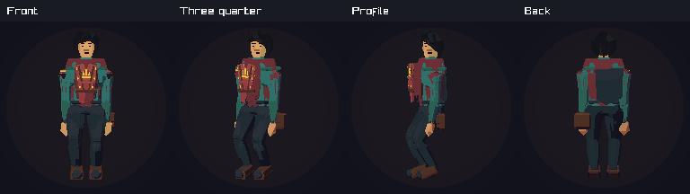
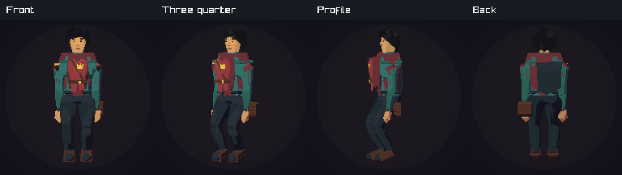
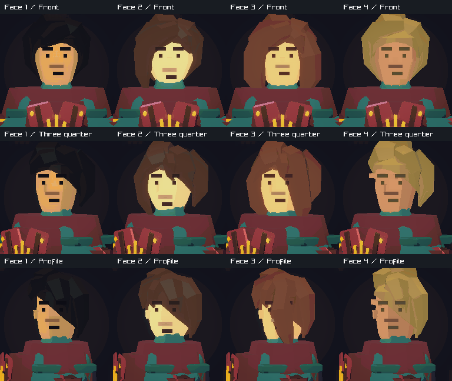
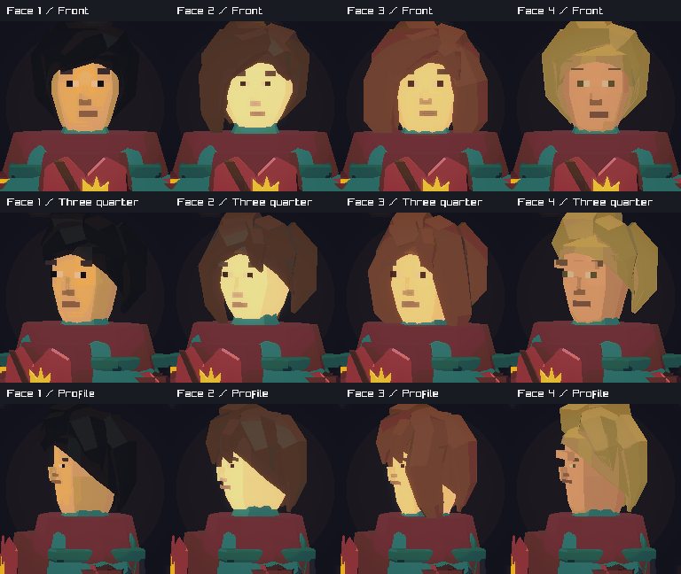
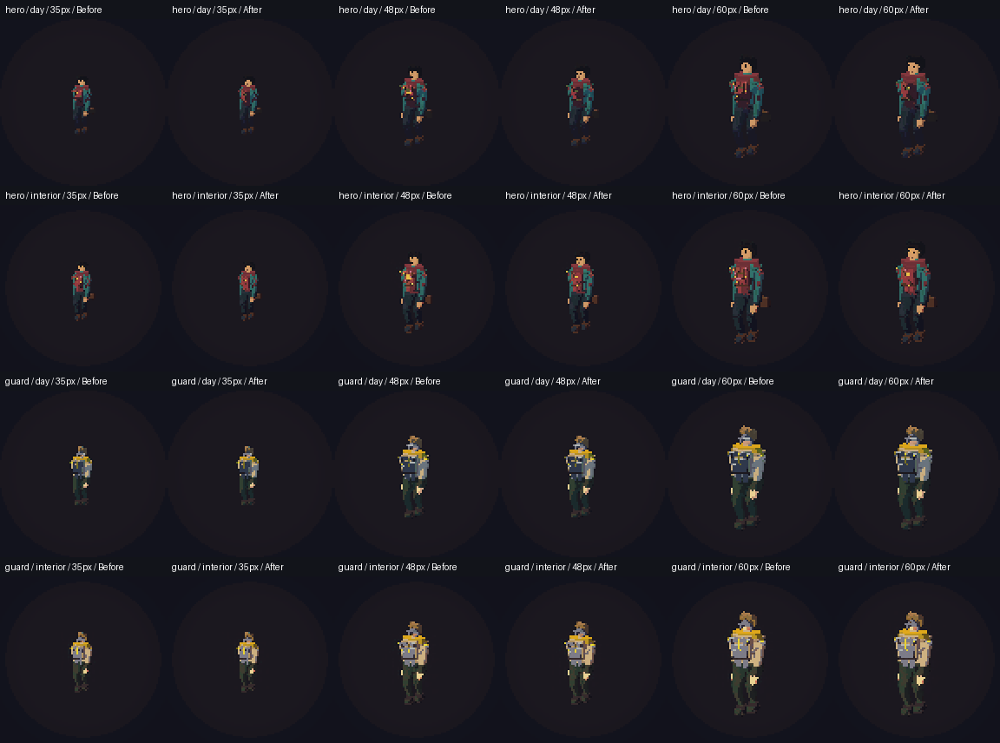
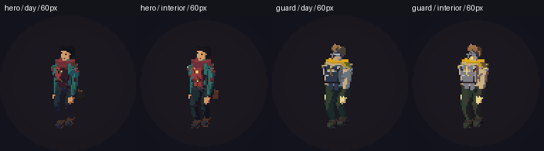

# Hero and faces

Matched captures use the production game renderer. The baseline is `fed1dcb`.

The hero has two broad chest plates, a diagonal leather strap, a small crown
badge, and a slightly larger head. The chest mesh uses 504 triangles, down from
768, and one material. The shared faces have softer lips, smaller nose marks,
and warm eye highlights. Eye and mouth marks keep a useful size in small views.
Face marks follow a smooth turn near the front of each head. Side views show
the near eye. Face placement follows the four exported head shapes.

## Hero

Before:



After:



## Faces

Before:



After:



## Game sizes

The sheet compares the hero and guard at 35, 48, and 60 pixels tall, in daylight
and interior light. The capture run checks all eight walking turns for each
size and light, for 96 measured images.





## Repeat the review

```sh
make blender-hero-armor
cmake --build --preset play
cmake --build out/build/play --target run_hero_face_captures
cmake --build out/build/play --target run_character_material_captures
python3 tools/art/check_character_materials.py out/build/play/character-materials
```

Validation includes the full client build, CTest, the native graphics suite,
module and surface checks, and a repeat asset build. The face angle regression
covers 160 small camera turns through the former view thresholds.
