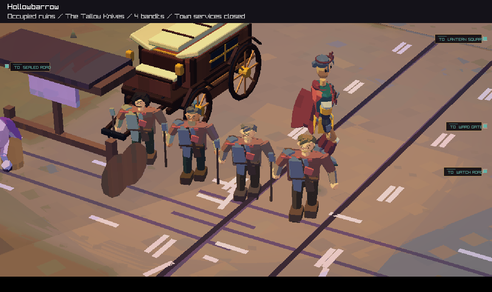
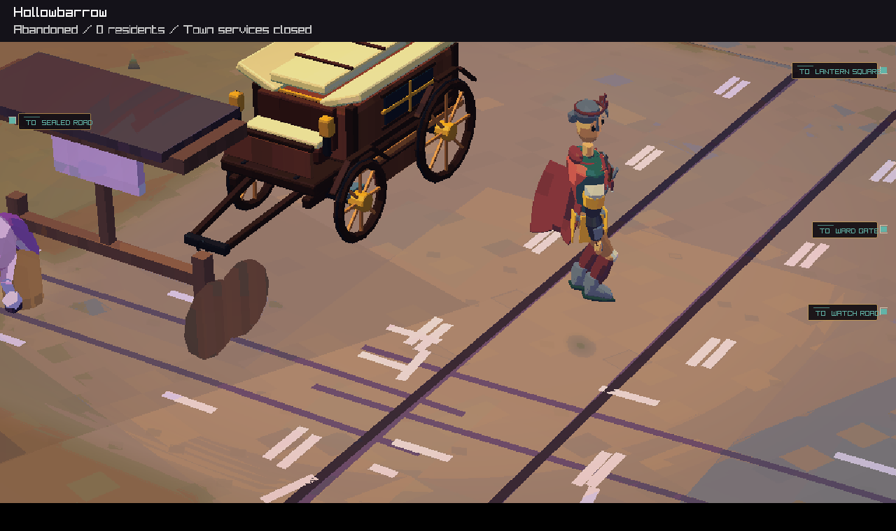
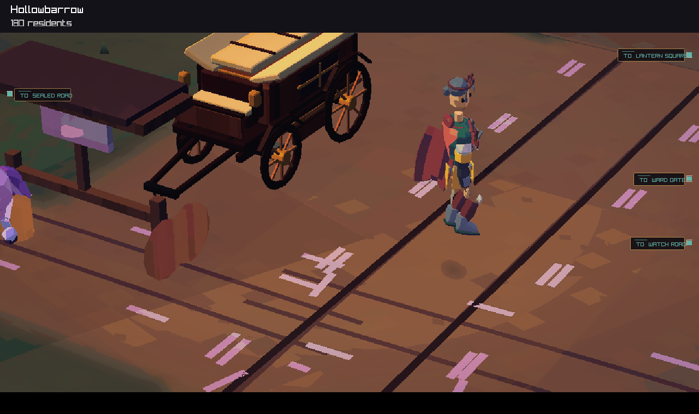

# Hollowbarrow scene presence

The reported shared world had zero residents and closed services in Hollowbarrow, with four Tallow Knives bandits holding the ruins. The street still displayed fixed citizens, training guards and travellers. This review uses a synthetic seed-42 fixture with the same population and occupation conditions. Shared-world saves, membership details and invitations stay outside the repository.

The street now reads abandoned status from the simulation. It renders up to six members of the occupying group, bounded by its saved membership, and up to eight living named people present at the town. Dead and travelling characters are excluded. The company and its carriage retain their normal presentation. The header names the occupying band and states that town services are closed. Doors receive timber boards. The hall, counter, warehouse trade controls and notice board follow the abandoned state, including when a saved interior is reopened. A living town resumes its ordinary population scene after resettlement.

These are presentation samples of the saved band and named cast. Band figures represent the group's member count. Simulation time, population, food, pony care and resettlement rules keep their existing owners.

## Verification

- Native build with strict warnings. All 189 tests passed: 186 in the full run, plus three local-server tests after allowing loopback access. The first three failures were socket permission errors.
- `abandoned_town_presence` checks actual interaction targets, a named visitor, departure, stale traveller/witness state, the closed hall, the saved interior exit, resettlement and world hash preservation.
- `distinct_local_places` checks occupation membership, living presence, travel and death eligibility, and status labels.
- The graphics fixture checks four raiders in the occupied ruin, zero ambient people after the band leaves, and a populated scene after resettlement. It checks the simulation hash after every draw.

Reproduce the graphics check from the repository root:

```sh
out/build/native/renderer_regression_tests --abandoned-town docs/reviews/hollowbarrow-presence-2026-09-12/town
```

## Occupied



## Abandoned



## Resettled


