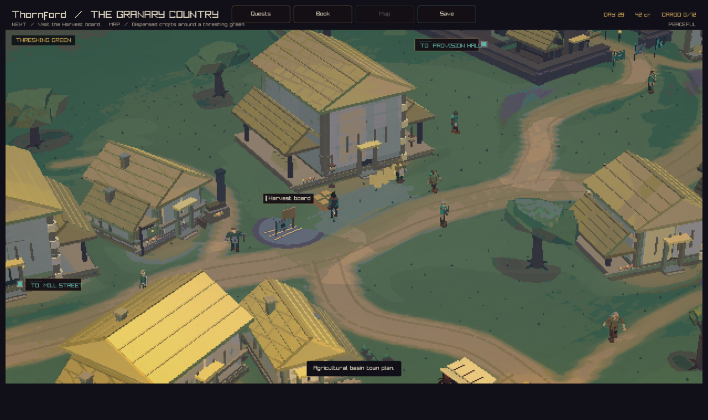
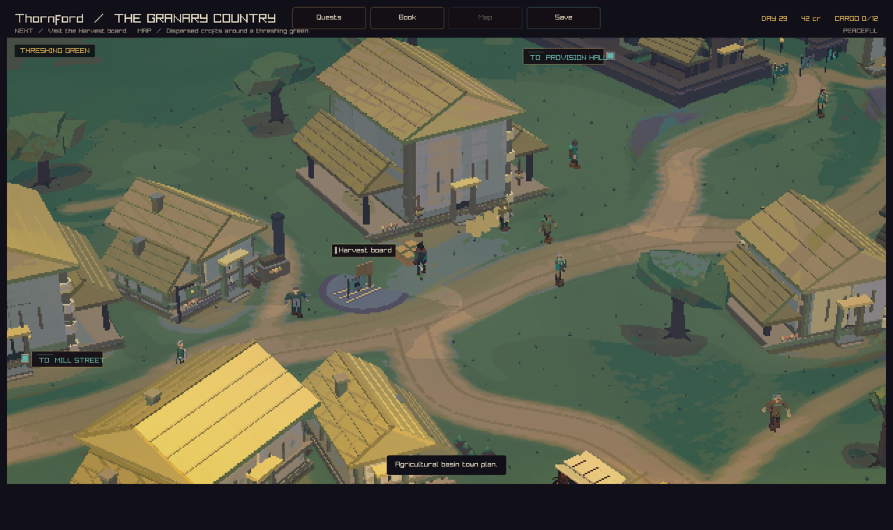
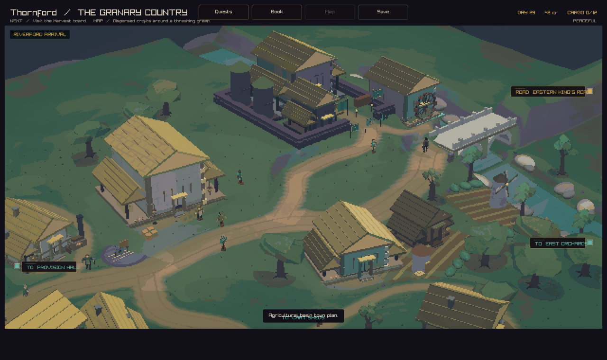

# Painted meadow ground

The village ground uses blended pigment washes with warm grass highlights and
cool green pockets. Fine chips fade when their footprint falls below a pixel.
The foreground uses the same soft wash treatment.

## Before and after

Both images use current main at `90dc717e` with the same town, camera, and state.
The after image adds this shader change.







## Capture recipe

Build with the `play` preset. Run the native app from the worktree root:

```sh
out/build/play/crownless_carriage.app/Contents/MacOS/crownless_carriage --capture-town-state 0 44.25 28.85 docs/reviews/meadow-2026-09-12/after.png peaceful
out/build/play/crownless_carriage.app/Contents/MacOS/crownless_carriage --capture-town-state 0 82 34 docs/reviews/meadow-2026-09-12/arrival.png peaceful
```

## Validation

The strict native build passes. The updated shader loads in both native captures.
The change reuses the existing noise and pixel-footprint helpers.
