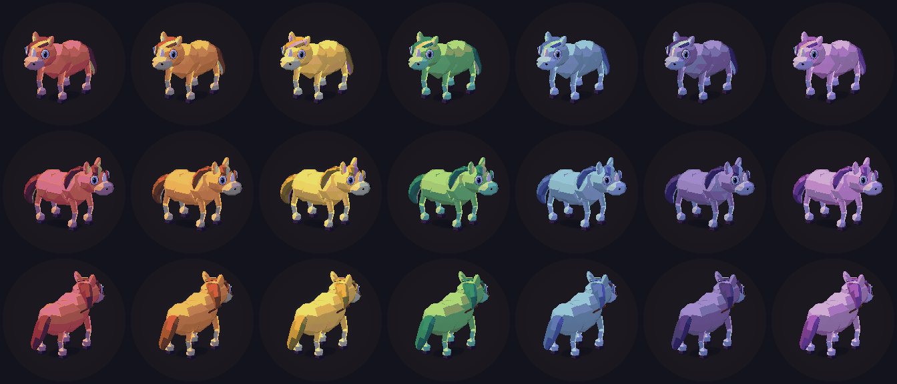
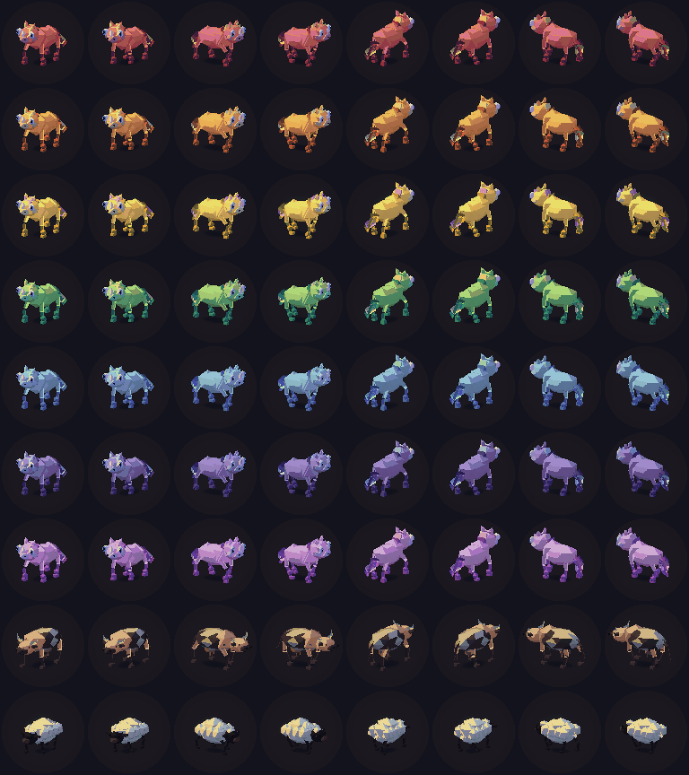
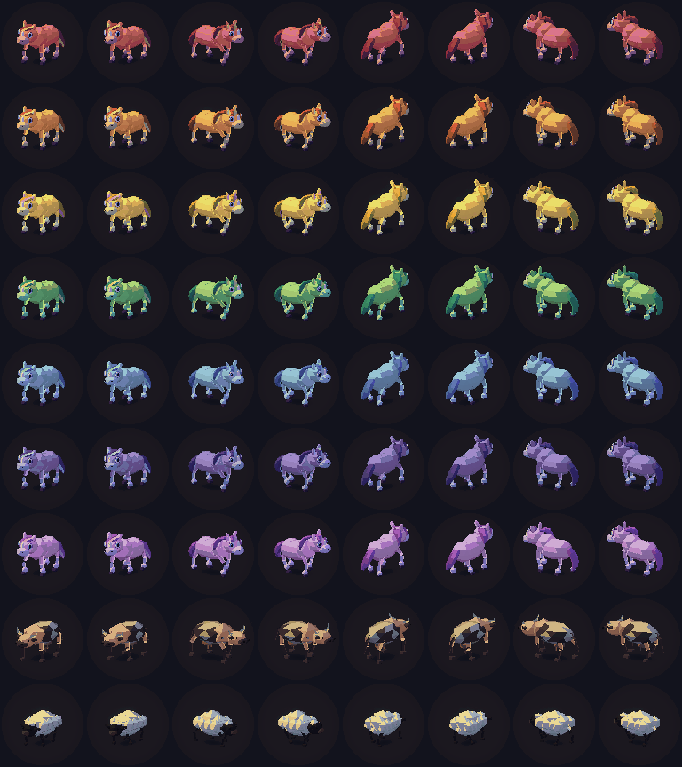
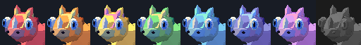
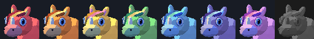
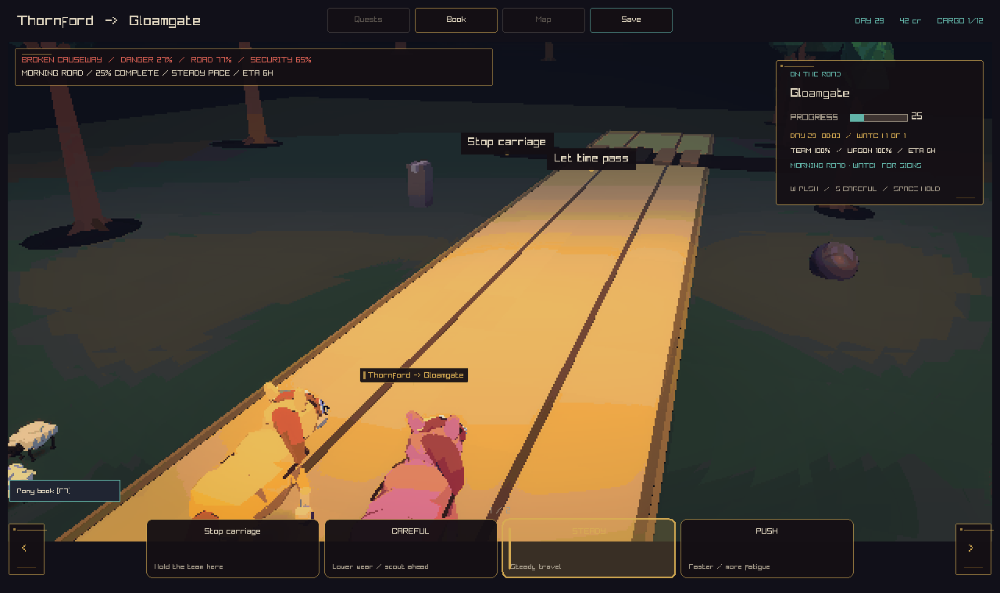

# Pony graphics

The seven ponies have a longer muzzle, eyes set into the face, rounder shoulders
and hips, a swept forelock, and a mane that hangs over the neck. Light socks and
dark hooves make their feet easier to read. A continuous tail bends across two
skin joints. Their existing coat, mane, and ribbon colours carry through to the
stable, the road, and the pony book.

The road bridle now fits the pony's face. Its points follow the rendered head
pose. The collar follows the neck and chest. The earlier harness used fixed
points above the face.



## Small game views

The same native renderer, lighting, final screen pass, camera, and walking phases
produce both sheets. Each pony has four turns and two walking poses. The last two
rows show the other farm animals. The original asset comes from `0118062`.

| Before | After |
| --- | --- |
|  |  |
|  |  |

## Harness fit

Both road captures use the revised pony model. The first shows the earlier fixed
harness. The second shows the fitted harness attached to the animated skin.

| Earlier harness | Fitted harness |
| --- | --- |
|  |  |

## Checks

- Full native build and all 74 CTest tests pass.
- The asset checks pass for all 50 creature assets. The pony has 2,240 triangles,
  one material, and 19 bones. Its budget is 3,200 triangles.
- Native graphics checks pass for all seven pony colours, four turns, two walking
  poses, and all pony book portraits.
- A regression test checks the bridle during a head lift and turn, with the pony
  turned in the world. It also checks that the collar follows the chest.
- The three-angle sheet and road captures use the shipped model and game shaders.

## Reproduce

Build with `cmake --preset play` and `cmake --build --preset play`.

```sh
mkdir -p out/pony-review
ctest --preset play --parallel 4
make art-assets-check blender-creature-assets-check
out/build/play/renderer_regression_tests --graphics out/pony-review/graphics.png
out/build/play/renderer_regression_tests --pony-captures out/pony-review/ponies.png
out/build/play/crownless_carriage.app/Contents/MacOS/crownless_carriage --capture-creatures horse out/pony-review/road.png
```

`--pony-captures` also writes a portrait strip at the supplied path plus
`-portraits.png`. Native captures require a working graphics context.

The pony is generated by `tools/blender/build_creature_library.py`. To rebuild
just its GLB, run Blender from the repository root:

```sh
blender --background --python-exit-code 1 --python-expr '
import sys
sys.path.insert(0, "tools/blender")
import build_creature_library as c
c.reset_scene()
c.make_materials()
spec = next(s for s in c.CREATURES if s.variant == "horse")
collection = c.new_collection("CREATURE_HORSE_IDLE")
c.build_creature(spec, collection)
rig = c.skin_quadruped(collection, spec)
model = c.consolidate(collection, spec, rig)
c.export_model(model, spec, rig)
'
```
