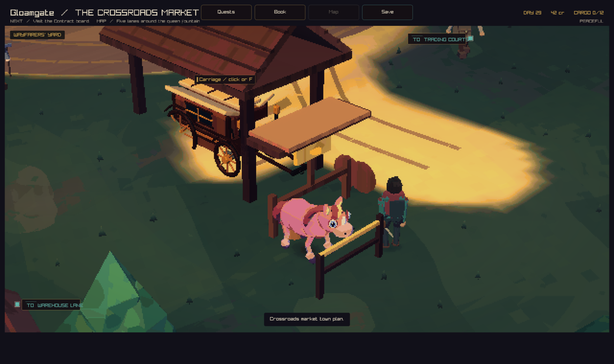
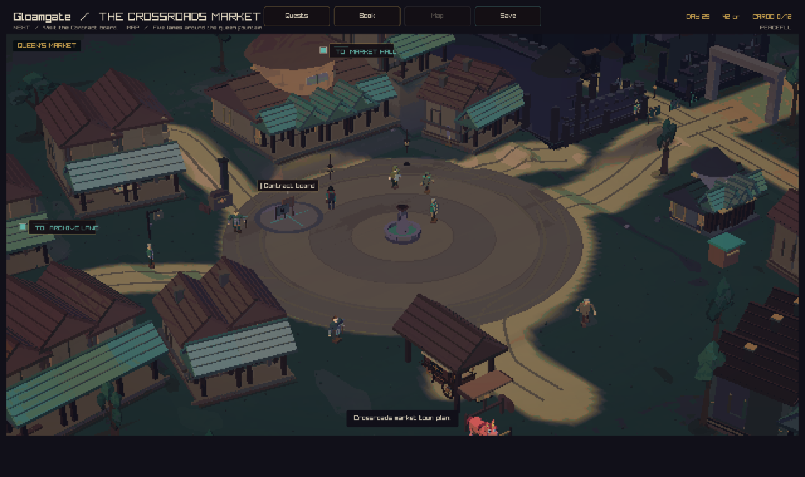
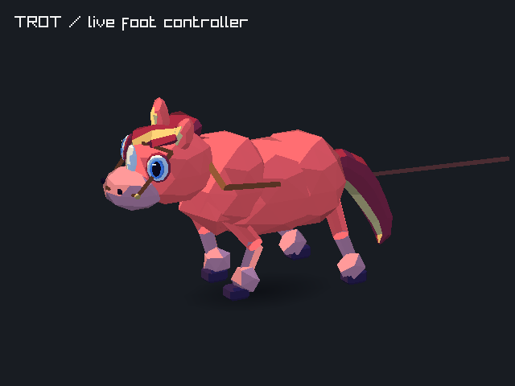

# Ponies at the carriage yard

Parked ponies stand at the open end of the carriage yard. The rail has two
posts and two slim bars. The yard camera includes the carriage and ponies.



The market square has its fountain and contract board.



The travelling companion uses the physical gait controller. The pulling team
and companion choose walk, trot, or canter from the carriage pace. Town travel
uses the town terrain for hoof contacts and carriage tilt.



The animation contains 30 frames from the live pulling-team renderer, sampled
at 15 frames per second after two seconds of warm-up. Each frame advances the
same foot controller used during play. The camera follows the moving team.

## Capture recipe

```sh
crownless_carriage --capture-town-state 1 37 58 yard.png peaceful
crownless_carriage --capture-town-state 1 44.25 28.85 market.png peaceful
renderer_regression_tests --pony-gait-captures gait-frames
```

The GIF uses the 30 resulting frames in order, at their captured speed.
The Linux client job also saves the yard view and gait frames with its
`gloamgate-review` artifact.

## Checks

All 152 local tests passed. Static analysis passed. The pony checks cover clear
hitching space in every town, both diagonal trot pairs, two supporting hooves,
and matching gait timing at 30 and 120 frames per second. The five-second trot
sample records 150 frames for each diagonal pair.
